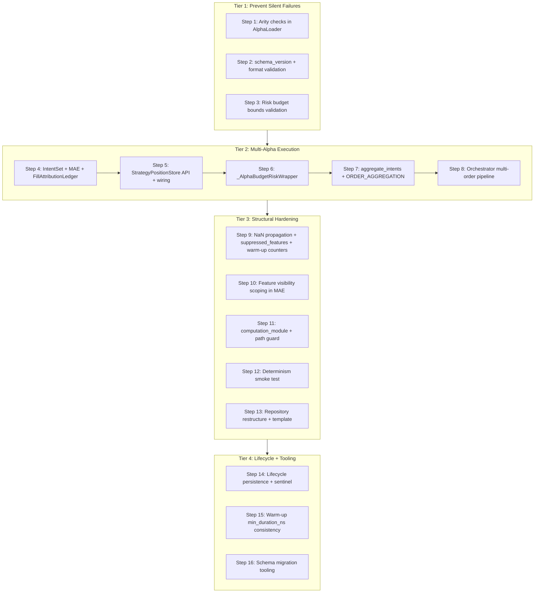
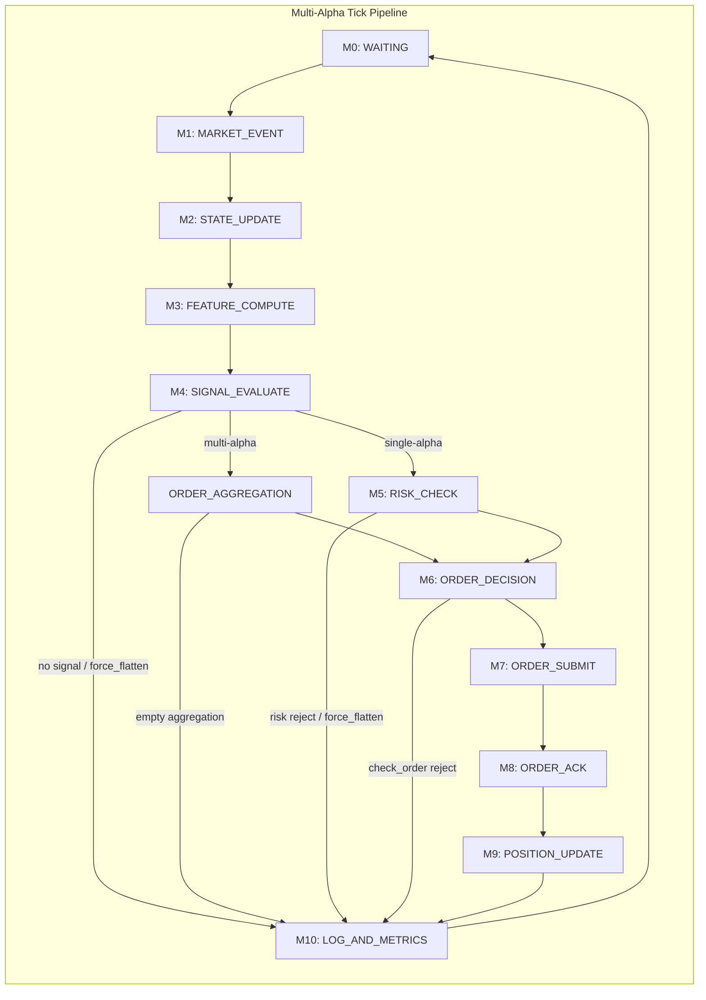

# Alpha Architecture v2.3 — Implementation Plan

## Architecture Overview







---

## TIER 1: Prevent Silent Production Failures

### Step 1 — Feature and signal function arity checks (~20 lines)

**Modify:** `src/feelies/alpha/loader.py`

After compiling feature functions (line ~632), validate arity using `inspect.signature`:

- `initial_state()` — 0 required args
- `update(quote, state, params)` — 3 required args
- `update_trade(trade, state, params)` — 3 required args (if present)
- `evaluate(features, params)` — 2 required args (in `_compile_signal()` after line ~722)

Add a private helper:

```python
import inspect

def _check_arity(fn, expected: int, name: str, source: str, fid: str) -> None:
    sig = inspect.signature(fn)
    n_required = sum(
        1 for p in sig.parameters.values()
        if p.default is inspect.Parameter.empty
    )
    if n_required != expected:
        raise AlphaLoadError(
            f"{source}: {name} in '{fid}' expects {expected} args, got {n_required}"
        )
```

**Invariant:** Inv-11 (fail loudly at boot, not at tick 500,000).

---

### Step 2 — `schema_version` + format validation (~50 lines)

**Modify:** `src/feelies/alpha/loader.py`

In `_validate_schema()` (line ~455):

1. Add `schema_version` to validation — **optional with default `"1.0"`** and deprecation warning if absent (so the existing `alphas/mean_reversion.alpha.yaml` does not break).
2. `alpha_id` format: must match `^[a-z][a-z0-9_]*$`.
3. `version` format: must match `^\d+\.\d+\.\d+$` (semver).

**Also modify:** `alphas/mean_reversion.alpha.yaml` — add `schema_version: "1.0"` so it is explicit.

**Invariant:** Inv-13 (provenance).

---

### Step 3 — Risk budget bounds validation (~30 lines)

**Modify:** `src/feelies/alpha/loader.py`

Add `_validate_risk_budget()` called from `load_from_dict()` after constructing `AlphaRiskBudget` (line ~431):

- `max_position_per_symbol > 0`
- `0 < max_gross_exposure_pct <= 100`
- `0 < max_drawdown_pct <= 100`
- `0 < capital_allocation_pct <= 100`

Raises `AlphaLoadError` on violation.

**Invariant:** Inv-12 (transaction cost realism begins with valid budgets).

---

## TIER 2: Multi-Alpha Execution Isolation

### Step 4 — `IntentSet`, `MultiAlphaEvaluator`, `FillAttributionLedger`

This is the largest single step. Three new files.

**(a) New file:** `src/feelies/alpha/intent_set.py`

`IntentSet` dataclass per architecture doc section 4.3:

```python
@dataclass(frozen=True, kw_only=True)
class IntentSet:
    timestamp_ns: int
    correlation_id: str
    symbol: str
    intents: tuple[OrderIntent, ...]
    signals: tuple[Signal, ...]
    verdicts: dict[str, RiskVerdict]
    force_flatten: bool = False
    force_flatten_verdict: RiskVerdict | None = None

    @property
    def is_empty(self) -> bool:
        return len(self.intents) == 0 and not self.force_flatten
```

**(b) New file:** `src/feelies/alpha/multi_alpha_evaluator.py`

`MultiAlphaEvaluator` class per section 4.3. Full `evaluate_tick(features, quote) -> IntentSet` with all gates:


| Gate                     | Behavior                                                                                                          |
| ------------------------ | ----------------------------------------------------------------------------------------------------------------- |
| Warm gate                | `not features.warm` -> empty IntentSet                                                                            |
| Suppressed features gate | `features.suppressed_features` -> empty IntentSet                                                                 |
| Symbol scope gate        | `manifest.symbols is not None and symbol not in manifest.symbols` -> skip alpha                                   |
| Error handling           | `try/except` per alpha, log + skip                                                                                |
| Stale gate               | `features.stale and direction != FLAT` -> skip alpha                                                              |
| Entry cooldown           | **Check** early (before expensive computation), **update** only after all gates pass (v2.3 deferred cooldown fix) |
| FORCE_FLATTEN            | Short-circuit entire loop, return `IntentSet(force_flatten=True)` — no further alphas evaluate                    |
| REJECT                   | Skip this alpha, continue loop to next alpha                                                                      |
| SCALE_DOWN               | Apply `verdict.scaling_factor` to intent quantity                                                                 |
| NO_ACTION                | Skip intent before risk check                                                                                     |


**Paradigm note:** The MAE does NOT arbitrate to a single winner signal (like the CSE does with `SignalArbitrator`). It collects ALL intents from ALL active alphas and returns them in the `IntentSet`. Aggregation to net orders happens later in the orchestrator via `aggregate_intents()`. This is a fundamental semantic change from CSE.

Constructor:

```python
def __init__(self, registry, intent_translator, risk_wrapper,
             strategy_positions, position_sizer, account_equity,
             entry_cooldown_ticks=0): ...
```

Private methods: `_scoped_features()`, `_compute_target_quantity()`.

**(c) New file:** `src/feelies/alpha/fill_attribution.py`

`FillAttributionLedger`, `AttributionRecord`, `AlphaContribution` per section 4.7.

```python
@dataclass(frozen=True)
class AlphaContribution:
    strategy_id: str
    signed_quantity: int
    proportion: float

@dataclass(frozen=True)
class AttributionRecord:
    order_id: str
    symbol: str
    net_side: Side
    net_quantity: int
    contributions: tuple[AlphaContribution, ...]
```

- `record(record: AttributionRecord)` — store for later fill allocation.
- `allocate_fill(order_id, filled_qty, fill_price) -> list[tuple[str, str, int, Decimal]]` — returns `(strategy_id, symbol, signed_qty, price)` tuples.
- **Allocation algorithm:** Proportional with largest-remainder method for integer rounding. Example: 3 shares filled, contributions (60% alpha_A, 40% alpha_B) -> alpha_A gets 2, alpha_B gets 1.

**Update:** `src/feelies/alpha/__init__.py` — export `IntentSet`, `MultiAlphaEvaluator`, `FillAttributionLedger`, `AttributionRecord`, `AlphaContribution`.

**Tests:** `tests/alpha/test_intent_set.py`, `tests/alpha/test_multi_alpha_evaluator.py`, `tests/alpha/test_fill_attribution.py`.

**Invariants:** Inv-7 (typed events), Inv-8 (layer separation), Inv-11 (FORCE_FLATTEN propagation).

---

### Step 5 — `StrategyPositionStore` API extensions + bootstrap wiring

**Modify:** `src/feelies/portfolio/strategy_position_store.py`

Add two public methods per section 4.4:

```python
def get_strategy_exposure(self, strategy_id: str) -> Decimal:
    store = self._stores.get(strategy_id)
    if store is None:
        return Decimal("0")
    return store.total_exposure()

def get_strategy_realized_pnl(self, strategy_id: str) -> Decimal:
    store = self._stores.get(strategy_id)
    if store is None:
        return Decimal("0")
    return sum(
        (pos.realized_pnl for pos in store.all_positions().values()),
        Decimal("0"),
    )
```

**Modify:** `src/feelies/bootstrap.py`

Replace `MemoryPositionStore()` (line 109) with `StrategyPositionStore()`:

```python
from feelies.portfolio.strategy_position_store import StrategyPositionStore

strategy_positions = StrategyPositionStore()

orchestrator = Orchestrator(
    ...
    position_store=strategy_positions.as_aggregate(),
    strategy_positions=strategy_positions,
    ...
)
```

**Modify:** `src/feelies/kernel/orchestrator.py`

Add `strategy_positions: StrategyPositionStore | None = None` constructor parameter. Store as `self._strategy_positions`.

**Tests:** Extend `tests/portfolio/test_strategy_position_store.py`.

**Invariant:** Inv-8 (encapsulation — no `_stores` access from outside).

---

### Step 6 — `_AlphaBudgetRiskWrapper` with per-alpha drawdown

**New file:** `src/feelies/alpha/risk_wrapper.py`

Full implementation per section 4.3.1:

- Constructor: `inner: RiskEngine`, `registry: AlphaRegistry`, `strategy_positions: StrategyPositionStore`, `platform_config: RiskConfig`, `account_equity: Decimal`
- `check_signal(signal, positions) -> RiskVerdict`:
  1. Per-alpha position limit: `min(alpha_budget, platform_config)`
  2. Per-alpha exposure limit via `get_strategy_exposure()`
  3. Per-alpha drawdown check via `_check_alpha_drawdown()` using `get_strategy_realized_pnl()` — realized-only PnL (see section 10.12 rationale)
  4. Delegate to inner engine for aggregate checks — inner may return `FORCE_FLATTEN` which the MAE distinguishes from per-alpha `REJECT`
- `_check_alpha_drawdown()`: HWM tracker, returns `REJECT` (not `FORCE_FLATTEN`) on breach — per-alpha drawdown triggers quarantine, not platform lockdown
- `check_order()`: delegates directly to inner engine

**Update:** `src/feelies/alpha/__init__.py` — export.

**Tests:** `tests/alpha/test_risk_wrapper.py`.

**Invariant:** Inv-11 (per-alpha drawdown -> REJECT/quarantine, aggregate -> FORCE_FLATTEN/lockdown).

---

### Step 7 — Exit-priority aggregation + `ORDER_AGGREGATION` micro-state

**(a) New file:** `src/feelies/alpha/aggregation.py`

Three components per section 4.6:

`**_to_signed_quantity` dispatch table with exhaustiveness guard:**


| Intent                                            | Signed Quantity                                        |
| ------------------------------------------------- | ------------------------------------------------------ |
| `ENTRY_LONG`                                      | `+target_quantity`                                     |
| `ENTRY_SHORT`                                     | `-target_quantity`                                     |
| `SCALE_UP` (current_quantity >= 0)                | `+target_quantity`                                     |
| `SCALE_UP` (current_quantity < 0)                 | `-target_quantity`                                     |
| `EXIT` (current_quantity > 0, i.e. closing long)  | `-target_quantity`                                     |
| `EXIT` (current_quantity < 0, i.e. closing short) | `+target_quantity`                                     |
| `EXIT` (current_quantity == 0)                    | `0`                                                    |
| `NO_ACTION`                                       | Not reached (filtered before call)                     |
| `REVERSE`_*                                       | Not reached (handled separately in aggregation)        |
| Any other                                         | `raise ValueError(...)` (exhaustiveness guard, Inv-11) |


`**AggregatedOrders` dataclass:**

```python
@dataclass(frozen=True)
class AggregatedOrders:
    exit_order: tuple[Side, int] | None
    entry_order: tuple[Side, int] | None
    contributing_intents: tuple[OrderIntent, ...]
```

`**aggregate_intents()` function:**

Two-bucket aggregation per section 4.6:

- Reversals split into exit component + entry component
- Exits are non-cancellable (Inv-11)
- Entries are netted across alphas per symbol
- `NO_ACTION` intents filtered from `contributing_intents` (v2.3)

**(b) Modify:** `src/feelies/kernel/micro.py`

Add `ORDER_AGGREGATION = auto()` to `MicroState` enum.

**Critical: dual-path transition table.** `SIGNAL_EVALUATE` must be able to transition to three targets:

- `RISK_CHECK` (single-alpha path — existing)
- `ORDER_AGGREGATION` (multi-alpha path — new)
- `LOG_AND_METRICS` (no signal / force_flatten — existing)

And `ORDER_AGGREGATION` transitions to:

- `ORDER_DECISION`
- `LOG_AND_METRICS` (empty aggregation)

```python
MicroState.SIGNAL_EVALUATE: frozenset({
    MicroState.RISK_CHECK,          # single-alpha path (existing)
    MicroState.ORDER_AGGREGATION,   # multi-alpha path (new)
    MicroState.LOG_AND_METRICS,     # no signal / force_flatten
}),
MicroState.ORDER_AGGREGATION: frozenset({
    MicroState.ORDER_DECISION,      # orders to submit
    MicroState.LOG_AND_METRICS,     # empty aggregation
}),
```

**Existing tests:** The single-alpha path `SIGNAL_EVALUATE -> RISK_CHECK -> ORDER_DECISION` is preserved. Existing tests in `tests/kernel/test_orchestrator.py` that assert this sequence will continue passing. New tests cover the multi-alpha `SIGNAL_EVALUATE -> ORDER_AGGREGATION -> ORDER_DECISION` path.

**Tests:** `tests/alpha/test_aggregation.py`.

**Invariants:** Inv-5 (deterministic), Inv-11 (exits non-cancellable, exhaustiveness guard).

---

### Step 8 — Orchestrator multi-order pipeline rewrite

**Modify:** `src/feelies/kernel/orchestrator.py`

This is the most invasive change. Affects `__init__`, `_process_tick_inner`, `_reconcile_fills`, and adds several new helpers.

**(a) Constructor changes:**

Add parameters:

- `multi_alpha_evaluator: MultiAlphaEvaluator | None = None`
- `fill_ledger: FillAttributionLedger | None = None`

Store as `self._multi_alpha_evaluator`, `self._fill_ledger`.

**Backward compatibility:** `signal_engine: SignalEngine` remains required. When `multi_alpha_evaluator is not None`, the signal engine is unused but still wired (CSE retained for single-alpha compat, per section 10.4).

**(b) `_process_tick_inner()` — branch after M3 FEATURE_COMPUTE:**

```python
if self._multi_alpha_evaluator is not None:
    self._process_tick_multi_alpha(features, quote, cid, t_wall_start)
else:
    # existing single-signal path (unchanged)
    ...
```

**(c) New method `_process_tick_multi_alpha()`:**

Implements the full pipeline from section 4.9:

1. **M3 -> M4: SIGNAL_EVALUATE** — `intent_set = self._multi_alpha_evaluator.evaluate_tick(features, quote)`
2. **FORCE_FLATTEN check** (before aggregation, v2.3) — if `intent_set.force_flatten`: fire `_escalate_risk()`, reset micro SM, return immediately.
3. **Empty check** — if `intent_set.is_empty`: transition to LOG_AND_METRICS, finalize, return.
4. **Publish per-alpha signals for observability** — `for signal in intent_set.signals: self._bus.publish(signal)`
5. **Quarantine trigger** — iterate `intent_set.verdicts`: for any verdict where `action == RiskAction.REJECT` and `"drawdown"` in `verdict.reason` and `"quarantine"` in `verdict.reason`, call `self._alpha_registry.quarantine(strategy_id, verdict.reason)`.
6. **M4 -> ORDER_AGGREGATION** — `aggregated = aggregate_intents(intent_set.intents)`
7. **Build `orders_to_submit`** — exits first, then entries (v2.3):
  - For each symbol's `AggregatedOrders`: if `exit_order is not None`, call `_build_net_order()` and `_fill_ledger.record()` with `_compute_contributions(agg, "exit")`. Append to list.
  - Then if `entry_order is not None`, same for entry.
8. **Empty orders check** — if no orders: LOG_AND_METRICS, finalize, return.
9. **ORDER_AGGREGATION -> M6: ORDER_DECISION** — pre-submission risk check on each concrete aggregate order via `self._risk_engine.check_order(order, self._positions)`. Handle FORCE_FLATTEN, REJECT, SCALE_DOWN per-order (same logic as existing single-order check_order at lines 726-767).
10. **M6 -> M7: ORDER_SUBMIT** — loop: `_track_order`, `_transition_order`, `submit`, `publish` for each order.
11. **M7 -> M8: ORDER_ACK** — single `poll_acks()` returns all N acks (verified: `BacktestOrderRouter.submit()` appends to `_pending_acks`, `poll_acks()` returns + clears).
12. **M8 -> M9: POSITION_UPDATE** — `_reconcile_fills(acks, cid)`
13. **M9 -> M10: LOG_AND_METRICS** — `_finalize_tick()`

**(d) New helper `_build_net_order()`:**

Constructs `OrderRequest` from `(symbol, Side, quantity)` with deterministic `order_id` via SHA-256 of `correlation_id:sequence` (Inv-5). Distinct from existing `_build_order_from_intent()` which takes an `OrderIntent` + `RiskVerdict`.

```python
def _build_net_order(self, symbol: str, side: Side, quantity: int,
                     correlation_id: str) -> OrderRequest:
    seq = self._seq.next()
    order_id = hashlib.sha256(
        f"{correlation_id}:{seq}".encode()
    ).hexdigest()[:16]
    return OrderRequest(
        timestamp_ns=self._clock.now_ns(),
        correlation_id=correlation_id, sequence=seq,
        order_id=order_id, symbol=symbol, side=side,
        order_type=OrderType.MARKET, quantity=quantity,
        strategy_id="multi_alpha_net",
    )
```

**(e) New helper `_compute_contributions()`:**

Maps `AggregatedOrders` + bucket ("exit"/"entry") to `tuple[AlphaContribution, ...]` for the fill attribution ledger. Filters `contributing_intents` by bucket type and computes proportional contributions.

**(f) `_reconcile_fills()` update:**

When `self._fill_ledger is not None` and `self._strategy_positions is not None`:

- For each filled ack, call `self._fill_ledger.allocate_fill(order_id, filled_qty, fill_price)`
- For each `(strategy_id, symbol, signed_qty, price)` tuple returned, call `self._strategy_positions.update(strategy_id, symbol, signed_qty, price)`
- The aggregate position store (`self._positions`) is still updated via the existing code path for backward compat with risk engine.

**(g) `_emergency_flatten_all()` consideration:**

Emergency flatten operates on aggregate positions (correct — it needs to close net exposure). Per-strategy positions are not individually zeroed by emergency flatten. This is a documented limitation: emergency flatten bypasses per-strategy accounting. The per-alpha drawdown HWM tracker in the risk wrapper will be stale after emergency flatten, but the alpha will already be quarantined or the platform locked down.

**(h) Modify:** `src/feelies/bootstrap.py`

Wire all new components:

```python
from feelies.alpha.risk_wrapper import AlphaBudgetRiskWrapper
from feelies.alpha.multi_alpha_evaluator import MultiAlphaEvaluator
from feelies.alpha.fill_attribution import FillAttributionLedger

risk_wrapper = AlphaBudgetRiskWrapper(
    inner=risk_engine, registry=registry,
    strategy_positions=strategy_positions,
    platform_config=risk_config,
    account_equity=_decimal(config.account_equity),
)
fill_ledger = FillAttributionLedger()
multi_alpha_evaluator = MultiAlphaEvaluator(
    registry=registry, intent_translator=intent_translator,
    risk_wrapper=risk_wrapper, strategy_positions=strategy_positions,
    position_sizer=position_sizer,
    account_equity=_decimal(config.account_equity),
    entry_cooldown_ticks=config.signal_entry_cooldown_ticks,
)

orchestrator = Orchestrator(
    ...,
    multi_alpha_evaluator=multi_alpha_evaluator,
    fill_ledger=fill_ledger,
    strategy_positions=strategy_positions,
    ...
)
```

**(i) BacktestOrderRouter regression test:**

Add a test: submit 3 orders, call `poll_acks()` once, assert 3 acks returned and `_pending_acks` is empty.

**Tests:** Major update to `tests/kernel/test_orchestrator.py` — multi-alpha pipeline end-to-end, FORCE_FLATTEN propagation, exits-before-entries, quarantine on drawdown REJECT, signal publishing for observability.

**Invariants:** Inv-5 (deterministic order IDs), Inv-9 (backtest/live parity), Inv-11 (FORCE_FLATTEN propagation, exit priority).

---

## TIER 3: Structural Hardening

### Step 9 — NaN suppression propagation + `suppressed_features` + per-feature warm-up counters

**Modify:** `src/feelies/core/events.py`

Add field to `FeatureVector`:

```python
suppressed_features: frozenset[str] = frozenset()
```

**Modify:** `src/feelies/alpha/composite.py` — `CompositeFeatureEngine`

Major changes per section 7.1-7.3:

1. **New instance variables:**
  - `_suppression_runs: dict[tuple[str, str], int]` — `(feature_id, symbol) -> consecutive suppressed ticks`
  - `_per_feature_event_count: dict[tuple[str, str], int]` — `(feature_id, symbol) -> events since last reset`
  - `_max_suppression_ticks: int` — configurable, default 100
2. `**update()` rewrite** — dependency-based NaN suppression:
  - Track `suppressed: set[str]` during computation loop
  - If `fdef.depends_on & suppressed`: set value to `0.0`, add to suppressed set, skip `update()`, increment suppression run counter
  - If suppression run >= `_max_suppression_ticks`: reset feature state AND per-feature event counter to 0 (v2.3), log warning
  - If NaN/Inf from `update()`: record NaN, add to suppressed, increment suppression run
  - If clean value: increment `_per_feature_event_count`, clear suppression run
  - Emit `suppressed_features=frozenset(suppressed)` in returned `FeatureVector`
3. `**_is_warm_for_symbol()` rewrite** — per-feature event counts:
  - For each feature definition, check `_per_feature_event_count.get((fid, symbol), 0) < fdef.warm_up.min_events` -> `False`
  - Duration check unchanged (uses global per-symbol timing)
4. `**process_trade()` consistency:**
  - Increment `_per_feature_event_count` for each feature that produces a non-NaN trade-updated value
  - Track suppression runs for features producing NaN on the trade path
  - Include `suppressed_features` in the returned `FeatureVector` (currently omitted)
5. `**reset()` update:**
  - Clear `_per_feature_event_count` entries for the reset symbol
  - Clear `_suppression_runs` entries for the reset symbol

**Tests:** Update `tests/alpha/test_composite.py`.

**Invariants:** Inv-11 (NaN -> suppression -> no signal), Inv-5 (deterministic propagation).

---

### Step 10 — Feature visibility scoping in MAE

Already included in Step 4b's `_scoped_features()` method. This step verifies:

- `_scoped_features()` is called on every `FeatureVector` before `alpha.evaluate()`, filtering to only `manifest.required_features`
- Applied to both quote-path and trade-path features if the MAE ever receives trade-path feature vectors (currently it does not — trades only update feature state, they don't trigger signal evaluation through the orchestrator)
- Uses `dataclasses.replace()` to produce a new `FeatureVector` with scoped `values` dict

No additional file changes beyond Step 4b.

---

### Step 11 — `computation_module` + path traversal guard

**Modify:** `src/feelies/alpha/loader.py`

In `_compile_features()`, add support for `computation_module` field in feature specs:

```python
if "computation_module" in fspec:
    module_path = Path(fspec["computation_module"])
    alpha_dir = Path(source).parent.resolve()
    resolved = (alpha_dir / module_path).resolve()
    try:
        resolved.relative_to(alpha_dir)
    except ValueError:
        raise AlphaLoadError(
            f"{source}: computation_module '{module_path}' escapes alpha directory"
        )
    code = resolved.read_text(encoding="utf-8")
```

Per section 3.6 of the architecture doc.

---

### Step 12 — Determinism smoke test with declared params

**Modify:** `src/feelies/alpha/registry.py`

Add `_smoke_test()` called during `register()`:

- Create a synthetic `FeatureVector` with zero/default feature values
- Call `alpha.evaluate(features)` twice with identical inputs
- Assert outputs are identical (Inv-5)
- Warn if `smoke_test_params` not declared in spec (vacuous pass)

Per section 6.3 of the architecture doc.

---

### Step 13 — Repository restructure + template

**Directory restructure:** `alphas/` — support per-alpha directories: `alphas/{alpha_id}/{alpha_id}.alpha.yaml`. Backward-compatible with flat layout.

**Modify:** `src/feelies/alpha/discovery.py` — update glob pattern to search both flat (`alphas/*.alpha.yaml`) and nested (`alphas/*/*.alpha.yaml`) layouts.

**New files:** `alphas/_template/template.alpha.yaml` (full example spec per section 9), `alphas/SCHEMA.md` (field documentation).

---

## TIER 4: Lifecycle and Tooling

### Step 14 — Lifecycle state persistence + sentinel token fix

**Modify:** `src/feelies/alpha/lifecycle.py`

Per section 8:

- Add `checkpoint() -> bytes` and `restore(data: bytes)` methods
- Add `_restore_to_checkpoint()` with sentinel token: `_token: object = None` (default None, not importable)
- Only the registry (holding the token) can call `_restore_to_checkpoint()`

---

### Step 15 — Warm-up consistency: `min_duration_ns` check

**Modify:** `src/feelies/alpha/loader.py`

In `_resolve_warm_up()`, add advisory warning if `min_events > 0` and `min_duration_ns > 0` but the duration seems physically inconsistent with typical event rates.

Already enforced at runtime by Step 9's `_is_warm_for_symbol()` which checks both dimensions.

---

### Step 16 — Schema migration tooling

**New file:** `src/feelies/alpha/migrate.py`

A function that reads an `.alpha.yaml`, checks `schema_version`, applies forward migrations (adding missing fields with defaults, renaming deprecated keys), returns the migrated spec dict.

---

## Files Summary

### New files (6)


| File                                         | Step | Purpose                                                        |
| -------------------------------------------- | ---- | -------------------------------------------------------------- |
| `src/feelies/alpha/intent_set.py`            | 4a   | `IntentSet` dataclass                                          |
| `src/feelies/alpha/multi_alpha_evaluator.py` | 4b   | `MultiAlphaEvaluator`                                          |
| `src/feelies/alpha/fill_attribution.py`      | 4c   | `FillAttributionLedger` + attribution types                    |
| `src/feelies/alpha/risk_wrapper.py`          | 6    | `AlphaBudgetRiskWrapper`                                       |
| `src/feelies/alpha/aggregation.py`           | 7a   | `aggregate_intents`, `_to_signed_quantity`, `AggregatedOrders` |
| `src/feelies/alpha/migrate.py`               | 16   | Schema migration tooling                                       |


### Modified files (11)


| File                                               | Steps           | Nature of change                                                                     |
| -------------------------------------------------- | --------------- | ------------------------------------------------------------------------------------ |
| `src/feelies/alpha/loader.py`                      | 1, 2, 3, 11, 15 | Arity checks, format validation, risk budget validation, computation_module, warm-up |
| `src/feelies/alpha/__init__.py`                    | 4, 6            | Export new public symbols                                                            |
| `src/feelies/portfolio/strategy_position_store.py` | 5               | Add `get_strategy_exposure()`, `get_strategy_realized_pnl()`                         |
| `src/feelies/bootstrap.py`                         | 5, 8            | Wire `StrategyPositionStore`, MAE, risk wrapper, fill ledger                         |
| `src/feelies/kernel/orchestrator.py`               | 5, 8            | Multi-alpha pipeline path, new helpers, fill attribution, quarantine                 |
| `src/feelies/kernel/micro.py`                      | 7b              | Add `ORDER_AGGREGATION` enum + dual-path transitions                                 |
| `src/feelies/core/events.py`                       | 9               | Add `suppressed_features` to `FeatureVector`                                         |
| `src/feelies/alpha/composite.py`                   | 9               | NaN propagation, per-feature warm-up, reset-after-N                                  |
| `src/feelies/alpha/registry.py`                    | 12              | Determinism smoke test                                                               |
| `src/feelies/alpha/lifecycle.py`                   | 14              | State persistence + sentinel                                                         |
| `src/feelies/alpha/discovery.py`                   | 13              | Per-alpha directory support                                                          |


### Test files to create/update


| File                                              | Covers                                                                          |
| ------------------------------------------------- | ------------------------------------------------------------------------------- |
| `tests/alpha/test_intent_set.py`                  | IntentSet construction, is_empty, force_flatten                                 |
| `tests/alpha/test_multi_alpha_evaluator.py`       | All gates, FORCE_FLATTEN short-circuit, deferred cooldown                       |
| `tests/alpha/test_fill_attribution.py`            | Attribution recording, proportional allocation, remainder                       |
| `tests/alpha/test_risk_wrapper.py`                | Per-alpha limits, drawdown, FORCE_FLATTEN passthrough                           |
| `tests/alpha/test_aggregation.py`                 | Netting, exit priority, reversal splitting, NO_ACTION filtering, exhaustiveness |
| `tests/portfolio/test_strategy_position_store.py` | Extended with new API methods                                                   |
| `tests/alpha/test_composite.py`                   | NaN propagation, suppressed_features, per-feature warm-up                       |
| `tests/kernel/test_orchestrator.py`               | Multi-alpha pipeline, existing single-alpha tests preserved                     |
| `tests/execution/test_backtest_router.py`         | Multi-submit regression (3 submits, 1 poll, 3 acks)                             |


### Verified preconditions (no code changes needed)

- `BacktestOrderRouter.submit()` appends to `_pending_acks`; `poll_acks()` returns all + clears. Multi-submit works correctly.
- `CompositeSignalEngine` retained unchanged for single-alpha backward compatibility.
- `AlphaRegistry.quarantine()` already exists and correctly transitions lifecycle state.

