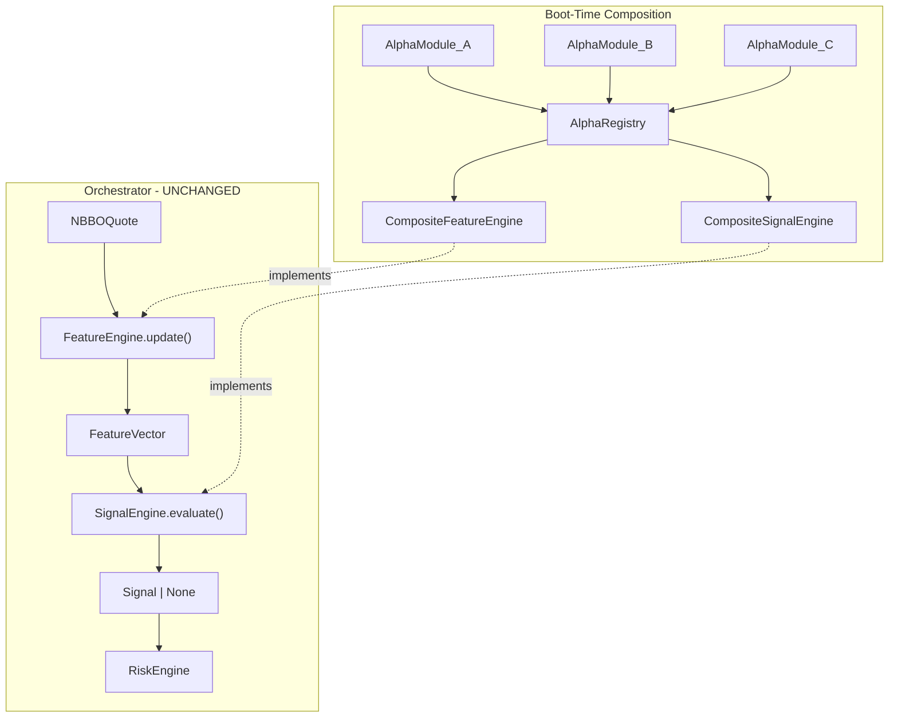
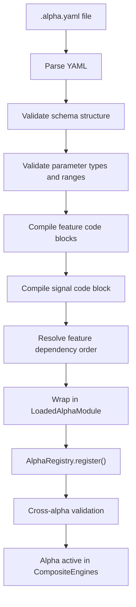
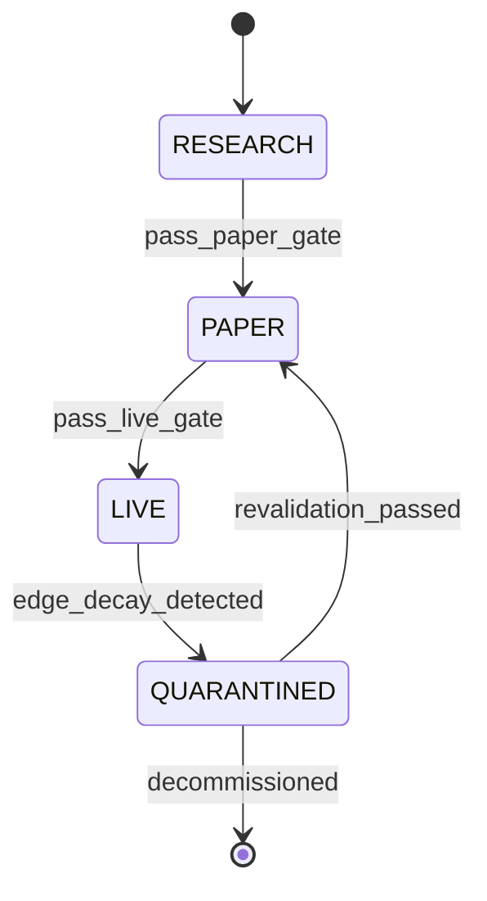

# Alpha Plug-and-Play Architecture — Consolidated Plan

## Part 1: Foundation (Completed)

The pluggable alpha module system is built and tested. All code lives under `src/feelies/alpha/` and `src/feelies/features/`.




**What exists:**

- `AlphaModule` protocol — `manifest`, `feature_definitions()`, `evaluate()`, `validate()` ([alpha/module.py](src/feelies/alpha/module.py))
- `AlphaManifest` + `AlphaRiskBudget` dataclasses ([alpha/module.py](src/feelies/alpha/module.py))
- `AlphaRegistry` — register/unregister, feature conflict detection, cross-alpha validation ([alpha/registry.py](src/feelies/alpha/registry.py))
- `CompositeFeatureEngine` — aggregates features from all alphas, topological sort, warm-up tracking, checkpointing ([alpha/composite.py](src/feelies/alpha/composite.py))
- `CompositeSignalEngine` — fan-out evaluation, fail-safe exception handling, signal arbitration ([alpha/composite.py](src/feelies/alpha/composite.py))
- `SignalArbitrator` protocol + `EdgeWeightedArbitrator` ([alpha/arbitration.py](src/feelies/alpha/arbitration.py))
- `FeatureDefinition`, `FeatureComputation` protocol, `WarmUpSpec` ([features/definition.py](src/feelies/features/definition.py))
- Cross-alpha validation — feature version conflicts, dependency cycles, required-feature coverage ([alpha/validation.py](src/feelies/alpha/validation.py))

**Key existing contracts:**

```python
# FeatureComputation — the unit of incremental feature logic
class FeatureComputation(Protocol):
    def update(self, quote: NBBOQuote, state: dict[str, Any]) -> float: ...
    def initial_state(self) -> dict[str, Any]: ...

# FeatureVector — float-only values dict
@dataclass(frozen=True)
class FeatureVector(Event):
    symbol: str
    feature_version: str
    values: dict[str, float]
    warm: bool = True
    stale: bool = False
    event_count: int = 0
```

---

## Part 2: Gap Analysis

Five gaps block external quant lab integration:

- **Gap 1 — No alpha loader.** The registry accepts Python objects but has no mechanism to load an alpha from a YAML artifact. An external lab currently must hand you a Python class.
- **Gap 2 — Untyped parameters.** `AlphaManifest.parameters` is `dict[str, Any]`. No type/range validation from an external spec.
- **Gap 3 — Quote-only features.** `FeatureComputation.update()` only accepts `NBBOQuote`. Many microstructure features need `Trade` events (volume clustering, aggressor detection, trade arrival rate).
- **Gap 4 — No alpha lifecycle.** No concept of RESEARCH -> PAPER -> LIVE -> QUARANTINED. No promotion gates or evidence requirements.
- **Gap 5 — No standard feature library.** External labs re-implement EWMA, spread, z-score from scratch every time.

---

## Part 3: The Standardized Alpha Specification

### Design Principle

**Single self-contained `.alpha.yaml` file.** The quant lab delivers one file. The system loads, validates, and integrates it without code changes. Python code for feature computations and signal logic is embedded as inline code blocks within the YAML sections.

### Canonical Template

```yaml
# ═══════════════════════════════════════════════════════════
# ALPHA SPECIFICATION TEMPLATE — PLUG-AND-PLAY
# Version: 2026-03-12 (Lab Genome Compliant)
# Use this exact structure for any REPL-generated alpha
# ═══════════════════════════════════════════════════════════

# ── Identity & Provenance ─────────────────────────────────
alpha_id: your_alpha_id_here                    # e.g. regime_gated_hybrid_mom_rev
version: "1.0.0"
author: "lab-genome-2026"
description: >
  One-line + multi-line description of what the alpha does.
  Must be human-readable and contain the structural force.

# ── Epistemological (Platform Invariant 2) ─────────────────
hypothesis: >
  Exact hypothesis statement (can include math).
  Example: Trade clustering + microprice deviation under regime gating
  produces net edge after costs.
falsification_criteria:
  - "Forward return distribution conditioned on signal shows no edge (bootstrap p > 0.05)"
  - "Net Sharpe < target after realistic execution on OOS data across 3 regimes"

# ── Symbol Scope ──────────────────────────────────────────
symbols: null                                   # null = all, or ["AAPL", "NVDA", "TSLA"]

# ── Typed Parameters ──────────────────────────────────────
parameters:
  param_name_1:
    type: int|float|bool|str
    default: value
    range: [min, max]                           # optional
    description: "Clear description"
  # ... add as many as needed

# ── Risk Budget ───────────────────────────────────────────
risk_budget:
  max_position_per_symbol: 100
  max_gross_exposure_pct: 8.0
  max_drawdown_pct: 1.5
  capital_allocation_pct: 15.0

# ── Regimes (Lab-Specific Extension) ───────────────────────
regimes:
  engine: hmm_3state_fractional                  # or null if not used
  state_names: [compression_clustering, normal, vol_breakout]
  active_state_for_momentum: 0                   # index of preferred state

# ── Feature Declarations ──────────────────────────────────
features:
  - feature_id: feature_1_name
    version: "1.0.0"
    description: "One-line description"
    depends_on: [other_feature_id]              # or []
    warm_up:
      min_events: 100
    computation: |
      def initial_state():
          return {"key": default_value}

      def update(quote, state, params):
          # quote has .bid, .ask, .bid_size, .ask_size etc.
          # return float or int
          ...

  # Add more features as needed
  # Compound features: add return_type: list[N] to auto-flatten into N scalar features

# ── Signal Logic ──────────────────────────────────────────
signal: |
  def evaluate(features, params):
      if not features.warm or features.stale:
          return None

      # Your full logic here — use features.values["feature_id"]
      # Return Signal or None

      return Signal(
          timestamp_ns=features.timestamp_ns,
          symbol=features.symbol,
          strategy_id=alpha_id,
          direction=direction,
          strength=strength,
          edge_estimate_bps=params.get("edge_estimate_bps", 2.5),
      )
```

### Template Design Notes

- **Feature formats**: The loader accepts features as either a YAML list (with `feature_id` as a field) or a YAML dict (keyed by feature name). Both produce identical `FeatureDefinition` instances.
- **Compound features**: Adding `return_type: list[N]` to a feature triggers auto-flattening (e.g., `regime_state` with `return_type: list[3]` becomes `regime_state_0`, `regime_state_1`, `regime_state_2` in `FeatureVector.values`). When omitted, `return_type` defaults to `float`.
- **Dynamic warm-up**: `min_events` can be a string expression referencing params (e.g., `"params['ema_span']"`), evaluated at load time.
- **Signal provenance**: The lab constructs `Signal` with `timestamp_ns`, `symbol`, and `strategy_id` from the `FeatureVector` and `alpha_id` (injected into scope by the loader). The loader patches in `correlation_id` and `sequence` from the `FeatureVector` since these are platform-internal provenance fields the lab should not manage.
- **Injected scope**: The loader injects `Signal`, `SignalDirection`, `LONG`, `SHORT`, `FLAT`, `alpha_id`, and `regime_engine` (if `regimes` section present) into both feature and signal code namespaces.

---

## Part 4: Detailed Design

### 4.1 `ParameterDef` and Typed Parameters

New dataclass in [src/feelies/alpha/module.py](src/feelies/alpha/module.py):

```python
@dataclass(frozen=True, kw_only=True)
class ParameterDef:
    name: str
    param_type: str          # "int", "float", "bool", "str"
    default: int | float | bool | str
    range: tuple[float, float] | None = None
    description: str = ""

    def validate_value(self, value: Any) -> list[str]:
        ...  # type check + range check
```

`AlphaManifest.parameters` stays `dict[str, Any]` (resolved values at runtime). A new field `parameter_schema: tuple[ParameterDef, ...] = ()` holds the typed definitions for validation at registration time.

### 4.2 `RegimeEngine` Protocol and HMM Implementation

New module: `src/feelies/services/regime_engine.py`

```python
class RegimeEngine(Protocol):
    @property
    def state_names(self) -> Sequence[str]: ...
    @property
    def n_states(self) -> int: ...
    def posterior(self, quote: NBBOQuote) -> list[float]: ...
    def reset(self, symbol: str) -> None: ...

class HMM3StateFractional:
    """Built-in 3-state HMM regime engine."""
    ...
```

Registry of available engines by name (`hmm_3state_fractional` -> `HMM3StateFractional`). The `AlphaLoader` looks up the engine name from the `regimes.engine` field and injects the instance into feature computation namespaces as `regime_engine`.

### 4.3 `AlphaLoader` — The Core New Component

New module: `src/feelies/alpha/loader.py`

**Responsibilities:**

1. **Parse** — Read and validate `.alpha.yaml` against structural checks. Accept features as either a list (with `feature_id` field) or a dict (keyed by name) — normalize to a canonical list internally.
2. **Resolve parameters** — Build `params` dict from defaults (or caller-provided overrides). Validate types and ranges against `ParameterDef`.
3. **Resolve dynamic warm-up** — If `min_events` is a string expression (e.g., `"params['ema_span']"`), evaluate it against the resolved params dict to produce an integer.
4. **Build sandboxed namespace** — Inject into the code execution namespace:
  - Platform types: `Signal`, `SignalDirection`, `NBBOQuote`, `Trade`
  - Shorthand constants: `LONG`, `SHORT`, `FLAT`
  - `alpha_id` — the manifest's `alpha_id` string
  - `regime_engine` — injected only if `regimes` section is present
  - Math builtins: `abs`, `min`, `max`, `round`, `len`, `range`, `sum`, `math`
5. **Compile feature code** — For each feature:
  - Compile the `computation:` block in the sandboxed namespace
  - Extract `initial_state()` and `update(quote, state, params)` callables
  - Wrap in a `_YAMLFeatureComputation` adapter implementing `FeatureComputation` protocol
  - **Auto-flatten compound returns**: If `return_type` is `list[N]`, create N separate `FeatureDefinition` instances (`feature_id_0` ... `feature_id_N-1`), each wrapping one element
6. **Compile signal code** — Compile the `signal:` block, extract `evaluate(features, params)`, wrap in an adapter that patches in `correlation_id` and `sequence` from the `FeatureVector`
7. **Produce `LoadedAlphaModule`** — A concrete class implementing `AlphaModule` protocol




**Compound Feature Auto-Flattening Detail:**

For a feature with `return_type: list[3]`:

```
YAML feature "regime_state"
    -> 1 shared _CompoundComputation (calls update once per tick, caches result)
    -> 3 FeatureDefinitions:
        regime_state_0 (version "1.0", wraps element [0])
        regime_state_1 (version "1.0", wraps element [1])
        regime_state_2 (version "1.0", wraps element [2])
```

The shared computation uses a tick counter in state to avoid recomputation when the engine calls each sub-feature sequentially.

### 4.4 Standard Feature Library

New module: `src/feelies/features/library.py`

Pre-built `FeatureComputation` implementations:

- `EWMAComputation` — exponentially weighted moving average of mid-price
- `RollingVarianceComputation` — incremental variance
- `ZScoreComputation` — z-score relative to rolling window
- `BidAskImbalanceComputation` — `(bid_size - ask_size) / (bid_size + ask_size)`
- `SpreadComputation` — `ask - bid`
- `MidPriceComputation` — `(bid + ask) / 2`

Can be referenced from YAML via `library:` shorthand (future extension) or used directly in Python-defined alphas.

### 4.5 Feature Engine Extension for Trade Events

Extend `FeatureComputation` protocol in [src/feelies/features/definition.py](src/feelies/features/definition.py):

```python
class FeatureComputation(Protocol):
    def update(self, quote: NBBOQuote, state: dict[str, Any]) -> float: ...
    def initial_state(self) -> dict[str, Any]: ...
    def update_trade(self, trade: Trade, state: dict[str, Any]) -> float | None:
        return None  # default: no-op, backward compatible
```

`CompositeFeatureEngine` gains a `process_trade(trade)` method that calls `update_trade` for features that implement it.

### 4.6 Alpha Lifecycle State Machine




Each registered alpha carries a lifecycle state in `AlphaRegistry`. Promotion gates require affirmative evidence:

- **RESEARCH -> PAPER**: Schema valid, determinism smoke test passes, feature values finite
- **PAPER -> LIVE**: N days paper PnL, Sharpe > threshold, no quarantine triggers, cost model validated
- **LIVE -> QUARANTINED**: Forensic evidence of edge decay, cost drift, or execution degradation (auto-triggered by post-trade forensics)

---

## Part 5: Files to Create / Modify

**New files:**

- `src/feelies/alpha/loader.py` — `AlphaLoader`, `LoadedAlphaModule`, `_YAMLFeatureComputation`, `_CompoundFeatureWrapper`
- `src/feelies/services/__init__.py` — services package
- `src/feelies/services/regime_engine.py` — `RegimeEngine` protocol, `HMM3StateFractional`
- `src/feelies/features/library.py` — standard feature computations
- `tests/alpha/test_loader.py` — loader unit tests
- `tests/services/test_regime_engine.py` — regime engine tests

**Modified files:**

- [src/feelies/alpha/module.py](src/feelies/alpha/module.py) — add `ParameterDef`, `parameter_schema` field to `AlphaManifest`
- [src/feelies/features/definition.py](src/feelies/features/definition.py) — add `update_trade` to `FeatureComputation`
- [src/feelies/alpha/composite.py](src/feelies/alpha/composite.py) — add `process_trade()` method
- [src/feelies/alpha/**init**.py](src/feelies/alpha/__init__.py) — export new types

---

## Part 6: Security — Inline Code Compilation

The `AlphaLoader` compiles inline Python using `compile()` + `exec()` in a restricted namespace. The namespace includes only:

- Platform types: `Signal`, `SignalDirection`, `NBBOQuote`, `Trade`
- Shorthand: `LONG`, `SHORT`, `FLAT`, `alpha_id`
- Math builtins: `abs`, `min`, `max`, `round`, `len`, `range`, `sum`
- The `math` module
- Resolved `params` dict
- Injected services: `regime_engine` (if `regimes` section present)

No `import`, `open`, `eval`, `exec`, `__import`__, or filesystem access is available to inline code. This is a defense-in-depth measure — the primary trust boundary is the quant lab relationship.