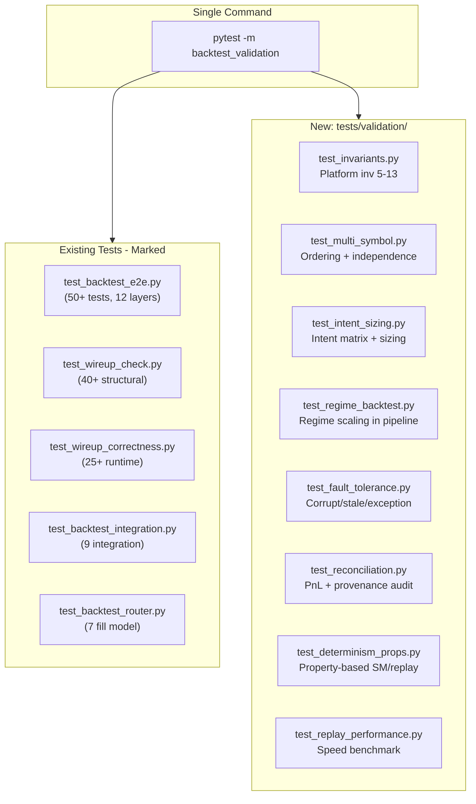

# Backtest Pipe Validation Suite

## Current State

The existing test suite has strong coverage in several areas:

- **E2E flow** (`test_backtest_e2e.py`): 12-layer assertion suite with 50+ tests on an 8-tick scenario
- **Wireup** (`test_wireup_check.py`): 40+ structural type/wiring checks
- **Correctness** (`test_wireup_correctness.py`): 25+ runtime data-flow checks
- **Determinism**: 3-run replay identity in both `test_backtest_e2e.py` and `test_wireup_correctness.py`
- **Boundary cases**: Empty log, warm-up only, wide spread

**Critical gaps** identified against the 12 skills and platform invariants:


| Gap                             | Driving Skill(s)                  | Why It Matters                                         |
| ------------------------------- | --------------------------------- | ------------------------------------------------------ |
| No multi-symbol backtest test   | backtest-engine, data-engineering | Multi-symbol ordering bug exists (no timestamp sort)   |
| No causality enforcement test   | backtest-engine (inv 6)           | Future-data leakage undetectable                       |
| No latency injection validation | backtest-engine                   | `backtest_fill_latency_ns` effect untested end-to-end  |
| No intent/sizing pipeline test  | system-architect, live-execution  | NO_ACTION path, FLAT handling, reverse untested in e2e |
| No regime-aware backtest test   | regime-detection, risk-engine     | Regime scaling in fills untested                       |
| No fault tolerance tests        | testing-validation (inv 11)       | Corrupt quotes, mid-tick exceptions, stale data        |
| No PnL reconciliation audit     | risk-engine, post-trade-forensics | Position changes vs fills vs journal not cross-checked |
| No transaction cost gate test   | backtest-engine (inv 12)          | `edge > 1.5x cost` never validated                     |
| No replay speed benchmark       | performance-engineering           | Regression in events/sec undetectable                  |
| No property-based SM tests      | testing-validation                | SM invariants tested on fixed paths only               |


**Hotspots** identified during proof-review:


| Hotspot                               | Driving Skill(s) / Inv           | Why It Matters                                                                                             |
| ------------------------------------- | -------------------------------- | ---------------------------------------------------------------------------------------------------------- |
| Trade event path zero e2e coverage    | feature-engine, data-engineering | `_process_trade()` → `process_trade()` → feature state update → next quote uses updated features: untested |
| Feature checkpoint-restore roundtrip  | testing-validation (inv 5)       | Snapshot save verified, but restore → identical output never tested                                        |
| Drawdown / FORCE_FLATTEN in backtest  | risk-engine (inv 11)             | Safety-critical path with zero integration coverage; existing e2e asserts it never fires                   |
| Sequential backtest re-entry          | system-architect                 | Calling `run_backtest()` twice on same orchestrator: stale feature/position state unknown                  |
| Latency injection e2e                 | backtest-engine                  | Identified as gap in original plan but no test file actually implements it                                 |
| Backtest/live parity impractical test | system-architect (inv 9)         | `test_process_tick_identical_across_modes` needs live backend; replace with structural verification        |
| Transaction cost realism no framework | backtest-engine (inv 12)         | No cost model exists in codebase; need placeholder marker test, not a behavioral test                      |
| Two-phase risk check enforcement      | risk-engine, live-execution      | Both `check_signal` AND `check_order` must fire for every order reaching M7; never verified                |
| All signals suppressed boundary       | testing-validation (inv 11)      | Entire backtest with zero signal triggers: should complete cleanly with empty journal                      |
| EventLog.append_batch integrity       | data-engineering                 | Batch-appended events must maintain sequence numbering through `replay()`                                  |


## Architecture




## Implementation

### Step 0: Add pytest marker and mark existing tests

In `[pyproject.toml](pyproject.toml)`, add the marker:

```toml
markers = [
    "functional: network-backed tests against live external services",
    "backtest_validation: full backtest pipe validation suite",
]
```

Add `@pytest.mark.backtest_validation` (via `pytestmark` module-level) to:

- `tests/test_backtest_e2e.py`
- `tests/test_wireup_check.py`
- `tests/test_wireup_correctness.py`
- `tests/test_backtest_integration.py`
- `tests/execution/test_backtest_router.py`

These 130+ existing tests become part of the validation suite with zero duplication.

### Step 1: Shared fixtures — `tests/validation/conftest.py`

Reusable scenario fixtures that power the new tests:

- `**single_symbol_scenario**` — reuses the 8-tick AAPL pattern from `test_backtest_e2e.py`; returns `(orchestrator, recorder, config)`
- `**multi_symbol_scenario**` — 2 symbols (AAPL + MSFT), 12 ticks interleaved by timestamp; validates global ordering
- `**trade_mixed_scenario**` — **(new)** AAPL quotes interleaved with `Trade` events; validates `_process_trade()` → feature engine → feature state feeding into next quote-driven signal. Uses a feature definition with `update_trade()` that returns a non-None value so the path is exercised
- `**regime_scenario`** — 8 ticks with `regime_engine="hmm3_fractional"` enabled; validates regime-aware sizing
- `**latency_injection_scenario`** — **(new)** single-symbol 4-tick scenario with `backtest_fill_latency_ns=5000`; validates fill timestamps are offset from submission
- `**drawdown_scenario`** — **(new)** constructs a price series that generates trades leading to cumulative losses exceeding `max_drawdown_pct`; validates FORCE_FLATTEN → RISK_LOCKDOWN
- `**all_suppressed_scenario`** — **(new)** 4 ticks where the signal engine always returns `None` (e.g., all prices within warm-up or flat range); validates clean completion with zero orders
- `**fault_scenario_factory`** — factory fixture producing event logs with injected faults (corrupt prices, negative spreads, duplicate timestamps, gaps)
- `**alpha_spec_dir`** — temporary directory with `mean_reversion.alpha.yaml` (copied from `alphas/`)

### Step 2: New test files

Each file maps to specific skills and platform invariants. All classes/functions marked `@pytest.mark.backtest_validation`.

---

#### `tests/validation/test_invariants.py`

**Skills**: system-architect, backtest-engine, data-engineering, testing-validation
**Platform invariants**: 5, 6, 7, 8, 9, 10, 11, 12, 13


| Test                                                    | Invariant | What It Validates                                                                                                                                                                                                                                                                                                   |
| ------------------------------------------------------- | --------- | ------------------------------------------------------------------------------------------------------------------------------------------------------------------------------------------------------------------------------------------------------------------------------------------------------------------- |
| `test_deterministic_order_ids`                          | Inv 5     | SHA-256 order IDs from `correlation_id:seq` are identical across 2 runs                                                                                                                                                                                                                                             |
| `test_no_uuid4_in_order_ids`                            | Inv 5     | All order IDs are 16-char hex (SHA-256 prefix), no hyphens                                                                                                                                                                                                                                                          |
| `test_causal_ordering_features_use_only_past`           | Inv 6     | For each FeatureVector, its `timestamp_ns <= exchange_timestamp_ns` of the triggering quote                                                                                                                                                                                                                         |
| `test_causal_ordering_no_future_nbbo_in_fills`          | Inv 6     | Each OrderAck `fill_price` matches the NBBO *at or before* the order's timestamp, not a future quote                                                                                                                                                                                                                |
| `test_all_events_are_typed_frozen_dataclasses`          | Inv 7     | Every event on the bus is a frozen dataclass inheriting from Event                                                                                                                                                                                                                                                  |
| `test_no_cross_layer_imports_in_signal_engine`          | Inv 8     | SignalEngine.evaluate has no side effects (check: same features → same signal, repeated call)                                                                                                                                                                                                                       |
| `test_no_mode_branching_in_orchestrator_pipeline`       | Inv 9     | **(replaces impractical cross-mode test)** Structural grep/AST: `_process_tick`, `_process_tick_inner`, `_run_pipeline` contain zero `if mode`, `OperatingMode`, or `MacroState.BACKTEST` conditionals. Mode-specific code lives only in `bootstrap.py`                                                             |
| `test_no_raw_datetime_now_in_pipeline_events`           | Inv 10    | All event timestamps are from SimulatedClock (value <= max exchange_timestamp_ns)                                                                                                                                                                                                                                   |
| `test_exception_in_feature_engine_degrades_not_crashes` | Inv 11    | Injected exception in feature compute → macro DEGRADED, no crash                                                                                                                                                                                                                                                    |
| `test_risk_breach_activates_kill_switch`                | Inv 11    | FORCE_FLATTEN → risk escalation → kill switch active → macro RISK_LOCKDOWN                                                                                                                                                                                                                                          |
| `test_cost_realism_gate_exists`                         | Inv 12    | **(new — placeholder)** `AlphaLifecycleEvidence.cost_model_validated` field exists and defaults to `False`. `validate_promotion_evidence()` rejects promotion when `cost_model_validated=False`. Marks the structural requirement as tested even though no cost model implementation exists yet                     |
| `test_full_provenance_chain_quote_to_trade_record`      | Inv 13    | Every TradeRecord.correlation_id traces back to a quote via signal → order chain                                                                                                                                                                                                                                    |
| `test_every_sm_transition_emitted_on_bus`               | Inv 13    | Count of StateTransition events >= expected (macro + micro + order SM transitions)                                                                                                                                                                                                                                  |
| `test_trade_events_update_feature_state_e2e`            | Inv 6, 7  | **(new — Hotspot 1)** Uses `trade_mixed_scenario`: Trade events fed alongside quotes; feature engine receives `process_trade()` calls; feature values from trade-updated state feed into next quote's signal evaluation. Asserts FeatureVector after a Trade-then-Quote sequence differs from a Quote-only baseline |
| `test_sequential_backtest_reentry_clean_state`          | Inv 5     | **(new — Hotspot 4)** Calls `run_backtest()` twice on the same orchestrator (with `boot()` between). Second run must produce identical positions/orders to a fresh single-run orchestrator. Validates feature engine, position store, and risk engine HWM are reset                                                 |
| `test_append_batch_preserves_sequence_integrity`        | Inv 7     | **(new — Hotspot 10)** Appends events via `append_batch()`, then replays. Asserts sequence numbers are contiguous, ordering matches insertion order, and `last_sequence()` reflects the batch                                                                                                                       |


---

#### `tests/validation/test_multi_symbol.py`

**Skills**: backtest-engine, data-engineering, feature-engine
**Invariant**: 6 (causality), 5 (determinism)


| Test                                      | What It Validates                                                                 |
| ----------------------------------------- | --------------------------------------------------------------------------------- |
| `test_events_replayed_in_timestamp_order` | Quotes arrive at orchestrator in exchange_timestamp_ns order regardless of symbol |
| `test_per_symbol_feature_isolation`       | AAPL features are independent of MSFT quote updates                               |
| `test_per_symbol_position_independence`   | AAPL fill does not affect MSFT position and vice versa                            |
| `test_multi_symbol_deterministic_replay`  | 2 runs of multi-symbol backtest produce identical results                         |
| `test_fill_uses_correct_symbol_quote`     | AAPL order filled at AAPL mid, not MSFT mid                                       |


---

#### `tests/validation/test_intent_sizing.py`

**Skills**: system-architect, live-execution, risk-engine, microstructure-alpha
**New pipeline layer validation**


| Test                                              | What It Validates                                            |
| ------------------------------------------------- | ------------------------------------------------------------ |
| `test_flat_signal_no_position_produces_no_action` | FLAT signal with qty=0 → NO_ACTION → no risk check, no order |
| `test_long_signal_from_flat_produces_entry_long`  | LONG + flat position → ENTRY_LONG → order BUY                |
| `test_long_signal_at_target_produces_no_action`   | LONG + already at target qty → NO_ACTION                     |
| `test_short_signal_from_long_produces_reverse`    | SHORT + long position → REVERSE_LONG_TO_SHORT → order SELL   |
| `test_exit_signal_closes_position`                | FLAT + long position → EXIT → order SELL                     |
| `test_position_sizer_scales_with_signal_strength` | strength=0.5 → half the qty vs strength=1.0                  |
| `test_position_sizer_caps_at_max_position`        | qty never exceeds `risk_budget.max_position_per_symbol`      |
| `test_no_action_skips_risk_check`                 | When NO_ACTION, no RiskVerdict events emitted for that tick  |
| `test_scale_down_verdict_reduces_quantity`        | `scaling_factor=0.5` → order qty halved                      |


---

#### `tests/validation/test_regime_backtest.py`

**Skills**: regime-detection, risk-engine, feature-engine
**Invariants**: 5 (determinism), 11 (fail-safe)


| Test                                           | What It Validates                                                   |
| ---------------------------------------------- | ------------------------------------------------------------------- |
| `test_regime_state_published_at_m2_every_tick` | One RegimeState event per NBBOQuote, published before FeatureVector |
| `test_regime_posteriors_sum_to_one`            | Every RegimeState's posteriors sum to ~1.0                          |
| `test_regime_scaling_reduces_position_size`    | vol_breakout regime → smaller order qty than normal regime          |
| `test_no_regime_engine_defaults_neutral`       | regime_engine=None → position sizing uses 1.0x factor               |
| `test_regime_deterministic_across_runs`        | Same quotes → same RegimeState sequence across 2 runs               |


---

#### `tests/validation/test_fault_tolerance.py`

**Skills**: testing-validation, data-engineering, system-architect, risk-engine
**Invariant**: 11 (fail-safe default)


| Test                                                | What It Validates                                                                                                                                                                                                                                                                                                                   |
| --------------------------------------------------- | ----------------------------------------------------------------------------------------------------------------------------------------------------------------------------------------------------------------------------------------------------------------------------------------------------------------------------------- |
| `test_zero_size_quote_does_not_crash`               | bid_size=0, ask_size=0 → pipeline continues, no fill                                                                                                                                                                                                                                                                                |
| `test_extreme_price_spike_handled`                  | 100x price spike → pipeline processes without crash                                                                                                                                                                                                                                                                                 |
| `test_duplicate_timestamp_events_processed`         | Two quotes with same timestamp_ns → both processed, no crash                                                                                                                                                                                                                                                                        |
| `test_feature_engine_exception_degrades_gracefully` | Patched feature engine raising → micro resets to M0, macro DEGRADED                                                                                                                                                                                                                                                                 |
| `test_signal_engine_exception_degrades_gracefully`  | Patched signal engine raising → same degraded behavior                                                                                                                                                                                                                                                                              |
| `test_risk_engine_exception_degrades_gracefully`    | Patched risk engine raising → same degraded behavior                                                                                                                                                                                                                                                                                |
| `test_degraded_mode_blocks_further_ticks`           | After DEGRADED, remaining ticks are not processed                                                                                                                                                                                                                                                                                   |
| `test_kill_switch_activated_mid_run_stops_pipeline` | Kill switch activated → no further orders                                                                                                                                                                                                                                                                                           |
| `test_recover_from_degraded_resumes`                | DEGRADED → recover_from_degraded() → READY → can run_backtest again                                                                                                                                                                                                                                                                 |
| `test_drawdown_triggers_force_flatten_and_lockdown` | **(new — Hotspot 3)** Uses `drawdown_scenario`: price series causes cumulative losses exceeding `max_drawdown_pct`. Asserts: `_is_drawdown_breached()` returns True, `check_signal()` emits `FORCE_FLATTEN`, orchestrator escalates to `RISK_LOCKDOWN`, remaining ticks are not processed, and final macro state is `RISK_LOCKDOWN` |
| `test_drawdown_hwm_tracks_peak_equity`              | **(new — Hotspot 3)** After profitable trades raise HWM, a loss only triggers FORCE_FLATTEN relative to the HWM, not initial equity                                                                                                                                                                                                 |
| `test_all_signals_suppressed_completes_cleanly`     | **(new — Hotspot 9)** Uses `all_suppressed_scenario`: entire backtest produces zero signals. Asserts: macro completes at READY (not DEGRADED), zero OrderRequest events, zero OrderAck events, empty trade journal, all ticks reach M10 via the NO_ACTION/None early-exit path                                                      |


---

#### `tests/validation/test_reconciliation.py`

**Skills**: post-trade-forensics, risk-engine, live-execution, backtest-engine
**Invariant**: 13 (provenance), 12 (cost realism)


| Test                                              | What It Validates                                                                                                                                                                                                                                                               |
| ------------------------------------------------- | ------------------------------------------------------------------------------------------------------------------------------------------------------------------------------------------------------------------------------------------------------------------------------- |
| `test_position_delta_matches_fill_quantity`       | Sum of signed fill quantities = final position for each symbol                                                                                                                                                                                                                  |
| `test_realized_pnl_matches_trade_journal`         | PositionStore.realized_pnl = sum of TradeRecord.realized_pnl                                                                                                                                                                                                                    |
| `test_trade_record_has_all_required_fields`       | Every TradeRecord: non-empty order_id, symbol, strategy_id, correlation_id; fill_price > 0                                                                                                                                                                                      |
| `test_trade_record_timestamps_causal`             | signal_timestamp_ns <= submit_timestamp_ns <= fill_timestamp_ns                                                                                                                                                                                                                 |
| `test_order_request_count_equals_ack_count`       | Every submitted OrderRequest has exactly one OrderAck                                                                                                                                                                                                                           |
| `test_no_orphaned_fills`                          | Every OrderAck.order_id exists in _active_orders (no fill_for_unknown_order alerts)                                                                                                                                                                                             |
| `test_fees_and_slippage_non_negative`             | TradeRecord.fees >= 0 and slippage_bps >= 0                                                                                                                                                                                                                                     |
| `test_pnl_decomposition_sums_correctly`           | realized_pnl across all records = final portfolio realized_pnl                                                                                                                                                                                                                  |
| `test_both_risk_checks_fire_for_every_order`      | **(new — Hotspot 8)** For every OrderRequest that reaches M7 (i.e., `router.submit()` is called), exactly one `check_signal` RiskVerdict AND one `check_order` RiskVerdict with matching `correlation_id` exist on the bus. Prevents regressions that silently skip the M6 gate |
| `test_latency_injection_propagates_to_fill_ts`    | **(new — Hotspot 5)** Uses `latency_injection_scenario` (`backtest_fill_latency_ns=5000`): for every OrderAck, `fill_timestamp_ns = submission_timestamp_ns + 5000`. Validates end-to-end propagation through orchestrator → BacktestOrderRouter → reconciliation → TradeRecord |
| `test_latency_injection_causal_fill_after_submit` | **(new — Hotspot 5)** With latency > 0, TradeRecord's `fill_timestamp_ns > submit_timestamp_ns` (strict inequality, unlike the zero-latency case where they may be equal)                                                                                                       |


---

#### `tests/validation/test_determinism_props.py`

**Skills**: testing-validation, system-architect, feature-engine
**Invariant**: 5 (deterministic replay)

Property-based tests using `hypothesis`, plus checkpoint-restore roundtrip:


| Test                                                  | What It Validates                                                                                                                                                                                                                                                                                                                                                                 |
| ----------------------------------------------------- | --------------------------------------------------------------------------------------------------------------------------------------------------------------------------------------------------------------------------------------------------------------------------------------------------------------------------------------------------------------------------------- |
| `test_simulated_clock_never_moves_backward`           | Random set_time sequences: backward raises ValueError                                                                                                                                                                                                                                                                                                                             |
| `test_state_machine_illegal_transition_raises`        | Random transition attempts on all 5 SMs: illegal → IllegalTransition                                                                                                                                                                                                                                                                                                              |
| `test_state_machine_terminal_states_have_no_outbound` | Terminal states (FILLED, CANCELLED, REJECTED, EXPIRED, SHUTDOWN) have empty transition sets                                                                                                                                                                                                                                                                                       |
| `test_risk_escalation_monotonic`                      | Random RiskLevel sequences: can only go forward R0→R4                                                                                                                                                                                                                                                                                                                             |
| `test_order_id_deterministic_from_inputs`             | Same (correlation_id, seq) → same order_id across 100 runs                                                                                                                                                                                                                                                                                                                        |
| `test_micro_pipeline_always_returns_to_m0`            | Any valid path through micro states ends at WAITING_FOR_MARKET_EVENT                                                                                                                                                                                                                                                                                                              |
| `test_checkpoint_restore_produces_identical_output`   | **(new — Hotspot 2)** Run A: 10-tick backtest → shutdown (checkpoints feature state). Run B: replay first 5 ticks → checkpoint → restore from snapshot → replay remaining 5 ticks. Assert: final positions, order IDs, and FeatureVector values from run B match run A exactly. This validates the `FeatureSnapshotStore.save()` → `load()` → `FeatureEngine.restore()` roundtrip |
| `test_checkpoint_version_mismatch_cold_starts`        | **(new — Hotspot 2)** Save checkpoint with version "1.0", attempt restore with version "2.0". Assert: `load()` returns `None` (version mismatch), feature engine cold-starts, and the backtest still completes correctly (degraded but not crashed)                                                                                                                               |


---

#### `tests/validation/test_replay_performance.py`

**Skills**: performance-engineering, backtest-engine


| Test                                       | What It Validates                                           |
| ------------------------------------------ | ----------------------------------------------------------- |
| `test_single_tick_processing_under_budget` | 1000 ticks: p99 < 100μs (simulated clock, no I/O)           |
| `test_full_day_replay_speed`               | 50,000 synthetic events replayed in < 30s                   |
| `test_events_per_second_regression`        | events/sec >= a stored baseline (fails if regression > 20%) |
| `test_memory_footprint_bounded`            | RSS delta after 10,000 events < 50 MB                       |


Note: Performance tests use `pytest-benchmark` or manual `time.perf_counter_ns()` timing. They are marked `@pytest.mark.slow` in addition to `@pytest.mark.backtest_validation` so they can be excluded from quick runs via `pytest -m "backtest_validation and not slow"`.

---

### Step 3: Multi-symbol event log fix

The `test_multi_symbol.py` tests will initially fail because `scripts/run_backtest.py` does not sort events globally by `exchange_timestamp_ns` for multi-symbol runs. The test fixtures will build a correctly-sorted multi-symbol event log directly (bypassing the script), which validates the pipeline's ability to handle interleaved symbols. A separate test will assert that events must arrive in timestamp order.

### Skill Coverage Matrix


| Skill                    | Existing Tests                                      | New Tests                                                                                                                        |
| ------------------------ | --------------------------------------------------- | -------------------------------------------------------------------------------------------------------------------------------- |
| system-architect         | wireup_check, wireup_correctness                    | test_invariants (inv 5-13 + structural parity + re-entry), test_intent_sizing                                                    |
| backtest-engine          | backtest_e2e, backtest_integration, backtest_router | test_invariants (causality, order IDs), test_multi_symbol, test_reconciliation (latency injection e2e)                           |
| data-engineering         | replay_feed, polygon_ingestor, data_integrity       | test_multi_symbol (ordering), test_fault_tolerance (corrupt data), test_invariants (append_batch integrity)                      |
| feature-engine           | test_library, test_engine_protocol, composite       | test_invariants (causal features + trade event path), test_multi_symbol (isolation), test_determinism_props (checkpoint-restore) |
| live-execution           | order_state, intent                                 | test_intent_sizing (full matrix), test_reconciliation (two-phase risk enforcement)                                               |
| microstructure-alpha     | composite_signal, backtest_e2e (signals)            | test_intent_sizing (FLAT handling)                                                                                               |
| performance-engineering  | —                                                   | test_replay_performance                                                                                                          |
| post-trade-forensics     | backtest_e2e (provenance, journal)                  | test_reconciliation (PnL audit + latency propagation)                                                                            |
| regime-detection         | test_regime_engine                                  | test_regime_backtest                                                                                                             |
| research-workflow        | — (orthogonal to backtest pipe)                     | —                                                                                                                                |
| risk-engine              | test_basic_risk, test_position_sizer                | test_intent_sizing (scale_down), test_fault_tolerance (escalation + drawdown/FORCE_FLATTEN + HWM)                                |
| testing-validation       | backtest_e2e (determinism)                          | test_determinism_props (property-based + checkpoint roundtrip), test_fault_tolerance (all-signals-suppressed)                    |
| platform-invariants rule | scattered                                           | test_invariants (consolidated inv 5-13, including inv 9 structural guard and inv 12 placeholder)                                 |


### Run Commands

```bash
# Full validation suite (existing + new)
pytest -m backtest_validation -v

# Quick validation (skip performance benchmarks)
pytest -m "backtest_validation and not slow" -v

# Just the new validation tests
pytest tests/validation/ -v
```

### File Summary


| File                                          | Action | Tests                                                  |
| --------------------------------------------- | ------ | ------------------------------------------------------ |
| `pyproject.toml`                              | Edit   | Add `backtest_validation` and `slow` markers           |
| `tests/test_backtest_e2e.py`                  | Edit   | Add `pytestmark`                                       |
| `tests/test_wireup_check.py`                  | Edit   | Add `pytestmark`                                       |
| `tests/test_wireup_correctness.py`            | Edit   | Add `pytestmark`                                       |
| `tests/test_backtest_integration.py`          | Edit   | Add `pytestmark`                                       |
| `tests/execution/test_backtest_router.py`     | Edit   | Add `pytestmark`                                       |
| `tests/validation/__init__.py`                | Create | Empty                                                  |
| `tests/validation/conftest.py`                | Create | ~200 lines: 8 fixtures (4 new scenarios for hotspots)  |
| `tests/validation/test_invariants.py`         | Create | ~350 lines: 16 tests (+4 from hotspots 1, 4, 6, 7, 10) |
| `tests/validation/test_multi_symbol.py`       | Create | ~200 lines: 5 tests                                    |
| `tests/validation/test_intent_sizing.py`      | Create | ~250 lines: 9 tests                                    |
| `tests/validation/test_regime_backtest.py`    | Create | ~150 lines: 5 tests                                    |
| `tests/validation/test_fault_tolerance.py`    | Create | ~300 lines: 12 tests (+3 from hotspots 3, 9)           |
| `tests/validation/test_reconciliation.py`     | Create | ~280 lines: 11 tests (+3 from hotspots 5, 8)           |
| `tests/validation/test_determinism_props.py`  | Create | ~280 lines: 8 tests (+2 from hotspot 2)                |
| `tests/validation/test_replay_performance.py` | Create | ~150 lines: 4 tests                                    |


### Hotspot-to-Test Traceability


| Hotspot | Description                          | Resolved In               | Test(s)                                                                                             |
| ------- | ------------------------------------ | ------------------------- | --------------------------------------------------------------------------------------------------- |
| 1       | Trade event path zero e2e            | test_invariants.py        | `test_trade_events_update_feature_state_e2e`                                                        |
| 2       | Checkpoint-restore roundtrip         | test_determinism_props.py | `test_checkpoint_restore_produces_identical_output`, `test_checkpoint_version_mismatch_cold_starts` |
| 3       | Drawdown / FORCE_FLATTEN             | test_fault_tolerance.py   | `test_drawdown_triggers_force_flatten_and_lockdown`, `test_drawdown_hwm_tracks_peak_equity`         |
| 4       | Sequential backtest re-entry         | test_invariants.py        | `test_sequential_backtest_reentry_clean_state`                                                      |
| 5       | Latency injection e2e                | test_reconciliation.py    | `test_latency_injection_propagates_to_fill_ts`, `test_latency_injection_causal_fill_after_submit`   |
| 6       | Backtest/live parity structural      | test_invariants.py        | `test_no_mode_branching_in_orchestrator_pipeline`                                                   |
| 7       | Transaction cost realism placeholder | test_invariants.py        | `test_cost_realism_gate_exists`                                                                     |
| 8       | Two-phase risk check enforcement     | test_reconciliation.py    | `test_both_risk_checks_fire_for_every_order`                                                        |
| 9       | All signals suppressed boundary      | test_fault_tolerance.py   | `test_all_signals_suppressed_completes_cleanly`                                                     |
| 10      | EventLog.append_batch integrity      | test_invariants.py        | `test_append_batch_preserves_sequence_integrity`                                                    |


