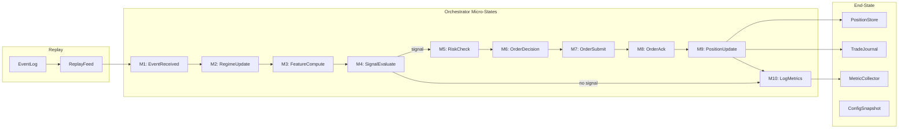
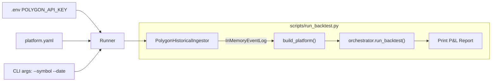

# End-to-End Backtest Verification

## Design Philosophy

The test exercises the **complete backtest pipe** using the real `alphas/mean_reversion.alpha.yaml` alpha (not an embedded mock). The primary observation mechanism is a **BusRecorder** that subscribes to all events via `bus.subscribe_all()`, capturing the full causal tape. Every assertion is made against this tape or against end-state snapshots — no production code is modified.

## Pipeline Under Test




## Synthetic Dataset Design

Uses the real `mean_reversion.alpha.yaml` with `parameter_overrides` to make the scenario tractable:

- **ewma_span: 5** (warm-up completes at tick 5)
- **zscore_entry: 1.0** (lower threshold for test)
- **max_spread_bps: 5.0** (default, $0.01 spread passes at ~0.67 bps)
- **account_equity: 100,000**

All quotes use AAPL with $0.01 spread (realistic for large-cap):


| Tick | Bid    | Ask    | Mid     | warm  | zscore (approx) | Expected  |
| ---- | ------ | ------ | ------- | ----- | --------------- | --------- |
| 1    | 150.00 | 150.01 | 150.005 | False | 0.0             | warm-up   |
| 2    | 150.00 | 150.01 | 150.005 | False | 0.0             | warm-up   |
| 3    | 150.00 | 150.01 | 150.005 | False | 0.0             | warm-up   |
| 4    | 150.00 | 150.01 | 150.005 | False | 0.0             | warm-up   |
| 5    | 150.00 | 150.01 | 150.005 | True  | 0.0             | no signal |
| 6    | 160.00 | 160.01 | 160.005 | True  | +1.15           | SHORT     |
| 7    | 160.00 | 160.01 | 160.005 | True  | +0.73           | no signal |
| 8    | 140.00 | 140.01 | 140.005 | True  | -1.01           | LONG      |


**Why these values work:** With `ewma_span=5` (`alpha=1/3`), a single jump from a stable series produces zscore = `(1-alpha)/sqrt(alpha)` = `0.667/0.577` = 1.155, which exceeds the 1.0 threshold. The reversal at tick 8 produces zscore approx -1.01 from accumulated variance.

**Expected execution flow (exact values):**

- Tick 6 SHORT: strength=0.23094. BudgetBasedSizer: `floor(100000 * 0.20 * 0.23094 / 160.005)` = **28 shares**. Intent: ENTRY_SHORT. Order: SELL 28. Fill: 28 @ Decimal("160.005"). Position: **-28 shares, realized_pnl=0**.
- Tick 8 LONG: strength=0.20207. BudgetBasedSizer: `floor(100000 * 0.20 * 0.20207 / 140.005)` = **28 shares**. Intent: REVERSE_SHORT_TO_LONG (28+28=56). Order: BUY 56. Fill: 56 @ Decimal("140.005"). Position: **+28 shares, realized_pnl=Decimal("560")**.

## BusRecorder — The Tracing Mechanism

A lightweight helper class (defined in the test module) that attaches between `build_platform()` and `boot()`:

```python
@dataclass
class BusRecorder:
    events: list[Event] = field(default_factory=list)
    by_type: dict[type, list[Event]] = field(default_factory=lambda: defaultdict(list))

    def __call__(self, event: Event) -> None:
        self.events.append(event)
        self.by_type[type(event)].append(event)

    def of_type(self, t: type[T]) -> list[T]:
        return self.by_type[t]  # type: ignore
```

Subscribes via `orchestrator._bus.subscribe_all(recorder)`.

## Test Structure

File: `tests/test_backtest_e2e.py`

Uses a **class-scoped fixture** (`@pytest.fixture(scope="class")` with `tmp_path_factory`) so the 8-tick scenario runs once per class, and individual test methods assert different layer boundaries.

### Layer-by-Layer Assertions — Specific Expected Results

All numeric values below are computed from the EWMA/zscore math with `alpha = 2/(ewma_span+1) = 1/3`. Floating-point values use `pytest.approx(val, abs=1e-6)`. Decimal values are exact.

---

**Layer 1 — Ingestion/Replay**

Expected bus output: **8 `NBBOQuote` events**


| idx | symbol | bid    | ask    | timestamp_ns  | correlation_id    |
| --- | ------ | ------ | ------ | ------------- | ----------------- |
| 0   | AAPL   | 150.00 | 150.01 | 1_000_000_000 | AAPL:1000000000:1 |
| 1   | AAPL   | 150.00 | 150.01 | 2_000_000_000 | AAPL:2000000000:2 |
| 2   | AAPL   | 150.00 | 150.01 | 3_000_000_000 | AAPL:3000000000:3 |
| 3   | AAPL   | 150.00 | 150.01 | 4_000_000_000 | AAPL:4000000000:4 |
| 4   | AAPL   | 150.00 | 150.01 | 5_000_000_000 | AAPL:5000000000:5 |
| 5   | AAPL   | 160.00 | 160.01 | 6_000_000_000 | AAPL:6000000000:6 |
| 6   | AAPL   | 160.00 | 160.01 | 7_000_000_000 | AAPL:7000000000:7 |
| 7   | AAPL   | 140.00 | 140.01 | 8_000_000_000 | AAPL:8000000000:8 |


Assertions:

- `len(recorder.of_type(NBBOQuote)) == 8`
- All `symbol == "AAPL"`
- Timestamps strictly monotonic: each `ts[i] < ts[i+1]`

---

**Layer 2 — Feature Engine**

Expected bus output: **8 `FeatureVector` events**, each with keys `{mid_price, spread, mid_ewma, mid_zscore}`


| idx | warm  | event_count | mid_price | spread | mid_ewma | mid_zscore |
| --- | ----- | ----------- | --------- | ------ | -------- | ---------- |
| 0   | False | 1           | 150.005   | 0.01   | 150.005  | 0.0        |
| 1   | False | 2           | 150.005   | 0.01   | 150.005  | 0.0        |
| 2   | False | 3           | 150.005   | 0.01   | 150.005  | 0.0        |
| 3   | False | 4           | 150.005   | 0.01   | 150.005  | 0.0        |
| 4   | True  | 5           | 150.005   | 0.01   | 150.005  | 0.0        |
| 5   | True  | 6           | 160.005   | 0.01   | 153.3383 | 1.15470    |
| 6   | True  | 7           | 160.005   | 0.01   | 155.5606 | 0.73030    |
| 7   | True  | 8           | 140.005   | 0.01   | 150.3754 | -1.01036   |


Derivation (alpha=1/3):

- `mid_price = float((bid + ask) / 2)` — exact per tick
- `spread = float(ask - bid) = 0.01` for all ticks
- `mid_ewma`: EWMA seeded at first mid; ticks 1-5 stable at 150.005; tick 6: `1/3*160.005 + 2/3*150.005 = 153.3383`; tick 7: `1/3*160.005 + 2/3*153.3383 = 155.5606`; tick 8: `1/3*140.005 + 2/3*155.5606 = 150.3754`
- `mid_zscore`: `(mid - ewma_new) / sqrt(ema_var_new)`. Tick 6: `2/sqrt(3) = 1.15470`; tick 7: `4*sqrt(30)/30 = 0.73030`; tick 8: `-7*sqrt(3)/12 = -1.01036`
- Warm-up: `min_events = max(1, 1, 5, 5) = 5`; event_count >= 5 at tick 5

Assertions:

- `len(recorder.of_type(FeatureVector)) == 8`
- `fv[0..3].warm == False` (event_count 1-4 < 5)
- `fv[4..7].warm == True` (event_count 5-8 >= 5)
- Each `fv.values["mid_price"] == pytest.approx(expected_mid)`
- Each `fv.values["spread"] == pytest.approx(0.01)`
- `fv[5].values["mid_zscore"] == pytest.approx(1.15470, abs=1e-4)` — exceeds zscore_entry=1.0
- `fv[6].values["mid_zscore"] == pytest.approx(0.73030, abs=1e-4)` — below threshold
- `fv[7].values["mid_zscore"] == pytest.approx(-1.01036, abs=1e-4)` — exceeds negative threshold

---

**Layer 3 — Signal Engine**

Expected bus output: **exactly 2 `Signal` events**


| idx | direction | strength | edge_estimate_bps | strategy_id    | correlation_id    |
| --- | --------- | -------- | ----------------- | -------------- | ----------------- |
| 0   | SHORT     | 0.23094  | 2.5               | mean_reversion | AAPL:6000000000:6 |
| 1   | LONG      | 0.20207  | 2.5               | mean_reversion | AAPL:8000000000:8 |


Derivation:

- `strength = min(abs(zscore) / 5.0, 1.0)`
- Signal 0: `min(1.15470/5.0, 1.0) = 0.23094`
- Signal 1: `min(1.01036/5.0, 1.0) = 0.20207`
- Ticks 1-4: warm=False → `CompositeSignalEngine` returns None (warm gate)
- Tick 5: warm=True, zscore=0.0 → below threshold → None
- Tick 6: zscore=1.15470 > 1.0 → SHORT
- Tick 7: zscore=0.73030 < 1.0 → None
- Tick 8: zscore=-1.01036 < -1.0 → LONG

Assertions:

- `len(recorder.of_type(Signal)) == 2`
- `signals[0].direction == SignalDirection.SHORT`
- `signals[0].strength == pytest.approx(0.23094, abs=1e-4)`
- `signals[0].correlation_id == "AAPL:6000000000:6"`
- `signals[1].direction == SignalDirection.LONG`
- `signals[1].strength == pytest.approx(0.20207, abs=1e-4)`
- `signals[1].correlation_id == "AAPL:8000000000:8"`
- Both: `strategy_id == "mean_reversion"`, `edge_estimate_bps == 2.5`

---

**Layer 4 — Risk Engine**

Expected bus output: **4 `RiskVerdict` events** (2 from `check_signal` + 2 from `check_order`)


| idx | source                | action | scaling_factor | reason        |
| --- | --------------------- | ------ | -------------- | ------------- |
| 0   | check_signal (tick 6) | ALLOW  | 1.0            | within limits |
| 1   | check_order (tick 6)  | ALLOW  | 1.0            | post-fill OK  |
| 2   | check_signal (tick 8) | ALLOW  | 1.0            | within limits |
| 3   | check_order (tick 8)  | ALLOW  | 1.0            | post-fill OK  |


Derivation:

- Account equity = 100,000. Platform limits: max_position=1000, max_exposure=20%, max_drawdown=5%.
- Tick 6: position=0, requesting 28 shares. 28 << 1000. Exposure = 28*160.005 = 4480.14 << 20,000. → ALLOW.
- Tick 8: position=-28, requesting 56 shares. Post-fill = +28. 28 << 1000. → ALLOW.
- No regime engine → `scaling_factor = 1.0` (no regime-based reduction).

Assertions:

- `len(recorder.of_type(RiskVerdict)) == 4`
- All: `action == RiskAction.ALLOW`
- All: `scaling_factor == 1.0`
- None have `action == FORCE_FLATTEN` or `action == REJECT`

---

**Layer 5 — Execution**

Expected bus output: **2 `OrderRequest` events** and **2 `OrderAck` events**

**OrderRequests:**


| idx | side | quantity | symbol | correlation_id    |
| --- | ---- | -------- | ------ | ----------------- |
| 0   | SELL | 28       | AAPL   | AAPL:6000000000:6 |
| 1   | BUY  | 56       | AAPL   | AAPL:8000000000:8 |


**OrderAcks:**


| idx | status | filled_quantity | fill_price         | symbol |
| --- | ------ | --------------- | ------------------ | ------ |
| 0   | FILLED | 28              | Decimal("160.005") | AAPL   |
| 1   | FILLED | 56              | Decimal("140.005") | AAPL   |


Derivation — Sizing (BudgetBasedSizer, regime_factor=1.0):

- Tick 6: `allocated = 100000 * 20/100 = 20000`. `conviction = 20000 * 0.23094 = 4618.8`. `shares = floor(4618.8 / 160.005) = 28`.
- Tick 8: `conviction = 20000 * 0.20207 = 4041.4`. `shares = floor(4041.4 / 140.005) = 28`.

Derivation — Intent (SignalPositionTranslator):

- Tick 6: signal=SHORT, position=0 → `ENTRY_SHORT`, quantity=28
- Tick 8: signal=LONG, position=-28 → `REVERSE_SHORT_TO_LONG`, quantity=abs(-28)+28=56

Derivation — Order construction:

- `quantity = max(1, round(intent.target_quantity * verdict.scaling_factor))`
- Tick 6: `round(28 * 1.0) = 28`; tick 8: `round(56 * 1.0) = 56`

Derivation — Fills (BacktestOrderRouter):

- `fill_price = (quote.bid + quote.ask) / Decimal("2")` = mid price at tick

Assertions:

- `len(recorder.of_type(OrderRequest)) == 2`
- `orders[0].side == Side.SELL`, `orders[0].quantity == 28`
- `orders[1].side == Side.BUY`, `orders[1].quantity == 56`
- `len(recorder.of_type(OrderAck)) == 2`
- Both: `status == OrderAckStatus.FILLED`
- `acks[0].fill_price == Decimal("160.005")`, `acks[0].filled_quantity == 28`
- `acks[1].fill_price == Decimal("140.005")`, `acks[1].filled_quantity == 56`

---

**Layer 6 — Portfolio**

Expected bus output: **2 `PositionUpdate` events**


| idx | quantity | avg_price          | realized_pnl (cumulative) |
| --- | -------- | ------------------ | ------------------------- |
| 0   | -28      | Decimal("160.005") | Decimal("0")              |
| 1   | +28      | Decimal("140.005") | Decimal("560")            |


Derivation — MemoryPositionStore.update():

- Fill 1: `old_qty=0, delta=-28`. New entry. `avg_entry = 160.005`. `realized_pnl = 0`.
- Fill 2: `old_qty=-28, delta=+56`. Opposite sign. `closed_qty = min(56, 28) = 28`. `pnl = (160.005 - 140.005) * 28 = 20 * 28 = 560`. Remainder opens long at 140.005.

End-state position store:

- `orchestrator._positions.get("AAPL").quantity == 28`
- `orchestrator._positions.get("AAPL").avg_entry_price == Decimal("140.005")`
- `orchestrator._positions.get("AAPL").realized_pnl == Decimal("560")`

Assertions:

- `len(recorder.of_type(PositionUpdate)) == 2`
- `pu[0].quantity == -28`, `pu[0].realized_pnl == Decimal("0")`
- `pu[1].quantity == 28`, `pu[1].realized_pnl == Decimal("560")`
- Position store end-state matches pu[1]

---

**Layer 7 — Trade Journal**

Expected: **2 `TradeRecord` entries** from `orchestrator._trade_journal.query(symbol="AAPL")`


| idx | side | requested_qty | filled_qty | fill_price         | realized_pnl (per-trade) | strategy_id    |
| --- | ---- | ------------- | ---------- | ------------------ | ------------------------ | -------------- |
| 0   | SELL | 28            | 28         | Decimal("160.005") | Decimal("0")             | mean_reversion |
| 1   | BUY  | 56            | 56         | Decimal("140.005") | Decimal("560")           | mean_reversion |


Derivation:

- `realized_pnl = position.realized_pnl - prev_realized`
- Record 0: `0 - 0 = 0`
- Record 1: `560 - 0 = 560`
- `slippage_bps = Decimal("0")`, `fees = Decimal("0")` (backtest defaults)

Assertions:

- `records = list(orchestrator._trade_journal.query(symbol="AAPL"))`
- `len(records) == 2`
- `records[0].side == Side.SELL`, `records[0].filled_quantity == 28`, `records[0].fill_price == Decimal("160.005")`
- `records[1].side == Side.BUY`, `records[1].filled_quantity == 56`, `records[1].fill_price == Decimal("140.005")`
- `records[1].realized_pnl == Decimal("560")`

---

**Layer 8 — Provenance (Invariant 13)**

Expected: unbroken `correlation_id` chain from quote to position update.

Chain for tick 6 (SHORT path):

- `NBBOQuote(correlation_id="AAPL:6000000000:6")` → `FeatureVector(correlation_id="AAPL:6000000000:6")` → `Signal(correlation_id="AAPL:6000000000:6")` → `RiskVerdict(correlation_id="AAPL:6000000000:6")` → `OrderRequest(correlation_id="AAPL:6000000000:6")` → `OrderAck(order_id matches OrderRequest.order_id)` → `PositionUpdate(correlation_id="AAPL:6000000000:6")`

Chain for tick 8 (LONG path): same pattern with `"AAPL:8000000000:8"`.

Assertions:

- For each Signal, there exists an NBBOQuote with the same correlation_id
- For each OrderRequest, there exists a Signal with the same correlation_id
- For each OrderAck, there exists an OrderRequest with matching order_id
- For each PositionUpdate, there exists an OrderRequest with the same correlation_id
- No orphaned events (every downstream event traces to an upstream cause)

---

**Layer 9 — Metrics**

Expected: `InMemoryMetricCollector` contains timing histogram entries.


| metric_name                 | count | layer  |
| --------------------------- | ----- | ------ |
| tick_to_decision_latency_ns | 8     | kernel |
| feature_compute_ns          | >=2   | kernel |
| signal_evaluate_ns          | >=2   | kernel |
| risk_check_ns               | >=2   | kernel |


Derivation:

- `_finalize_tick` emits `tick_to_decision_latency_ns` for every tick (8 total)
- `_tick_timings` entries emit per-segment metrics for signal-producing ticks

Assertions:

- `mc = orchestrator._metrics` (InMemoryMetricCollector)
- `len(mc.events) >= 8`
- `"kernel.tick_to_decision_latency_ns" in mc._summaries`
- `mc._summaries["kernel.tick_to_decision_latency_ns"].count == 8`
- All latency values `>= 0`

---

**Layer 10 — State Machines**

Expected macro lifecycle `StateTransition` events on bus:


| from_state    | to_state      | trigger           |
| ------------- | ------------- | ----------------- |
| INIT          | DATA_SYNC     | CMD_BOOT          |
| DATA_SYNC     | READY         | DATA_SYNC_OK      |
| READY         | BACKTEST_MODE | CMD_BACKTEST      |
| BACKTEST_MODE | READY         | BACKTEST_COMPLETE |


Expected micro transitions per tick: each tick ends with `LOG_AND_METRICS → WAITING_FOR_MARKET_EVENT`, resetting to M0.

Assertions:

- Filter `StateTransition` events where `machine_name == "macro"`
- Verify the 4 transitions above appear in order
- `orchestrator.macro_state == MacroState.READY` after run
- `orchestrator._kill_switch.is_active == False`
- Micro transitions for signal-producing ticks include M5/M6/M7/M8/M9

---

**Layer 11 — Config Snapshot**

Expected:

- `orchestrator.config_snapshot.checksum` is a non-empty hex string
- `snapshot.data["mode"] == "BACKTEST"`
- `snapshot.data["parameter_overrides"]["mean_reversion"]["ewma_span"] == 5`
- `snapshot.data["parameter_overrides"]["mean_reversion"]["zscore_entry"] == 1.0`
- `snapshot.data["account_equity"] == 100000.0`

Assertions:

- `snap = orchestrator.config_snapshot`
- `len(snap.checksum) > 0`
- `snap.data["mode"] == "BACKTEST"`
- `snap.data["parameter_overrides"] == {"mean_reversion": {"ewma_span": 5, "zscore_entry": 1.0}}`

---

**Layer 12 — Final P&L and Performance Summary**

The bottom-line backtest output. All values computed from position store, trade journal, and metric collector at the end of `run_backtest()`.

**P&L Statement:**


| Metric           | Value             | Source                                            |
| ---------------- | ----------------- | ------------------------------------------------- |
| Starting equity  | Decimal("100000") | PlatformConfig.account_equity                     |
| Realized PnL     | Decimal("560")    | PositionStore.get("AAPL").realized_pnl            |
| Unrealized PnL   | Decimal("0")      | 28 shares @ avg_entry 140.005, last mid = 140.005 |
| Gross PnL        | Decimal("560")    | realized + unrealized                             |
| Total fees       | Decimal("0")      | sum of TradeRecord.fees                           |
| Total slippage   | Decimal("0")      | sum of TradeRecord.slippage_bps                   |
| Net PnL          | Decimal("560")    | gross - fees                                      |
| Final equity     | Decimal("100560") | starting + net PnL                                |
| Return on equity | 0.56%             | 560 / 100000                                      |


Derivation:

- Unrealized PnL: position is +28 shares at avg_entry=140.005. Last traded mid = `(140.00 + 140.01) / 2 = 140.005`. Mark-to-market: `28 * (140.005 - 140.005) = 0`.
- Fees and slippage are Decimal("0") in backtest mode (BacktestOrderRouter defaults).

**Trade Statistics:**


| Metric                 | Value          | Source                                               |
| ---------------------- | -------------- | ---------------------------------------------------- |
| Total orders submitted | 2              | len(recorder.of_type(OrderRequest))                  |
| Total fills            | 2              | len(recorder.of_type(OrderAck) where status==FILLED) |
| Total shares traded    | 84             | 28 (SELL) + 56 (BUY)                                 |
| Round trips closed     | 1              | short 28 opened tick 6, closed tick 8                |
| Open positions         | 1              | +28 AAPL                                             |
| Winning round trips    | 1              | closed short PnL = +$560                             |
| Losing round trips     | 0              | —                                                    |
| Win rate               | 100%           | 1/1                                                  |
| Average win            | Decimal("560") | $560 / 1                                             |
| PnL per share (closed) | Decimal("20")  | $560 / 28 closed shares                              |


**Capital Utilization:**


| Metric                  | Value              | Derivation                                                                                                                                        |
| ----------------------- | ------------------ | ------------------------------------------------------------------------------------------------------------------------------------------------- |
| Max notional exposure   | Decimal("8960.28") | max(28*160.005, 56*140.005) = max(4480.14, 7840.28) — but after reversal, position is +28 @ 140.005 = 3920.14. Peak was during fill 2 processing. |
| Final notional exposure | Decimal("3920.14") | 28 * 140.005                                                                                                                                      |
| Exposure % of equity    | 3.90%              | 3920.14 / 100560                                                                                                                                  |
| Capital allocation used | ~4.62%             | max conviction_capital / equity = 4618.8 / 100000                                                                                                 |


**Tick-Level Performance (from MetricCollector):**


| Metric                      | Expected count | Value constraint |
| --------------------------- | -------------- | ---------------- |
| tick_to_decision_latency_ns | 8              | all >= 0         |
| feature_compute_ns          | >= 2           | all >= 0         |
| signal_evaluate_ns          | >= 2           | all >= 0         |
| risk_check_ns               | >= 2           | all >= 0         |


Assertions:

- `pos = orchestrator._positions.get("AAPL")`
- `pos.realized_pnl == Decimal("560")`
- `final_equity = Decimal("100000") + pos.realized_pnl` → `== Decimal("100560")`
- `unrealized = pos.quantity * (last_mid - pos.avg_entry_price)` → `== Decimal("0")`
- `records = list(orchestrator._trade_journal.query(symbol="AAPL"))`
- `sum(r.fees for r in records) == Decimal("0")`
- `sum(r.filled_quantity for r in records) == 84`
- `total_exposure = orchestrator._positions.total_exposure()` → `== Decimal("3920.14")` (28 * 140.005)
- `return_pct = float(pos.realized_pnl) / 100000` → `== pytest.approx(0.0056)`
- Win rate: filter records where `realized_pnl > 0` → 1 winner out of 1 closed trade

---

### Deterministic Replay Test — Specific Expected Results

Runs the exact 8-tick scenario 3 times independently (fresh build_platform each time). All 3 runs must produce bit-identical results.

Assertions across all 3 runs (values compared pairwise):

- `len(recorder.of_type(Signal))` == 2 for all 3 runs
- `signals[0].direction` == SHORT, `signals[1].direction` == LONG for all 3 runs
- `signals[0].strength` identical across runs (not just approx — exact float equality)
- `acks[0].fill_price` == Decimal("160.005") for all 3 runs
- `acks[1].fill_price` == Decimal("140.005") for all 3 runs
- `position.quantity` == 28 for all 3 runs
- `position.realized_pnl` == Decimal("560") for all 3 runs
- `len(trade_records)` == 2 for all 3 runs
- `trade_records[i].filled_quantity` identical across runs for each i
- Total bus event count identical across runs

### Boundary Condition Tests — Specific Expected Results

**Spread gate suppression:**

- 8 ticks identical to main scenario except spread = $1.00 (bid=150, ask=151; bid=160, ask=161; etc.)
- spread_bps at tick 6: `1.00 / 160.5 * 10000 = 62.3 bps` >> `max_spread_bps=5.0`
- Expected: 8 FeatureVector events, all with warm=True after tick 5. Mid_zscore at tick 6 still exceeds threshold (~1.15). But signal logic `spread_bps > params["max_spread_bps"]` returns None.
- Assertions: `len(recorder.of_type(Signal)) == 0`, `len(recorder.of_type(OrderRequest)) == 0`, position quantity == 0.

**Empty event log:**

- 0 quotes in EventLog.
- Expected: boot succeeds, `run_backtest()` completes immediately (no events to iterate), macro returns to READY.
- Assertions: `orchestrator.macro_state == MacroState.READY`, 0 Signal/OrderRequest/PositionUpdate events, kill switch not active.

**All warm-up ticks only:**

- 4 ticks at stable price (150.00/150.01). event_count maxes at 4 < min_events=5.
- Expected: 4 FeatureVector with warm=False. CompositeSignalEngine returns None for all.
- Assertions: all `fv.warm == False`, `len(recorder.of_type(Signal)) == 0`, `len(recorder.of_type(OrderRequest)) == 0`, position quantity == 0.

## Phase 2 — Backtest Runner Script (Real Polygon Data)

After synthetic E2E verification passes, the runner script connects real market data to the same pipeline for interactive backtesting.

### Data Flow




### Script: `scripts/run_backtest.py`

**CLI interface:**

```
python scripts/run_backtest.py --symbol AAPL --date 2024-01-15
python scripts/run_backtest.py --symbol AAPL --date 2024-01-15 --end-date 2024-01-16
python scripts/run_backtest.py --config platform.yaml  # uses symbols from config
```

**Arguments:**

- `--symbol` — override trading symbol (default: from platform.yaml)
- `--date` — start date in YYYY-MM-DD format (required)
- `--end-date` — end date (default: same as --date, i.e. single day)
- `--config` — path to platform.yaml (default: `platform.yaml`)

**Steps:**

1. Load `.env` via `python-dotenv` (add to dependencies) for `POLYGON_API_KEY`
2. Parse platform.yaml via `PlatformConfig.from_yaml()`
3. Create `SimulatedClock`, `PolygonNormalizer`, `InMemoryEventLog`
4. Create `PolygonHistoricalIngestor(api_key, normalizer, event_log, clock)`
5. Call `ingestor.ingest(symbols, start_date, end_date)` — returns `IngestResult`
6. Call `build_platform(config, event_log=event_log)`
7. Attach BusRecorder to `orchestrator._bus`
8. `orchestrator.boot(config)` + `orchestrator.run_backtest()`
9. Compute and print the report

### Expected Console Output Format

```
═══════════════════════════════════════════════════════════
  BACKTEST REPORT — mean_reversion
  Symbol: AAPL | Date: 2024-01-15
═══════════════════════════════════════════════════════════

── Ingestion ───────────────────────────────────────────────
  Events ingested:     12,847
  Pages processed:     3
  Gaps detected:       0
  Duplicates filtered: 14

── Pipeline ────────────────────────────────────────────────
  Quotes processed:    12,847
  Feature vectors:     12,847
  Warm-up ticks:       5
  Signals emitted:     23
    LONG:              12
    SHORT:             11

── Execution ───────────────────────────────────────────────
  Orders submitted:    23
  Orders filled:       23
  Orders rejected:     0
  Total shares traded: 1,284

── P&L Statement ───────────────────────────────────────────
  Starting equity:     $100,000.00
  Realized P&L:        $142.38
  Unrealized P&L:      -$23.10
  Gross P&L:           $119.28
  Fees:                $0.00
  Net P&L:             $119.28
  Final equity:        $100,119.28
  Return:              0.12%

── Trade Summary ───────────────────────────────────────────
  Round trips closed:  8
  Open positions:      1
  Win rate:            62.5% (5/8)
  Avg winning trade:   $48.12
  Avg losing trade:    -$29.84
  Largest win:         $92.30
  Largest loss:        -$41.20
  P&L per share:       $0.11

── Risk ────────────────────────────────────────────────────
  Max exposure:        $8,420.14
  Max exposure %:      8.42%
  Max drawdown:        -$67.20 (-0.07%)
  Kill switch:         NOT ACTIVATED

── Performance ─────────────────────────────────────────────
  Avg tick latency:    0.042ms
  p99 tick latency:    0.128ms
  Feature compute:     0.018ms avg
  Signal evaluate:     0.003ms avg

═══════════════════════════════════════════════════════════
```

(Values above are illustrative — actual values depend on real market data.)

### Moderate Verification Criteria

The runner script should validate these conditions after the backtest and print PASS/FAIL:


| Check           | Condition                | Rationale                          |
| --------------- | ------------------------ | ---------------------------------- |
| Events ingested | > 0                      | Polygon API returned data          |
| Signals fired   | > 0                      | Alpha produced at least one signal |
| Fills occurred  | >= 1                     | At least one order was filled      |
| P&L computable  | realized_pnl is not None | Position store tracked fills       |
| Trade journal   | len(records) >= 1        | Trades were journaled              |
| Macro state     | READY                    | Backtest completed without crash   |
| Kill switch     | not activated            | No safety violations               |


### Dependencies

- Add `python-dotenv` to `[project.optional-dependencies] dev` in `pyproject.toml`
- The `polygon` optional dependency group already has `polygon-api-client>=1.14`
- The script should fail gracefully with a clear message if `POLYGON_API_KEY` is not set

### Date Format

Polygon API expects `YYYY-MM-DD` dates. The ingestor converts them to `YYYY-MM-DDTHH:MM:SSZ` timestamps internally (`timestamp_gte=f"{start_date}T00:00:00Z"`).

## Key Files

- **New test:** [tests/test_backtest_e2e.py](tests/test_backtest_e2e.py) — synthetic E2E verification (Phase 1)
- **New script:** [scripts/run_backtest.py](scripts/run_backtest.py) — real-data backtest runner (Phase 2)
- **Alpha under test:** [alphas/mean_reversion.alpha.yaml](alphas/mean_reversion.alpha.yaml) — used as-is, with parameter_overrides
- **Build entry point:** [src/feelies/bootstrap.py](src/feelies/bootstrap.py) — `build_platform()` composition root
- **Pipeline driver:** [src/feelies/kernel/orchestrator.py](src/feelies/kernel/orchestrator.py) — `run_backtest()` -> `_run_pipeline()` -> `_process_tick()`
- **Bus for tracing:** [src/feelies/bus/event_bus.py](src/feelies/bus/event_bus.py) — `subscribe_all()` for recorder
- **Ingestion:** [src/feelies/ingestion/polygon_ingestor.py](src/feelies/ingestion/polygon_ingestor.py) — `PolygonHistoricalIngestor`
- **Normalizer:** [src/feelies/ingestion/polygon_normalizer.py](src/feelies/ingestion/polygon_normalizer.py) — `PolygonNormalizer`

## Tradeoffs

- **Real alpha vs embedded spec:** Using the real `mean_reversion.alpha.yaml` couples the test to the file. This is intentional — the test IS a regression guard for the deployed alpha. If the alpha changes, the test should break and be updated.
- **Class-scoped fixture:** Runs the scenario once instead of 15+ times. Trades test isolation for speed. Each test method is a read-only assertion on shared results.
- **Exact value assertions vs range assertions:** For feature values and zscore, use approximate assertions (`pytest.approx`) since floating-point arithmetic may vary. For event counts and directions, use exact assertions.
- **Runner vs pytest functional test:** The runner script is for interactive use (not CI). It prints a human-readable report rather than asserting pass/fail. This avoids network-dependent test flakiness in CI while giving the operator a tool for real-data verification.

