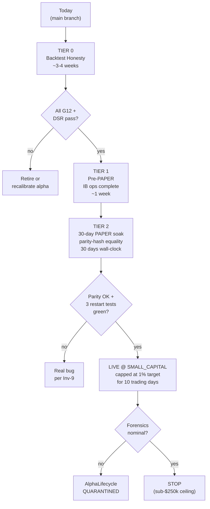

# Feelies Production-Readiness Remediation

## 1. Cross-check synthesis

The two reviews are ~85% aligned. Both identified the cost model as institutionally rigorous, the IB router's delta-VWAP handling as correct, and the determinism guarantees as real. Material non-overlaps:

- **Outside reviewer caught** (and I missed): through-fill / queue-drain adverse-selection split as a code-level fix; OFI residualization gap in `FactorNeutralizer`; IB account-type (Pro Tiered vs Lite vs Fixed) prerequisite check.
- **I caught** (and outside reviewer missed): `signal_min_edge_cost_ratio: 0.35` shipping default in [platform.yaml](platform.yaml) effectively disables the B4 cost gate; `cost_stress_multiplier: 1.0` ships default vs Inv-12's stated 1.5x stress; hazard exits and PORTFOLIO legs hard-coded `MARKET` in [src/feelies/risk/hazard_exit.py](src/feelies/risk/hazard_exit.py) and [src/feelies/risk/basic_risk.py](src/feelies/risk/basic_risk.py); in-memory `_active_orders` dict and `MemoryPositionStore` with no restart safety; backtest's `avg_entry_price = MID` convention discontinuity vs IB-reported fills.
- **Outside reviewer corrected me on**: `LiveOrderRouter = NotImplementedError` is misleading-naming, not a structural blocker — `IBOrderRouter` is the live path that bootstrap.py wires for both PAPER and (mode-flag away) LIVE.

Confirmed via direct read: [src/feelies/execution/cost_model.py:123,274](src/feelies/execution/cost_model.py) has only flat `passive_adverse_selection_bps = 0.5` (no through-fill split exists in code). [src/feelies/composition/factor_neutralizer.py:59-72](src/feelies/composition/factor_neutralizer.py) hard-codes FF5+mom+STR with no OFI factor. [src/feelies/alpha/arbitration.py:60-79](src/feelies/alpha/arbitration.py) does per-(symbol, tick) winner-takes-all but no cross-alpha intent netting.

## 2. Scope reframing for sub-$250k personal capital

Given the user's stated ceiling, the following are **out of scope** (deferred indefinitely, not deferred to a tier):

- Almgren-Chriss impact modeling (sub-1% of 5-min ADV always; the L1 walk-the-book model is sufficient).
- Universe expansion to 50-100 symbols (operational cost cannot be amortized).
- Cross-alpha internal crossing (collision frequency too low at 5 SIGNAL alphas on 3 symbols).
- HTB locate fee / rate-spike modeling (only relevant for non-large-cap shorts).
- Multi-day HTB accrual (intraday-only deployment).
- IBKR Lite / Fixed account support abstraction.
- Dynamic intra-day factor exposure (static daily β is sufficient at 3 symbols).

A consequential implication: the **two PORTFOLIO-layer alphas should not deploy** at this scale. `IR = IC * sqrt(N)` with N=3 gives only 1.73x amplification, which does not justify the composition-layer operational complexity (universe synchronizer, factor neutralizer, sector matcher, CVXPY turnover optimizer). Mark `pro_kyle_benign_v1` and `pro_burst_revert_v1` as RESEARCH-only and deploy SIGNAL alphas directly through the orchestrator's signal-path. This also retires the OFI-residualization concern (it only mattered through the PORTFOLIO layer).

## 3. Capital-deployment gate flow

## 4. TIER 0 — Backtest Honesty (~3-4 weeks)

**Gate goal**: A passing backtest faithfully predicts live behavior on the IB-mediated retail equity surface. *Do not deploy any alpha to PAPER until Tier 0 is complete and the alpha still passes G12 + DSR > 1.0 against the post-fix backtest.*

**T0-1 — Fix shipping config defaults** *(mine, ~2 hours, low risk)*
- [platform.yaml](platform.yaml): `signal_min_edge_cost_ratio: 0.35 -> 1.5` (matches paper configs and Inv-12 intent).
- [platform.yaml](platform.yaml): `cost_stress_multiplier: 1.0 -> 1.5` (matches Inv-12's "1.5x cost stress" requirement).
- [src/feelies/core/platform_config.py:85](src/feelies/core/platform_config.py): change shipping default `degrade_on_data_gap: bool = False` -> `True` (G8). Currently the LIVE default keeps trading on a stale Polygon feed; only `paper_smoke_rth.yaml` overrides to `True`. Fail-safe Inv-11 demands the inverse default.
- Audit and tighten `cost_sell_regulatory_bps`, `cost_htb_*`, `cost_max_impact_half_spreads` (currently 10 — review whether 4 is more realistic for L1-only).
- Add a startup assertion that `signal_min_edge_cost_ratio >= 1.0` and warn if `< 1.5`.

**T0-2 — Through-fill / queue-drain adverse selection split** *(outside R-1, ~1 week, medium risk)*
- [src/feelies/execution/cost_model.py](src/feelies/execution/cost_model.py): replace `passive_adverse_selection_bps: Decimal` with `adverse_selection_through_bps: Decimal = 3.0` and `adverse_selection_drain_bps: Decimal = 0.3`.
- Cost-model API change: `compute_costs(...)` accepts new `is_through_fill: bool` parameter (default False = drain semantics for safety).
- [src/feelies/execution/passive_limit_router.py](src/feelies/execution/passive_limit_router.py): the through-fill semantic already exists in `_emit_passive_fill`'s docstring — wire it through to the cost model call as `is_through_fill=True` for the through-fill branch and `False` for queue-drain.
- Update `estimate_round_trip_cost_bps` to take an `is_through_fill_entry`/`is_through_fill_exit` pair (default both False = conservative drain assumption).
- Update [src/feelies/core/platform_config.py:121](src/feelies/core/platform_config.py) and [src/feelies/bootstrap.py:337](src/feelies/bootstrap.py) for the new fields.
- Re-run G12 disclosed-vs-modeled reconciliation on all 5 SIGNAL alphas in [alphas/](alphas). Expect ~1.5-3 bps cost-model increase. Some alphas may fail the 1.5x margin floor; this is the intended outcome.

**T0-3 — Passive fill-probability model** *(outside R-2, ~2 weeks, high risk on parity hashes)*
- [src/feelies/execution/passive_limit_router.py](src/feelies/execution/passive_limit_router.py): replace the deterministic `fill_delay_ticks` + `passive_queue_position_shares` drain with a seeded Bernoulli per-tick model: `fill_prob_per_tick = f(opposite_side_aggression_count, queue_position, ticks_at_level)`.
- Determinism preservation: seed from `SHA256(symbol, sequence_no, side, level_id)` and threshold against the resulting uniform — no true Poisson sampling. Inv-5 preserved.
- Emit a new `passive_fill_outcome` event per resting order: `{FILLED_BY_DRAIN, FILLED_BY_THROUGH, CANCELLED_MAX_RESTING_TICKS, CANCELLED_LEVEL_LEFT_BBO}`.
- Track `passive_fill_rate` and `mean_resting_ticks_to_fill` metrics into the existing monitoring layer.
- **Re-baseline all 54 parity hashes in [tests/determinism/](tests/determinism)**. This is the single largest test-suite churn in the plan; budget ~2-3 days for re-baselining alone.

**T0-4 — Re-run G12, CPCV, DSR on every alpha post-Tier-0** *(both, ~1 week, low risk)*
- For each of the 5 SIGNAL alphas: re-run [src/feelies/research/cpcv.py](src/feelies/research/cpcv.py) and [src/feelies/research/dsr.py](src/feelies/research/dsr.py) against the post-T0-2/T0-3 backtests.
- Acceptance bar: `cpcv_min_mean_sharpe >= 1.0`, `dsr >= 1.0`, `margin_ratio >= 1.5x`.
- Alphas failing the bar: re-calibrate (preferred) or retire. Document each decision in the alpha YAML's `falsification_criteria` block.
- Update each alpha's `cost_arithmetic:` block to reflect the post-fix modeled cost.

**T0-5 — Decommission PORTFOLIO alphas at this capital scale** *(scope-driven, ~1 hour, low risk)*
- Move [alphas/pro_kyle_benign_v1/](alphas/pro_kyle_benign_v1) and [alphas/pro_burst_revert_v1/](alphas/pro_burst_revert_v1) to a `research/` subtree or mark with `lifecycle_state: RESEARCH` so they cannot promote to PAPER.
- Document rationale in each YAML's notes section. Keep the composition-layer code path live (no deletion) — the universe synchronizer is correct, just unused at this scale.

## 5. TIER 1 — Pre-PAPER (~1 week)

**Gate goal**: IB integration is operationally complete; the platform can survive the IB Gateway's daily restart and detect NAV/position drift.

**T1-1 — IB account-type prerequisite check** *(outside R-4, ~2 hours, trivial risk)*
- [scripts/verify_ib_broker.py](scripts/verify_ib_broker.py): query `reqAccountSummary` for `AccountType`. Refuse to wire LIVE/PAPER unless account is "Pro Tiered". Print explicit error explaining the cost model is calibrated to Pro Tiered fees.

**T1-2 — IBPacingGuard pre-route gate** *(outside R-5, ~1 day, low risk)*
- New module [src/feelies/broker/ib/pacing_guard.py](src/feelies/broker/ib/pacing_guard.py): token bucket, default 45 orders/sec/client_id (IB Gateway documented limit ~50/sec).
- Insert in `IBOrderRouter.submit()` before `placeOrder` call. Queue (don't drop) when bucket empty.
- Emit `pacing_throttle` metric on every queue event.

**T1-3 — IBAccountSync daemon** *(outside R-3, mine, ~2 days, low risk)*
- New component [src/feelies/broker/ib/account_sync.py](src/feelies/broker/ib/account_sync.py): periodic (15s) `reqAccountSummary` + `reqPositions`.
- Reconcile IB-reported positions vs `MemoryPositionStore.positions()`. Alert on >1-share mismatch per symbol.
- Use IB's `AvailableFunds` for the risk engine's equity gate — *not* the static `account_equity` config value. Adds an event-bus `AccountStateUpdate` event consumed by [src/feelies/risk/basic_risk.py](src/feelies/risk/basic_risk.py).
- This makes T1-2 and T1-3 the explicit answer to my report's "no persistent state" concern at the live-broker boundary (Tier 2 closes the rest).

**T1-4 — IB Gateway daily-restart resilience** *(outside R-10, mine, ~1 day + automated test)*
- [src/feelies/broker/ib/connection.py](src/feelies/broker/ib/connection.py): on disconnect, emit `BrokerDisconnected` event -> Macro SM transitions to DEGRADED -> orchestrator suspends new entries (Inv-11 fail-safe), holds existing positions, cancels pending passive orders.
- On reconnect: run T1-3 reconciliation before any new entry is allowed. Macro SM transitions DEGRADED -> RUNNING only after reconciliation succeeds.
- New test [tests/broker/ib/test_restart_resilience.py](tests/broker/ib/test_restart_resilience.py): kill IB Gateway mid-test, expect DEGRADED, restart, expect re-RUNNING with reconciled positions.

**T1-5 — Document IB market-data permission requirements** *(outside R-5.2.5, ~30 min)*
- Add to [README.md](README.md) deployment section: required IB MDF subscriptions (NYSE+ARCA+NASDAQ+BATS minimum for the equities universe). The Polygon/Massive feed is for *strategy data*; IB still needs MDF subscriptions to *accept orders* on those symbols.

**T1-6 — Clean up the LiveOrderRouter naming** *(mine, corrected by outside, ~30 min)*
- [src/feelies/execution/live_router.py](src/feelies/execution/live_router.py) is a `NotImplementedError` stub. The IB router is the actual live router. Either delete the stub or rename it to make the relationship explicit (e.g., `LegacyLiveOrderRouterStub` with a clear deprecation comment), and update [src/feelies/bootstrap.py](src/feelies/bootstrap.py) to wire `IBOrderRouter` for `OperatingMode.LIVE` instead of raising.

## 5.5. TIER 1.5 — Regulatory + Fail-safe Blockers (~2 weeks)

**Gate goal**: Close five gaps that are mechanically incompatible with running the strategy at the user's stated scale. None of these were in the original plan; all surfaced from the proof review. **All five are blockers for PAPER, not just LIVE** — paper-trading PDT-violating behavior or trading through a halt teaches the wrong distribution.

**T1.5-1 — PDT compliance counter and pre-route gate (G1)** *(proof review, ~3 days, high impact)*
- New module [src/feelies/risk/pdt_counter.py](src/feelies/risk/pdt_counter.py): persistent rolling 5-business-day round-trip counter, keyed by `(symbol, account_id)`. Reads from the SQLite state store (T2-2 dependency — schedule T1.5-1 immediately after T2-2 if cash-account, or before if margin ≥$25k).
- Pre-route gate in [src/feelies/kernel/orchestrator.py](src/feelies/kernel/orchestrator.py)'s `_try_build_order_from_intent`: refuse new ENTRY if the resulting trade would be the 4th round-trip in the 5-day window for an account <$25k, or the 4th in 5 days for an account ≥$25k (PDT flag).
- Cash-account branch: T+2 settlement model. Track unsettled-proceeds-by-day; refuse use of unsettled cash for new entries (free-rider rule).
- Account-type comes from `T1-1` IB prerequisite check + a config field `platform.account_type: margin_25k|margin_under_25k|cash`.
- Acceptance test: simulate 5 round-trips in one day on a margin-under-25k account; expect the 4th to be refused with a `PDTViolationError`.

**T1.5-2 — LULD halt detection wired into the data-integrity SM (G2)** *(proof review, ~3 days, high impact)*
- Extend [src/feelies/ingestion/data_integrity.py:25](src/feelies/ingestion/data_integrity.py) `DataHealth` enum with `HALTED` (parallel to `GAP_DETECTED`).
- [src/feelies/ingestion/massive_normalizer.py](src/feelies/ingestion/massive_normalizer.py): subscribe to Polygon's halt-status events; transition the per-symbol DI machine on halt-on, halt-off.
- Orchestrator behavior on `HALTED`: suppress entries and exits (cannot trade); cancel any resting orders for the symbol; emit a `SymbolHalted` event for forensics.
- Halt-resolution guard: after halt-off, suspend new entries for `halt_resolution_blackout_seconds` (default 60s) so the auction print stabilizes before re-enabling. Existing positions remain held; the operator-facing flag is the absence of new entries during the blackout.
- Acceptance test: synthetic halt event mid-replay; expect entries suppressed; expect blackout enforced post-resolution.

**T1.5-3 — Reg SHO / SSR uptick-rule compliance (G3)** *(proof review, ~3 days, medium impact)*
- New ingestion: NYSE SSR list (publicly available daily; [https://www.nyse.com/regulation/threshold-securities](https://www.nyse.com/regulation/threshold-securities) plus intraday-trigger feed via Polygon's `T.ssr` field).
- Pre-route gate: when an ENTRY is SHORT and the symbol is on the SSR list, take one of two paths:
  - Conservative (default): refuse the SHORT entry. The entry will retry next horizon boundary.
  - Permissive: route via IB `RELATIVE` order type with a small offset above the bid (auto-uptick). Configurable per-alpha.
- Acceptance test: synthetic SSR trigger mid-replay; expect SHORT entries refused (conservative) or RELATIVE-routed (permissive).

**T1.5-4 — Risk-lockdown recovery runbook + operator CLI (G5)** *(proof review, ~1 day, medium impact)*
- [src/feelies/cli/main.py](src/feelies/cli/main.py): add `feelies risk unlock-lockdown --audit-token <token> --operator <name>` subcommand. Wraps the existing `Orchestrator.unlock_from_lockdown` programmatic call.
- Pre-conditions enforced by the CLI: `position_count == 0` (verified via T1-3 IB account sync, not just the in-memory store), audit-token present, lockdown reason recorded in the event log.
- Document the lockdown recovery procedure in [README.md](README.md):
  1. Investigate cause via the most recent `RiskEscalation` event.
  2. Confirm flat positions on IB side via `feelies broker positions`.
  3. Issue `feelies risk unlock-lockdown --audit-token <signed-token> --operator <you>`.
  4. Verify state resets to NORMAL via `feelies status`.

**T1.5-5 — Operator-facing kill-switch CLI (G7)** *(proof review, ~1 day, high reliability impact)*
- [src/feelies/monitoring/kill_switch.py](src/feelies/monitoring/kill_switch.py) is currently a Protocol with programmatic `activate(reason, activated_by)`. Add a file-trigger concrete implementation: orchestrator main loop polls a sentinel path (`platform.kill_switch_sentinel_path`) once per tick; presence of the file activates the switch with the file's contents as the reason.
- New CLI subcommand: `feelies kill --reason "..."` writes the sentinel file (atomic rename pattern) and waits up to 5 seconds for orchestrator confirmation via a status file.
- Activation path: cancel all open IB orders, await ACKs, emit `KillSwitchActivation` event, transition Macro SM to RISK_LOCKDOWN, exit gracefully (no SIGTERM-induced orphaned orders).
- Acceptance test: launch orchestrator, wait for warm-up, write the sentinel file, expect cancel-all + lockdown within 1 second.

**T1.5-6 — Pre-LIVE single-trade end-to-end smoke** *(proof review, ~half-day)*
- New script [scripts/ib_paper_smoke_trade.py](scripts/ib_paper_smoke_trade.py): submits one $10 round-trip (BUY 1 share SPY, wait for fill, SELL 1 share SPY, wait for fill) through the full orchestrator path against IB paper port.
- Validates: connection, account-type check (T1-1), pacing guard (T1-2), account sync (T1-3), order routing (T2-4 if shipped), cost reconciliation (T2-5).
- This is the gate before the 30-day PAPER soak: if a single round-trip cannot complete clean, the soak should not start.

## 6. TIER 2 — Pre-LIVE @ SMALL_CAPITAL (~6 weeks: 30-day soak + ~1.5 weeks code)

**Gate goal**: The platform survives a process restart, broker disconnect, and a bad day without losing money to operational failure modes.

**T2-1 — 30-day PAPER-mode soak with parity-hash validation** *(both, 30 days wall-clock)*
- Run `mode: PAPER` against IB Gateway paper port (4002) on the deployed SIGNAL alphas.
- Daily harness: capture the PAPER event log (NBBOQuote, Trade, Signal, OrderRequest, OrderAck-with-real-IB-fills, StateTransition events). Replay this captured log through the BACKTEST `ExecutionBackend` substituting only the broker (i.e., feed IB's recorded fills back as deterministic responses). Verify:
  - **Signal/intent tape** SHA-256 byte-identical (Inv-9: backtest/live parity is over the *strategy* code, not the fills).
  - **Post-fill PnL trajectory** equivalent within tolerance (`<=0.5 bps cumulative drift`).
  - **Position trajectory** byte-identical at every fill timestamp.
- IB-driven fills are non-deterministic and cannot be byte-identical to a backtest replay; the parity contract is over deterministic strategy decisions, not over the broker's stochastic responses (G6 clarification from proof review).
- ANY signal-tape divergence is a real bug — backtest/live parity invariant violated.

**T2-1b — Cold-start warm-up handling on restart (G4)** *(proof review, ~2 days)*
- Verify behavior: after T2-2 restores positions/orders from SQLite, sensors lose their windowed state and need wall-clock time to warm. Required behavior per Inv-11:
  - Suppress entries during warm-up (Inv-11 fail-safe; entry on cold sensors uses uninitialized state).
  - **Permit exits during warm-up** (existing positions must be exitable; staleness should not strand a position).
  - Block hazard-spike exits driven by uninitialized regime posteriors (different code path).
- [src/feelies/kernel/orchestrator.py](src/feelies/kernel/orchestrator.py): audit `_check_stop_exit` and the regime-gate evaluation for cold-sensor handling. Tighten if necessary.
- Document expected wall-clock-blackout window per (sensor, horizon) combination in [README.md](README.md). Worst case is `realized_vol_30s` + `kyle_lambda_60s` + 1800s horizon -> ~30 min full warm.
- Add an explicit `cold_start_blackout_seconds` config field with conservative default (`max(sensor_warm_periods)`).
- Acceptance test: restart mid-position; expect existing position exitable, expect new entries blocked until all sensors report `warm=True`.

**T2-2 — Persistent state for orders, positions, alpha lifecycle** *(mine, ~1 week, medium risk)*
- New module [src/feelies/storage/sqlite_state.py](src/feelies/storage/sqlite_state.py): SQLite WAL-mode store for `open_orders`, `positions`, `alpha_lifecycle_state`.
- Replace `_active_orders: dict[str, OrderRequest]` in [src/feelies/kernel/orchestrator.py](src/feelies/kernel/orchestrator.py) with a persistent-backed view.
- Replace `MemoryPositionStore` with a persistent variant gated by config flag (`storage.position_store: memory|sqlite`).
- Startup recovery path: on process boot, reconcile persistent state vs IB (T1-3 daemon).
- Three deliberate restart tests: mid-fill, mid-stop-watch, mid-disconnect. All three must recover bit-clean.

**T2-3 — Native broker-side stops, brackets, MOC** *(mine, ~3 days, medium risk)*
- Currently stop-loss is enforced inside [src/feelies/kernel/orchestrator.py](src/feelies/kernel/orchestrator.py) via `_check_stop_exit()` which polls the latest mid each tick. If the orchestrator process dies, no stop fires. Move stops to broker-side IB STP/STP TRAIL orders attached at entry time as bracket children.
- For `sig_moc_imbalance_v1`: use IB's MOC order type instead of MKT-in-window. Also exposes the documented IB cutoff (3:50 PM ET).
- Bracket attachment: `OrderRequest` gains `attached_stop_price: Decimal | None` and `attached_take_profit_price: Decimal | None`. The IB router translates these to an OCO bracket on submit.

**T2-4 — OrderRoutingPolicy module** *(outside R-6, mine, ~3 days, low risk)*
- New module [src/feelies/execution/order_routing_policy.py](src/feelies/execution/order_routing_policy.py): decides IB order type from `(intent_kind, urgency, horizon_seconds)`.
- Routing matrix:
  - Passive entry, 30-300s horizon -> `PEG MID` (Pegged-to-Midpoint, auto-reprices).
  - Passive entry, 300-1800s horizon -> `LMT @ BBO` with periodic re-peg.
  - Aggressive entry (cost-policy decided) -> `Adaptive Market (Patient)` algo.
  - Stop-loss / hazard-spike / forced-flatten exit -> `Adaptive Market (Urgent)`.
  - Risk-lockdown emergency flatten -> `MKT` (no optimization on safety path).
- [src/feelies/risk/hazard_exit.py:237](src/feelies/risk/hazard_exit.py) and [src/feelies/risk/basic_risk.py:318](src/feelies/risk/basic_risk.py): replace hard-coded `OrderType.MARKET` with `OrderRoutingPolicy.choose(intent)`.

**T2-5 — Live realized-vs-disclosed cost reconciliation** *(both, ~3 days, low risk)*
- New forensic monitor [src/feelies/forensics/cost_drift.py](src/feelies/forensics/cost_drift.py): per-fill, compare modeled cost from `estimate_round_trip_cost_bps` vs realized `(fill_price - mid_at_decision)`.
- Daily report: rolling 5-day mean realized vs disclosed. Alert when `realized > 2.0 * disclosed`.
- Wires into the existing `DecayDetector` -> `AlphaLifecycle.quarantine()` path so a slippage-drifted alpha auto-quarantines.

**T2-6 — Real-time CPCV+DSR forensic monitor** *(outside R-13, mine, ~3 days, medium risk)*
- The research module ([src/feelies/research/cpcv.py](src/feelies/research/cpcv.py), [src/feelies/research/dsr.py](src/feelies/research/dsr.py)) computes these offline. Wire them into [src/feelies/forensics/](src/feelies/forensics) on a rolling 30-day live trade window. Alert on DSR < 1.0; auto-quarantine on DSR < 0.5.
- This is the alpha-discipline gate for SCALED escalation, but worth wiring before LIVE @ SMALL_CAPITAL because the same discipline catches edge decay early.

## 7. TIER 3 — LIVE @ SMALL_CAPITAL itself

After all of Tier 2 is green:

- Deploy SIGNAL alphas only at the configured 1% / 10-trading-day SMALL_CAPITAL tier.
- Use the F-6 capital-tier escalation only after `CapitalStageEvidence` is satisfied — but per the user's stated ceiling, **STOP after SMALL_CAPITAL**. Do not escalate to SCALED. The platform's own promotion machinery is the correct gate.

## 8. TIER 4 — Long-term quality (deferred / opportunistic)

Items that improve the codebase but are not blockers at sub-$250k:

- Orchestrator refactor: split [src/feelies/kernel/orchestrator.py](src/feelies/kernel/orchestrator.py) (~4.2k LOC) into `OrderManager`, `StopLossWatcher`, `BusBridge`, retaining the orchestrator as a coordinator only. Reduces coupling and improves testability.
- Online cost-model recalibration: feed T2-5's realized fills back into a Bayesian update of `adverse_selection_*_bps` parameters. Closes the loop on the cost model.
- Acceptance gate that asserts no `OrderType.MARKET` literal exists outside [src/feelies/risk/escalation.py](src/feelies/risk/escalation.py)'s emergency flatten path. Forces routing decisions through the policy module.

## 9. Capital-deployment gate criteria (binding)

Do **not** wire any real-money client_id until *all* of:

1. Tier 0 complete: `cost_stress_multiplier=1.5`, `degrade_on_data_gap=true` default, through-fill split shipped, fill-probability model shipped, parity hashes re-baselined.
2. All deployed alphas pass G12 (margin >= 1.5x) and CPCV+DSR (Sharpe >= 1.0, DSR >= 1.0) against the post-Tier-0 backtest.
3. Tier 1 complete: account-type check, pacing guard, account sync, restart resilience, MDF subs documented.
4. **Tier 1.5 complete: PDT counter active, halt detection wired, SSR-aware short routing, lockdown CLI + kill-switch CLI shipped, single-trade smoke green.**
5. Tier 2 complete: 30-day PAPER soak with signal-tape parity equality every day, persistent state, broker-side stops, routing policy, cost-drift monitor, cold-start warm-up behavior verified.
6. Three deliberate restart tests pass clean (mid-fill, mid-stop-watch, mid-disconnect).

## 10. Open decisions (need user input before execution)

1. **`sig_moc_imbalance_v1` retention** — depends on `event_calendar_path` for SCHEDULED_FLOW timing. Operationally maintainable for personal deployment, or retire?
2. **`sig_inventory_revert_v1` retention** — author's own falsification block acknowledges the inventory-vs-informed-flow sign confusion is a fragility. Keep with tighter regime gate, or retire?
3. **Hazard exit default** — currently OFF except for `sig_hawkes_burst_v1`. Enable platform-wide default-ON given the personal-capital risk profile?
4. **PAPER soak duration** — 30 days is the default. Acceptable to stop at 15 if Tier 0+1 churn delays the start?
5. **Account type and PDT path (T1.5-1)** — is the IB account a margin account ≥$25k (PDT counter only), margin <$25k (3-RT/5-day hard cap), or cash (T+2 settlement model)? The PDT module's complexity scales with this answer; cash-account is the most invasive (requires per-day unsettled-cash tracking).
6. **SSR routing posture (T1.5-3)** — conservative refuse-SHORT default, or permissive RELATIVE-routed default? The conservative default is fail-safe; the permissive default trades the SSR-day signal at increased operational complexity.

## 11. Proof-review summary

This plan was hardened by an explicit proof-review pass that cross-checked the original plan against the codebase for blind spots. Eight gaps were identified; five (G1-G5) became Tier 1.5 because they are mechanically incompatible with the user's stated scale (PDT, halts, SSR, warm-up, lockdown recovery). Three (G6-G8) tightened existing tiers (parity-hash semantics, kill-switch CLI, data-gap default). One non-issue was retired (order-ID collision is handled broker-side by IB's `next_order_id`).

The critical insight from the proof review: **PAPER-mode trading itself can violate PDT and trade-through-halts.** PDT compliance and halt detection cannot be deferred to LIVE — they are blockers for honest paper-soak data, because paper-trading the wrong distribution gives the wrong confidence signal. This moved them from "Tier 3 polish" (where I had implicitly placed them) to Tier 1.5 (blocker for PAPER).