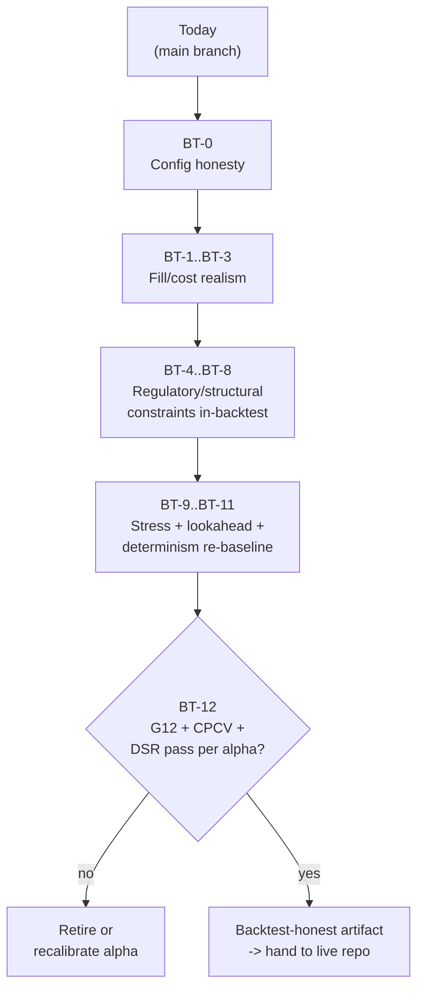

# Feelies Backtest-Fidelity Remediation (backtest repo only)

## 0. Scope boundary (what this revision changed)

This plan was rescoped from a full BACKTEST -> PAPER -> LIVE deployment plan to **backtest repo only**. The single governing question for every task below is: *does a passing backtest faithfully predict live PnL on the IB-mediated retail equity surface?* If a gap distorts simulated PnL, it is in scope. If it is purely a live-deployment operational concern, it moved to the separate live repo.

**Moved OUT of scope (now owned by the live repo):**
- IB account-type prerequisite check, `IBPacingGuard`, `IBAccountSync` daemon, IB Gateway daily-restart resilience, MDF-subscription docs, `LiveOrderRouter` wiring (original T1-1..T1-6).
- Risk-lockdown recovery CLI, operator kill-switch CLI, pre-LIVE single-trade smoke (original T1.5-4/-5/-6).
- 30-day PAPER soak, SQLite WAL persistent *live* state + restart-recovery tests, native IB broker-side stops/brackets, live `OrderRoutingPolicy` wiring, live realized-vs-disclosed cost-drift monitor, real-time CPCV+DSR live monitor (original T2-1..T2-6), LIVE @ SMALL_CAPITAL deployment (original Tier 3).

**Reframed and KEPT in scope (the "nothing important missed" move):** the original Tier 1.5 regulatory gates (PDT, LULD halts, Reg-SHO/SSR) were filed as *live pre-route gates*. They are equally **backtest-fidelity** requirements: a backtest that lets the strategy day-trade past the PDT cap, fill through a LULD halt, or short on a downtick during SSR is dishonest and overstates the edge. They are reframed into in-backtest fill/constraint models. Borrow-availability (a short-locate gate) is added as a new item — the original plan deferred HTB *fees* but never modeled short *availability*, which is the larger honesty gap for a long/short retail book.

**Confirmed via direct read of the repo:**
- Three execution backends sit behind the single `ExecutionBackend` protocol ([src/feelies/execution/backend.py](src/feelies/execution/backend.py)); the backtest path is `ReplayFeed` + `BacktestOrderRouter` / `PassiveLimitOrderRouter` ([src/feelies/execution/backtest_backend.py](src/feelies/execution/backtest_backend.py)).
- The cost model has only flat `passive_adverse_selection_bps` — no through-fill split ([src/feelies/execution/cost_model.py](src/feelies/execution/cost_model.py)).
- **No halt / LULD / SSR / PDT / borrow-availability modeling exists anywhere in the backtest fill path** (only an incidental "halt" mention in the `_DeferredMarketFill` docstring and unrelated `platform_config` matches).
- `BacktestOrderRouter` documents `avg_entry_price = MID` as an intentional convention (audit R6), routing the half-spread through `Position.cumulative_fees` ([src/feelies/execution/backtest_router.py:14-33](src/feelies/execution/backtest_router.py)).
- Shipping defaults diverge from intent: [platform.yaml](platform.yaml) sets `signal_min_edge_cost_ratio: 0.35` and `cost_stress_multiplier: 1.0`; `platform_config.from_dict` defaults `degrade_on_data_gap=False` ([src/feelies/core/platform_config.py:85,123](src/feelies/core/platform_config.py)).

## 1. Backtest-fidelity gate flow

## 2. Out-of-scope at sub-$250k (deferred indefinitely, not to a tier)

- Almgren-Chriss impact modeling (sub-1% of 5-min ADV always; the L1 walk-the-book model is sufficient).
- Universe expansion to 50-100 symbols.
- Cross-alpha internal crossing (collision frequency too low at 5 SIGNAL alphas on 3 symbols).
- HTB locate *fee* / rate-spike modeling and multi-day HTB accrual (intraday-only, large-cap focus) — but short *availability* IS modeled (BT-7).
- Dynamic intra-day factor exposure (static daily beta is sufficient at 3 symbols).

Consequence (BT-13): the two PORTFOLIO-layer alphas should not deploy at this scale. `IR = IC * sqrt(N)` with N=3 gives only 1.73x amplification, which does not justify the composition-layer complexity. Mark `pro_kyle_benign_v1` and `pro_burst_revert_v1` RESEARCH-only and deploy SIGNAL alphas directly through the orchestrator's signal-path. This also retires the OFI-residualization concern (it only mattered through the PORTFOLIO layer).

## 3. Config honesty

**BT-0 — Fix backtest-relevant shipping config defaults** *(~2 hours, low risk)*
- [platform.yaml](platform.yaml): `signal_min_edge_cost_ratio: 0.35 -> 1.5` (matches paper configs, the `from_dict` loader default, and Inv-12 intent; the 0.35 shipping value effectively disables the cost gate in backtest acceptance).
- [platform.yaml](platform.yaml): `cost_stress_multiplier: 1.0 -> 1.5` (matches Inv-12's 1.5x cost-stress requirement; the cost model already documents the 1.5x/2x stress contract in its module docstring).
- [src/feelies/core/platform_config.py:85](src/feelies/core/platform_config.py): change the dataclass default `degrade_on_data_gap: bool = False -> True`. A backtest replaying gappy historical data should suppress signals on a stale feed, not trade through it (Inv-11 fail-safe; Inv-8 data integrity). Only `paper_smoke_rth.yaml` currently overrides to `True`.
- Audit and tighten `cost_sell_regulatory_bps` (currently 0.0 — set the real SEC+TAF round-trip estimate), `cost_htb_borrow_annual_bps`, and `cost_max_impact_half_spreads` (currently 10 in the router — review whether 4 is more realistic for an L1-only book).
- Add a startup assertion: `signal_min_edge_cost_ratio >= 1.0`, warn if `< 1.5`.

## 4. Fill and cost realism

**BT-1 — Through-fill / queue-drain adverse-selection split** *(~1 week, medium risk)*
- [src/feelies/execution/cost_model.py](src/feelies/execution/cost_model.py): replace flat `passive_adverse_selection_bps` with `adverse_selection_through_bps = 3.0` and `adverse_selection_drain_bps = 0.3`.
- API change: `compute(...)` accepts `is_through_fill: bool` (default `False` = drain semantics = conservative).
- [src/feelies/execution/passive_limit_router.py](src/feelies/execution/passive_limit_router.py): the through-fill semantic already exists in `_emit_passive_fill`'s docstring — wire it to the cost-model call as `is_through_fill=True` on the through branch and `False` on the queue-drain branch.
- Update `estimate_round_trip_cost_bps` to take an `is_through_fill_entry`/`is_through_fill_exit` pair (default both `False`).
- Wire the new fields through [src/feelies/core/platform_config.py](src/feelies/core/platform_config.py) and [src/feelies/bootstrap.py](src/feelies/bootstrap.py).

**BT-2 — Seeded-Bernoulli passive fill-probability model** *(~2 weeks, high parity churn)*
- [src/feelies/execution/passive_limit_router.py](src/feelies/execution/passive_limit_router.py): replace the deterministic `fill_delay_ticks` + `queue_position_shares` drain with a per-tick fill probability `f(opposite_side_aggression, queue_position, ticks_at_level)`.
- Determinism preserved (Inv-5): seed from `SHA256(symbol, sequence_no, side, level_id)`, threshold a derived uniform — no live RNG, no Poisson sampling.
- Emit a `passive_fill_outcome` per resting order: `{FILLED_BY_DRAIN, FILLED_BY_THROUGH, CANCELLED_MAX_RESTING_TICKS, CANCELLED_LEVEL_LEFT_BBO}`; track `passive_fill_rate` and `mean_resting_ticks_to_fill`.
- Parity-hash re-baseline lands in BT-11 (single batched re-baseline after all fill-model changes, to avoid re-baselining twice).

**BT-3 — `avg_entry_price = MID` convention decision** *(~1 day, low risk, parity-relevant)*
- [src/feelies/execution/backtest_router.py:14-33](src/feelies/execution/backtest_router.py) records fills at MID and routes the half-spread cross through `Position.cumulative_fees`; IB reports the *executed cross price* as the fill. This is documented as internally consistent (NAV and forensics subtract fees), but it is a discontinuity vs the eventual live-repo fill semantics.
- **LOCKED: switch to executed cross price.** Record `avg_entry_price` = the executed cross price (tick-rounded per BT-14), dropping the synthetic MID + spread-as-fee split, so the backtest entry-price tape matches what IB will report. This removes the `spread_cost` component double-handling: the half-spread is now embedded in the fill price, not added to `cumulative_fees` — audit every consumer of `realized_pnl` / `cumulative_fees` (`BasicRiskEngine._compute_current_equity`, forensics) so the NAV identity still holds and no cost is double-counted. Re-baseline lands with BT-11.

## 5. Regulatory / structural constraints — modeled in-backtest

These three were live pre-route gates in the prior plan; here they are backtest fill/constraint models. None require IB; all are driven from the historical Polygon/Massive tape plus published reference lists. **All raise simulated cost or suppress simulated fills — never the reverse.**

**BT-4 — PDT flag tracking + $25k minimum-equity maintenance** *(~1.5 days, medium impact)* — **LOCKED: margin >= $25k, PDT-EXEMPT**
- The locked account type (margin >= $25k) is PDT-*exempt*, so the 3-round-trip/5-day **hard cap is NOT modeled** and the cash-account T+2 settlement branch is **dropped**. Scope shrinks from the original ~3-day estimate.
- New module [src/feelies/execution/regulatory/pdt_constraint.py](src/feelies/execution/regulatory/pdt_constraint.py): rolling 5-business-day round-trip *counter* keyed by `account_id` — used only to set the PDT flag (4+ round-trips in 5 days) for forensics, not to suppress fills.
- The one real backtest constraint at this tier: a PDT-flagged account that drops **below $25,000 equity** is restricted from opening new day trades until equity is restored. Wire this against the BT-15 live-equity computation: if `current_equity < $25,000` and the account is PDT-flagged, refuse new ENTRY fills (`PDT_MIN_EQUITY`) and emit a forensic event. Exits always permitted (fail-safe).
- Driven by `platform.account_type: margin_25k` (locked). Keep the enum extensible (`margin_under_25k`, `cash`) but only the `margin_25k` path is implemented now.
- Acceptance test: replay a tape that draws a PDT-flagged account below $25k; expect new entries suppressed and exits still permitted.

**BT-5 — LULD halt modeling in the backtest fill engine** *(~3 days, high impact)*
- Extend [src/feelies/ingestion/data_integrity.py](src/feelies/ingestion/data_integrity.py) `DataHealth` with `HALTED` (parallel to `GAP_DETECTED`); transition the per-symbol DI machine on halt-on / halt-off from the tape.
- [src/feelies/ingestion/massive_normalizer.py](src/feelies/ingestion/massive_normalizer.py): surface halt-status from the Polygon/Massive event stream.
- Backtest fill behavior on `HALTED`: no fills (entry or exit) for the symbol; cancel any resting passive orders; emit `SymbolHalted` for forensics.
- Halt-resolution blackout: after halt-off, suppress new entry fills for `halt_resolution_blackout_seconds` (default 60s) so the reopening-auction print stabilizes. Existing positions held.
- Acceptance test: synthetic halt mid-replay; expect fills suppressed during halt and during the post-resolution blackout.

**BT-6 — Reg-SHO / SSR uptick constraint on SHORT fills** *(~3 days, medium impact)* — **LOCKED: conservative refuse-short**
- New ingestion: daily SSR list + intraday SSR-trigger from the tape (Polygon `T.ssr` field).
- Backtest fill behavior (locked conservative): when a simulated ENTRY is SHORT and the symbol is SSR-active, **refuse the short entry fill** (`SSR_SUPPRESSED`); the entry retries next horizon boundary. The permissive uptick-routed variant is **not** implemented now (deferred; keep a config hook so it can be added without rework).
- Acceptance test: synthetic SSR trigger mid-replay; expect short entries suppressed.

**BT-7 — Short-locate / borrow-availability gate** *(~2 days, medium impact, NEW)*
- The prior plan deferred HTB *fees* but never modeled short *availability*. For an intraday long/short book, the larger honesty gap is whether a borrow exists at all.
- Add a per-symbol borrow-availability table (static `available | hard | unavailable` per symbol, conservative default `available` for the large-cap universe; flag mid-caps `hard`). When a simulated SHORT entry hits an `unavailable` symbol, the backtest refuses the fill (`LOCATE_UNAVAILABLE`); `hard` applies the existing HTB fee path if configured.
- Keep deliberately lightweight (static table, no rate-spike modeling) — sufficient for a 3-symbol large-cap universe; revisit only if the universe expands.

**BT-8 — MOC / closing-auction fill modeling for `sig_moc_imbalance_v1`** *(~3 days, medium risk, NEW)* — **LOCKED: keep + model the auction**
- The MOC-imbalance alpha currently relies on MKT-in-window fills, which do not represent a closing-auction execution. Model the closing-auction print: a single MOC fill at the official close, with the IB MOC cutoff (3:50 PM ET; 12:50 PM ET on early-close half-days per BT-16) enforced — entries submitted after the cutoff do not fill.
- Add an `attached_order_type` / `is_moc` flag on the simulated order so the backtest fill engine routes it to the auction-fill path rather than the continuous walk-the-book path.
- This makes the alpha's backtested PnL reflect auction execution, not a continuous-session approximation. The alpha is **retained** (locked); its survival is still subject to BT-12 re-validation.

## 5.5. Price, capital, and session realism (added in review pass 2)

Review pass 2 audited the fill/risk/ingestion code against the dimensions a faithful IB retail-equity sim requires and found five gaps the plan had not captured. Each one systematically biases backtested PnL; none are modeled today.

**BT-14 — Tick-size / sub-penny price rounding** *(~2 days, HIGH priority — affects every fill)*
- [src/feelies/execution/market_fill.py:67](src/feelies/execution/market_fill.py) fills at `mid = (quote.bid + quote.ask) / 2`. For a 1-cent-wide spread this yields a **half-penny fill price** (e.g. bid 100.01 / ask 100.02 -> 100.015) that no US equity venue can produce. Every backtested fill price is currently off the achievable grid, and the error is directionally small but pervasive — it contaminates spread-cost attribution and the avg-entry-price tape (BT-3).
- Add a `tick_size(price)` helper (Reg NMS sub-penny rule: `$0.01` for prices `>= $1.00`, `$0.0001` below `$1.00`) and snap **both** simulated fill prices and any LIMIT/STP/peg limit price to the tick. Round *conservatively* (against the taker: buys round up, sells round down) so the model never invents price improvement.
- Apply at the single fill-price chokepoint in `market_fill.py` and in the passive router's resting-price logic so BT-2's probability model also rests on valid ticks.
- Re-baseline lands with BT-11.

**BT-15 — Buying-power / margin model + real account equity** *(~2.5 days, HIGH priority)* — **LOCKED: margin >= $25k, 4x intraday / 2x overnight**
- The risk engine ([src/feelies/risk/basic_risk.py:50,52](src/feelies/risk/basic_risk.py)) enforces only a self-imposed `max_gross_exposure_pct = 20%` cap on a static `account_equity = $1,000,000`. The **binding** constraint is the broker's Reg-T buying power, not the 20% cap — and `account_equity` is a placeholder, not the real deployed capital.
- Set `account_equity` in `platform.yaml` to the real deployed figure. **Locked bracket: $25,000–$100,000; placeholder default `$50,000` pending the exact figure from the operator** (one open input below). The cost model is already calibrated to IB Tiered, so only equity + buying power need wiring.
- Buying-power model (locked `margin_25k` tier): **4x intraday / 2x overnight** Reg-T. Reject simulated entries whose post-fill gross would exceed intraday buying power (`INSUFFICIENT_BUYING_POWER`); flatten-or-block any position that would exceed 2x into the close (interacts with BT-16 session boundary). The `margin_under_25k` (2x) and `cash` (1x settled) tiers are **not** implemented now — keep the enum extensible.
- Feeds BT-4: the same live-equity computation drives the `< $25,000` PDT-min-equity guard.
- This makes the backtest's *position-size distribution* faithful — without it the backtest silently assumes $1M of capacity and overstates absolute PnL.
- Acceptance test: size an entry beyond 4x intraday buying power; expect `INSUFFICIENT_BUYING_POWER` and a position trajectory consistent with the funded size; verify the 2x overnight reduction at the session boundary.

**BT-16 — RTH session gating + holiday/early-close calendar** *(~3 days, medium priority)*
- There is **no trading-session model**. The `EventCalendar` ([src/feelies/storage/reference/event_calendar/](src/feelies/storage/reference/event_calendar)) is a scheduled-flow *window* registry for sensors, not a market-hours/holiday calendar; `orchestrator.halt()` is an operator command, not a session boundary.
- Add an RTH session model (09:30–16:00 ET) with a holiday + early-close (13:00 ET half-day) calendar. Suppress entry fills outside RTH; permit exits (fail-safe — an open position near the close must be exitable). Shift the MOC cutoff (BT-8) to 12:50 ET on half-days.
- Add optional open/close edge guards: `no_entry_first_seconds` (opening-auction volatility) and `no_entry_last_seconds` (handled by MOC routing). Conservative defaults; documented.
- Acceptance test: replay events spanning 16:00 ET and an early-close day; expect entry suppression outside RTH and the correct half-day cutoff.

**BT-17 — Market-data propagation latency** *(~2 days, medium priority)* — **LOCKED: conservative defaults until measured**
- The deferred-fill model models order-submission latency (`backtest_fill_latency_ns = 30ms`) but the **decision** is made on the quote's `exchange_timestamp_ns` directly. Live, that quote reaches the strategy only after feed-propagation delay, so the strategy acts on staler data than the backtest assumes — a subtle lookahead that flatters fast signals.
- Model a `market_data_latency_ns` (the delay from `exchange_timestamp_ns` to decision availability) distinct from fill latency. The signal pipeline should treat a quote as visible at `exchange_timestamp_ns + market_data_latency_ns`.
- **Locked baselines: `backtest_fill_latency_ns = 50ms`, `market_data_latency_ns = 20ms`** (conservative literature defaults; the current 30ms fill value is raised to 50ms). Revisit when measured IB round-trip / Polygon feed numbers are available.
- Fold into BT-10's lookahead audit and BT-9's latency stress (stress both legs jointly at 2x).

**BT-18 — Data-adjustment policy + corporate actions** *(~1 day, low priority intraday, but must be stated)*
- Ingestion performs **no** split/dividend handling ([src/feelies/ingestion/](src/feelies/ingestion) has zero corporate-action logic). For intraday-only replay this is usually benign, but a split or dividend ex-date inside a replay window produces a genuine price discontinuity that will corrupt level-anchored sensor scales (Kyle-lambda, realized-vol) if the data is silently switched between raw and adjusted.
- Document the policy: backtests use **raw, unadjusted** L1 within a single session; replays must not straddle an ex-date for a held symbol, or must apply the adjustment factor at the boundary. Add a load-time guard that flags any replay window containing a known ex-date for a universe symbol (reuse the calendar surface).
- No fill-model change — this is a data-integrity guard, sequenced with BT-10.

## 6. Stress, lookahead, and determinism

**BT-9 — Cost + latency stress gate** *(~3 days, low risk)*
- Inv-12 requires every edge to survive **1.5x cost AND 2x latency**. The cost-stress multiplier is set in BT-0; add the latency leg.
- Harness: re-run each alpha's backtest at `latency_ns x2` (the router already takes `latency_ns`; `_DeferredMarketFill` models latency-eligible fills) and at `cost_stress_multiplier x1.5`, jointly.
- Acceptance: alpha's `margin_ratio` and DSR must remain above the floor under the stressed run. Wire as a backtest acceptance test (alongside G12/CPCV/DSR in BT-12).

**BT-10 — Lookahead / causality audit** *(~2 days, low risk)*
- Inv-6: features/signals/fills at time T use only events with timestamp <= T. The deferred-fill model already fills from the first latency-eligible quote (causal), but the audit has never been made explicit for the new fill-probability path (BT-2) and the regulatory models (BT-4..BT-8 must read only as-of-T halt/SSR/borrow state).
- Audit the fill, cost, regulatory, and aggregation paths; add anti-lookahead tests that perturb a future-timestamped event and assert no change to any signal/fill at or before T.

**BT-11 — Determinism re-baseline** *(~2-3 days, mechanical)*
- After BT-1/BT-2/BT-5/BT-6/BT-8/BT-14 change fill outputs, re-baseline all parity hashes in [tests/determinism/](tests/determinism) in one batched pass.
- Confirm bit-identical replay (Inv-5): same event log + parameters -> identical signals, orders, fills, PnL. The five locked parity-hash baselines (sensor, signal, sized-intent, portfolio-order, hazard-exit) are re-pinned together so a single PR carries the churn.

## 7. Alpha re-validation against the post-fix backtest

**BT-12 — Re-run G12 + CPCV + DSR on every SIGNAL alpha** *(~1 week, low risk)*
- For each of the 5 SIGNAL alphas: re-run [src/feelies/research/cpcv.py](src/feelies/research/cpcv.py) and [src/feelies/research/dsr.py](src/feelies/research/dsr.py) against the post-BT-1..BT-9 / BT-14..BT-18 backtest.
- Acceptance bar: `cpcv_min_mean_sharpe >= 1.0`, `dsr >= 1.0`, `margin_ratio >= 1.5x`, and survival under the BT-9 cost+latency stress run.
- **LOCKED for `sig_inventory_revert_v1`: keep with a tighter regime gate**, then re-validate here. The author's falsification block flags inventory-vs-informed-flow sign confusion; tighten the regime gate so the alpha only fires in the inventory-dominant regime before re-running the bar. If it still fails post-tightening, retire it.
- Alphas failing the bar: recalibrate (preferred) or retire. Document each decision in the alpha YAML's `falsification_criteria` block; update each `cost_arithmetic:` block to the post-fix modeled cost.

**BT-13 — Decommission PORTFOLIO alphas at this capital scale** *(~1 hour, low risk)*
- Move [alphas/pro_kyle_benign_v1/](alphas/pro_kyle_benign_v1) and [alphas/pro_burst_revert_v1/](alphas/pro_burst_revert_v1) to a `research/` subtree or set `lifecycle_state: RESEARCH` so they cannot promote.
- Keep the composition-layer code path live (no deletion) — the universe synchronizer is correct, just unused at this scale. Document the rationale in each YAML's notes.

## 8. Backtest acceptance criteria (binding handoff to the live repo)

The backtest artifact is honest enough to hand to the live repo only when ALL of:
1. BT-0 shipped: `signal_min_edge_cost_ratio >= 1.5`, `cost_stress_multiplier = 1.5`, `degrade_on_data_gap = true` default, regulatory/impact bps tightened, startup assertion present.
2. BT-1..BT-3 shipped: through-fill/drain cost split, fill-probability model, entry-price convention decided and locked.
3. BT-4..BT-8 shipped: PDT min-equity guard (margin >= $25k tier), LULD halt, SSR refuse-short, borrow-availability, and MOC/closing-auction constraints all model their suppression/cost effects in the backtest fill path, each with an acceptance test.
4. BT-14..BT-18 shipped: prices snap to the tick grid; orders respect real account equity + buying power; trades respect RTH/holiday/early-close session bounds; market-data latency is modeled distinctly from fill latency; data-adjustment/ex-date policy documented and guarded.
5. BT-9..BT-11 green: 1.5x-cost + 2x-latency stress gate (both latency legs), lookahead/causality audit, parity hashes re-baselined and bit-identical replay confirmed.
6. BT-12: every deployed (SIGNAL-only) alpha passes G12 (margin >= 1.5x), CPCV (Sharpe >= 1.0), DSR (>= 1.0) against the post-fix backtest, and survives stress.
7. BT-13: PORTFOLIO alphas RESEARCH-only.

## 9. Locked decisions (resolved 2026-05-29)

All execution-blocking decisions are now locked, so BT-4 and BT-15 can land together.

1. **Account type (BT-4 / BT-15)** — **LOCKED: margin >= $25k, PDT-EXEMPT.** Buying power 4x intraday / 2x overnight. No 3-RT/5-day hard cap; no cash T+2 model. Only the `< $25k` minimum-equity-to-day-trade guard is modeled (BT-4). The `margin_under_25k` / `cash` enum values are kept extensible but unimplemented.
2. **Deployed capital (BT-15)** — **LOCKED: $25,000–$100,000 bracket; placeholder `account_equity = $50,000`.** *One remaining input:* the operator should confirm the exact figure so absolute PnL and position-size faithfulness are exact (the bracket is sufficient to build against; the exact number only re-scales results).
3. **SSR posture (BT-6)** — **LOCKED: conservative refuse-short.** Permissive uptick-routed variant deferred (config hook retained).
4. **`sig_moc_imbalance_v1` retention (BT-8)** — **LOCKED: keep + model the closing auction** (3:50 ET cutoff; 12:50 ET on half-days). Subject to BT-12 re-validation.
5. **`sig_inventory_revert_v1` retention (BT-12)** — **LOCKED: keep with a tighter regime gate**, then re-validate; retire only if it fails the post-fix bar.
6. **Entry-price convention (BT-3)** — **LOCKED: switch to executed cross price** (tick-rounded), matching IB-reported fills.
7. **Latency baselines (BT-17)** — **LOCKED: conservative defaults** (`fill = 50ms`, `feed = 20ms`) until measured IB/Polygon numbers are available.

**Only remaining input (non-blocking):** the exact `account_equity` within the $25k–$100k bracket. BT-15 builds against the `$50,000` placeholder; supplying the exact figure later only re-scales absolute PnL and the buying-power ceiling — no code rework.

## 10. Review-pass-2 findings (priority-ordered)

The second review pass validated the plan against the live-fidelity goal by auditing the fill, cost, risk, ingestion, and calendar code directly. The cost model ([src/feelies/execution/cost_model.py](src/feelies/execution/cost_model.py)) is already faithful (IB Tiered commission with floor/cap, SEC §31 + FINRA TAF with cap, maker/taker split, HTB, and a correct variable-only stress multiplier) and needs only the through/drain split (BT-1). The fill model has sound bones (partial fills, walk-the-book impact, causal deferred-latency fills). The gaps that block faithful live-PnL prediction, in priority order:

1. **BT-14 tick-size rounding** — every fill price is currently off the legal price grid (sub-penny MID). Highest pervasiveness, lowest effort. Do first.
2. **BT-15 buying-power + real equity** — without it, absolute PnL and position sizing assume phantom $1M capacity. Blocks any faithful sub-$250k claim.
3. **BT-1 through/drain adverse-selection split** — the single biggest *cost*-model fidelity item; already in the plan.
4. **BT-4/BT-5/BT-6/BT-7 regulatory constraints** — PDT, halts, SSR, locate; each suppresses trades the live account couldn't make.
5. **BT-16 session gating** + **BT-8 MOC/auction** — session bounds and auction execution.
6. **BT-17 market-data latency** + **BT-2 fill-probability** + **BT-10 lookahead audit** — remove the residual optimism in fast-signal fills.
7. **BT-3 entry-price convention**, **BT-18 data-adjustment** — parity-locking and data-integrity guards.
8. **BT-9 stress**, **BT-11 determinism**, **BT-12 re-validation** — the gates that prove the above held.

## 11. Revision note

This plan was rewritten from the original full-deployment remediation (`feelies-production-remediation`), then hardened by a second review pass. Pass 1 scoped to the backtest repo (removed live/paper ops; reframed PDT/LULD/SSR as in-backtest models; added borrow-availability BT-7, MOC/auction BT-8, stress BT-9, lookahead BT-10). Pass 2 added five fidelity items found by auditing the code against the live-PnL-prediction goal: tick-size rounding (BT-14), buying-power/real-equity (BT-15), RTH/holiday/early-close session gating (BT-16), market-data propagation latency (BT-17), and a data-adjustment/ex-date guard (BT-18) — none of which were modeled in the codebase.
