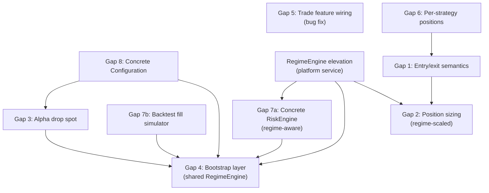
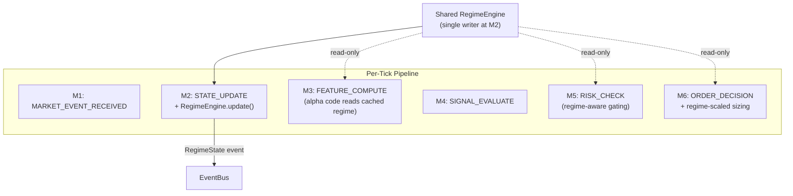
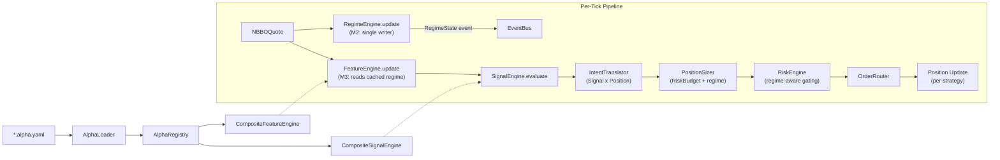

# Closing the Alpha Pipeline Gaps — Prioritized Plan

## Dependency Graph




The gaps form three chains plus a cross-cutting concern (RegimeEngine) that touches Phase 1, Phase 2, and Phase 3. Phasing groups them by milestone: each phase produces a testable, useful system.

## RegimeEngine — Cross-Cutting Integration

The `RegimeEngine` currently exists as an optional service injected into alpha feature code namespaces by the `AlphaLoader`. It is invisible to the orchestrator, risk engine, position sizer, and observability. This plan elevates it to a **platform-level service** — a single shared instance that participates in the tick pipeline at a defined point, publishes regime state as typed events, and is consumed by risk, sizing, and alpha layers alike.

### Current state

- `RegimeEngine` protocol + `HMM3StateFractional` implementation exist in [services/regime_engine.py](src/feelies/services/regime_engine.py)
- `AlphaLoader` resolves engine by name from `regimes.engine` in alpha spec, injects into feature code namespace
- Alpha feature code calls `regime_engine.posterior(quote)` inside `update()` — this is the only call site
- Risk engine has no access to regime state
- No regime events exist in [core/events.py](src/feelies/core/events.py)
- Multiple alphas may create separate instances or share one — no guarantee of consistency

### Target state




**Single-writer semantics:** The orchestrator calls `regime_engine.update(quote)` once at M2 (STATE_UPDATE). This is the canonical update point. Alpha feature code that calls `regime_engine.posterior(quote)` afterwards gets the already-computed result for that tick (cached by symbol). Risk engine and position sizer query current state — they never update.

**Backward compatibility:** Alpha specs that reference `regime_engine` in feature code continue to work. The `HMM3StateFractional.posterior()` already caches by symbol — a second call with the same quote returns the cached posterior. The only change is that the first call now happens at M2 (orchestrator) rather than inside feature computation.

### What this adds to each phase

- **Phase 1 (1.3):** `BasicRiskEngine` accepts an optional `RegimeEngine`. When regime is `vol_breakout`, it scales down max position and tightens exposure limits. New `RegimeState` event type in `core/events.py`.
- **Phase 1 (new 1.5):** Orchestrator gains an optional `RegimeEngine` dependency. At M2, if present, calls `update(quote)` and publishes `RegimeState` event.
- **Phase 2 (2.2):** `build_platform()` creates one shared `RegimeEngine` instance and injects it into: AlphaLoader, RiskEngine, Orchestrator. Config specifies which engine (or null).
- **Phase 3 (3.3):** `BudgetBasedSizer` accepts regime state. Applies a regime scaling factor: e.g., `vol_breakout → 0.5x`, `compression_clustering → 0.75x`, `normal → 1.0x`.

---

## Phase 1 — Make the Pipeline Runnable End-to-End

**Goal:** A manually-wired orchestrator can boot, process ticks, and produce fills in backtest mode. All protocols have at least one concrete implementation.

### 1.1 Trade Feature Wiring (Gap 5) — Bug Fix

**Effort:** Trivial (one call site)

In [orchestrator.py](src/feelies/kernel/orchestrator.py) `_process_trade()`, add a call to `self._feature_engine` for trade-aware features. Currently:

```python
def _process_trade(self, trade: Trade) -> None:
    self._event_log.append(trade)
    self._bus.publish(trade)
```

Needs to also call `process_trade` on the feature engine (via a duck-typed check or protocol extension on `FeatureEngine`), and if features updated, optionally run signal evaluation. Decision: whether trade-triggered feature updates should re-enter the signal pipeline or just update state silently is an architectural choice.

**Recommended approach:** Update feature state only, do not trigger signal evaluation. Signal evaluation happens only on quote ticks. Rationale: signal purity (inv 5) — signals are a function of FeatureVector, which is quote-driven. Trade features contribute to the *next* quote's FeatureVector, not to an immediate signal. This avoids double-evaluation and keeps the micro-state machine clean.

**File changes:**

- [src/feelies/kernel/orchestrator.py](src/feelies/kernel/orchestrator.py) — add `process_trade` call
- [src/feelies/features/engine.py](src/feelies/features/engine.py) — add optional `process_trade` to `FeatureEngine` protocol (with default no-op for backward compat)

---

### 1.2 Concrete Configuration (Gap 8)

**Effort:** Small

`Configuration` is a protocol with no implementation. Create `PlatformConfig` in a new file `src/feelies/core/platform_config.py`:

- Fields: `version`, `symbols`, `alpha_spec_dir` (Path | None), `alpha_specs` (list of explicit paths), `parameter_overrides` (dict[alpha_id, dict]), `mode` (backtest/paper/live enum), `data_dir`, `author`
- `validate()` — check alpha_spec_dir exists (if set), symbols non-empty, mode valid
- `snapshot()` — serialize to `ConfigSnapshot` with SHA-256 checksum
- Load from a YAML file (e.g., `platform.yaml`) so the system has a single configuration surface

This creates the anchor for alpha discovery (Phase 2) and bootstrap (Phase 2).

**File changes:**

- New: `src/feelies/core/platform_config.py`

---

### 1.3 RegimeEngine Elevation — Platform Service

**Effort:** Medium

Three sub-tasks:

**1.3a — `RegimeState` event type.** Add to [core/events.py](src/feelies/core/events.py):

```python
@dataclass(frozen=True, kw_only=True)
class RegimeState(Event):
    symbol: str
    engine_name: str
    state_names: tuple[str, ...]
    posteriors: tuple[float, ...]     # probability per state
    dominant_state: int               # argmax index
    dominant_name: str                # human-readable name of dominant state
```

**1.3b — RegimeEngine protocol extension.** The current `posterior()` method both updates state *and* returns the result. For single-writer semantics, add an explicit `current_state()` read-only accessor to [services/regime_engine.py](src/feelies/services/regime_engine.py):

```python
class RegimeEngine(Protocol):
    # ... existing methods ...
    def current_state(self, symbol: str) -> list[float] | None:
        """Return cached posteriors for a symbol without updating. None if never updated."""
        ...
```

`HMM3StateFractional` already stores posteriors per symbol in `self._posteriors` — the implementation is a one-line dict lookup.

**1.3c — Orchestrator integration.** Inject optional `RegimeEngine` into `Orchestrator.__init__`. At M2 (STATE_UPDATE), if present:

1. Call `regime_engine.posterior(quote)` — this updates and caches
2. Determine dominant state (argmax)
3. Publish `RegimeState` event on the bus

This happens before M3 (FEATURE_COMPUTE), so alpha feature code that calls `regime_engine.posterior(quote)` gets the cached result (no double-update; `HMM3StateFractional` uses per-symbol state that's already been advanced).

**File changes:**

- Update: [src/feelies/core/events.py](src/feelies/core/events.py) — add `RegimeState`
- Update: [src/feelies/services/regime_engine.py](src/feelies/services/regime_engine.py) — add `current_state()` to protocol and implementation
- Update: [src/feelies/kernel/orchestrator.py](src/feelies/kernel/orchestrator.py) — accept optional `RegimeEngine`, update at M2, publish `RegimeState`

---

### 1.4 Concrete RiskEngine (Gap 7a)

**Effort:** Medium

`RiskEngine` is a protocol. Build a first concrete implementation in `src/feelies/risk/basic_risk.py`:

- Accepts optional `RegimeEngine` at construction
- `check_signal()`:
  - Query `regime_engine.current_state(symbol)` if available
  - If dominant regime is `vol_breakout`: halve max position limit, apply 0.5x scaling factor
  - Reject if symbol exposure exceeds (regime-adjusted) per-symbol limit
  - Reject if gross portfolio exposure exceeds portfolio limit
  - Scale down if approaching limits (SCALE_DOWN action)
  - FORCE_FLATTEN if drawdown threshold breached
  - Otherwise ALLOW
- `check_order()`:
  - Validate order quantity doesn't breach (regime-adjusted) per-symbol position limit
  - Validate total exposure post-fill stays within budget

Configuration via a `RiskConfig` dataclass (max position per symbol, max gross exposure, max drawdown, regime scaling factors).

**File changes:**

- New: `src/feelies/risk/basic_risk.py`

---

### 1.5 Backtest Fill Simulator (Gap 7b)

**Effort:** Medium-Large

The `ExecutionBackend` protocol composes `MarketDataSource` + `OrderRouter`. `ReplayFeed` already implements `MarketDataSource`. What's missing is a concrete `OrderRouter` for backtest mode.

Create `src/feelies/execution/backtest_router.py`:

- `BacktestOrderRouter` implements `OrderRouter`
- `submit(order)` — queue the order, simulate fill against most recent quote
- `poll_acks()` — return fills from submitted orders
- Fill model (v1): immediate fill at mid-price (simplest possible). Document this as a placeholder for the fill model designed in the backtest-engine skill.
- Track last quote per symbol (updated by caller or by subscribing to bus)

Also create `src/feelies/execution/backtest_backend.py` to compose `ReplayFeed` + `BacktestOrderRouter` into a concrete `ExecutionBackend`.

**File changes:**

- New: `src/feelies/execution/backtest_router.py`
- New: `src/feelies/execution/backtest_backend.py`

---

### Phase 1 Milestone

After Phase 1, a developer can write a test that:

1. Manually creates a `PlatformConfig`
2. Creates a shared `RegimeEngine` instance
3. Loads an `.alpha.yaml` via `AlphaLoader(regime_engine=shared)`
4. Registers it in `AlphaRegistry`
5. Builds `CompositeFeatureEngine` + `CompositeSignalEngine`
6. Constructs `Orchestrator` with concrete risk engine (regime-aware) + backtest backend + regime engine
7. Calls `boot()` + `run_backtest()`
8. Observes fills in the trade journal AND `RegimeState` events on the bus

Still requires manual wiring. Still has dumb order sizing. But the pipeline runs with regime as a first-class participant.

---

## Phase 2 — Make Alpha Loading Self-Service

**Goal:** Drop `.alpha.yaml` files in a directory, point a config at it, call one function, get a running system.

### 2.1 Alpha Drop Spot and Discovery (Gap 3)

**Effort:** Small

**Convention:** `alphas/` directory at project root (configurable via `PlatformConfig.alpha_spec_dir`). All files matching `*.alpha.yaml` are auto-discovered.

Create `src/feelies/alpha/discovery.py`:

- `discover_alpha_specs(spec_dir: Path) -> list[Path]` — glob for `*.alpha.yaml`, sorted alphabetically for determinism
- `load_and_register(spec_dir, registry, loader, overrides) -> list[str]` — discover, load each, register, run `registry.validate_all()`, return list of loaded alpha_ids
- Error policy: one bad spec does not block others. Collect errors, log them, register valid ones. Raise if *no* alphas loaded successfully.

**File changes:**

- New: `src/feelies/alpha/discovery.py`
- Update: [src/feelies/alpha/**init**.py](src/feelies/alpha/__init__.py) — export discovery functions

---

### 2.2 Bootstrap / Composition Layer (Gap 4)

**Effort:** Medium

Create `src/feelies/bootstrap.py` — the "main" that composes the system:

```python
def build_platform(config_path: Path) -> Orchestrator:
    """Load config, discover alphas, compose all layers, return ready-to-boot orchestrator."""
```

Responsibilities:

1. Load `PlatformConfig` from YAML
2. Select clock (`SimulatedClock` for backtest, `WallClock` for paper/live)
3. Construct `EventBus`
4. **Create shared `RegimeEngine`** — instantiate from `config.regime_engine` name (e.g., `hmm_3state_fractional`). If null, no regime engine. This single instance is the canonical regime service.
5. Create `AlphaLoader(regime_engine=shared_regime_engine)` — alphas that declare `regimes.engine` use this shared instance instead of creating their own
6. Call `discover_alpha_specs()` → `load_and_register()`
7. Build `CompositeFeatureEngine(registry, clock)`, `CompositeSignalEngine(registry)`
8. Build concrete `BasicRiskEngine(config, regime_engine=shared_regime_engine)` — risk engine reads regime state
9. Build `ExecutionBackend` by mode (backtest: `ReplayFeed` + `BacktestOrderRouter`)
10. Build `PositionStore` (in-memory for backtest)
11. Assemble `Orchestrator` with all components **including `regime_engine=shared_regime_engine`**
12. Return it — caller does `orchestrator.boot(config)` + `orchestrator.run_*()`

**Single instance, three consumers:** The shared `RegimeEngine` is injected into the orchestrator (writer at M2), the risk engine (reader at M5), and the alpha loader (reader at M3 via feature code). No duplication, no inconsistency.

Also need a concrete in-memory `PositionStore` — create `src/feelies/portfolio/memory_position_store.py`.

**File changes:**

- New: `src/feelies/bootstrap.py`
- New: `src/feelies/portfolio/memory_position_store.py`

---

### Phase 2 Milestone

After Phase 2:

```python
orchestrator = build_platform(Path("platform.yaml"))
orchestrator.boot(config)
orchestrator.run_backtest()
```

Drop a new `.alpha.yaml` into `alphas/`, re-run, and it's live. True plug-and-play for backtest mode.

---

## Phase 3 — Make Trading Behavior Correct

**Goal:** The system understands entry vs. exit, sizes positions from alpha risk budgets, and isolates per-strategy positions for multi-alpha.

### 3.1 Per-Strategy Position Tracking (Gap 6)

**Effort:** Medium

The current `PositionStore` is keyed by symbol. For multi-alpha on the same symbol, we need per-strategy isolation.

**Design approach:** Composite pattern.

- Introduce `StrategyPositionStore` — wraps a per-strategy `dict[str, PositionStore]` plus an aggregate view
- `get(strategy_id, symbol)` — strategy-level position
- `get_aggregate(symbol)` — net position across all strategies (for risk engine)
- The risk engine checks aggregate exposure; the intent translator checks per-strategy position

This preserves the existing `PositionStore` protocol (the aggregate view satisfies it), so the risk engine and orchestrator signatures don't change. The intent translator (next gap) receives the strategy-aware store.

**File changes:**

- New: `src/feelies/portfolio/strategy_position_store.py`
- Update: [src/feelies/kernel/orchestrator.py](src/feelies/kernel/orchestrator.py) — pass strategy_id through reconciliation path
- Update: `src/feelies/portfolio/memory_position_store.py` — implement the per-strategy variant

---

### 3.2 Trading Intent Translator (Gap 1) — Core Gap

**Effort:** Large (architectural centerpiece)

Create `src/feelies/execution/intent.py`:

```python
class TradingIntent(Enum):
    ENTRY_LONG = auto()
    ENTRY_SHORT = auto()
    EXIT = auto()
    REVERSE_LONG_TO_SHORT = auto()
    REVERSE_SHORT_TO_LONG = auto()
    SCALE_UP = auto()
    NO_ACTION = auto()

@dataclass(frozen=True)
class OrderIntent:
    intent: TradingIntent
    symbol: str
    strategy_id: str
    target_quantity: int      # absolute, unsigned
    current_quantity: int     # signed, from position store
    signal: Signal

class IntentTranslator(Protocol):
    def translate(self, signal: Signal, position: Position) -> OrderIntent: ...
```

Default implementation `SignalPositionTranslator`:


| Signal direction | Current position | Intent                | Orders needed       |
| ---------------- | ---------------- | --------------------- | ------------------- |
| LONG             | 0                | ENTRY_LONG            | BUY target_qty      |
| LONG             | +N (at target)   | NO_ACTION             | none                |
| LONG             | -N               | REVERSE_SHORT_TO_LONG | BUY N + target_qty  |
| SHORT            | 0                | ENTRY_SHORT           | SELL target_qty     |
| SHORT            | -N (at target)   | NO_ACTION             | none                |
| SHORT            | +N               | REVERSE_LONG_TO_SHORT | SELL N + target_qty |
| FLAT             | +N               | EXIT                  | SELL N              |
| FLAT             | -N               | EXIT                  | BUY N               |
| FLAT             | 0                | NO_ACTION             | none                |


Wire into the orchestrator between M4 and M6:

- After signal evaluation (M4), call `intent_translator.translate(signal, strategy_position)`
- If `NO_ACTION`, skip to M10
- If action needed, the intent (not raw signal) drives order construction
- Replace `_build_order` to consume `OrderIntent` instead of raw `Signal`
- FLAT signals no longer short-circuit at M5 — they flow through the translator

This is the most impactful change. The orchestrator's `_process_tick_inner` logic between M4 and M7 must be restructured, but the micro-state machine itself doesn't change.

**File changes:**

- New: `src/feelies/execution/intent.py`
- Major update: [src/feelies/kernel/orchestrator.py](src/feelies/kernel/orchestrator.py) — inject `IntentTranslator`, restructure M4-M6 flow
- Update: `src/feelies/core/events.py` — potentially add `OrderIntent` event type for provenance

---

### 3.3 Position Sizing from Risk Budget (Gap 2)

**Effort:** Medium

Create `src/feelies/risk/position_sizer.py`:

```python
class PositionSizer(Protocol):
    def compute_target_quantity(
        self,
        signal: Signal,
        risk_budget: AlphaRiskBudget,
        symbol_price: Decimal,
        account_equity: Decimal,
    ) -> int: ...
```

Default implementation `BudgetBasedSizer`:

1. `allocated_capital = account_equity * risk_budget.capital_allocation_pct / 100`
2. `position_value = allocated_capital * signal.strength` (strength as conviction scalar)
3. **Regime scaling:** Query `regime_engine.current_state(symbol)` if available. Apply regime-dependent multiplier:
  - `vol_breakout` (dominant state) → `0.5x` (halve position in high-vol regime)
  - `compression_clustering` → `0.75x` (reduced edge in compression)
  - `normal` → `1.0x`
4. `target_shares = floor(position_value * regime_factor / symbol_price)`
5. `capped = min(target_shares, risk_budget.max_position_per_symbol)`

The `IntentTranslator` calls `PositionSizer` to determine `target_quantity` in `OrderIntent`. This replaces the hardcoded `base_quantity = 100`.

**Requires:**

- A way to look up `AlphaRiskBudget` for the signal's `strategy_id` — the registry already stores manifests, so `registry.get(strategy_id).manifest.risk_budget` works.
- The shared `RegimeEngine` instance (injected at construction, same instance as risk engine and orchestrator).

**File changes:**

- New: `src/feelies/risk/position_sizer.py`
- Update: `src/feelies/execution/intent.py` — wire sizer into translator
- Update: [src/feelies/kernel/orchestrator.py](src/feelies/kernel/orchestrator.py) — remove hardcoded `base_quantity`

---

### Phase 3 Milestone

After Phase 3, the complete pipeline works:




---

## Sequencing Summary


| Order | Item                        | Phase | Effort  | Depends On                 | Unlocks                                  |
| ----- | --------------------------- | ----- | ------- | -------------------------- | ---------------------------------------- |
| 1     | 5: Trade feature wiring     | 1     | Trivial | None                       | Trade-consuming features                 |
| 2     | 8: Concrete Configuration   | 1     | Small   | None                       | Boot, discovery, bootstrap               |
| 3     | RegimeEngine elevation      | 1     | Medium  | None                       | Regime-aware risk, sizing, observability |
| 4     | 7a: Concrete RiskEngine     | 1     | Medium  | RegimeEngine elevation     | Pipeline past M5 with regime gating      |
| 5     | 7b: Backtest fill simulator | 1     | Medium  | None                       | Pipeline completes with fills            |
| 6     | 3: Alpha drop spot          | 2     | Small   | Gap 8                      | Self-service alpha loading               |
| 7     | 4: Bootstrap layer          | 2     | Medium  | Gaps 3, 7a, 7b, 8, RegimeE | One-call startup, shared RegimeEngine    |
| 8     | 6: Per-strategy positions   | 3     | Medium  | None (but needed by 9, 10) | Multi-alpha isolation                    |
| 9     | 1: Intent Translator        | 3     | Large   | Gap 6                      | Entry/exit correctness                   |
| 10    | 2: Position sizing          | 3     | Medium  | Gaps 1, 6, RegimeE         | Risk-budget + regime-aware sizing        |


Phase 1 items (1-5): items 1, 2, 5 are independent. Item 3 (RegimeEngine) must precede item 4 (RiskEngine).
Phase 2 items (6-7): sequential (discovery before bootstrap).
Phase 3 items (8-10): sequential (positions before intent before sizing). Item 10 also reads RegimeEngine from Phase 1.