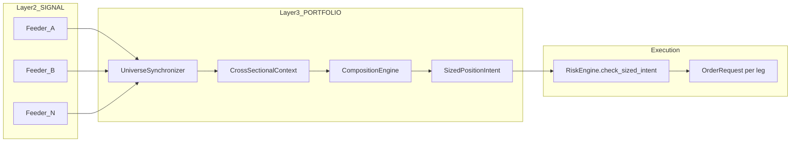
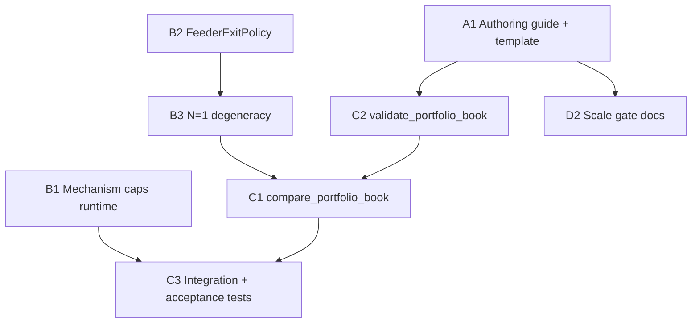

# P5: Systematic PORTFOLIO Alpha Framework

## Context (what P1–P4 solved vs P5)

P1–P4 closed the **standalone-SIGNAL collision harness** path: exit hijacks, redundant gate-close spam, collision forensics, and documentation that [`configs/bt_multialpha.yaml`](configs/bt_multialpha.yaml) is research-only.

P5 is the **general replacement architecture**: multiple SIGNAL feeders → one PORTFOLIO book builder → `SizedPositionIntent` → `RiskEngine.check_sized_intent` (per-leg veto). The platform already implements this pipeline; P5 makes it **authorable, enforceable, and verifiable** without picking a first production alpha (per your scope choice).



**Reference implementations today (research-only, not P5 deliverables):**
- [`alphas/research/pro_kyle_benign_v1/`](alphas/research/pro_kyle_benign_v1/) — KYLE_INFO feeders, N=3 universe
- [`alphas/research/pro_burst_revert_v1/`](alphas/research/pro_burst_revert_v1/) — decorrelated mechanisms
- [`alphas/_template/template_portfolio.alpha.yaml`](alphas/_template/template_portfolio.alpha.yaml) — schema-1.1 skeleton
- Integration contract: [`tests/integration/test_phase4_e2e.py`](tests/integration/test_phase4_e2e.py)

---

## Design principles (general, not pilot-specific)

| Principle | Implication |
|-----------|-------------|
| **One order path per symbol per tick** | Feeders listed in `depends_on_signals` are **consumed**, not arbitrated ([`orchestrator._on_bus_signal`](src/feelies/kernel/orchestrator.py) skip rule) |
| **Mechanism-first composition** | G16 PORTFOLIO rule 8/9: declare `trend_mechanism.consumes` caps + whitelist matching feeder families ([`layer_validator.py`](src/feelies/alpha/layer_validator.py)) |
| **Cross-sectional vs single-symbol** | Same machinery; N=1 universe is a degenerate cross-section (ranker standardization edge case must be defined) |
| **Scale gate** | BT-13 IR ≈ IC × √N: composition complexity justified only above a documented N / gross threshold ([`test_bt13_portfolio_research_only.py`](tests/acceptance/test_bt13_portfolio_research_only.py)) |
| **Fail-safe default** | Low completeness → degenerate empty intent (hold); per-leg risk veto; no double-trade (Inv-11) |

---

## Workstream A — Authoring contract and templates

**Goal:** Any future PORTFOLIO alpha follows one checklist, not ad-hoc YAML.

### A1. Canonical authoring guide (new doc, ~2 pages)
Location: `docs/portfolio_alpha_authoring.md` (or extend [`alphas/SCHEMA.md`](alphas/SCHEMA.md) if it exists).

Sections:
1. **When to use PORTFOLIO vs standalone SIGNAL** — decision tree (feeder count, same symbol, capital scale)
2. **Required blocks** — mirror [`template_portfolio.alpha.yaml`](alphas/_template/template_portfolio.alpha.yaml): `depends_on_signals`, `universe`, `horizon_seconds`, `cost_arithmetic`, G16 `trend_mechanism.consumes`
3. **Feeder eligibility matrix** — per feeder: mechanism family, horizon, margin_ratio, lifecycle state, falsification criteria; reject feeders that fail G12 or are QUARANTINED
4. **Horizon alignment rules** — PORTFOLIO `horizon_seconds` ≥ max(feeder horizons); cross-horizon fan-in semantics ([`synchronizer._pick_feeder_signal`](src/feelies/composition/synchronizer.py))
5. **Two book patterns** (both first-class):
   - **Pattern A — CrossSectionalBook** (N≥3): rank → neutralize → sector-match → optimize
   - **Pattern B — SingleSymbolBook** (N=1): same pipeline but document ranker degeneracy + completeness semantics
6. **Promotion path** — RESEARCH → PAPER requires portfolio-level CPCV/DSR + paper-window evidence on the **book**, not per-feeder attribution

### A2. Upgrade template + scaffold
- Extend [`alphas/_template/template_portfolio.alpha.yaml`](alphas/_template/template_portfolio.alpha.yaml) with:
  - commented `depends_on_signals` examples (same-family vs decorrelated-family)
  - `parameters` for `decay_weighting_enabled`, `composition_completeness_threshold`
  - explicit `lifecycle_state: RESEARCH` default + scale-up notes
- Add `scripts/scaffold_portfolio_alpha.py` (mirror signal scaffold if one exists): generates `alphas/pf_<name>/` from template with G16 pre-filled from selected feeders

### A3. Config taxonomy
| Config | Purpose |
|--------|---------|
| `configs/bt_multialpha.yaml` | **Research collision harness** (standalone SIGNAL) — keep, never for live |
| `configs/bt_portfolio_<book>.yaml` | **New pattern**: lists feeders + one PORTFOLIO alpha; no standalone arbitration |
| `configs/platform.yaml` | Shared: `composition_*`, `factor_loadings_dir`, `sector_map_path` |

---

## Workstream B — Platform gaps (must close before any pilot)

These are **framework blockers**, not alpha-specific tuning.

### B1. Wire G16 mechanism caps at runtime (known gap)
**Today:** G16 validates caps at load; bootstrap builds [`CrossSectionalRanker`](src/feelies/bootstrap.py) with default `mechanism_max_share_of_gross=1.0` (cap disabled per [composition-layer skill](.cursor/skills/composition-layer/SKILL.md)).

**P5 fix:**
- Pass per-alpha `trend_mechanism.consumes[*].max_share_of_gross` from [`LoadedPortfolioLayerModule`](src/feelies/alpha/portfolio_layer_module.py) into ranker construction (per registered alpha, not global singleton if multiple PORTFOLIO alphas)
- Add unit test: load YAML with 0.5 cap → assert `mechanism_breakdown` never exceeds 0.5 on synthetic context
- Lock with L3 parity hash extension or dedicated determinism test

### B2. Feeder exit synthesis (critical design gap)
**Today:** [`CrossSectionalRanker._rank_multi_feeder`](src/feelies/composition/cross_sectional.py) sums **directional** scores; gate-close `FLAT` (`regime_gate_state=OFF`) yields `raw_total=0` → optimizer holds position. This differs from standalone SIGNAL path where FLAT can flatten the book.

**Impact:** Any feeder that exits via gate-close FLAT (e.g. `sig_benign_midcap_v1`) will not exit through the default PORTFOLIO pipeline unless addressed.

**P5 deliverable — general `FeederExitPolicy` (platform module, not one-off alpha):**
```python
# feelies/composition/feeder_exit.py (new)
def synthesize_exit_targets(
    ctx: CrossSectionalContext,
    feeder_ids: tuple[str, ...],
    *,
    current_qty_by_symbol: Mapping[str, int],
) -> dict[str, TargetPosition]: ...
```

Rules (document + implement):
- **Any-feeder FLAT + open book** → target flat for symbol (conservative: OR semantics for exit)
- **Conflicting directional feeders on same symbol** → fail-safe: zero delta (hold) + DEBUG trace; never net-new exposure from conflict
- **Never-traded feeder gate-close** → ignore (mirrors P4 redundant filter)
- Integrate in [`CompositionEngine.run_default_pipeline`](src/feelies/composition/engine.py) **after** ranker, **before** optimizer: merge exit targets with entry weights (exit takes precedence when book open)

Tests:
- Unit tests for each rule
- Determinism test: fixed context → byte-identical `SizedPositionIntent`
- Regression: APP 2026-03-26 with a **throwaway test-only** portfolio config (not shipped alpha) proves PnL parity vs benign-only within tolerance

### B3. N=1 universe degeneracy
When `len(universe)==1`, cross-sectional z-score standardization in [`_standardize`](src/feelies/composition/cross_sectional.py) degenerates (std=0 → zero weights).

**P5 fix:** Explicit branch: single-symbol books use **absolute score → signed target** mapping (document formula in authoring guide), not cross-sectional z-score. Gate behind ranker flag `single_symbol_mode: auto` (detect `len(universe)==1`).

### B4. Completeness semantics for single-feeder / single-symbol
[`UniverseSynchronizer`](src/feelies/composition/synchronizer.py) completeness = fraction of universe with any feeder signal. For N=1 with one feeder, define minimum completeness for entry vs hold.

**P5:** Document default; allow per-alpha override via existing `composition_completeness_threshold` parameter.

### B5. Forensics and attribution contract
- All PORTFOLIO fills tagged `strategy_id=<portfolio_alpha_id>`, `OrderRequest.reason=PORTFOLIO`
- Extend post-trade tooling to decompose PnL by `mechanism_breakdown` on intent + feeder signal lineage (read-only; no per-tick ledger reads in production path)
- Document that per-feeder cost-survival under a book is **forensic-only** (same lesson as multialpha compare script)

---

## Workstream C — Validation tooling (generalized)

Extend the P2 compare pattern into portfolio-aware forensics.

### C1. `scripts/compare_portfolio_book.py` (new)
Generalization of [`scripts/compare_multialpha_runs.py`](scripts/compare_multialpha_runs.py):

| Mode | Compares |
|------|----------|
| `--mode standalone` | Each feeder alone vs combined standalone (collision harness) |
| `--mode portfolio` | Best standalone feeder vs PORTFOLIO book config |
| `--mode feeders` | Per-feeder PnL vs book PnL (attribution warning built-in) |

Outputs: fleet PnL, fill diffs, `SizedPositionIntent` count, mechanism_breakdown histogram, `--strict` exit codes.

### C2. Loader / wiring preflight
`scripts/validate_portfolio_book.py`:
- All `depends_on_signals` resolve to registered SIGNAL alphas
- G16 whitelist closure (feeder families ⊆ consumes)
- Horizon ordering check
- Bootstrap dry-run: `build_platform(config)` without replay

### C3. Determinism and integration enrichment
- Extend [`tests/integration/test_phase4_e2e.py`](tests/integration/test_phase4_e2e.py) with a **synthetic fixture that produces non-vacuous intents** (always-on tracer SIGNAL or tuned gates) — locks PR-2b-iii/iv contracts non-vacuously
- Add acceptance test: `test_portfolio_framework_wiring.py` — template loads, validate script passes, mechanism cap runtime test passes
- Optional: new L3 parity fixture file for framework golden intent stream (decay OFF baseline)

---

## Workstream D — Discovery, lifecycle, and promotion gates

### D1. Alpha discovery layout
```
alphas/
  sig_*           # SIGNAL feeders (production-eligible individually)
  pf_*            # PORTFOLIO books (future production)
  research/       # pro_* reference alphas (RESEARCH cap, excluded from default discovery)
  _template/      # templates
```

P5: codify in [`discover_alpha_specs`](src/feelies/alpha/discovery.py) docs; no new production `pf_*` alpha required.

### D2. Lifecycle and scale gate
Extend BT-13 acceptance into a **general scale gate** documented in authoring guide:
- Default `lifecycle_state: RESEARCH` for new PORTFOLIO alphas
- Promotion to PAPER blocked until: `len(universe) ≥ N_min` (configurable, default 10) OR explicit operator override with signed rationale in promotion metadata
- Structured evidence: portfolio-level `CPCVEvidence` + `DSREvidence` + `PaperWindowEvidence` on the **book** artifact_id

### D3. Deprecation policy for standalone multi-SIGNAL
- [`configs/bt_multialpha.yaml`](configs/bt_multialpha.yaml): keep for collision regression only; CI runs `compare_multialpha_runs --strict`
- Document in AGENTS.md / authoring guide: **never** add a second standalone SIGNAL to a live config; add feeders to `depends_on_signals` instead

---

## Workstream E — Documentation and operator surfaces

| Deliverable | Content |
|-------------|---------|
| `docs/portfolio_alpha_authoring.md` | Full checklist + patterns A/B |
| [`AGENTS.md`](AGENTS.md) | Add portfolio backtest smoke command |
| Operator CLI (optional stretch) | `feelies portfolio validate-book --config …` wrapping C2 preflight |

---

## Suggested implementation order



1. **B2 FeederExitPolicy** — unblocks any book using gate-close exits
2. **B1 + B3** — runtime correctness for caps and single-symbol
3. **A1 + A2 + A3** — authoring contract (parallel with B)
4. **C2 → C1 → C3** — validation tooling and CI gates
5. **D1–D3** — discovery/lifecycle policy (mostly docs + one acceptance test)

---

## Success criteria (P5 done when)

- [ ] Author can follow `docs/portfolio_alpha_authoring.md` + template to define a book **without** reading orchestrator arbitration code
- [ ] `validate_portfolio_book.py` catches invalid feeder/universe/horizon/G16 configs at CI time
- [ ] `compare_portfolio_book.py --mode portfolio --strict` passes on a **test fixture config** (throwaway YAML in `tests/fixtures/`, not production alpha)
- [ ] G16 mechanism caps enforced at runtime (not just load time)
- [ ] Feeder gate-close FLAT produces flatten intent when book is open (B2)
- [ ] N=1 universe produces non-zero targets when feeder fires directional signal (B3)
- [ ] L3/L4 determinism tests green; phase4 e2e non-vacuous for intent→order path
- [ ] No new production `pf_*` alpha shipped (framework-only scope)

---

## Explicit non-goals for P5

- Shipping a production PORTFOLIO alpha to `alphas/pf_*`
- Live capital deployment or IB paper wiring
- New SIGNAL feeder research (inventory revert promotion, etc.)
- Rewriting `TurnoverOptimizer` or factor model infrastructure
- Removing standalone SIGNAL path (feeder-only alphas remain valid in single-alpha configs)
