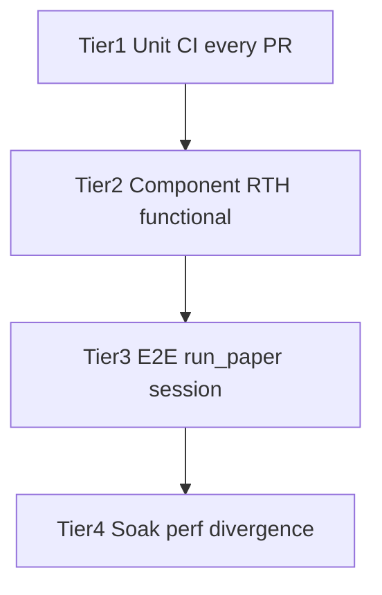

# Paper Trading RTH Test Plan

## Goal

Close the largest gap in the current paper implementation: **no test exercises Massive WS + orchestrator + IB Gateway together during trading hours**. Deliver a repeatable validation pipeline that finds async-fill bugs, shutdown races, and perf regressions without weakening backtest determinism (Inv-5 / Inv-9).

## Revision history (post-audit hardening)

This revision incorporates findings from a code-grounded audit against `main`:

| Finding | Severity | Resolution |
|---|---|---|
| A — `run_backtest.py` has no `--run-dir`; compare script needed symmetric inputs | HIGH | New §4.0 introduces `scripts/split_backtest_emit.py` to convert prefixed stdout → run-dir; `run_backtest.py` CLI untouched |
| B — 120s "fast-warm" milestone unreachable for `ofi_ewma` (300s warm window) | MEDIUM | Smoke alpha `depends_on_sensors` reduced to `micro_price` + `realized_vol_30s` only; signal logic re-anchored to `realized_vol_30s_zscore`; Tier 3 signal-path runtime extended to ≥600s |
| C — `--inject-test-order` was test-only production code | MEDIUM | Replaced with in-process invocation of `run_paper.main` + bus-direct `OrderRequest` injection from the test harness |
| D — Two parallel client-ID counters risked collision | LOW | New shared `tests/_ib_client_id.py`; existing IB functional suite refactored to import it |
| E — Cited perf precedent file does not exist | LOW | Plan now explicitly identifies this as the FIRST concrete consumer of `tests/perf/_pinned_baseline.py` |
| F — New baseline JSON file would fragment the helper | LOW | Extend existing `tests/perf/baselines/v02_baseline.json` with a `paper_rth` section |
| G — "Zero regression in ~2356 tests" not baselined | LOW | Success criterion now baselined against `main` with explicit acknowledgment of pre-existing acceptance failures |
| H — SIGTERM mentioned twice | NIT | Single source in §C; "Out of scope" cross-references rather than re-listing |
| I — Marker code block wrong language tag | NIT | Now TOML, in full `markers = [...]` context |
| J — `halt()` no-op semantics during boot | LOW | Tier-1 unit test pins the contract; Tier 3 fixture waits for `PAPER_TRADING_MODE` before injection |
| K — Recorder ctor kwarg would touch all test orchestrator constructions | LOW | Wired via post-construction `Orchestrator.set_paper_session_recorder()` setter from bootstrap PAPER branch only |
| L — Teardown regression test was claimed by two todos | NIT | `tier1-unit` owns it exclusively; `phase0-teardown-fix` ships only the production fix |
| M (2nd-pass) — Phase 0 snippet put `halt()` in `finally` although it's already on SIGINT/timer | NIT | Phase 0 snippet rewritten with the actual `finally` body (3 calls, shutdown first) plus `_max_runtime_timer.cancel()` |
| N (2nd-pass) — Event type was `StateTransition`, not `MacroStateTransition` | NIT | §3.1 fixture corrected (verified at orchestrator.py L3995-4006) |
| O (2nd-pass) — Original `paper_session(...)` design subscribed "before main()" although bus is created *inside* `build_platform` | MEDIUM | Fixture pattern documented: `monkeypatch.setattr("scripts.run_paper.build_platform", capturing_build)` captures orchestrator + bus on first call; zero production-code changes |
| P (2nd-pass) — `FORCE_FLATTEN` was annotated as a `RiskLevel` value | NIT | Corrected to `RiskAction.FORCE_FLATTEN` (`basic_risk.py` L541) |
| Q (2nd-pass) — §2.3 async-fill-latency was misclassified under "RTH functional" although it uses stubs | LOW | Reclassified as Tier 1 (runs in default pytest, no `functional`/`paper_rth` markers) |
| R (2nd-pass) — Original perf-baseline JSON layout used a top-level `paper_rth` key parallel to `hosts`; helper's actual schema is `data["hosts"][label][section]` | MEDIUM | Corrected to nest `paper_rth` *under* each host; added a new `load_paper_rth_baseline` helper function (additive — existing `PinnedBaseline` API untouched) |
| S (2nd-pass) — `session_open_ns` formula lacked DST guidance | LOW | Added `ZoneInfo("America/New_York")` example with explicit DST callout |

## Current state

```mermaid
flowchart LR
    subgraph tested [Tested today]
        IB[IB adapter unit + functional]
        WS[Massive WS functional]
        OrchStub[Orchestrator IdleTick stubs]
        Boot[Bootstrap PAPER branch]
        Guards[run_paper guard tests]
    end
    subgraph gap [Missing]
        E2E[run_paper full session]
        Fill[RTH marketable fills]
        Shut[Shutdown teardown bug]
        WarmUp[Sensor regime warm-up gates]
        Export[Session artefact export]
        Perf[Paper perf baseline]
        Recon[Broker position reconciliation]
    end
    tested --> gap
```



Key existing assets to extend (not replace):

- IB functional suite: [`tests/broker/ib/test_ib_functional.py`](tests/broker/ib/test_ib_functional.py) — handshake, cancel, dup-submit; uses non-marketable limits only
- WS functional suite: [`tests/ingestion/test_massive_functional.py`](tests/ingestion/test_massive_functional.py)
- Orchestrator IdleTick: [`tests/kernel/test_orchestrator_idle_tick.py`](tests/kernel/test_orchestrator_idle_tick.py)
- Manual harness: [`scripts/verify_ib_broker.py`](scripts/verify_ib_broker.py)
- Entry script: [`scripts/run_paper.py`](scripts/run_paper.py) — no export flags yet (unlike [`scripts/run_backtest.py`](scripts/run_backtest.py))

## Architecture: four tiers



| Tier | When | Duration | Marker |
|------|------|----------|--------|
| 1 | Every PR | ~5 min | default pytest |
| 2 | RTH / manual | ~15 min | `functional` + `paper_rth` |
| 3 | RTH / scheduled | ~30–60 min | `functional` + `paper_rth` |
| 4 | Weekly RTH | 2–4 hr | `slow` + `paper_rth` |

---

## Phase 0 — Critical fix before RTH E2E (second-pass finding)

**Bug:** [`scripts/run_paper.py`](scripts/run_paper.py) disconnects IB *before* calling `orchestrator.shutdown()`. The comment on line 151–153 claims drain happens first, but the actual order is:

```
live_feed.stop() → ib_connection.disconnect_and_stop() → orchestrator.shutdown()
```

Since `_drain_async_fills("shutdown")` polls `IBOrderRouter` while IB is still connected, disconnecting first can **lose in-flight fills** and leave orders stuck non-terminal (Inv-4 hygiene violation).

**Fix (implement before Tier 3):**

`run_paper.main` has two control paths into the `finally` block:
1. **Normal exit** — `orchestrator.run_paper()` returns when the pipeline self-exits (macro left `TRADING_MODES`, typically because the SIGINT handler or `--max-runtime-s` timer called `halt()`).
2. **Exception** — pipeline raised; macro transitions to `DEGRADED` and the exception propagates into `finally`.

Either way, `halt()` is already called from the SIGINT handler (run_paper.py L129) or from the `--max-runtime-s` timer (new in §3.1). The fix is **purely in the `finally` block** — reorder the three teardown calls so `shutdown()` runs first while IB is still connected:

```python
finally:
    # If --max-runtime-s was used, cancel the Timer before tearing down
    # so a late firing can't call halt() on an already-shut orchestrator.
    if _max_runtime_timer is not None:
        _max_runtime_timer.cancel()
    try:
        orchestrator.shutdown()   # drain fills while IB still connected
    except Exception:
        logger.exception("orchestrator.shutdown() raised")
    try:
        live_feed.stop()
    except Exception:
        logger.exception("live_feed.stop() raised")
    try:
        ib_connection.disconnect_and_stop()
    except Exception:
        logger.exception("ib_connection.disconnect_and_stop() raised")
```

`halt()` does NOT belong in `finally` — by the time we reach `finally`, either halt has already fired or the pipeline raised. Calling halt again would be a no-op outside `TRADING_MODES` (Finding J) but adds noise.

**Regression test:** owned by `tier1-unit` (see §1.3). Two layers:
1. **Call-order assertion** in `tests/scripts/test_run_paper.py` — mock build/orchestrator/feed/ib, assert `finally` invokes `shutdown` before `live_feed.stop` before `disconnect_and_stop`.
2. **Drain-vs-disconnect proof** in `tests/kernel/test_orchestrator_shutdown_drain.py` — direct orchestrator + stub `IBOrderRouter` with delayed fill ack; proves the call-order assertion above actually preserves the in-flight fill (without the proof, the call-order assertion is unmotivated).

---

## Second-pass review — gaps added to plan

### A. Timing and warm-up (E2E design corrections)

Per-sensor warm-up budgets (verified against [`platform.yaml`](platform.yaml)):

| Sensor | `min_history` | `warm_window_seconds` | Practical warm time |
|---|---|---|---|
| `micro_price` | 1 quote | 60 | ~1 quote (effectively instant) |
| `realized_vol_30s` | 16 quotes | n/a | ~30s at liquid-name quote rate |
| `ofi_ewma` | 50 quotes | **300** | up to **5 minutes** |
| `spread_z_30d` | 6000 quotes | n/a | hours — **forbidden in smoke** |

| Gap | Impact | Plan adjustment |
|-----|--------|-----------------|
| **Sensor warm-up** | [`HorizonSignalEngine`](src/feelies/signals/horizon_engine.py) suppresses entry signals when features are cold/stale | `paper_smoke_v1` `depends_on_sensors` includes **only `micro_price` and `realized_vol_30s`** so the 120s warm-up milestone is reachable. **`ofi_ewma` is excluded** (`warm_window_seconds: 300` makes the 120s assertion unreachable). `spread_z_30d` remains forbidden (6000-quote window). |
| **Horizon boundary** | 60s cold-start cannot hit a 300s horizon boundary | Split Tier 3: **cold-start (60s)**, **warm-up (120s)**, **signal-path (≥600s)**, **full-horizon (≥15 min, manual)** |
| **Signal logic** | Earlier draft used `ofi_ewma` threshold which we just excluded | Smoke alpha entry condition is a simple threshold on `realized_vol_30s_zscore` (warm at ~30s) — guarantees occasional entries while satisfying the 120s warm-up milestone |
| **Regime calibration** | `regime_calibration_max_quotes` prefix needed before HMM posteriors stabilize | Smoke alpha hard-codes `on_condition: "True"` / `off_condition: "False"` — the regime engine still runs (Inv-4 architectural invariant) but the gate is regime-independent |
| **Regime gate literal** | `on_condition: "True"` is valid (`ast.Constant` in [`regime_gate.py`](src/feelies/signals/regime_gate.py) L135) | Use for test alpha; avoid sensor bindings that fail during warm-up |

### B. Order-type and IB adapter coverage

| Gap | Plan adjustment |
|-----|-----------------|
| Orchestrator emits **`OrderType.MARKET`** on several paths ([`orchestrator.py`](src/feelies/kernel/orchestrator.py) ~L2484, L2714) | Add IB functional test: MKT 1-share SPY submit + cancel/flatten |
| **Error 10268** (`eTradeOnly`/`firmQuoteOnly`) already patched in [`router.py`](src/feelies/broker/ib/router.py) | Add unit regression asserting both flags are `False` on every built order |
| **Connectivity errors** (1100–2110) return `None` from `_fill_to_ack` — orchestrator never sees ack | Tier 2 test: simulate connectivity drop after submit; assert order stays non-terminal + alert/log path (documents known gap until Alert wiring TODO in router) |
| **Partial fill delta math** | Already in priority bug hunt; add explicit cumulative-fill sequence assertion in RTH fill test |

### C. Safety and degradation paths (missing from v1 plan)

| Path | Test |
|------|------|
| **`degrade_on_data_gap: true`** + WS drop | Macro → DEGRADED; entry signals suppressed; document in runbook |
| **PAPER `RISK_LOCKDOWN`** | Stub risk engine returning `RiskAction.FORCE_FLATTEN` (verified at [`src/feelies/risk/basic_risk.py`](src/feelies/risk/basic_risk.py) L541) during `run_paper()` — macro must reach `RISK_LOCKDOWN`. Already unit-tested for live mode; extend to paper RTH E2E via the bus-direct injection pattern from §3.1 (publish a synthetic `OrderRequest` whose risk-check resolves to `FORCE_FLATTEN` in the stubbed risk engine). |
| **G12 cost alert** | Real fill where IB commission/spread exceeds disclosed cost → `g12_realized_cost_exceeds_disclosure_stress` alert fires |
| **Kill switch mid-session** | Activate kill switch; assert no further submits; already guarded by `_require_safe_session_entry` — add E2E restart test |
| **`halt()` semantics** | `Orchestrator.halt()` ([`orchestrator.py`](src/feelies/kernel/orchestrator.py) L939-949) is a no-op outside `TRADING_MODES`. Tier 3 shutdown-in-flight test must assert SIGINT timing is **after** `MacroState.PAPER_TRADING_MODE` is reached; otherwise the test exercises the wrong path. Add a Tier-1 unit test pinning the no-op semantics. |
| **SIGTERM** | `run_paper.py` only handles SIGINT today. **Resolution:** explicitly out-of-scope for v1 (single source of truth — removed from Tier 3 task list); runbook §"Operator playbook" notes the gap and recommends `kill -INT` over `kill -TERM` until a follow-up wires SIGTERM to the same handler. |

### D. Export and divergence completeness

| Gap | Plan adjustment |
|-----|-----------------|
| Fills recorded in [`TradeJournal`](src/feelies/storage/trade_journal.py) at ack time (~L3883) | Add `--emit-fills-jsonl` (or `--emit-trades-jsonl`) sourced from trade journal flush, not just bus tap |
| **`PaperWindowEvidence`** has 7 fields; v1 compare script covered 5 | Add `trading_days`, `sample_size`, `latency_ks_p`, `anomalous_event_count` to compare output |
| **Backtest vs paper is not same-period** | Document methodology: compare *distribution* metrics (fill rate, slippage residual, rejection rate) over comparable windows; PnL compression requires aligned calendar days or is flagged `LOW_CONFIDENCE` |
| **No broker position reconciliation** | Explicit known gap (live-execution skill Inv: broker is ground truth); out of scope for v1 but runbook notes manual IB vs `PositionStore` spot-check during soak |

### E. Test harness ergonomics

| Gap | Plan adjustment |
|-----|-----------------|
| Shutdown-in-flight test can't wait for alpha signal | **In-process invocation** — Tier 3 integration test imports `scripts.run_paper.main` (already PYTHONPATH-reachable via `src/`) on a thread, waits for `MacroState.PAPER_TRADING_MODE`, then publishes a synthetic `OrderRequest` directly on the `EventBus`. No new flag on `run_paper.py` (Karpathy guideline #2 — no test-only production code paths). |
| **Client-ID coordination** | [`tests/broker/ib/test_ib_functional.py`](tests/broker/ib/test_ib_functional.py) L52-57 already has a module-global `_unique_client_id()` (base 500). Move it to a shared module `tests/_ib_client_id.py` (or `tests/paper/conftest.py` and import from the IB test) so the Tier 2 IB suite and Tier 3 E2E never collide. Document the rule: `IB_FUNCTIONAL_*` env vars remain authoritative. |
| **`ib_port` sanity** | Bootstrap warning if `mode: PAPER` and `ib_port == 4001` (live port) |
| **Pre-market / extended hours** | `require_rth_window()` accepts `PAPER_RTH_EXTENDED=1` for 4:00–20:00 ET smoke (optional); core fill tests remain 9:30–16:00 |
| **CI** | No `.github/workflows/` today — runbook includes optional scheduled job template (cron RTH open, secrets for `MASSIVE_API_KEY`, self-hosted IB runner) |
| **AGENTS.md** | Add paper RTH test commands alongside existing pytest markers |

### F. Performance — additional metrics

Beyond tick/drain latency, soak should capture:
- **Fill-to-position lag** (submit timestamp → `PositionStore` update) — dominated by IdleTick interval (~1s); flags if p99 > 3s
- **WS queue high-water mark** — expose via `MassiveLiveFeed` queue size accessor (may need small instrumentation)
- **IB `_fill_queue` depth** — similar accessor on `IBGatewayConnection`
- **IdleTick tuning experiment** — document follow-up if fill lag exceeds budget (reduce poll timeout from 1s)

---

## Phase 1 — Test infrastructure foundation

### 1.1 Pytest markers and shared helpers

**Files:**
- [`pyproject.toml`](pyproject.toml) — append to the existing `[tool.pytest.ini_options].markers` TOML list:
  ```toml
  markers = [
      "functional: network-backed tests against live external services",
      "backtest_validation: full backtest pipe validation suite",
      "slow: performance benchmarks and long-running tests",
      "paper_rth: requires US RTH + IB Gateway paper @ 4002 + MASSIVE_API_KEY",
  ]
  ```
- New shared module [`tests/_ib_client_id.py`](tests/_ib_client_id.py) — single module-global counter (base from `IB_FUNCTIONAL_CLIENT_ID` env, default 500). Tier 2 IB tests and Tier 3 paper E2E both import the same helper so allocations never collide.
- New [`tests/paper/conftest.py`](tests/paper/conftest.py) — shared fixtures (no parallel client-ID counter):
  - `require_rth_window()` — skip outside 9:30–16:00 ET (configurable via `PAPER_RTH_FORCE=1` for dev override)
  - `require_ib_gateway()` — port probe (reuse pattern from `test_ib_functional.py`)
  - `require_massive_api_key()`
  - `unique_ib_client_id()` — delegates to `tests/_ib_client_id.py`; never re-implements
  - Env overrides: `IB_FUNCTIONAL_*`, `MASSIVE_FUNCTIONAL_*` (keep existing names for compatibility)
- Refactor [`tests/broker/ib/test_ib_functional.py`](tests/broker/ib/test_ib_functional.py) L52-57 to import from `tests/_ib_client_id.py` instead of its own module-global counter.

### 1.2 Reference PAPER smoke config

**New file:** [`configs/paper_smoke_rth.yaml`](configs/paper_smoke_rth.yaml)

Minimal config for E2E runs:
- `mode: PAPER`
- `symbols: [SPY]` (liquid, tight spread)
- One SIGNAL alpha — **dedicated** `alphas/paper_smoke_v1/` (do not repurpose production alphas)
- **`horizon_seconds: 30`** for signal-path tests (not 300 — 60s runs cannot cross a 300s boundary)
- **`enforce_trend_mechanism: false`** in smoke config OR full `trend_mechanism:` block on test alpha
- **Smoke `sensor_specs`** lists ONLY: `micro_price` (warm @ 1 quote), `realized_vol_30s` (warm @ 16 quotes / ~30s). **Exclude `ofi_ewma`** (`warm_window_seconds: 300` makes the 120s warm-up milestone unreachable). **Exclude `spread_z_30d`** (6000-quote warm-up). The platform `sensor_specs` is a config-level override so omitted sensors are simply not registered — no kernel changes needed.
- Regime gate: `on_condition: "True"` / `off_condition: "False"` (valid `ast.Constant` literals per [`regime_gate.py`](src/feelies/signals/regime_gate.py) L135)
- **Explicit `session_open_ns`** — required despite [`bootstrap.py`](src/feelies/bootstrap.py) L571-597 auto-anchoring for PAPER mode, because the auto-anchor uses composition-time wall clock → same-day restarts get different anchors → boundary indices drift (priority bug-hunt item #8). Formula (runbook documents the table):
  ```python
  from datetime import datetime
  from zoneinfo import ZoneInfo  # stdlib; preferred over hard-coded UTC offset
  session_open_ns = int(
      datetime(YYYY, MM, DD, 9, 30, tzinfo=ZoneInfo("America/New_York")).timestamp() * 1e9
  )
  ```
  Using `ZoneInfo("America/New_York")` rather than a hard-coded UTC offset is non-negotiable: 9:30 ET ↔ 13:30 UTC during EDT (Mar–Nov) but 14:30 UTC during EST (Nov–Mar); a hard-coded UTC offset silently breaks twice a year on the DST boundary.
- `ib_port: 4002`, unique `ib_client_id` range documented in runbook (allocated by `tests/_ib_client_id.py` for tests)
- `degrade_on_data_gap: true` (matches production default) — enables WS-drop Tier 3 test

### 1.3 Unit test gaps (Tier 1 — no network)

This phase owns **every** unit test referenced by the plan (Phase 0 deliberately ships the teardown *fix*; the test that proves the fix lives here, not in `phase0-teardown-fix`):

| Test | File | Assertion |
|------|------|-----------|
| Shutdown drain ordering | new [`tests/kernel/test_orchestrator_shutdown_drain.py`](tests/kernel/test_orchestrator_shutdown_drain.py) | `_drain_async_fills("shutdown")` called before the pending-order scan; stub router with delayed ack |
| `run_paper.py` teardown regression | extend [`tests/scripts/test_run_paper.py`](tests/scripts/test_run_paper.py) | Mock orchestrator records call order of `shutdown` / `live_feed.stop` / `ib_connection.disconnect_and_stop` invocations from `run_paper.main`'s `finally` block. Assert `shutdown` is called **first** (post-fix order). Pairs with the orchestrator-level drain test below, which proves that ordering actually preserves the in-flight fill (without it, the call-order assertion is meaningless). |
| Drain-vs-disconnect bug-reproducer | new [`tests/kernel/test_orchestrator_shutdown_drain.py`](tests/kernel/test_orchestrator_shutdown_drain.py) | Direct orchestrator + stub `IBOrderRouter` (delayed fill ack). Scenario A: invoke `orchestrator.shutdown()` while the stub is still "connected" — `TradeRecord` lands in journal. Scenario B: simulate disconnect first (stub raises / returns empty on poll) then `orchestrator.shutdown()` — ack is dropped. Documents the structural bug; bypasses `run_paper.py` so it remains valid even after the script-level fix lands. |
| Nested `paper:` YAML block | [`tests/bootstrap/test_paper_branch.py`](tests/bootstrap/test_paper_branch.py) | `ib_port` from nested block when top-level absent |
| IB `OrderType.MARKET` mapping | new [`tests/broker/ib/test_router_market_order.py`](tests/broker/ib/test_router_market_order.py) | `_build_ib_order` with `OrderType.MARKET` → `order.orderType == "MKT"`, no `lmtPrice` set; covers the orchestrator → IB MKT path (L2484, L2714, L2828, L3076, L4354) end-to-end at the mapping seam |
| Error 10268 defaults regression | extend [`tests/broker/ib/test_router.py`](tests/broker/ib/test_router.py) | Every built IB order has `eTradeOnly=False` AND `firmQuoteOnly=False` ([`router.py`](src/feelies/broker/ib/router.py) L215-216) |
| Connectivity-error silent drop | extend [`tests/broker/ib/test_router.py`](tests/broker/ib/test_router.py) | `_fill_to_ack` returns `None` for every code in `_IB_CONNECTIVITY_CODES = {1100, 1101, 1102, 2110}` (router.py L51, L236-246); documents the known gap until the Alert wiring TODO at router.py L232 lands |
| `halt()` no-op outside `TRADING_MODES` | extend [`tests/kernel/test_orchestrator.py`](tests/kernel/test_orchestrator.py) | Calling `halt()` while macro is `READY` (e.g., SIGINT during boot) is a no-op; pins the contract Tier 3 depends on |

---

## Phase 2 — Component RTH functional tests (Tier 2)

### 2.1 IB Gateway — RTH fill path

**Extend:** [`tests/broker/ib/test_ib_functional.py`](tests/broker/ib/test_ib_functional.py)

Add class `TestIBGatewayRTHFills` (marked `functional` + `paper_rth`):

| Test | Design | Pass criteria |
|------|--------|---------------|
| `test_marketable_micro_fill_and_flatten` | 1-share SPY limit at/inside NBBO (fetch last quote via brief WS sample) | `FILLED` ack; flatten with opposite side; net position 0 |
| `test_market_order_submit_and_cancel` | 1-share `OrderType.MARKET` (orchestrator default path) | ACKNOWLEDGED then terminal; exercises `_build_ib_order` MKT branch |
| `test_partial_fill_then_cancel` | Limit straddling inside spread | Per-delta acks from router; remainder `CANCELLED` |
| `test_fill_ack_lag_exceeds_idle_tick_interval` | Submit marketable order; poll with 1.5s gaps mimicking IdleTick cadence | Terminal ack within 3× IdleTick interval |
| `test_ten_orders_rapid_submit_cancel` | 10 sequential 1-share non-marketable limits | All reach terminal; no thread deadlock |
| `test_etradeonly_defaults_regression` | Inspect built IB order object | `eTradeOnly=False`, `firmQuoteOnly=False` (error 10268 guard) |

Safety: always 1 share; use paper account; skip if spread > threshold (illiquid guard).

### 2.2 Massive WS — sustained stream

**Extend:** [`tests/ingestion/test_massive_functional.py`](tests/ingestion/test_massive_functional.py)

| Test | Pass criteria |
|------|---------------|
| `test_sustained_quotes_with_idle_ticks` (5 min, `@pytest.mark.slow`) | IdleTicks ~1/s; no queue-full warnings; ≥ N quotes received |
| `test_multi_symbol_subscribe` | SPY + AAPL both produce quotes within 30s |
| `test_ws_stop_start_no_stale_sentinel` | Reuse existing sentinel tests under live conditions |
| `test_normalizer_data_health_on_gap` | Simulate WS disconnect; normalizer reports `GAP_DETECTED` for symbol |

### 2.3 IdleTick + async drain coupling — *Tier 1 unit test (no network)*

**New:** [`tests/kernel/test_orchestrator_async_fill_latency.py`](tests/kernel/test_orchestrator_async_fill_latency.py)

Stub `OrderRouter` that acks 500ms after submit; drive feed yielding `IdleTick` every 200ms (via `SimulatedClock` — no wall-clock dependency). Assert fill reaches `PositionStore` without a market event.

**Classification note:** despite living under Phase 2 "Component RTH functional tests", this test has **no network dependency** — it uses stubs and `SimulatedClock`. It runs in the default `pytest` set (no `functional` / `paper_rth` markers) on every PR. Filed under §2.3 only because it exercises the *async-drain coupling component* that the Tier 2 IB-fill tests rely on; logically it's Tier 1.

---

## Phase 3 — End-to-end paper session (Tier 3)

### 3.1 Integration test harness

**New:** [`tests/integration/test_paper_rth_e2e.py`](tests/integration/test_paper_rth_e2e.py)

Uses `configs/paper_smoke_rth.yaml`. Invocation model: **in-process with monkey-patched `bootstrap.build_platform`** — the test cannot subscribe to the bus before `run_paper.main` runs because the `EventBus` is constructed *inside* `build_platform` (bootstrap.py L226). The harness intercepts the orchestrator at the moment `build_platform` returns by patching the symbol and capturing the return tuple. This requires **zero changes** to `run_paper.py` (Finding C — no test-only production hooks).

Helper fixture `paper_session(...)` (in `tests/paper/conftest.py`):

```python
@pytest.fixture
def paper_session(monkeypatch, tmp_path):
    captured: dict[str, object] = {}
    from feelies import bootstrap
    orig_build = bootstrap.build_platform

    def capturing_build(config):
        orchestrator, returned_config = orig_build(config)
        captured["orchestrator"] = orchestrator
        captured["bus"] = orchestrator._bus  # private; test-only access
        return orchestrator, returned_config

    monkeypatch.setattr("scripts.run_paper.build_platform", capturing_build)

    # ...spawn run_paper.main on a thread with --max-runtime-s + --run-dir...
    # ...wait for captured["orchestrator"].macro_state == PAPER_TRADING_MODE
    #    (poll, or subscribe to StateTransition events on captured["bus"])...
    # ...yield (orchestrator, bus, run_dir, thread)...
    # ...teardown: orchestrator.halt() then thread.join(timeout) ...
```

Key invariants of this fixture:

- Polls `orchestrator.macro_state == MacroState.PAPER_TRADING_MODE` (or subscribes to `StateTransition` events filtered by `machine_name == "macro"`); timeout 30s. **The bus event type is `StateTransition`**, not `MacroStateTransition` (verified at orchestrator.py L3995-4006).
- Teardown calls `orchestrator.halt()` directly (we hold a captured reference); does NOT touch the private `_halt_requested` flag in `run_paper.main` (it's a local variable, unreachable from the harness).
- After `halt()`, the thread should exit via `run_paper`'s normal return path and run the (now-fixed) `finally` block. Joins the thread with a 10s timeout; asserts no zombie thread and macro is `READY` or `SHUTDOWN`.
- Yields `(orchestrator, bus, run_dir, thread)` to the test for additional assertions.

| Session | Runtime | Assertions |
|---------|---------|------------|
| **Cold start smoke** | 60s | Macro reaches PAPER then clean exit; WS+IB connected; no unhandled exceptions |
| **Quote + sensor warm-up** | 120s | `SensorReading` events present on bus; `HorizonFeatureSnapshot` events report `warm=True` for `micro_price` and `realized_vol_30s` (the ONLY sensors in the smoke alpha — Finding B) |
| **Signal → order → ack** | **≥600s (10 min)** | At least one full horizon-boundary cycle past warm-up (30s horizon × ≥3 cycles after the ~120s sensor warm-up); `Signal` emitted; `OrderRequest` submitted; `OrderAck.FILLED` drained via IdleTick. Earlier 8-min minimum tightened to 10 min to leave slack for the realized-vol z-score to cross threshold. |
| **Shutdown in-flight** | post-PAPER + bus-direct injection | Harness waits for `MacroState.PAPER_TRADING_MODE` (so `halt()` is **not** a no-op per Finding J), publishes a synthetic `OrderRequest` for a non-marketable SPY limit directly on the `EventBus`, polls until `ORDER_SUBMITTED` state, then raises SIGINT. Assertions: post-fix teardown ordering exercised; terminal ack OR `pending_orders_at_shutdown` Alert; clean thread teardown (no zombie threads). |
| **WS gap degradation** | 120s + injected disconnect | Macro → DEGRADED when `degrade_on_data_gap: true` (orchestrator.py L4269, L4305) |

**New CLI flags on** [`scripts/run_paper.py`](scripts/run_paper.py) — **production-only, no test-only flags**:
- `--max-runtime-s N` — auto-halt after N seconds. Implementation: a `threading.Timer(N, orchestrator.halt)` armed **just before** `orchestrator.run_paper()` is called (so the timer can't fire before macro reaches `PAPER_TRADING_MODE`). The `finally` block calls `_max_runtime_timer.cancel()` first (see Phase 0 snippet) so a late firing can't call `halt()` on an already-shut orchestrator. Pre-condition: macro is in `TRADING_MODES` when the timer fires; else `halt()` is a no-op (covered by Tier-1 unit test).
- `--run-dir PATH` — session output directory for artefacts (created if missing; `metadata.json` written at boot).

### 3.2 Dedicated test alpha

**New:** `alphas/paper_smoke_v1/paper_smoke_v1.alpha.yaml`

- SIGNAL layer, schema 1.1, **`horizon_seconds: 30`**
- **`depends_on_sensors`:** `micro_price`, `realized_vol_30s` ONLY (Finding B — `ofi_ewma` excluded because its 300s warm window makes the 120s Tier 3 milestone unreachable; `spread_z_30d` excluded because of its 6000-quote warm)
- Regime gate: `on_condition: "True"`, `off_condition: "False"` (regime-independent gate; HMM still runs per Inv-7 but does not influence entries)
- Signal logic: simple threshold on `realized_vol_30s_zscore` (e.g. `|z| > 0.3` — deliberately permissive to guarantee occasional entries during the 10-min signal-path test); direction tied to the sign of `micro_price - mid` so we exercise both BUY and SELL paths
- Tiny `risk_budget` (1-share per leg, 25% gross cap, `max_position_per_symbol: 5`) — bounds capital at risk even on paper
- Cost arithmetic disclosed conservatively so G12 passes against real IB paper-account commission/spread (margin_ratio ≥ 1.5)
- Set `enforce_trend_mechanism: false` in smoke config — the smoke alpha is deliberately mechanism-free and would otherwise be rejected by gate G16 strict mode (workstream E default since acceptance row 84)

---

## Phase 4 — Session export, perf, and divergence (Tier 4)

### 4.0 Backtest emit-channel bridge (Finding A — structural prerequisite for §4.4)

**Problem:** [`scripts/run_backtest.py`](scripts/run_backtest.py) emits artefacts as **stdout-prefixed JSONL** (`SIGNAL_JSONL: {...}`, `SNAP_JSONL: {...}`, `SENSOR_JSONL: {...}`, etc. — see L367-453). It has **no `--run-dir` flag** and writes nothing to disk. The paper script will use `--run-dir` (per §3.1). Phase 4.4's `compare_paper_backtest.py` therefore cannot consume both sides via the same directory contract.

**Resolution — asymmetric inputs + tiny bridge helper.** Do **not** modify `run_backtest.py` (Inv-5 — backtest CLI surface is locked; touching it risks parity hashes and the existing determinism suite).

**New helper:** [`scripts/split_backtest_emit.py`](scripts/split_backtest_emit.py)
- Reads `run_backtest.py` stdout (file or stdin) line by line.
- For each `PREFIX_JSONL: {...}` line, strips the prefix and appends the payload to `<run-dir>/<prefix>.jsonl` (e.g. `SIGNAL_JSONL` → `signals.jsonl`, `SNAP_JSONL` → `snapshots.jsonl`, `INTENT_JSONL` → `sized_intents.jsonl`).
- Writes a `metadata.json` (start/end timestamps from the first/last seen line, prefix set seen, source command if provided via `--source-cmd`).
- Idempotent: re-running on the same stdout produces byte-identical run-dir output.
- Pure stdin → file IO; **no orchestrator imports** so Inv-5 replay determinism (audit A-DET-02) is preserved.

**Usage pattern (documented in runbook):**
```bash
uv run python scripts/run_backtest.py --emit-signals-jsonl --emit-fills-jsonl ... \
  | tee backtest_raw.log \
  | uv run python scripts/split_backtest_emit.py --run-dir runs/backtest_$(date +%F)
```

`scripts/compare_paper_backtest.py` (§4.4) then takes two `--run-dir` paths with the same on-disk JSONL layout on both sides — symmetric reader code.

### 4.1 Session artefact export (mirror backtest)

**Extend:** [`scripts/run_paper.py`](scripts/run_paper.py)

Add flags parallel to backtest emit channels (start with highest-value subset):

| Flag | Output | Purpose |
|------|--------|---------|
| `--run-dir DIR` | `metadata.json` | Session config snapshot, start/end timestamps, symbol list |
| `--emit-order-acks-jsonl` | `order_acks.jsonl` | Fill rate, rejection rate, latency |
| `--emit-signals-jsonl` | `signals.jsonl` | Signal-to-order linkage |
| `--emit-fills-jsonl` | `fills.jsonl` | Trade journal records (authoritative fill PnL) |
| `--emit-timing-jsonl` | `timing.jsonl` | Per-tick, per-drain, fill-to-position spans |

**New helper module:** [`src/feelies/monitoring/paper_session_recorder.py`](src/feelies/monitoring/paper_session_recorder.py)
- Subscribes to bus for typed events; writes JSONL deterministically sorted by `(timestamp_ns, sequence)`
- Forensic-only (never read on hot path during session — write-only buffer flush)

### 4.2 Orchestrator timing instrumentation (minimal)

**Surgical additions to** [`src/feelies/kernel/orchestrator.py`](src/feelies/kernel/orchestrator.py):
- **Post-construction setter** `Orchestrator.set_paper_session_recorder(recorder: PaperSessionRecorder | None)` — wired from `bootstrap.py` (PAPER branch only) right next to the existing `orchestrator.live_feed = bundle.live_feed` / `orchestrator.ib_connection = bundle.ib_connection` assignments (bootstrap.py L526-527). Finding K: avoids adding yet another kwarg to `Orchestrator.__init__` (already ~20+ params at L321+) which would force every test orchestrator construction to pass `paper_session_recorder=None`.
- Backtest path never calls the setter → field stays `None` → zero overhead and zero parity-hash impact (Inv-5).
- Record spans on the existing hot path: `_process_tick_inner` duration, `_drain_async_fills` duration, IdleTick count. All writes go to the recorder's internal buffer; flush is recorder-owned (write-only from the orchestrator's perspective).
- Guard every record call with `if self._paper_session_recorder is not None: ...` — single branch per span, predictable for the optimizer, no behavioural divergence in BACKTEST mode.

### 4.3 Paper perf baseline

**Precedent note (Finding E):** the platform-invariants doc references `tests/perf/test_phase4_1_no_regression.py` as the decay-weighting perf gate pattern, but **that file does not exist on `main`** — only the helper [`tests/perf/_pinned_baseline.py`](tests/perf/_pinned_baseline.py) and [`scripts/record_perf_baseline.py`](scripts/record_perf_baseline.py) exist. The paper-RTH perf gate is therefore the **first concrete consumer** of the pinned-baseline helper. The plan does not block on a non-existent precedent; it follows the helper's documented contract instead.

**Baseline layout (Finding F — corrected after 2nd-pass verification):** The existing [`tests/perf/baselines/v02_baseline.json`](tests/perf/baselines/v02_baseline.json) schema is `data["hosts"][host_label][section]` (sections are **nested under each host**, not parallel — verified at [`tests/perf/_pinned_baseline.py`](tests/perf/_pinned_baseline.py) L91-100). Extend by adding a new `paper_rth` section under each opted-in host:

```json
{
  "hosts": {
    "<host_label>": {
      "phase4_1_decay_weighting": {
        "baseline_best_seconds": ...,
        "extended_best_seconds": ...
      },
      "paper_rth": {
        "tick_processing_p99_s": ...,
        "drain_p99_s": ...,
        "fill_to_position_p99_s": ...
      }
    }
  }
}
```

This matches the existing helper's lookup contract (`section="phase4_1_decay_weighting"` works today; `section="paper_rth"` works after we populate it). Do NOT create a parallel `paper_rth_baseline.json` and do NOT add a top-level `paper_rth` key — both would diverge from the helper's existing shape.

**New script:** [`scripts/record_paper_perf_baseline.py`](scripts/record_paper_perf_baseline.py)

- Runs 30-min bounded `run_paper.py` session (or consumes existing `--run-dir`)
- Parses `timing.jsonl`; computes p99 for tick processing, drain latency, and fill-to-position lag
- Writes `data["hosts"][PERF_HOST_LABEL]["paper_rth"]` in place (preserves every other host + section untouched; idempotent on the same input)

**New perf gate:** [`tests/perf/test_paper_rth_no_regression.py`](tests/perf/test_paper_rth_no_regression.py)
- Opt-in (`PERF_HOST_LABEL` set + `hosts[label].paper_rth` section exists in `v02_baseline.json`)
- The paper-RTH gate carries **three** metrics; the existing `PinnedBaseline` dataclass supports only one primary + one secondary. **Additive surface:** new helper function `load_paper_rth_baseline(host_label) -> dict[str, float] | None` in `_pinned_baseline.py` returning all three values (or `None` with `PERF_BASELINE_MISS` line on miss). The existing `PinnedBaseline` / `load_pinned_baseline` API is untouched — no breakage for the decay-weighting precedent.
- Budget: ≤ 5% regression vs pinned baseline per metric (matches the helper's documented contract).
- Falls back to ratio-only assertion when the section is missing (same behavior as `load_pinned_baseline`'s `PERF_BASELINE_MISS` line).

Initial targets (to be pinned from first clean run — values below are **placeholders**, not contracts):
- Tick processing p99 ≤ 50ms
- IdleTick drain p99 ≤ 10ms (when queue empty)
- Fill-to-position-update p99 ≤ 2s (dominated by IdleTick interval — may motivate tuning)

### 4.4 Sim-vs-live divergence report

**New script:** [`scripts/compare_paper_backtest.py`](scripts/compare_paper_backtest.py)

Inputs (both `--run-dir` arguments after Phase 4.0 bridges the asymmetry):
- `--backtest-run-dir PATH` — directory produced by `scripts/split_backtest_emit.py` from `run_backtest.py` prefixed stdout (§4.0)
- `--paper-run-dir PATH` — directory produced by `run_paper.py --run-dir` (§3.1)

Both directories follow the same on-disk layout: `signals.jsonl`, `order_acks.jsonl`, `fills.jsonl`, `timing.jsonl`, `metadata.json`. The compare script has **one** reader for both sides.

Outputs: JSON + markdown report aligned to [`PaperWindowEvidence`](src/feelies/alpha/promotion_evidence.py):

| Field | Source | Alert / blocking |
|-------|--------|------------------|
| `fill_rate_drift_pct` | order acks / backtest fills | ±10% / ±20% |
| `slippage_residual_bps` | trade journal vs model | — / ≤ 2.5 bps |
| `order rejection rate` | REJECTED acks / submits | > 3% / > 8% |
| `pnl_compression_ratio` | paper vs backtest PnL | [0.6,1.2] / [0.4,1.5] |
| `latency_ks_p` | timing.jsonl vs backtest latency inject | p < 0.10 / p < 0.01 |
| `trading_days`, `sample_size` | session metadata | informational |
| `anomalous_event_count` | alert log scrape | informational |

**Methodology note:** live paper and historical backtest are not the same market path — report must flag `comparison_confidence: LOW` when calendar periods don't align; PnL compression is only HIGH confidence on matched days.

Exit code 3 on blocking thresholds (consistent with `feelies promote` convention).

### 4.5 Soak harness

**New script:** [`scripts/run_paper_soak.py`](scripts/run_paper_soak.py)

- Wraps `run_paper.py` for 2–4 hr with periodic health snapshots (RSS, thread count, queue depth via orchestrator attributes)
- Writes rolling summary to `--run-dir/soak_summary.jsonl`
- Designed for weekly operator runs, not CI

---

## Phase 5 — Failure injection (RTH manual checklist)

Document in [`docs/paper_rth_test_runbook.md`](docs/paper_rth_test_runbook.md) (new):

| Fault | Injection | Expected (Inv-11) |
|-------|-----------|-------------------|
| IB Gateway kill | Stop process mid-session | DEGRADED; no duplicate submits on restart |
| WS disconnect | Firewall block 443 briefly | DataHealth GAP → macro DEGRADED if `degrade_on_data_gap` |
| Wrong ib_port (4001) | Config typo | Fail fast at connect or bootstrap warning |
| Kill switch activate | CLI / API | No new orders; restart blocked until reset |
| Duplicate client_id | Reuse cid | Error 326 surfaced clearly |
| IB connectivity blip | Gateway restart during resting order | Document: ack may be dropped (router TODO); order may stay non-terminal |
| SIGINT during fill drain | Ctrl+C at exact fill arrival | Phase 0 teardown fix must still record fill |

Automate IB Gateway kill + WS disconnect once Tier 3 is stable. Manual IB-vs-PositionStore spot-check during weekly soak.

---

## Execution schedule

| Cadence | Command | Tier |
|---------|---------|------|
| Every PR | `uv run pytest -m "not functional and not slow"` | 1 |
| Pre-market daily | `uv run python scripts/verify_ib_broker.py` | 2 |
| RTH open (30 min) | `uv run pytest tests/broker/ib/test_ib_functional.py tests/integration/test_paper_rth_e2e.py -m paper_rth` | 2–3 |
| Weekly | `uv run python scripts/run_paper_soak.py --config configs/paper_smoke_rth.yaml --duration-s 7200` | 4 |
| After backtest + paper same day | `uv run python scripts/compare_paper_backtest.py ...` | 4 |

---

## Priority bug hunt (ordered by likelihood)

1. **Teardown order bug** — IB disconnect before `shutdown()` drain loses fills ([`run_paper.py`](scripts/run_paper.py) — **fix in Phase 0**)
2. Fill ack lag > IdleTick interval → stale position state
3. Pending-order guard false positives on PORTFOLIO legs ([`_filter_portfolio_orders_for_pending_conflicts`](src/feelies/kernel/orchestrator.py))
4. Order SM stuck in SUBMITTED — IB connectivity errors silently dropped ([`router.py`](src/feelies/broker/ib/router.py) `_IB_CONNECTIVITY_CODES`)
5. Partial fill cumulative delta miscount in [`IBOrderRouter`](src/feelies/broker/ib/router.py)
6. Sensor warm-up prevents signals for entire short E2E run (misconfigured alpha/config)
7. WS queue overflow at open auction
8. `session_open_ns` auto-anchor drift across same-day restarts
9. MARKET order path untested end-to-end through orchestrator → IB

---

## Out of scope (explicit)

- `OperatingMode.LIVE` bootstrap (still `NotImplementedError`)
- Changes to locked parity-hash baselines under `tests/determinism/`
- Real-capital or live-port (4001) testing
- **Broker position reconciliation** (IB account vs `PositionStore` — manual spot-check only)
- IB connectivity Alert wiring (router TODO at ~L232)
- PORTFOLIO soak until Tier 3 SIGNAL path is green for 5 consecutive RTH sessions
- **Modifications to** [`scripts/run_backtest.py`](scripts/run_backtest.py) — Phase 4.0 bridges via an external splitter; the backtest script's CLI surface stays locked (Inv-5)
- **Production-code paths that exist only to serve tests** (Karpathy guideline #2) — Tier 3 uses in-process invocation + bus injection instead

> SIGTERM is single-sourced in §C above (runbook documents the gap; recommend `kill -INT` until a follow-up wires SIGTERM).

---

## Success criteria

Baseline reference: `main` at plan creation. AGENTS.md flags two pre-existing acceptance failures (`test_strict_mode_default_true.py::...::test_v02_baseline_alpha_refused_under_default` and `test_v02_no_trend_mechanism_parity.py::...`) that this plan does NOT fix; they must remain *unchanged* (not newly broken).

- **Phase 0:** teardown order corrected in `run_paper.py`; the orchestrator-level drain-vs-disconnect test (`tier1-unit`) proves the fill is preserved when shutdown precedes disconnect and dropped when reversed
- **Tier 1:** no *new* test failures introduced (pre-existing failures unchanged); new unit tests green in CI; total green count = (current main green count) + (new tier-1 tests)
- **Tier 2:** RTH IB fill + MARKET order tests pass; WS sustained stream passes; client-ID helper shared between IB and paper suites
- **Tier 3:** 60s cold-start passes daily; 10-min signal-path passes 5 consecutive RTH days; shutdown-in-flight passes (post-fix teardown ordering verified)
- **Tier 4:** Phase 4.0 splitter produces byte-identical run-dir output for the same input twice (idempotency); first perf baseline pinned in `v02_baseline.json` at `hosts[label].paper_rth`; divergence report produces valid JSON with all 7 `PaperWindowEvidence` fields populated
- **Cross-cutting:** no weakening of Inv-5 (backtest determinism — verified by `tests/determinism/` suite unchanged); `scripts/run_backtest.py` CLI surface unchanged; `Orchestrator.__init__` signature unchanged (recorder wired via `set_paper_session_recorder` setter); no test-only flags on `scripts/run_paper.py` (Tier 3 uses `monkeypatch` of `bootstrap.build_platform` instead)

---

## Plan lock

> **Status: LOCKED — 2026-05-25 (2nd-pass complete).**
>
> Two code-grounded review passes have been applied against `main`. All HIGH/MEDIUM findings are resolved and verified against actual source locations cited in the plan (every line reference was checked). The plan is **ready for execution in the order specified by `Execution schedule` + `Priority bug hunt`**.
>
> **Re-opening criteria** (any of):
> 1. A todo's content requires a structural change to its phase (not just implementation detail).
> 2. A code path cited in the plan (file path / line number / type name) is found to have drifted on `main` *before* the corresponding work item is started.
> 3. A NEW finding emerges during implementation that materially changes the test architecture (e.g., we discover during Tier 3 that the `monkeypatch`-of-`build_platform` model can't satisfy a required assertion). Capture as a new Revision-history row; do NOT silently re-design.
>
> **Cosmetic / wording-only edits do NOT require unlocking.** Only structural or factual changes do.
>
> Verified line/symbol references (locked anchors — re-check before implementation if `main` has moved):
> - `run_paper.py` L150-165 (finally block); L129, L143-146 (boot sequence)
> - `orchestrator.py` L1035-1097 (shutdown), L1056-1057 (drain), L939-949 (halt), L686-702 (`_require_safe_session_entry`), L2484/L2714/L2828/L3076/L4354 (MARKET emit sites), L3252 (`_filter_portfolio_orders_for_pending_conflicts`), L3461-3487 (`_drain_async_fills`), L3865 (G12 alert), L3995-4006 (`StateTransition` emit), L4269/L4305 (`degrade_on_data_gap`)
> - `router.py` L51 (`_IB_CONNECTIVITY_CODES`), L165, L215-216 (10268 patch), L219-246 (`_fill_to_ack` None drop), L232 (Alert wiring TODO)
> - `regime_gate.py` L128-138 (`_ALLOWED_NODES` with `ast.Constant`)
> - `promotion_evidence.py` L250-274 (`PaperWindowEvidence` 7 fields)
> - `basic_risk.py` L541 (`RiskAction.FORCE_FLATTEN` emit site)
> - `bootstrap.py` L226 (bus creation), L526-527 (PAPER attach point), L562 (`build_platform` return), L571-597 (`session_open_ns` auto-anchor)
> - `platform_config.py` L352 (`ib_port: 4002` default), L888-889 (nested `paper:` block)
> - `_pinned_baseline.py` L71-122 (`load_pinned_baseline` schema → `data["hosts"][label][section]`)
> - `platform.yaml` L29 (`degrade_on_data_gap: true`), L131-139 (`spread_z_30d` 6000), L164-185 / L231-240 (smoke-eligible sensors)
