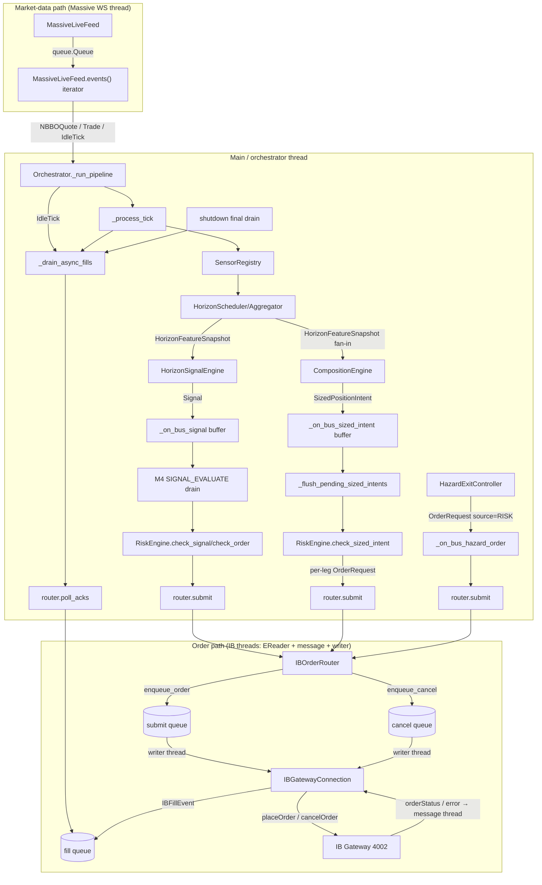

# Paper Trading Implementation Plan (IB Gateway)

> **Status: LOCKED for implementation (revision 3, final).**
> Three review passes against `HEAD`. Architecture, threading model,
> field mappings, cumulative-to-delta math, bootstrap wiring, entry-
> script ordering, and rollout sequence are frozen. Do **not** re-open
> design decisions during implementation — surface any deviation
> needed to the plan author for an explicit revision bump.
> Implementation proceeds strictly in the §15 rollout order; each PR
> stands on its own and must keep BACKTEST Level-1 through Level-5
> determinism hashes byte-identical (Inv-5).

## 1. Goal & Scope

Make `mode: PAPER` runnable end-to-end. Market data continues to flow
through `MassiveLiveFeed` (better L1 than IB's snapshot feed and
already integrated with the data-integrity layer); orders route to
**Interactive Brokers Gateway paper account** via the official `ibapi`
TWS API. The shared core (sensors → horizon snapshots → SIGNAL engine →
composition engine → risk engine → orchestrator) is reused unchanged.
The only mode-specific surface is `ExecutionBackend` (Inv-9).

**Out of scope** (deliberately deferred):

- Live mode (`run_live`, port 4001, kill-switch hardening) — `IBOrderRouter`
  is designed to be reusable, but live-specific safety controls live in a
  separate workstream.
- IB reconnection / failover (initial implementation connects once;
  `MassiveLiveFeed` already has reconnect-with-backoff).
- Position reconciliation against IB's portfolio view (paper uses the
  in-process `MemoryPositionStore` only).
- Multi-leg / complex order types (only single-leg MKT/LMT equity).
- Order-staleness watchdog (better as a risk-engine concern).
- Hardening `_emergency_flatten_all` for async fills (acceptable for paper;
  must be hardened before live).

---

## 2. Current State Snapshot (as of HEAD)

Confirmed by direct inspection of the repo. Treat this as the source of
truth — the previous plan revision had drifted from it.

### Already done (do not re-do)

| Item | Evidence |
|------|----------|
| `OperatingMode.PAPER`, YAML `mode: PAPER` parse | `src/feelies/core/platform_config.py:35-38` |
| `MacroState.PAPER_TRADING_MODE` + transitions (→ READY / RISK_LOCKDOWN / DEGRADED), included in `TRADING_MODES` | `src/feelies/kernel/macro.py:35,70-74,93-97` |
| `Orchestrator.run_paper()` (G2 → PAPER_TRADING_MODE → `_run_pipeline` → READY/DEGRADED) | `src/feelies/kernel/orchestrator.py:843-875` |
| `WallClock` selected for non-BACKTEST modes | `src/feelies/bootstrap.py:490-493` |
| `MassiveLiveFeed` full WS client (start/stop, reconnect, normaliser, bounded queue) | `src/feelies/ingestion/massive_ws.py` |
| Order SM: `ACKNOWLEDGED → CANCELLED`, `PARTIALLY_FILLED → CANCELLED`, `ACKNOWLEDGED → REJECTED` (post-ack risk-reject) | `src/feelies/execution/order_state.py:41-61` |
| `_reconcile_resting_fills` is **unconditional** at tick start (no `_use_passive_entries` gate) | `src/feelies/kernel/orchestrator.py:1606` |
| `cancel_order()` invokes `getattr(router, "cancel_order", None)`, polls, and reconciles; falls back to local CANCELLED + WARNING alert when missing | `src/feelies/kernel/orchestrator.py:3140-3198` |
| `_poll_order_router_acks(expected_order_ids)` with deferred-ack buffer (`_deferred_router_acks`) | `src/feelies/kernel/orchestrator.py:3249-3279` |
| `PassiveLimitOrderRouter.cancel_order(order_id) -> bool` | `src/feelies/execution/passive_limit_router.py:619-642` |
| `shutdown()` resolves stale `CANCEL_REQUESTED → CANCELLED` and prunes terminals (still missing the final `poll_acks` drain — see §4.3) | `src/feelies/kernel/orchestrator.py:1033-1087` |

### Still missing (this plan's deliverables)

- No `src/feelies/broker/` package; no IB adapter at all.
- `src/feelies/execution/paper_router.py` is a fail-fast stub (delete).
- No `paper_backend.py` / `build_paper_backend()`.
- `bootstrap._create_backend(mode=PAPER)` raises `NotImplementedError`
  (`src/feelies/bootstrap.py:627-630`).
- `PlatformConfig` has no `ib_host` / `ib_port` / `ib_client_id` /
  `massive_ws_url` fields.
- `MassiveLiveFeed.events()` swallows the 1 s `queue.Empty` and loops
  silently (`src/feelies/ingestion/massive_ws.py:91-100`). No `IdleTick`.
- `Orchestrator._run_pipeline` only handles `NBBOQuote` / `Trade`
  (`src/feelies/kernel/orchestrator.py:1100-1108`). No fill-pump on idle.
- `shutdown()` does not drain `poll_acks()` a final time.
- `_has_pending_order_for_symbol` guard at line 1940 is still gated on
  `self._use_passive_entries`; PORTFOLIO (`_flush_pending_sized_intents`,
  line 1264) has no per-symbol pending guard at all. (Hazard-exit
  path, `_on_bus_hazard_order` line 4062, is deliberately exempt — see
  §4.4.)
- `scripts/run_paper.py` does not exist.
- `tests/broker/` does not exist.
- No `ib` optional dependency group.

### Architectural changes since the previous plan revision

The previous revision's architecture diagram showed
`FeatureEngine → SignalEngine → RiskEngine`. **That path was retired in
D.2.** Today, three asynchronous order-ingress paths reach the router:

1. **SIGNAL path** — `HorizonSignalEngine` publishes `Signal` on the bus
   → `Orchestrator._on_bus_signal` buffers → M4 `SIGNAL_EVALUATE` drain
   → risk → `OrderRequest` → `router.submit` (inside `_process_tick_inner`).
2. **PORTFOLIO path** — `CompositionEngine` publishes
   `SizedPositionIntent` on the bus → `_on_bus_sized_intent` buffers →
   `_flush_pending_sized_intents` (M5–M10, called between
   `CROSS_SECTIONAL` and `FEATURE_COMPUTE`) → `check_sized_intent` →
   per-leg `router.submit`.
3. **Hazard-exit path** — `HazardExitController` publishes an
   `OrderRequest` → `_on_bus_hazard_order` (`source_layer == "RISK"`,
   `reason ∈ {"HAZARD_SPIKE","HARD_EXIT_AGE"}`) → defensive
   `check_order` → `router.submit`.

The IB integration must serve **all three** ingress paths uniformly.
Every recommendation below is informed by that fact.

---

## 3. Architecture

### 3.1 Threading model

Five threads, four queues (`MassiveLiveFeed._queue`, `_submit_queue`,
`_cancel_queue`, `_fill_queue`). The EventBus has no locks and **must
remain single-threaded** (main / orchestrator thread only).

| Thread | Owner | Responsibility |
|--------|-------|---------------|
| Main / orchestrator | `Orchestrator._run_pipeline` | Iterates `MassiveLiveFeed.events()`; runs micro SM; calls `router.submit / poll_acks / cancel_order`; publishes to bus. |
| Massive WS | `MassiveLiveFeed._run_loop` | asyncio loop reading WS frames, normalising, putting `NBBOQuote / Trade` (or `_SENTINEL`) on `MassiveLiveFeed._queue`. |
| IB EReader (ibapi-owned) | spawned by `EClient.connect()` | Reads raw bytes off the TWS socket; pushes decoded messages onto ibapi's internal `msg_queue`. Owned by ibapi; we never touch it. |
| IB message thread | `_msg_thread` runs `self.run()` (ibapi's blocking dispatch loop) | Drains ibapi's `msg_queue` and invokes `EWrapper` callbacks (`nextValidId`, `orderStatus`, `error`); enqueues `IBFillEvent` on `_fill_queue`. |
| IB writer thread | `_writer_thread` runs `_drain_writer_queues` | Drains `_submit_queue` and `_cancel_queue`; only thread that calls `EClient.placeOrder` / `cancelOrder` (socket-writer exclusivity). |

**Cross-thread communication is exclusively via `queue.Queue`.** No IB
callback ever touches the EventBus, the position store, or any
orchestrator state. The orchestrator polls the IB fill queue (via
`IBOrderRouter.poll_acks`) on three triggers, all routed through the
new `_drain_async_fills` helper (§4.1): tick start (existing
`_reconcile_resting_fills` delegates to it), idle (§4.2), and shutdown
(§4.3).

### 3.2 Component diagram



**Key invariants on this picture:**

- `EClient.placeOrder` / `cancelOrder` are called **only** from the IB
  writer thread (`_writer_thread`). The orchestrator never touches the
  socket directly.
- IB `EWrapper` callbacks (on the IB message thread) **never** publish
  to the bus or mutate orchestrator state — they only enqueue onto
  `_fill_queue`.
- Only the main thread drains `_fill_queue` (via `poll_acks`) and only
  the main thread publishes `OrderAck` events to the bus.

---

## 4. Orchestrator Changes

Six small surgical edits (4.1–4.6), deliberately additive. Each is
independently testable; after every one the existing BACKTEST
determinism hashes (Level-1 through Level-5) stay byte-identical.
4.4 is the only edit that touches the SIGNAL path; 4.5 / 4.6 are
documentation-only summaries of work already partially landed.

### 4.1 Shared `_drain_async_fills` helper

Introduce a single private helper that owns the body currently
duplicated across `_reconcile_resting_fills` and the future shutdown /
idle paths:

```python
def _drain_async_fills(self, correlation_id: str) -> None:
    """Drain pending router acks and reconcile fills.

    The single source of truth for async fill processing. Called from
    three triggers:
      - Tick start (via `_reconcile_resting_fills`, line 3376) — quote-
        driven fills from BacktestOrderRouter / PassiveLimitOrderRouter
        / IBOrderRouter (the latter pushes asynchronously, so this is
        the dominant path for paper).
      - IdleTick (§4.2) — WS feed idle; no signal pipeline runs.
      - Shutdown (§4.3) — final drain so a fill between the last quote
        and the operator's halt is not dropped.

    Does NOT transition the micro SM and does NOT touch the macro SM.
    Routes through `_poll_order_router_acks()` so the deferred-ack
    buffer (`_deferred_router_acks`) is honoured.
    """
    acks = self._poll_order_router_acks()
    if not acks:
        return
    for ack in acks:
        self._bus.publish(ack)
        self._apply_ack_to_order(ack)
    self._reconcile_fills(acks, correlation_id)
```

Rewrite the existing `_reconcile_resting_fills(cid)` body
(`orchestrator.py:3376-3391`) as a one-liner delegating to
`_drain_async_fills(cid)`. The two trigger names are kept distinct so
metric / log attribution stays grep-friendly, but the body is shared
— a single behavioural change to fill reconciliation now lands
everywhere automatically.

### 4.2 `IdleTick` fill-pump (issue C1)

**Problem.** Without this, `_drain_async_fills` only fires when the WS
yields a quote. If MassiveLiveFeed is quiet (illiquid symbol,
off-hours, connectivity blip) IB fills sit in `_fill_queue` forever.

**Fix.** Yield an `IdleTick` from `MassiveLiveFeed.events()` on its 1 s
`queue.Empty` and add a dedicated branch in `_run_pipeline`
(`orchestrator.py:1091-1108`):

```python
def _run_pipeline(self) -> None:
    for event in self._backend.market_data.events():
        if self._pipeline_abort_requested:
            break
        if self._macro.state not in TRADING_MODES:
            break
        if isinstance(event, NBBOQuote):
            self._process_tick(event)
        elif isinstance(event, Trade):
            self._process_trade(event)
        elif isinstance(event, IdleTick):
            self._drain_async_fills(correlation_id=f"idle:{event.timestamp_ns}")
    if self._pipeline_abort_requested:
        raise OrchestratorPipelineAbortError(...)
```

The `IdleTick` branch does **not** advance the micro SM (it stays at
`WAITING_FOR_MARKET_EVENT` between ticks) and does **not** publish the
`IdleTick` to the bus or the EventLog.

**Side benefit:** `IdleTick`'s 1 s cadence is also the upper bound on
`halt()` responsiveness — without IdleTick, a `queue.get(timeout=1.0)`
in MassiveLiveFeed.events() blocks the main thread for the whole
second before re-checking `self._macro.state not in TRADING_MODES`.

**`IdleTick` is NOT an `Event`.** It is a data-path control signal —
never published to the bus, never logged to `EventLog`, never carries
a correlation id or sequence. Define it in
`src/feelies/ingestion/idle_tick.py`:

```python
@dataclass(frozen=True, slots=True)
class IdleTick:
    """Sentinel yielded by live feeds when no data arrives within timeout.
    Not an Event — never published to bus, never logged."""
    timestamp_ns: int
```

`MarketDataSource.events()` widens to
`Iterator[NBBOQuote | Trade | IdleTick]`. `ReplayFeed.events()` keeps
its narrower `Iterator[NBBOQuote | Trade]` return — yielding a subset
of the union satisfies the Protocol (LSP / contravariance). Mypy
strict will require the orchestrator's `if/elif/elif` chain to be
exhaustive; the existing pattern already is.

### 4.3 Final fill drain in `shutdown()` (issue M3)

Add a single call at the very top of `shutdown()`
(`orchestrator.py:1033-1087`), before `_checkpoint_feature_snapshots`
and the `CANCEL_REQUESTED → CANCELLED` resolution:

```python
def shutdown(self) -> None:
    if self._backend is not None:                   # defensive
        self._drain_async_fills(correlation_id="shutdown")
    self._checkpoint_feature_snapshots()
    ...
```

The defensive `self._backend is not None` check is for tests that
construct a partial orchestrator; production paths always have a
backend.

### 4.4 Generalise the pending-order guard (issue M4)

**Current code** (`orchestrator.py:1940-1962`):

```python
if (
    self._use_passive_entries
    and intent.signal.strategy_id != "__stop_exit__"
    and self._has_pending_order_for_symbol(order.symbol)
):
    ...
```

The `_use_passive_entries` clause is wrong for paper trading: IB fills
arrive asynchronously regardless of execution mode. Drop it:

```python
if (
    intent.signal.strategy_id != "__stop_exit__"
    and self._has_pending_order_for_symbol(order.symbol)
):
    ...
```

`__stop_exit__` and `TradingIntent.EXIT` already bypass the guard so a
flatten can always race in (Inv-11). The exit-already-resting check
(`_has_pending_exit_for_symbol`, line 3207) is unchanged.

**Extend to the PORTFOLIO path.** In `_flush_pending_sized_intents`
(`orchestrator.py:1264-1369`), filter the per-leg order list at line
1339, just before the `for order in orders` submit loop:

```python
orders_to_submit = []
for order in orders:
    if self._has_pending_order_for_symbol(order.symbol):
        self._bus.publish(Alert(
            ...,
            alert_name="portfolio_leg_skipped_pending_order",
            severity=AlertSeverity.WARNING,
            ...
        ))
        continue
    orders_to_submit.append(order)
orders = orders_to_submit
if not orders:
    self._micro.transition(MicroState.LOG_AND_METRICS, ...)
    continue
```

**Documented limitation:** the PORTFOLIO path has no native
"supersede-pending" logic — when a later boundary's cross-sectional
weights differ materially from the still-pending earlier intent, the
later legs are skipped rather than cancelling-and-replacing. This is a
conservative paper-trading default; the live-mode workstream owns the
supersede semantics.

**Hazard-exit path** — **do NOT add a per-symbol guard.** Hazard exits
are Inv-11 exit-only and should not be blocked by an unrelated pending
order on the same symbol (e.g. an entry waiting on IB ack while the
hazard detector wants to flatten). The existing
`_hazard_submitted_order_ids` set in `_on_bus_hazard_order`
(`orchestrator.py:4104-4106`) already provides per-order-id idempotency,
which is the right semantic for hazard exits (one episode → one
order). The plan's earlier draft incorrectly conflated these two
concerns — the SIGNAL/PORTFOLIO double-submit bug does not exist for
hazard exits because `HazardExitController` emits at most one
`OrderRequest` per `(symbol, episode, reason)` already.

### 4.5 Order-router `cancel_order` convention (issue M2 — already partially done)

The orchestrator already invokes `getattr(self._backend.order_router,
"cancel_order", None)` and reconciles the resulting acks
(`orchestrator.py:3140-3198`). **No protocol change required.**
Document the convention in `src/feelies/execution/backend.py`:

```python
class OrderRouter(Protocol):
    def submit(self, request: OrderRequest) -> None: ...
    def poll_acks(self) -> list[OrderAck]: ...
    # Optional, duck-typed:
    # def cancel_order(self, order_id: str) -> bool
    # Implementations that support broker-initiated cancel define
    # `cancel_order`. Absence is explicit (no NotImplementedError);
    # orchestrator resolves locally with a `cancel_order_router_unsupported`
    # WARNING alert and an immediate local CANCELLED transition.
```

`IBOrderRouter` **must** implement `cancel_order`. `BacktestOrderRouter`
deliberately does not (orchestrator falls back to local cancel — fine
for backtests).

### 4.6 Bootstrap-returned handles

`_create_backend` currently returns `(backend, router)`. For PAPER, the
caller needs the `MassiveLiveFeed` handle (start/stop) and the
`IBGatewayConnection` handle (connect/disconnect). Choose a small
private dataclass over storing handles on the orchestrator: it
localises the change inside bootstrap, keeps the `Orchestrator` ctor
surface stable, and is greppable. Concrete shape and call-site rewrite
in §7.

---

## 5. New Package: `src/feelies/broker/ib/`

All IB-specific code lives here. The execution layer continues to
import only `OrderRouter` / `ExecutionBackend` — never `ibapi`.

### 5.1 `connection.py` — `IBGatewayConnection`

```python
class IBGatewayConnection(EWrapper, EClient):
    """Threaded TWS API connection with thread-safe queues.

    Thread layout (4 threads, see §3.1 table):
      - **EReader** (ibapi-owned) reads bytes off the socket and pushes
        decoded messages onto ibapi's internal `msg_queue`.
      - **Message thread** (`_msg_thread`) runs `self.run()` and invokes
        the `EWrapper` callbacks (`orderStatus`, `error`, `nextValidId`,
        ...). Populates `_fill_queue`.
      - **Writer thread** (`_writer_thread`) drains `_submit_queue` and
        `_cancel_queue`. The only thread that calls `EClient.placeOrder`
        / `cancelOrder` — `EClient` is not documented as thread-safe
        and the socket writer has no internal lock, so socket-write
        exclusivity is enforced here.
      - **Main / orchestrator** thread only ever calls `enqueue_*`,
        `poll_fills`, `next_order_id`, and the lifecycle methods.
    """

    def __init__(self, *, host: str, port: int, client_id: int, clock: Clock) -> None:
        EClient.__init__(self, wrapper=self)
        # nextValidId handshake — `next_order_id()` blocks until set.
        self._next_id_ready = threading.Event()
        self._next_valid_id: int | None = None
        self._next_id_lock = threading.Lock()
        # Submission + cancel queues (drained on writer thread).
        self._submit_queue: queue.Queue[tuple[int, Contract, IBOrder]] = queue.Queue()
        self._cancel_queue: queue.Queue[int] = queue.Queue()
        # Fill queue (drained from main thread via poll_fills).
        self._fill_queue: queue.Queue[IBFillEvent] = queue.Queue()
        self._clock = clock
        self._host, self._port, self._client_id = host, port, client_id
        self._msg_thread: threading.Thread | None = None      # runs self.run()
        self._writer_thread: threading.Thread | None = None   # runs _drain_writer_queues
        self._shutdown_event = threading.Event()

    # ── Lifecycle (main thread) ────────────────────────────────
    def connect_and_start(self, *, ready_timeout_s: float = 10.0) -> None:
        """Connect, spawn message + writer threads, block until
        `nextValidId` arrives.

        Raises `RuntimeError("IB connection not ready: nextValidId not received")`
        if the handshake does not complete within `ready_timeout_s`.
        """
        self.connect(self._host, self._port, self._client_id)
        # EReader is spawned by EClient.connect() itself. We add two
        # daemon threads on top.
        self._msg_thread = threading.Thread(
            target=self.run, name="ib-msg", daemon=True,
        )
        self._writer_thread = threading.Thread(
            target=self._drain_writer_queues, name="ib-writer", daemon=True,
        )
        self._msg_thread.start()
        self._writer_thread.start()
        if not self._next_id_ready.wait(ready_timeout_s):
            self.disconnect_and_stop()
            raise RuntimeError(
                "IB connection not ready: nextValidId not received within "
                f"{ready_timeout_s}s"
            )

    def disconnect_and_stop(self) -> None:
        """Signal both threads to exit, disconnect, join.

        Order matters: set the shutdown flag first so the writer thread
        stops pulling from the submit/cancel queues; then `disconnect()`
        which causes ibapi's `run()` to return (EReader closes the
        socket and pushes a poison message); finally join both threads
        with a bounded timeout (5s) so an unresponsive socket cannot
        wedge `shutdown()` indefinitely.
        """
        ...

    def is_connected(self) -> bool: ...

    # ── Submission API (main thread, thread-safe) ──────────────
    def enqueue_order(self, ib_order_id: int, contract: Contract, order: IBOrder) -> None:
        self._submit_queue.put((ib_order_id, contract, order))
    def enqueue_cancel(self, ib_order_id: int) -> None:
        self._cancel_queue.put(ib_order_id)

    # ── Fill collection (main thread) ──────────────────────────
    def poll_fills(self) -> list[IBFillEvent]:
        """Drain `_fill_queue`. Thread-safe (queue.Queue is thread-safe)."""
        out: list[IBFillEvent] = []
        while True:
            try:
                out.append(self._fill_queue.get_nowait())
            except queue.Empty:
                return out

    # ── Order-id allocation (main thread, thread-safe) ─────────
    def next_order_id(self) -> int:
        """Monotonic IB integer order id, atomically incremented.

        Raises RuntimeError if `nextValidId` has not been received yet
        (caller must `connect_and_start` first).
        """
        with self._next_id_lock:
            if self._next_valid_id is None:
                raise RuntimeError(
                    "IB connection not ready: nextValidId not received. "
                    "Call connect_and_start() before submitting orders."
                )
            oid = self._next_valid_id
            self._next_valid_id += 1
            return oid

    # ── Writer loop (writer thread) ────────────────────────────
    # `connect_and_start` spawned `_writer_thread` to run this method.
    # The only place `placeOrder` / `cancelOrder` is ever called.
    # ibapi has no global lock; the only true thread hazard is the
    # socket writer, which is exclusive to this thread.

    def _drain_writer_queues(self) -> None:
        while not self._shutdown_event.is_set():
            try:
                ib_id, contract, order = self._submit_queue.get(timeout=0.05)
                self.placeOrder(ib_id, contract, order)
                continue
            except queue.Empty:
                pass
            try:
                ib_id = self._cancel_queue.get_nowait()
                self.cancelOrder(ib_id, "")  # ibapi >= 10.x signature
            except queue.Empty:
                pass

    # ── EWrapper callbacks (message thread → _fill_queue) ──────
    def nextValidId(self, orderId: int) -> None:
        with self._next_id_lock:
            self._next_valid_id = orderId
        self._next_id_ready.set()

    def orderStatus(self, orderId, status, filled, remaining, avgFillPrice,
                    permId, parentId, lastFillPrice, clientId,
                    whyHeld, mktCapPrice) -> None:
        self._fill_queue.put(IBFillEvent(
            ib_order_id=orderId,
            status=status,
            cumulative_filled=int(filled),    # ibapi >= 10.x may pass Decimal
            remaining=int(remaining),
            avg_fill_price=float(avgFillPrice),
            timestamp_ns=self._clock.now_ns(),
        ))

    def error(self, reqId, errorCode, errorString, advancedOrderRejectJson="") -> None:
        # Only forward order-scoped errors (reqId is the ib_order_id when
        # the message originated from a placeOrder/cancelOrder). Connectivity
        # errors (reqId == -1) are logged but not propagated as fills —
        # the router maps known error codes via the table in §5.3.
        if reqId < 0:
            logger.warning("ib error (no order): %s %s", errorCode, errorString)
            return
        self._fill_queue.put(IBFillEvent(
            ib_order_id=reqId,
            status="error",
            cumulative_filled=0,
            remaining=0,
            avg_fill_price=0.0,
            timestamp_ns=self._clock.now_ns(),
            error_code=int(errorCode),
            error_msg=str(errorString),
        ))
```

Internal event:

```python
@dataclass(frozen=True, slots=True)
class IBFillEvent:
    ib_order_id: int
    status: str              # "PreSubmitted" | "Submitted" | "Filled" | "Cancelled" | "Inactive" | "error"
    cumulative_filled: int   # IB sends cumulative; router converts to delta
    remaining: int
    avg_fill_price: float    # cumulative VWAP; router converts to per-delta price
    timestamp_ns: int
    error_code: int | None = None
    error_msg: str | None = None
```

### 5.2 `contracts.py` — Contract construction

```python
def stock_contract(symbol: str, *, exchange: str = "SMART",
                   currency: str = "USD", primary_exchange: str | None = None) -> Contract:
    c = Contract()
    c.symbol = symbol
    c.secType = "STK"
    c.exchange = exchange
    c.currency = currency
    if primary_exchange:
        c.primaryExchange = primary_exchange   # required for SMART when symbol ambiguous
    return c
```

### 5.3 `router.py` — `IBOrderRouter`

Implements the `OrderRouter` protocol (plus duck-typed `cancel_order`).
Mirrors the structure of `BacktestOrderRouter` so the orchestrator's
order-lifecycle path stays bit-identical (Inv-9): each `submit`
synchronously enqueues a single `ACKNOWLEDGED` `OrderAck` on the
router's pending-acks list, and broker-side status callbacks land on a
shared deferred fill queue that `poll_acks()` drains.

**Field mapping `OrderRequest → ibapi.order.Order`:**

| `OrderRequest` field | `ibapi.Order` assignment |
|----------------------|--------------------------|
| `symbol` | `contract = stock_contract(symbol)` |
| `side == Side.BUY` | `order.action = "BUY"` |
| `side == Side.SELL` | `order.action = "SELL"` |
| `order_type == OrderType.MARKET` | `order.orderType = "MKT"` |
| `order_type == OrderType.LIMIT` | `order.orderType = "LMT"`, `order.lmtPrice = float(request.limit_price)` |
| `quantity` (int) | `order.totalQuantity = Decimal(str(request.quantity))` — ibapi ≥ 10.19 uses `Decimal` for totalQuantity |
| (default) | `order.tif = "DAY"` |
| (always) | `order.eTradeOnly = False`, `order.firmQuoteOnly = False` — required defaults for ibapi ≥ 10.x; missing them rejects every order with `Error 10268` |

**Per-order metadata.** `submit(request)` is the only place where IB
order-id allocation, mapping, and bookkeeping happen. The router
stores everything it needs to reconstruct an `OrderAck` later:

```python
@dataclass(frozen=True)
class _IBOrderMeta:
    platform_id: str
    symbol: str
    correlation_id: str
    request_sequence: int
    total_quantity: int
    strategy_id: str

class IBOrderRouter:
    def __init__(self, *, connection: IBGatewayConnection, clock: Clock) -> None:
        self._connection = connection
        self._clock = clock
        self._ack_seq = SequenceGenerator()        # mirrors BacktestOrderRouter
        self._pending_acks: list[OrderAck] = []    # immediate submit ACKs
        self._meta: dict[int, _IBOrderMeta] = {}   # ib_id → metadata
        self._platform_to_ib: dict[str, int] = {}
        self._last_cumulative: dict[int, int] = {} # ib_id → cumulative filled
        self._last_cum_value: dict[int, Decimal] = {}  # ib_id → cum_filled * avg_price
        self._has_acked: dict[int, bool] = {}      # ib_id → ACKNOWLEDGED emitted?
        self._submitted_order_ids: set[str] = set()

    def submit(self, request: OrderRequest) -> None:
        # Duplicate-submission guard mirrors BacktestOrderRouter (Inv-11).
        if request.order_id in self._submitted_order_ids:
            self._pending_acks.append(OrderAck(
                timestamp_ns=self._clock.now_ns(),
                correlation_id=request.correlation_id,
                sequence=self._ack_seq.next(),
                order_id=request.order_id,
                symbol=request.symbol,
                status=OrderAckStatus.REJECTED,
                reason=f"duplicate order_id: {request.order_id}",
                request_sequence=request.sequence,
            ))
            return
        self._submitted_order_ids.add(request.order_id)

        ib_id = self._connection.next_order_id()
        self._meta[ib_id] = _IBOrderMeta(
            platform_id=request.order_id,
            symbol=request.symbol,
            correlation_id=request.correlation_id,
            request_sequence=request.sequence,
            total_quantity=request.quantity,
            strategy_id=request.strategy_id,
        )
        self._platform_to_ib[request.order_id] = ib_id

        contract = stock_contract(request.symbol)
        order = self._build_ib_order(request)
        self._connection.enqueue_order(ib_id, contract, order)

        # Emit the synchronous ACKNOWLEDGED ack so the order SM walks
        # SUBMITTED → ACKNOWLEDGED on the same tick as submit (parity
        # with BacktestOrderRouter:201). IB's PreSubmitted/Submitted
        # callbacks arrive later but are deduped by `_has_acked`.
        self._pending_acks.append(OrderAck(
            timestamp_ns=self._clock.now_ns(),
            correlation_id=request.correlation_id,
            sequence=self._ack_seq.next(),
            order_id=request.order_id,
            symbol=request.symbol,
            status=OrderAckStatus.ACKNOWLEDGED,
            request_sequence=request.sequence,
        ))
        self._has_acked[ib_id] = True

    def cancel_order(self, order_id: str) -> bool:
        ib_id = self._platform_to_ib.get(order_id)
        if ib_id is None:
            return False
        self._connection.enqueue_cancel(ib_id)
        return True
```

**Cumulative-to-delta conversion (critical — two bugs to avoid).** IB's
`orderStatus` callback sends **cumulative** values: `filled` is the
total shares filled so far, `avgFillPrice` is the cumulative
volume-weighted average. The orchestrator's `_reconcile_fills`
(`orchestrator.py:3572-3700`) treats each `OrderAck.filled_quantity`
as a **per-ack delta** and each `OrderAck.fill_price` as the price of
**that delta only**. Mishandling either side is a silent correctness bug:

- **Quantity bug:** emit `delta = current_cumulative - last_cumulative`,
  not `current_cumulative` itself (or positions double-count).
- **Price bug:** the per-delta price is **not** `avgFillPrice`. The
  correct per-delta VWAP is
  `(cum_new * avg_new - cum_prev * avg_prev) / delta`.
  Emitting `avgFillPrice` skews PnL — over a 2-leg fill at 100/101 the
  second delta's price would be reported as 100.5 instead of 101.

```python
def poll_acks(self) -> list[OrderAck]:
    out = list(self._pending_acks)
    self._pending_acks.clear()
    for fill in self._connection.poll_fills():
        ib_id = fill.ib_order_id
        meta = self._meta.get(ib_id)
        if meta is None:
            continue                              # not ours; ignore

        # Convert connectivity-error callbacks to alerts, drop the ack.
        if fill.error_code in {1100, 1101, 1102, 2110}:
            self._emit_connectivity_alert(meta, fill)
            continue

        status = self._map_status(fill)

        prev_qty = self._last_cumulative.get(ib_id, 0)
        delta_qty = fill.cumulative_filled - prev_qty
        if delta_qty < 0:
            self._emit_anomaly_alert(meta, fill, prev_qty)
            continue

        # Compute per-delta price *before* mutating _last_cum_value.
        prev_value = self._last_cum_value.get(ib_id, Decimal("0"))
        new_avg = Decimal(str(fill.avg_fill_price))
        new_value = new_avg * Decimal(fill.cumulative_filled)
        delta_value = new_value - prev_value
        per_delta_price: Decimal | None = (
            (delta_value / Decimal(delta_qty)) if delta_qty > 0 else None
        )

        self._last_cumulative[ib_id] = fill.cumulative_filled
        self._last_cum_value[ib_id] = new_value

        # ACKNOWLEDGED is emitted at submit-time; suppress the IB callback
        # for it. PreSubmitted / Submitted with delta_qty == 0 → drop.
        if status == OrderAckStatus.ACKNOWLEDGED:
            continue

        # Fill statuses with no new quantity are status-only redundancies.
        if status in (OrderAckStatus.FILLED, OrderAckStatus.PARTIALLY_FILLED) and delta_qty == 0:
            continue

        # Decide FILLED vs PARTIALLY_FILLED from cumulative vs total.
        if status == OrderAckStatus.FILLED and fill.cumulative_filled < meta.total_quantity:
            status = OrderAckStatus.PARTIALLY_FILLED

        out.append(OrderAck(
            timestamp_ns=fill.timestamp_ns,
            correlation_id=meta.correlation_id,
            sequence=self._ack_seq.next(),
            order_id=meta.platform_id,
            symbol=meta.symbol,
            status=status,
            filled_quantity=delta_qty,
            fill_price=per_delta_price,
            request_sequence=meta.request_sequence,
        ))

        # Prune metadata only on terminal ack types — leaves room for
        # follow-up cancel/expiry to land before GC.
        if status in (OrderAckStatus.CANCELLED, OrderAckStatus.REJECTED, OrderAckStatus.EXPIRED):
            self._meta.pop(ib_id, None)
        elif status == OrderAckStatus.FILLED:
            self._meta.pop(ib_id, None)
    return out
```

**Status mapping** (`_map_status`):

| Source signal | `OrderAckStatus` |
|---------------|------------------|
| `status == "PreSubmitted"` or `"Submitted"` | `ACKNOWLEDGED` (suppressed in `poll_acks` because submit emits it) |
| `status == "Filled"` and `cumulative_filled >= total_quantity` | `FILLED` |
| `status == "Filled"` and `cumulative_filled < total_quantity` | `PARTIALLY_FILLED` (downgraded) |
| `status == "Cancelled"` or `"ApiCancelled"` | `CANCELLED` |
| `status == "Inactive"` | `REJECTED` |
| `error_code == 201` (order rejected) | `REJECTED` |
| `error_code == 202` (order cancelled) | `CANCELLED` |
| `error_code ∈ {1100, 1101, 1102, 2110}` (connectivity loss/restore) | dropped; routed to fill queue as an alert payload; main thread publishes the `Alert` |

**Fee mapping (deferred).** IB returns commissions via `commissionReport`
on a separate `EWrapper` callback (`commissionReport(execution, ...)`),
keyed by `executionId`. Wiring `OrderAck.fees` and `OrderAck.cost_bps`
from this stream is out of scope for the first paper PR — fees default
to `Decimal("0")` and `cost_bps` to `Decimal("0")`. Post-trade
forensics will under-report fees in paper mode until this is wired;
acceptable for paper (no real capital), tracked as a follow-up before
LIVE.

**`cancel_order(order_id: str) -> bool`** — see the snippet above.
Returns `True` for any known platform id; the synchronous behaviour
inside the orchestrator's `cancel_order` (line 3140) does not depend on
the eventual broker `CANCELLED` ack, so the local SM transitions
through `CANCEL_REQUESTED` immediately and resolves to `CANCELLED`
when the ack arrives via the next `poll_acks` (idle or quote).

### 5.4 `__init__.py` exports

```python
from feelies.broker.ib.connection import IBGatewayConnection, IBFillEvent
from feelies.broker.ib.contracts import stock_contract
from feelies.broker.ib.router import IBOrderRouter
__all__ = ["IBGatewayConnection", "IBFillEvent", "IBOrderRouter", "stock_contract"]
```

---

## 6. `paper_backend.py` — Factory

The normalizer is a **shared** dependency: `MassiveLiveFeed` needs it
to convert raw WS frames into typed events; the orchestrator needs the
same instance for `DataHealth` gating (`orchestrator.py:4160-4177`).
Bootstrap builds it once and threads it into both consumers — see §7.

```python
def build_paper_backend(
    *,
    massive_api_key: str,
    symbols: Sequence[str],
    clock: Clock,
    normalizer: MassiveNormalizer,            # shared with orchestrator
    ib_host: str = "127.0.0.1",
    ib_port: int = 4002,
    ib_client_id: int = 1,
    massive_ws_url: str = "wss://socket.massive.com/stocks",
) -> tuple[ExecutionBackend, MassiveLiveFeed, IBGatewayConnection]:
    live_feed = MassiveLiveFeed(
        api_key=massive_api_key,
        symbols=symbols,
        normalizer=normalizer,
        clock=clock,
        ws_url=massive_ws_url,
    )
    ib_conn = IBGatewayConnection(
        host=ib_host, port=ib_port, client_id=ib_client_id, clock=clock,
    )
    router = IBOrderRouter(connection=ib_conn, clock=clock)
    backend = ExecutionBackend(
        market_data=live_feed,
        order_router=router,
        mode=ExecutionMode.PAPER,
    )
    return backend, live_feed, ib_conn
```

Delete `src/feelies/execution/paper_router.py` (stub no longer
needed).

---

## 7. Bootstrap Wiring

Edit `src/feelies/bootstrap.py`. The only existing `_create_backend`
call site is at line 310 (`backend, backtest_router = _create_backend(
config.mode, event_log, clock, ...)`). All edits below are anchored to
that.

1. **Widen `_create_backend` return** to a small private bundle dataclass:

   ```python
   @dataclass(frozen=True)
   class _BackendBundle:
       backend: ExecutionBackend
       backtest_router: BacktestOrderRouter | PassiveLimitOrderRouter | None
       live_feed: MassiveLiveFeed | None = None
       ib_connection: IBGatewayConnection | None = None
   ```

   Replace the line-310 call site with:

   ```python
   bundle = _create_backend(
       config.mode, event_log, clock,
       fill_latency_ns=config.backtest_fill_latency_ns,
       ...
       normalizer=normalizer,                # NEW: thread it through
       config=config,                        # NEW: paper branch needs ib_* fields
   )
   backend = bundle.backend
   backtest_router = bundle.backtest_router
   ```

   The existing `if backtest_router is not None` guard at line 322
   continues to skip `NBBOQuote → on_quote` subscription for PAPER.

2. **Construct (or reuse) the normalizer at bootstrap top.** Move the
   normalizer-construction decision in front of `_create_backend` so
   the same instance reaches both the live feed and the orchestrator:

   ```python
   # PAPER / LIVE always need a normalizer (for DataHealth gating +
   # WS frame decoding). When the caller supplies one (tests, custom
   # ingestors) we use it; otherwise we build the canonical one.
   if normalizer is None and config.mode in (OperatingMode.PAPER, OperatingMode.LIVE):
       normalizer = MassiveNormalizer(clock=clock)
   ```

3. **Add the `PAPER` branch** inside `_create_backend`:

   ```python
   if mode == OperatingMode.PAPER:
       api_key = os.environ.get("MASSIVE_API_KEY")
       if not api_key:
           raise ConfigurationError(
               "MASSIVE_API_KEY env var is required for OperatingMode.PAPER"
           )
       if normalizer is None:
           raise ConfigurationError(
               "PAPER mode requires a MassiveNormalizer "
               "(bootstrap auto-constructs one — this is a bug)"
           )
       backend, live_feed, ib_conn = build_paper_backend(
           massive_api_key=api_key,
           symbols=sorted(config.symbols),
           clock=clock,
           normalizer=normalizer,
           ib_host=config.ib_host,
           ib_port=config.ib_port,
           ib_client_id=config.ib_client_id,
           massive_ws_url=config.massive_ws_url,
       )
       return _BackendBundle(
           backend=backend,
           backtest_router=None,
           live_feed=live_feed,
           ib_connection=ib_conn,
       )
   ```

   The BACKTEST branch keeps returning `_BackendBundle(backend, router)`
   with `live_feed=None, ib_connection=None`.

4. **Plumb the live-feed and IB handles out of `build_platform`** so
   `scripts/run_paper.py` can drive their lifecycles. Attach them as
   attributes on the returned `Orchestrator`, mirroring how
   `config_snapshot` is attached at line 475:

   ```python
   orchestrator.config_snapshot = config_snapshot  # type: ignore[attr-defined]
   orchestrator.live_feed = bundle.live_feed          # type: ignore[attr-defined]
   orchestrator.ib_connection = bundle.ib_connection  # type: ignore[attr-defined]
   ```

   For BACKTEST runs both new attributes are `None`. The entry script
   asserts non-None before driving them.

---

## 8. Config Additions

Edit `src/feelies/core/platform_config.py`:

```python
# IB Gateway paper / live connection
ib_host: str = "127.0.0.1"
ib_port: int = 4002           # 4002 = paper, 4001 = live
ib_client_id: int = 1
# Massive WS endpoint (paper / live market-data feed)
massive_ws_url: str = "wss://socket.massive.com/stocks"
```

YAML grammar — accept either flat or nested:

```yaml
mode: PAPER
symbols: [AAPL, MSFT]

paper:
  ib_host: 127.0.0.1
  ib_port: 4002
  ib_client_id: 1
  massive_ws_url: wss://socket.massive.com/stocks
```

`from_yaml` lifts `paper.*` keys to the top-level fields if present.
Validation: when `mode == PAPER`, fail loudly if `MASSIVE_API_KEY` env
var is unset (the bootstrap branch already does this — keep it as the
single point of truth).

---

## 9. Entry Script — `scripts/run_paper.py`

```python
# Phase 1: load env + YAML config
load_dotenv()                                  # populates MASSIVE_API_KEY
config = PlatformConfig.from_yaml(args.config)
if args.symbol:
    config = replace(config, symbols=frozenset(args.symbol))

# Phase 2: compose the platform (bootstrap creates the IB connection
# and live feed but does NOT start either — only constructs).
orchestrator, config = build_platform(config)
orchestrator.boot(config)                      # macro: INIT → DATA_SYNC → READY
assert orchestrator.live_feed is not None, "PAPER mode requires a live feed"
assert orchestrator.ib_connection is not None, "PAPER mode requires an IB connection"

# Phase 3: connect IB first — `connect_and_start` blocks until
# `nextValidId` arrives (or `ready_timeout_s` elapses → RuntimeError).
# Connecting IB BEFORE the live feed guarantees `IBOrderRouter.submit`
# never races a closed socket when an early quote triggers a signal.
orchestrator.ib_connection.connect_and_start(ready_timeout_s=10.0)

# Phase 4: start the live feed (spawns the WS background thread).
orchestrator.live_feed.start()

# Phase 5: SIGINT handler — halt() flips macro out of TRADING_MODES;
# the orchestrator notices on the next IdleTick (≤ 1s) or quote.
def _on_sigint(signum: int, frame: Any) -> None:
    orchestrator.halt()
signal.signal(signal.SIGINT, _on_sigint)

# Phase 6: run.  Returns when the feed iterator exits cleanly (operator
# halt or stop_event set). Exceptions during the pipeline are surfaced
# after PAPER_TRADING_MODE → DEGRADED.
try:
    orchestrator.run_paper()
finally:
    # Phase 7: ordered teardown — stop the feed FIRST so no more
    # quotes / IdleTicks reach the pipeline, then disconnect IB so any
    # straggling fills are still in `_fill_queue` for the shutdown
    # drain to pick up. shutdown() runs `_drain_async_fills` first.
    orchestrator.live_feed.stop()
    orchestrator.ib_connection.disconnect_and_stop()
    orchestrator.shutdown()

# Phase 8: render the session report from MetricCollector + EventLog
# (reuse the helper in scripts/run_backtest.py).
print(format_session_report(orchestrator))
```

CLI surface (mirror `scripts/run_backtest.py` for consistency):

```
--config PATH        Required. platform.yaml.
--symbol SYM [SYM]   Override config.symbols.
--duration MIN       Optional wall-clock max minutes (background timer
                     thread calls orchestrator.halt() on expiry).
--log-level LEVEL    Default INFO.
```

**Connection ordering matters:** IB before Massive. If signals start
firing before IB is ready, `IBOrderRouter.submit` would call
`connection.next_order_id()` before `nextValidId` has arrived, raising
`RuntimeError("IB connection not ready")`. `connect_and_start`'s
`nextValidId` handshake is the canonical "ready" signal.

**Teardown ordering equally matters:** stop the feed first (no new
quotes / signals → no new IB submits), then disconnect IB (any
straggling fills already enqueued by the IB message thread before
disconnect remain in `_fill_queue`), then call `shutdown()` — the
first thing shutdown does is `_drain_async_fills` (§4.3), which picks
up exactly those straggling fills. Disconnecting IB **before**
stopping the feed risks `IBOrderRouter.submit` raising mid-tick.

---

## 10. `MassiveLiveFeed` Change

Single localised edit to `src/feelies/ingestion/massive_ws.py` `events()`:

```python
def events(self) -> Iterator[NBBOQuote | Trade | IdleTick]:
    while True:
        try:
            item = self._queue.get(timeout=1.0)
        except queue.Empty:
            if self._stop_event.is_set():
                return
            yield IdleTick(timestamp_ns=self._clock.now_ns())
            continue
        if item is _SENTINEL:
            return
        yield item  # type: ignore[misc]
```

Return-type annotation widens accordingly. Existing tests still pass
because they exercise the WS path (sentinel + items), not the
timeout-only path.

---

## 11. Dependency

`pyproject.toml`:

```toml
[project.optional-dependencies]
ib = ["ibapi>=10.19"]
```

The `massive` extra is already present and is **also required for
PAPER** (`MassiveLiveFeed` imports `websockets` lazily — see
`massive_ws.py:163-169`). The operator command line becomes:

```bash
uv sync --extra ib --extra massive
```

Bootstrap import of `feelies.broker.ib.*` lives behind the PAPER
branch, so a missing `ibapi` only fails when actually selecting paper
mode. Mypy strict scope (`[tool.mypy] strict = true` on
`src/feelies/`): `ibapi` ships no `py.typed`; use
`# type: ignore[import-untyped]` at each IB import site
(`feelies.broker.ib.connection`, `feelies.broker.ib.router`,
`feelies.broker.ib.contracts`) — never a per-module
`[[tool.mypy.overrides]]` block (per platform-invariant **strict
typing**, locked by `tests/acceptance/test_mypy_strict_scope.py`).

---

## 12. Files Changed

| File | Action |
|------|--------|
| `src/feelies/broker/__init__.py` | New — package marker |
| `src/feelies/broker/ib/__init__.py` | New — re-exports |
| `src/feelies/broker/ib/connection.py` | New — `IBGatewayConnection`, `IBFillEvent` |
| `src/feelies/broker/ib/contracts.py` | New — `stock_contract` |
| `src/feelies/broker/ib/router.py` | New — `IBOrderRouter` |
| `src/feelies/ingestion/idle_tick.py` | New — `IdleTick` sentinel (not an `Event`) |
| `src/feelies/ingestion/massive_ws.py` | Yield `IdleTick` on timeout; widen `events()` return type |
| `src/feelies/execution/backend.py` | Doc-only: document optional `cancel_order` on `OrderRouter`; widen `MarketDataSource.events()` to include `IdleTick` |
| `src/feelies/execution/paper_backend.py` | New — `build_paper_backend()` |
| `src/feelies/execution/paper_router.py` | Delete (stub) |
| `src/feelies/kernel/orchestrator.py` | (1) new `_drain_async_fills` helper; (2) `_reconcile_resting_fills` delegates to it; (3) `_run_pipeline` handles `IdleTick`; (4) `shutdown()` calls `_drain_async_fills` first; (5) drop `_use_passive_entries` from the line-1940 SIGNAL guard; (6) add per-symbol pending-order guard to `_flush_pending_sized_intents` (NOT to `_on_bus_hazard_order`) |
| `src/feelies/bootstrap.py` | `_BackendBundle` dataclass; `_create_backend` handles `PAPER`; attach `live_feed` / `ib_connection` to orchestrator |
| `src/feelies/core/platform_config.py` | New IB + WS fields; `paper:` YAML block |
| `pyproject.toml` | `ib` optional dep |
| `scripts/run_paper.py` | New entry script |
| `tests/broker/ib/test_ib_router.py` | New |
| `tests/broker/ib/test_ib_connection.py` | New |
| `tests/execution/test_paper_backend.py` | New |
| `tests/kernel/test_orchestrator_idle_tick.py` | New |
| `tests/bootstrap/test_paper_mode.py` | New |
| `tests/ingestion/test_massive_ws_idle.py` | New |

---

## 13. Test Plan

Tests are ordered so each lands independently with the smallest
possible plumbing. None of these tests connect to a real IB Gateway —
the functional smoke is opt-in only.

| Area | Test path | Asserts |
|------|-----------|---------|
| Shared `_drain_async_fills` helper | `tests/kernel/test_orchestrator.py` (extend) | A stub router with two queued acks is drained by a single call; both `OrderAck`s are published to the bus, `_active_orders` is updated, `_reconcile_fills` is invoked. The micro SM does not transition. |
| `IdleTick` orchestrator branch | `tests/kernel/test_orchestrator_idle_tick.py` | Feeding `[NBBOQuote, IdleTick, IdleTick]` invokes `_drain_async_fills` once per `IdleTick`, the micro SM stays at `WAITING_FOR_MARKET_EVENT` between ticks, and no `IdleTick` is published to the bus or appended to the EventLog. |
| `MassiveLiveFeed.events()` | `tests/ingestion/test_massive_ws_idle.py` | With an empty queue and `stop_event` unset, the iterator yields successive `IdleTick`s using a fake `Clock` that advances 1s per yield (assert distinct `timestamp_ns`). With `stop_event` set, the iterator returns within one timeout cycle. |
| Shutdown drain | extend `tests/kernel/test_orchestrator.py::test_shutdown_*` | A pending `OrderAck` queued in a stub router is drained at the top of `shutdown()` and applied before the `CANCEL_REQUESTED` resolution and pending-orders scan run. |
| Pending-order guard (SIGNAL) | `tests/kernel/test_orchestrator.py` (extend) | Market-mode (`execution_mode="market"`) submit blocks a duplicate while a prior order for the same symbol is `ACKNOWLEDGED`. `__stop_exit__` and `TradingIntent.EXIT` still pass. |
| Pending-order guard (PORTFOLIO) | `tests/kernel/test_orchestrator_portfolio.py` (new or extend) | `_flush_pending_sized_intents` skips a leg whose symbol has a pending order and emits the `portfolio_leg_skipped_pending_order` alert. Other legs in the same intent submit normally. |
| Pending-order guard (HAZARD) | `tests/kernel/test_orchestrator_hazard.py` (extend) | Hazard exits are **not** blocked by an unrelated pending order on the same symbol — the existing `_hazard_submitted_order_ids` idempotency is the only dedup. |
| `IBOrderRouter` cumulative-to-delta quantity | `tests/broker/ib/test_ib_router.py::test_cumulative_to_delta_quantity` | Feed `(50, 70, 100)` cumulative fills → emit `(50, 20, 30)` deltas; a duplicate `100` emits no ack; a backwards `90` emits an anomaly alert and skips. |
| `IBOrderRouter` cumulative-to-delta price | `tests/broker/ib/test_ib_router.py::test_cumulative_to_delta_price` | Feed `(qty=50@$100, qty=100@$100.50)` → first ack `fill_price=$100`; second ack `fill_price=$101` (derived via `(100*100.5 − 50*100) / 50`, **not** the cumulative `$100.50`). |
| `IBOrderRouter` ACKNOWLEDGED at submit | same file | `submit(request)` immediately appends one `OrderAck(ACKNOWLEDGED, request_sequence=request.sequence)` to `_pending_acks`; the subsequent IB `"PreSubmitted"` callback is suppressed by `_has_acked`. |
| `IBOrderRouter` status mapping | same file | Each IB status string (`PreSubmitted`/`Submitted`/`Filled`/`Cancelled`/`ApiCancelled`/`Inactive`) and each `errorCode ∈ {201, 202}` maps to the documented `OrderAckStatus`. Connectivity codes `{1100, 1101, 1102, 2110}` produce no `OrderAck` (alert path). |
| `IBOrderRouter` partial fill downgrade | same file | A `status="Filled"` ack with `cumulative_filled < total_quantity` is downgraded to `OrderAckStatus.PARTIALLY_FILLED` (defensive — IB occasionally sends `Filled` mid-stream). |
| `IBOrderRouter.cancel_order` | same file | Returns `True` for known order ids and `False` for unknown. The eventual `Cancelled` callback flows through `poll_acks` as `CANCELLED`. |
| `IBOrderRouter` duplicate `submit` | same file | Submitting the same `order_id` twice produces a `REJECTED` ack on the second call (mirrors `BacktestOrderRouter.submit:177-184`). |
| `IBGatewayConnection.next_order_id` | `tests/broker/ib/test_ib_connection.py` | Calling `next_order_id()` before `connect_and_start()` raises `RuntimeError("IB connection not ready: nextValidId not received.")`. After a fake `nextValidId(100)` is delivered, returns `100, 101, 102, ...` monotonically; thread-safe under parallel calls. |
| `IBGatewayConnection` submission-queue serialisation | same file | With a fake socket, N parallel `enqueue_order` calls from worker threads all reach `placeOrder` from the writer thread exclusively, in submission-queue order. |
| `build_paper_backend` | `tests/execution/test_paper_backend.py` | Returns an `ExecutionBackend(mode=ExecutionMode.PAPER)` whose `market_data` is the supplied `MassiveLiveFeed` and `order_router` is an `IBOrderRouter`. Does **not** call `connect_and_start` or `start`. |
| Bootstrap PAPER branch | `tests/bootstrap/test_paper_mode.py` | With `MASSIVE_API_KEY` set, `mode: PAPER` config builds an orchestrator with non-None `orchestrator.live_feed` and `orchestrator.ib_connection`. Without the env var, raises `ConfigurationError("MASSIVE_API_KEY env var is required ...")`. No `NBBOQuote → on_quote` subscription is registered on the bus. The orchestrator's `normalizer` is the same instance as `live_feed._normalizer`. |
| End-to-end smoke (`@pytest.mark.functional`) | `tests/integration/test_paper_smoke.py` | With a live IB paper Gateway on 4002 and a `MASSIVE_API_KEY`, submit one market order via the orchestrator and observe the fill. Excluded from default suite (`pytest -m "not functional"`). |

**Determinism scope.** Paper-mode runs are not bit-identical across
sessions (wall-clock timestamps from `WallClock`, broker fill noise,
WS frame-arrival jitter). They do not participate in the Level-1
through Level-5 parity hashes, which are BACKTEST-only. The only
determinism requirement we keep is the **mode-swap invariant**
(Inv-9): a frozen-event-log replay routed through `IBOrderRouter`
(mock backend) must produce the same order *flow* as the same replay
through `BacktestOrderRouter`; the per-fill economics differ legally.

---

## 14. Pitfalls & Things Easy to Get Wrong

A consolidated list of subtleties surfaced during proof review. Every
item here is encoded somewhere in the plan but is collected here for
quick reference during PR review.

1. **`OrderAck.fill_price`, not `avg_fill_price`.** The platform's
   event schema (`events.py:295`) calls the field `fill_price` and
   treats it as the price of the **delta**, not the cumulative VWAP.
   Confusing this with IB's `avgFillPrice` is a silent PnL bug.

2. **Per-delta price math.** For two consecutive cumulative callbacks
   `(cum_prev, avg_prev)` and `(cum_new, avg_new)`, the per-delta
   price is `(cum_new * avg_new − cum_prev * avg_prev) / delta`. It is
   **not** `avg_new`. Test covered in §13.

3. **`OrderAck` ordering: ACKNOWLEDGED before any fill.** The order SM
   table (`order_state.py:33-71`) requires
   `SUBMITTED → ACKNOWLEDGED → FILLED/PARTIALLY_FILLED/...`. The
   orchestrator auto-promotes (`orchestrator.py:3460-3466`) so a
   missed ACK is not fatal, but emitting one synchronously on
   `submit()` (mirroring `BacktestOrderRouter.submit:201-209`) gives a
   clean trace and zero-latency order-id tracking. Deduplicate IB's
   subsequent `PreSubmitted`/`Submitted` callback with `_has_acked`.

4. **`next_order_id()` race.** Must not be called before
   `connect_and_start` returns. The plan's `IBOrderRouter.submit`
   calls it lazily on each submit, so the connect-before-feed-start
   ordering in the entry script is load-bearing. The connection
   raises `RuntimeError` on early call rather than returning 0.

5. **`MicroState` name is `WAITING_FOR_MARKET_EVENT`** — not `WAITING`
   or `IDLE`. Earlier plan revisions had the wrong name.

6. **`MassiveNormalizer(clock=clock)` is required** — the constructor
   takes a `Clock`, not zero args. Bootstrap auto-constructs it for
   PAPER / LIVE when the caller does not supply one.

7. **Shared normalizer between feed and orchestrator.** The same
   `MassiveNormalizer` instance must reach both `MassiveLiveFeed`
   (frame decoding) and `Orchestrator` (`_normalizer` for DataHealth
   gating, `orchestrator.py:4160-4177`). Bootstrap is the single
   construction site.

8. **EventBus is not thread-safe.** Only the main / orchestrator
   thread may call `bus.publish`. IB callbacks land on the IB message
   thread and **must** route through `_fill_queue` → `poll_acks` →
   main-thread `bus.publish(ack)`. The same applies to MassiveLiveFeed:
   WS frames land in `_queue`; only the main thread consumes them.

9. **`EClient.placeOrder` is not safely thread-callable.** It writes
   the socket without an internal lock. All `placeOrder` / `cancelOrder`
   calls happen from the writer thread via `_drain_writer_queues`.

10. **`ibapi >= 10.x` uses `Decimal` for `Order.totalQuantity`.** Pass
    `Decimal(str(int_qty))`, not raw `int`. Symmetrically, ibapi
    sometimes passes `Decimal` to `orderStatus.filled`/`remaining`;
    cast to `int` before storing.

11. **Two ibapi `Order` defaults that bite.** `eTradeOnly = False` and
    `firmQuoteOnly = False`. Without these, every order is rejected
    with `Error 10268`. Set them in `_build_ib_order`.

12. **`config.symbols` is a `frozenset[str]`.** Use `sorted(...)` when
    passing to the WS subscriber so the subscribe order is
    deterministic across runs (not strictly required, but mirrors the
    rest of bootstrap).

13. **`MassiveLiveFeed` needs the `massive` extra.** It imports
    `websockets` lazily (`massive_ws.py:163-169`). The operator
    must `uv sync --extra ib --extra massive`.

14. **`build_platform` returns a tuple.** Use
    `orchestrator, config = build_platform(config)`; do not chain
    `.boot(config)` off the call.

15. **PORTFOLIO `_flush_pending_sized_intents` has no
    supersede-pending semantics.** When weights change between
    boundaries and the prior leg has not filled, the new leg is
    skipped (alerted), not cancel-replaced. This is conservative for
    paper; live-mode workstream owns the replacement logic.

16. **Hazard exits do NOT take the per-symbol pending guard.**
    Earlier plan drafts conflated `_hazard_submitted_order_ids` with
    the SIGNAL/PORTFOLIO double-submit bug. They are orthogonal: a
    hazard exit blocked by an unrelated pending entry would defeat
    Inv-11 (exits must always race in).

17. **Teardown ordering: feed first, then IB, then `shutdown()`.**
    Any other order risks a mid-tick `IBOrderRouter.submit` against a
    disconnected socket. The `shutdown()` drain (§4.3) picks up any
    straggling fills that landed during the IB-disconnect window.

18. **Paper-mode event log grows unbounded.** `_events_prelogged` is
    `False` for PAPER (set only by `run_backtest`), so every quote /
    trade lands in the in-memory `EventLog`. Long sessions can OOM.
    Out of scope for this plan but documented.

19. **Fees default to zero in paper.** IB returns commissions via
    `commissionReport`, not `orderStatus`. Wiring it through
    `OrderAck.fees` is a separate (post-MVP) workstream — see §5.3.

20. **Mypy strict scope.** No `[[tool.mypy.overrides]]` block silencing
    the IB import. Use `# type: ignore[import-untyped]` at each import
    site (`feelies.broker.ib.*`). Locked by
    `tests/acceptance/test_mypy_strict_scope.py`.

---

## 15. Sequenced Rollout

Each step lands as its own PR. After every step the full suite stays
green and the existing BACKTEST determinism parity hashes (Level-1
through Level-5) remain bit-identical. Each step is verifiable on its
own — no merge-and-pray dependencies.

| # | Scope | Verifiable as |
|---|-------|---------------|
| 1 | Shared `_drain_async_fills` helper; rewrite `_reconcile_resting_fills` as a delegating one-liner | Existing kernel + determinism tests pass unchanged. |
| 2 | `IdleTick` sentinel + `MarketDataSource.events()` widening + `MassiveLiveFeed.events()` yields IdleTick + orchestrator branch | New unit tests for IdleTick branch and feed yield. BACKTEST untouched. |
| 3 | Shutdown drain + pending-guard generalisation (SIGNAL + PORTFOLIO, not HAZARD) | New unit tests. Determinism hashes byte-identical (BACKTEST: no pending-guard delta because backtest fills are synchronous). |
| 4 | `broker/ib/` package: `connection.py`, `contracts.py`, `router.py`, `__init__.py` + unit tests with a mocked `IBGatewayConnection` (no real socket) | Tests pass; `ibapi` install only required when running these tests. |
| 5 | `paper_backend.py` factory + tests; delete `paper_router.py` stub | New unit test; the stub deletion may break any test that imports it (none expected — verify with grep). |
| 6 | `PlatformConfig` IB + WS fields + YAML `paper:` block + tests | New config-parsing tests. |
| 7 | Bootstrap `_BackendBundle` dataclass + PAPER branch + `live_feed`/`ib_connection` attribute attachment + tests | New bootstrap test; existing BACKTEST bootstrap test must pass unchanged. |
| 8 | `scripts/run_paper.py` + `ib` optional dep + manual smoke against a real IB paper Gateway | Manual smoke (record observed behaviour in PR description). |

After step 8, an operator with `ibapi` installed, IB paper Gateway
running, `MASSIVE_API_KEY` set, and a `platform.yaml` carrying
`mode: PAPER` + a `paper:` block can run:

```bash
uv sync --extra ib --extra massive
uv run python scripts/run_paper.py --config platform.yaml --symbol AAPL MSFT
```

and watch SIGNAL / PORTFOLIO / hazard-exit orders fill against IB
paper, with the same shared core code path that runs the backtest
suite (Inv-9 mode-swap parity).
