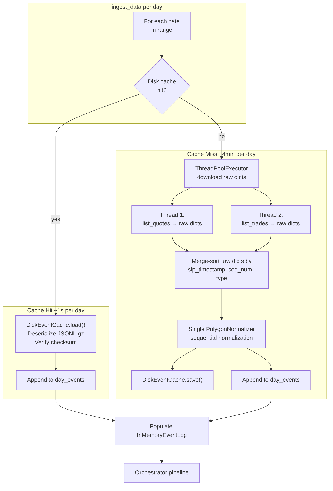

# Parallel Download + Per-Day Disk Cache

## Current Bottleneck

The AAPL 2026-03-13 backtest took ~510s total. Ingestion dominates: 313 pages downloaded sequentially (quotes first, then trades), producing 1.56M events. Every repeat run re-downloads everything because `InMemoryEventLog` is volatile.

A second problem: the current ingestor writes all quotes to the EventLog first, then all trades. `ReplayFeed` yields them in insertion order, so a trade at `exchange_timestamp_ns=100` is replayed *after* a quote at `exchange_timestamp_ns=999999999`. This is a causality defect — the merge-sort in this plan fixes it by interleaving events chronologically.

## Architecture




## Key Design Decisions

### Parallel download, sequential normalization

The bottleneck is network I/O (downloading hundreds of paginated API pages), not CPU. Normalizing 1.5M events takes under a second. The plan parallelizes only the download — each thread collects raw `rec_dict` lists — then merge-sorts the raw dicts and normalizes sequentially with a **single** `PolygonNormalizer`.

This avoids the critical flaw of parallel normalizers: each `PolygonNormalizer` has its own `SequenceGenerator` (starting at 0), so parallel normalizers produce colliding `sequence` numbers and inconsistent `correlation_id` values (which embed the sequence). A single normalizer preserves the invariant that every event gets a unique, monotonic sequence and a correct correlation ID (Inv-13).

### Chronological merge-sort (causality fix)

The current ingestor writes all quotes first, then all trades — a causality defect. The merge-sort produces chronological interleaving. Sort key: `(sip_timestamp, sequence_number, type_rank)` where `type_rank` is 0 for quotes, 1 for trades. This is deterministic: same API data always produces the same merge order.

This intentionally changes replay order from the current (incorrect) behavior. Existing backtest results will differ. This is documented as a correctness fix, not a regression.

### Per-day disk cache

- **Cache key**: `{cache_dir}/{symbol}/{YYYY-MM-DD}.jsonl.gz` — one file per symbol per calendar date
- **Cache format**: JSONL + gzip. Each line is one JSON object with a `__type__` discriminator (`"NBBOQuote"` or `"Trade"`). `Decimal` fields serialized as strings to preserve precision (Inv-5). ~1.5M events compresses to ~25-35MB.
- **Manifest**: companion `{YYYY-MM-DD}.manifest.json` with event count, SHA-256 checksum, and `event_schema_hash` (hash of `NBBOQuote` + `Trade` field names and types, so schema changes auto-invalidate)
- **Cache location**: Default `~/.feelies/cache/`, overridable via `--cache-dir` CLI flag or `PlatformConfig.cache_dir`
- **Multi-day range**: `ingest_data()` iterates each calendar date, checks cache per day, downloads only missing days. Running `--date 03-10 --end-date 03-13` after `03-12 to 03-13` only downloads 2 new days.
- **Corruption (Inv-11)**: If checksum mismatch, schema mismatch, or deserialization failure on load, log a warning and fall through to API download. Never crash on bad cache.

### Determinism (Inv-5)

Once cached, events are replayed identically — the cache IS the canonical event sequence. No re-normalization on load. The `sequence` and `correlation_id` fields in the cached events are the source of truth.

### Multi-symbol

Symbols processed sequentially to respect Polygon API rate limits. Each symbol's quotes + trades download in parallel (2 threads).

## File Changes

### New: `[src/feelies/storage/disk_event_cache.py](src/feelies/storage/disk_event_cache.py)`

`DiskEventCache` class:

- `__init__(cache_dir: Path)` — creates directory structure on first use
- `exists(symbol: str, date: str) -> bool` — checks manifest + data file exist and schema hash matches current event definitions
- `load(symbol: str, date: str) -> list[NBBOQuote | Trade]` — decompress, deserialize, verify checksum. On any failure, log warning, return `None` (Inv-11 fail-safe)
- `save(symbol: str, date: str, events: Sequence[NBBOQuote | Trade]) -> None` — serialize to JSONL.gz, compute SHA-256, write manifest atomically (write to `.tmp` then rename)

Helper: `_compute_schema_hash() -> str` — SHA-256 of sorted field names + type annotations from `NBBOQuote.__dataclass_fields__` and `Trade.__dataclass_fields__`. Included in manifest; checked on load to auto-invalidate when event schemas evolve.

Manifest schema:

```python
{
  "symbol": "AAPL",
  "date": "2026-03-13",
  "event_count": 1561419,
  "quotes_count": 897066,
  "trades_count": 664353,
  "checksum": "sha256:abc123...",
  "event_schema_hash": "sha256:def456...",
  "created_at": "2026-03-18T12:00:00Z"
}
```

### Modified: `[src/feelies/ingestion/polygon_ingestor.py](src/feelies/ingestion/polygon_ingestor.py)`

- New `_download_quotes_raw(client, symbol, start, end) -> list[dict]` — paginate through `list_quotes()`, collect raw dicts via `_model_to_dict()`. Pure download, no normalization.
- New `_download_trades_raw(client, symbol, start, end) -> list[dict]` — same for trades.
- New `ingest_symbol_parallel(client, symbol, start, end) -> tuple[int, int]` — runs `_download_quotes_raw` and `_download_trades_raw` in a 2-thread pool, merge-sorts by `(sip_timestamp, sequence_number, type_rank)`, then normalizes the sorted stream sequentially via the existing `PolygonNormalizer`, and writes to `EventLog` via `append_batch()`.
- Existing `ingest()` calls `ingest_symbol_parallel()` per symbol instead of the sequential `_ingest_quotes` / `_ingest_trades` pair.
- Existing sequential methods (`_ingest_quotes`, `_ingest_trades`, `_flush_chunk`) remain for backward compatibility / testing.

### Modified: `[scripts/run_backtest.py](scripts/run_backtest.py)`

- `ingest_data()` refactored to loop over each calendar date in the range:
  - Check `DiskEventCache.exists(symbol, date)` for each symbol
  - On hit: `cache.load()` and extend the event list
  - On miss: call ingestor for that single day, then `cache.save()`
  - After all days: populate `InMemoryEventLog` with merged events
- Add `--cache-dir` CLI argument (default: `~/.feelies/cache/`)
- Add `--no-cache` flag to force re-download
- Ingestion section of report shows source per day (cache / API)

### Modified: `[src/feelies/core/platform_config.py](src/feelies/core/platform_config.py)`

- Add `cache_dir: Path | None = None` field to `PlatformConfig` and `from_yaml()`.

## Performance Expectations

- **First run**: ~4 min (down from ~8 min) — quotes and trades download concurrently
- **Repeat run**: ~1-2 sec — load from gzipped JSONL, no API calls, no normalization
- **Partial cache hit** (multi-day): only missing days downloaded
- **Cache size**: ~25-35 MB per symbol-day (gzipped)

