# Polygon-to-Massive API Migration

## Inventory

17 files total across source, config, scripts, and tests.

**Source (rename + content):** `polygon_normalizer.py`, `polygon_ingestor.py`, `polygon_ws.py`
**Source (content only):** `__init__.py`, `normalizer.py`, `replay_feed.py`, `events.py`, `disk_event_cache.py`
**Config:** `pyproject.toml`, `.env.example`
**Scripts:** `run_backtest.py`
**Tests (rename + content):** `test_polygon_normalizer.py`, `test_polygon_ingestor.py`, `test_polygon_functional.py`
**Tests (content only):** `test_parallel_ingest_integration.py`, `tests/ingestion/conftest.py`, `tests/conftest.py`

```mermaid
flowchart TD
    subgraph phase0 [Phase 0: Pre-flight Gate]
        V1["Install massive package"]
        V2["Verify RESTClient constructor"]
        V3["Verify list_quotes / list_trades sigs"]
        V4["Verify model __annotations__ compat"]
    end
    subgraph phase1 [Phase 1: Config]
        P1A["pyproject.toml"]
        P1B[".env.example"]
    end
    subgraph phase2 [Phase 2: Source Renames]
        P2A["git mv polygon_normalizer -> massive_normalizer"]
        P2B["git mv polygon_ingestor -> massive_ingestor"]
        P2C["git mv polygon_ws -> massive_ws"]
    end
    subgraph phase3 [Phase 3: Source Content]
        P3["8 source files: class names, imports, URLs, source tags, logs, docstrings"]
    end
    subgraph phase4 [Phase 4: Script]
        P4["run_backtest.py"]
    end
    subgraph phase5 [Phase 5: Test Renames]
        P5A["git mv test_polygon_normalizer -> test_massive_normalizer"]
        P5B["git mv test_polygon_ingestor -> test_massive_ingestor"]
        P5C["git mv test_polygon_functional -> test_massive_functional"]
    end
    subgraph phase6 [Phase 6: Test Content]
        P6["6 test files: imports, class names, fixtures, patches, source tags, env vars"]
    end
    subgraph phase7 [Phase 7: Verification]
        P7A["pytest"]
        P7B["mypy"]
        P7C["ruff"]
    end
    phase0 -->|"GATE: all 4 pass"| phase1 --> phase2 --> phase3 --> phase4 --> phase5 --> phase6 --> phase7
```




---

## Phase 0 — Pre-flight SDK Verification (GATE)

Before any code changes, verify the `massive` SDK is compatible. Abort migration if any check fails.

- **Check 0.1:** `pip install massive` succeeds
- **Check 0.2:** `from massive import RESTClient` works; `RESTClient.__init__` accepts `api_key` kwarg
- **Check 0.3:** `RESTClient.list_quotes(ticker, timestamp_gte=..., timestamp_lte=..., limit=...)` and `RESTClient.list_trades(...)` have compatible signatures (same kwargs used in [src/feelies/ingestion/polygon_ingestor.py](src/feelies/ingestion/polygon_ingestor.py) lines 196-210 and 242-256)
- **Check 0.4:** Model objects returned by `list_quotes()` iterator have `__annotations`__ on their class (required by `_model_to_dict` at line 450). If the Massive SDK uses different model types (Pydantic, dataclass, plain dict), `_model_to_dict` needs logic changes — escalate before proceeding
- **Check 0.5:** `from massive import WebSocketClient` exists (confirms future WS migration path is available, but not required for this migration)

**If Check 0.4 fails:** The `_model_to_dict` function in [src/feelies/ingestion/polygon_ingestor.py](src/feelies/ingestion/polygon_ingestor.py) lines 450-481 must be rewritten to handle the new model type. This changes the migration from "rename-only" to "rename + adapt". The function currently handles 3 patterns (annotations-based, dict, `__dict`__), so it may already handle the new type — verify empirically.

---

## Phase 1 — Configuration (2 files)

**1.1 [pyproject.toml](pyproject.toml)**

- Rename optional-dependency group `polygon` to `massive` (line 18)
- Replace `"polygon-api-client>=1.14"` with `"massive>=1.0"` (line 20, pin to actual latest version from PyPI)
- Keep `"websockets>=13.0"` (still needed by custom WS implementation)

**1.2 [.env.example](.env.example)**

- `POLYGON_API_KEY=your_polygon_api_key_here` -> `MASSIVE_API_KEY=your_massive_api_key_here`

**1.3 Developer action (not a code change):** Every developer must update their local `.env` file: `POLYGON_API_KEY=xxx` -> `MASSIVE_API_KEY=xxx`. This file is gitignored and cannot be migrated automatically.

---

## Phase 2 — Source File Renames (3 `git mv` operations)

```
git mv src/feelies/ingestion/polygon_normalizer.py src/feelies/ingestion/massive_normalizer.py
git mv src/feelies/ingestion/polygon_ingestor.py   src/feelies/ingestion/massive_ingestor.py
git mv src/feelies/ingestion/polygon_ws.py          src/feelies/ingestion/massive_ws.py
```

---

## Phase 3 — Source Content Updates (8 files)

### 3.1 [massive_normalizer.py](src/feelies/ingestion/massive_normalizer.py)

Global renames within file:

- `PolygonNormalizer` -> `MassiveNormalizer` (class name, all refs)
- `"polygon_ws"` -> `"massive_ws"` (source tag constant + all string args)
- `"polygon_rest"` -> `"massive_rest"` (source tag constant + all string args)
- `"polygon_normalizer: ..."` -> `"massive_normalizer: ..."` (10 logger strings)
- Docstring: `Polygon.io` -> `Massive (formerly Polygon.io)`

### 3.2 [massive_ws.py](src/feelies/ingestion/massive_ws.py)

- Import: `from feelies.ingestion.polygon_normalizer import PolygonNormalizer` -> `from feelies.ingestion.massive_normalizer import MassiveNormalizer`
- `_DEFAULT_WS_URL`: `"wss://socket.polygon.io/stocks"` -> `"wss://socket.massive.com/stocks"`
- Class: `PolygonLiveFeed` -> `MassiveLiveFeed`
- Type annotations: `PolygonNormalizer` -> `MassiveNormalizer`
- Thread name: `"polygon-ws-feed"` -> `"massive-ws-feed"`
- ImportError: `pip install 'feelies[polygon]'` -> `pip install 'feelies[massive]'`
- Source tag: `"polygon_ws"` -> `"massive_ws"`
- Logger strings (~12): `"polygon_ws: ..."` -> `"massive_ws: ..."`
- Comments/docstrings: `Polygon responds/sends` -> `Massive responds/sends`

### 3.3 [massive_ingestor.py](src/feelies/ingestion/massive_ingestor.py)

- Import: `from feelies.ingestion.polygon_normalizer import PolygonNormalizer` -> `from feelies.ingestion.massive_normalizer import MassiveNormalizer`
- TYPE_CHECKING import: `from polygon import RESTClient` -> `from massive import RESTClient` (keep `pyright: ignore`)
- Runtime import: `from polygon import RESTClient as _RESTClient` -> `from massive import RESTClient as _RESTClient` (keep `pyright: ignore`)
- ImportError: `"polygon-api-client is required for PolygonHistoricalIngestor..."` -> `"massive package is required for MassiveHistoricalIngestor. Install with: pip install 'feelies[massive]'"`
- Class: `PolygonHistoricalIngestor` -> `MassiveHistoricalIngestor`
- Type annotations: `PolygonNormalizer` -> `MassiveNormalizer`
- Source tags (2): `"polygon_rest"` -> `"massive_rest"`
- Logger strings (~8): `"polygon_ingestor: ..."` -> `"massive_ingestor: ..."`
- `_model_to_dict` docstring: `polygon-api-client model` -> `massive model`, `polygon @modelclass` -> `massive @modelclass`
- **RISK NOTE:** If Phase 0 Check 0.4 revealed incompatible model types, `_model_to_dict` logic (lines 458-481) needs adaptation here. The function already has fallback paths for `dict` and `__dict`__ objects, but verify empirically.

### 3.4 [src/feelies/ingestion/**init**.py](src/feelies/ingestion/__init__.py)

- Docstring: `normalize Polygon L1 NBBO` -> `normalize Massive L1 NBBO`
- All 3 import paths: `polygon_ingestor` -> `massive_ingestor`, `polygon_normalizer` -> `massive_normalizer`, `polygon_ws` -> `massive_ws`
- All 3 class names in imports and `__all`__: `PolygonHistoricalIngestor` -> `MassiveHistoricalIngestor`, `PolygonLiveFeed` -> `MassiveLiveFeed`, `PolygonNormalizer` -> `MassiveNormalizer`

### 3.5 [src/feelies/ingestion/normalizer.py](src/feelies/ingestion/normalizer.py) — docstring only

- `Polygon.io WebSocket` -> `Massive WebSocket (formerly Polygon.io)`
- `"polygon_ws"` -> `"massive_ws"` (in docstring example)

### 3.6 [src/feelies/ingestion/replay_feed.py](src/feelies/ingestion/replay_feed.py) — docstring only

- `Polygon-agnostic` -> `Provider-agnostic`

### 3.7 [src/feelies/core/events.py](src/feelies/core/events.py) — docstring only (line 33)

- `L1 NBBO quote update from Polygon.io.` -> `L1 NBBO quote update from Massive (formerly Polygon.io).`

### 3.8 [src/feelies/storage/disk_event_cache.py](src/feelies/storage/disk_event_cache.py) — docstring only (line 4)

- `skip the Polygon API entirely` -> `skip the Massive API entirely`

---

## Phase 4 — Script Updates (1 file)

### 4.1 [scripts/run_backtest.py](scripts/run_backtest.py)

- Docstring (line 2): `real Polygon data` -> `real Massive data`
- Import (line 46): `from feelies.ingestion.polygon_ingestor import IngestResult` -> `from feelies.ingestion.massive_ingestor import IngestResult`
- Argparse (line 82): `real Polygon L1 data` -> `real Massive L1 data`
- Argparse help (line 111): `no Polygon API key required` -> `no Massive API key required`
- Imports (lines 176-177): `polygon_ingestor` -> `massive_ingestor`, `polygon_normalizer` -> `massive_normalizer`
- Class names (lines 176-177, 207, 210): `PolygonHistoricalIngestor` -> `MassiveHistoricalIngestor`, `PolygonNormalizer` -> `MassiveNormalizer`
- Docstring (line 291): `no Polygon needed` -> `no Massive API needed`
- Comment (line 663): `no Polygon needed` -> `no Massive API needed`
- Comment (line 686): `requires Polygon API key` -> `requires Massive API key`
- Env var (line 698): `"POLYGON_API_KEY"` -> `"MASSIVE_API_KEY"`
- Error messages (lines 701-703): `POLYGON_API_KEY` -> `MASSIVE_API_KEY`
- Install hint (line 743): `pip install 'feelies[polygon]'` -> `pip install 'feelies[massive]'`

---

## Phase 5 — Test File Renames (3 `git mv` operations)

```
git mv tests/ingestion/test_polygon_normalizer.py tests/ingestion/test_massive_normalizer.py
git mv tests/ingestion/test_polygon_ingestor.py   tests/ingestion/test_massive_ingestor.py
git mv tests/ingestion/test_polygon_functional.py  tests/ingestion/test_massive_functional.py
```

---

## Phase 6 — Test Content Updates (6 files)

### 6.1 [test_massive_normalizer.py](tests/ingestion/test_massive_normalizer.py)

- Imports (2): `polygon_normalizer` -> `massive_normalizer`, `polygon_ws` -> `massive_ws`
- Class names in imports: `PolygonNormalizer` -> `MassiveNormalizer`, `PolygonLiveFeed` -> `MassiveLiveFeed`
- Test class names (6): `TestPolygonNormalizer*` -> `TestMassiveNormalizer*`, `TestPolygonLiveFeed*` -> `TestMassiveLiveFeed*`
- Type annotations (~28): `PolygonNormalizer` -> `MassiveNormalizer`
- Source arg strings (~24): `"polygon_ws"` -> `"massive_ws"`, `"polygon_rest"` -> `"massive_rest"`
- Static method calls (6): `PolygonLiveFeed._validate_status_response` -> `MassiveLiveFeed._validate_status_response`
- Docstrings (6): `polygon_ws source` -> `massive_ws source`, etc.

### 6.2 [test_massive_ingestor.py](tests/ingestion/test_massive_ingestor.py)

- Imports (2): `polygon_ingestor` -> `massive_ingestor`, `polygon_normalizer` -> `massive_normalizer`
- Class names: `PolygonHistoricalIngestor` -> `MassiveHistoricalIngestor`, `PolygonNormalizer` -> `MassiveNormalizer`
- Test class name: `TestPolygonHistoricalIngestor` -> `TestMassiveHistoricalIngestor`
- Package spec check: `find_spec("polygon")` -> `find_spec("massive")`
- Skip reason: `"polygon installed"` -> `"massive installed"`
- Test function name: `test_ingest_raises_without_polygon_package` -> `test_ingest_raises_without_massive_package`
- ImportError match: `match="polygon-api-client"` -> `match="massive"` (match new error message from Phase 3.3)
- Patch targets (3): `"polygon.RESTClient"` -> `"massive.RESTClient"`
- Docstrings: `polygon Quote model` -> `massive Quote model`, `polygon Trade model` -> `massive Trade model`

### 6.3 [test_massive_functional.py](tests/ingestion/test_massive_functional.py)

- Imports (3): module paths `polygon_ingestor` / `polygon_normalizer` / `polygon_ws` -> `massive_ingestor` / `massive_normalizer` / `massive_ws`
- Class names: `PolygonHistoricalIngestor` -> `MassiveHistoricalIngestor`, `PolygonNormalizer` -> `MassiveNormalizer`, `PolygonLiveFeed` -> `MassiveLiveFeed`
- Env vars (4): `POLYGON_API_KEY` -> `MASSIVE_API_KEY`, `POLYGON_FUNCTIONAL_SYMBOL` -> `MASSIVE_FUNCTIONAL_SYMBOL`, `POLYGON_FUNCTIONAL_REST_RECORD_LIMIT` -> `MASSIVE_FUNCTIONAL_REST_RECORD_LIMIT`, `POLYGON_FUNCTIONAL_WS_TIMEOUT_S` -> `MASSIVE_FUNCTIONAL_WS_TIMEOUT_S`
- ValueError messages (2): update env var names in error strings
- Test function names (2): `test_rest_ingest_uses_live_polygon_data` -> `test_rest_ingest_uses_live_massive_data`, `test_websocket_feed_emits_live_polygon_event` -> `test_websocket_feed_emits_live_massive_event`
- Package import variable (2): `polygon = pytest.importorskip("polygon")` -> `massive = pytest.importorskip("massive")`, and `polygon.RESTClient(...)` -> `massive.RESTClient(...)`
- Patch target (1): `"polygon.RESTClient"` -> `"massive.RESTClient"`
- Type hint (1): `feed: PolygonLiveFeed` -> `feed: MassiveLiveFeed`
- Skip/error messages (~4): `Polygon` -> `Massive`

### 6.4 [test_parallel_ingest_integration.py](tests/ingestion/test_parallel_ingest_integration.py)

- Docstrings (2): `live Polygon API` -> `live Massive API`, `POLYGON_API_KEY` -> `MASSIVE_API_KEY`
- Imports — explicit enumeration:
  - `from feelies.ingestion.polygon_ingestor import (PolygonHistoricalIngestor, _download_quotes_raw, _download_trades_raw,)` -> `from feelies.ingestion.massive_ingestor import (MassiveHistoricalIngestor, _download_quotes_raw, _download_trades_raw,)` (note: private functions `_download_quotes_raw` and `_download_trades_raw` keep their names, only module path changes)
  - `from feelies.ingestion.polygon_normalizer import PolygonNormalizer` -> `from feelies.ingestion.massive_normalizer import MassiveNormalizer`
- Env var in `_require_api_key()` (2): `"POLYGON_API_KEY"` -> `"MASSIVE_API_KEY"`, skip message `Polygon` -> `Massive`
- **Fixture cascade (critical for pytest injection):**
  - Fixture `polygon_client` (line 105) -> `massive_client`: rename function, update body `polygon = pytest.importorskip("polygon")` -> `massive = pytest.importorskip("massive")`, `polygon.RESTClient(...)` -> `massive.RESTClient(...)`
  - Fixture `trading_day` parameter (line 112): `polygon_client: Any` -> `massive_client: Any`
  - Fixture `limited_client` parameter (line 117): `polygon_client: Any` -> `massive_client: Any`, and body: `polygon = pytest.importorskip("polygon")` -> `massive = pytest.importorskip("massive")`, `polygon.RESTClient(...)` -> `massive.RESTClient(...)`
- Class instantiations (~22): `PolygonNormalizer(...)` -> `MassiveNormalizer(...)`, `PolygonHistoricalIngestor(` -> `MassiveHistoricalIngestor(`

### 6.5 [tests/ingestion/conftest.py](tests/ingestion/conftest.py)

- Import: `from feelies.ingestion.polygon_normalizer import PolygonNormalizer` -> `from feelies.ingestion.massive_normalizer import MassiveNormalizer`
- Return type: `-> PolygonNormalizer` -> `-> MassiveNormalizer`
- Docstring: `Polygon normalizer` -> `Massive normalizer`
- Body: `return PolygonNormalizer(clock=clock)` -> `return MassiveNormalizer(clock=clock)`

### 6.6 [tests/conftest.py](tests/conftest.py) — docstring only

- `so POLYGON_API_KEY is available` -> `so MASSIVE_API_KEY is available`

---

## Phase 7 — Verification

1. **Unit tests (no API key):** `pytest tests/ -v --ignore=tests/ingestion/test_massive_functional.py --ignore=tests/ingestion/test_parallel_ingest_integration.py`
2. **Type check:** `mypy src/feelies/ingestion/ scripts/run_backtest.py`
3. **Lint:** `ruff check src/feelies/ tests/ scripts/`
4. **(Optional) Live integration:** requires `MASSIVE_API_KEY` set in environment

---

## Commit Strategy

- **Commit A:** Phase 1 (config) + Phase 2 (source renames, no content changes) — establishes new file names
- **Commit B:** Phase 3 (source content) + Phase 4 (script) — all source-side migration
- **Commit C:** Phase 5 (test renames) + Phase 6 (test content) — all test-side migration
- **Commit D:** After Phase 7 passes — verification clean

Alternative: single atomic commit after all phases pass verification.

---

## Out of Scope

- **WebSocket client swap** to Massive SDK built-in `WebSocketClient` — independent future improvement
- **Historical plan file updates** in `.cursor/plans/` — audit provenance artifacts, not functional code
- `**websockets` dependency removal** — only when/if WS client swap happens
- **Cached `.jsonl.gz` migration** — event schema is identical, existing caches remain valid

