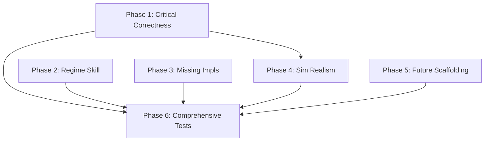

# Skill Review Remediation — 12th Skill + 15 Finding Fixes

## Dependency Graph




---

## Phase 1: Critical Correctness (F2, F8, F13+F15, F6)

These are bugs that would cause incorrect behavior at runtime. Must be fixed before tests are written.

### F2 [CRITICAL] — BacktestOrderRouter never receives quotes

**Root cause:** Bootstrap wires `bus.subscribe(NBBOQuote, router.on_quote)` but the orchestrator never publishes `NBBOQuote` to the bus. The router's `_last_quotes` stays empty; all orders are rejected.

**Fix:** Publish the quote to the bus at M1 in `_process_tick_inner`, right after `self._event_log.append(quote)`:

```python
self._event_log.append(quote)
self._bus.publish(quote)      # <-- enables BacktestOrderRouter subscription
```

- File: [src/feelies/kernel/orchestrator.py](src/feelies/kernel/orchestrator.py) line ~580
- This also benefits any future bus subscriber that needs raw quotes (dashboards, forensics)

### F8 [HIGH] — check_order() ignores order side

**Root cause:** `post_fill_qty = abs(current.quantity + order.quantity)` treats all orders as BUY. For SELL orders, the quantity should be subtracted.

**Fix in** [src/feelies/risk/basic_risk.py](src/feelies/risk/basic_risk.py) `check_order()` (line ~138):

```python
signed_qty = order.quantity if order.side == Side.BUY else -order.quantity
post_fill_qty = abs(current.quantity + signed_qty)
```

Requires importing `Side` from `core.events`.

### F13+F15 [HIGH+MEDIUM] — Regime single-writer violation + posterior() not idempotent

Two coupled issues:

1. Alpha feature code can call `regime_engine.posterior(quote)` at M3, after the orchestrator already called it at M2 — double Bayesian update corrupts posteriors
2. `posterior()` is not idempotent; each call performs a full update

**Fix 1 — Idempotent posterior:** Add per-tick caching to `HMM3StateFractional.posterior()` in [src/feelies/services/regime_engine.py](src/feelies/services/regime_engine.py):

```python
def posterior(self, quote: NBBOQuote) -> list[float]:
    symbol = quote.symbol
    ts = quote.timestamp_ns
    if self._last_update_ts.get(symbol) == ts:
        return list(self._posteriors[symbol])  # idempotent return
    self._last_update_ts[symbol] = ts
    # ... existing Bayesian update logic ...
```

Add `self._last_update_ts: dict[str, int] = {}` to `__init__`. Add idempotency requirement to the `RegimeEngine` protocol docstring.

**Fix 2 — Read-only proxy in loader:** In [src/feelies/alpha/loader.py](src/feelies/alpha/loader.py) `_build_namespace()` (line ~462), inject a read-only wrapper instead of the full engine:

```python
if regime_engine is not None:
    ns["regime_posteriors"] = regime_engine.current_state
    ns["regime_state_names"] = regime_engine.state_names
```

Remove `ns["regime_engine"] = regime_engine`. This structurally prevents alpha code from calling `posterior()`. Update test fixtures accordingly in `tests/alpha/test_loader.py`.

### F6 [HIGH] — No warm/stale gate before signal evaluation

**Root cause:** `CompositeSignalEngine.evaluate()` passes `FeatureVector` to alpha evaluators regardless of `warm`/`stale` flags. Both the feature-engine and microstructure-alpha skills require suppressing entry signals when features are cold or stale.

**Fix in** [src/feelies/alpha/composite.py](src/feelies/alpha/composite.py) `CompositeSignalEngine.evaluate()` (line ~269):

```python
def evaluate(self, features: FeatureVector) -> Signal | None:
    if not features.warm:
        return None   # suppress all signals during warm-up

    signals = self._evaluate_all(features)

    if features.stale:
        signals = [s for s in signals if s.direction == SignalDirection.FLAT]

    # ... existing arbitration logic ...
```

When `stale=True`, only FLAT (exit) signals pass through — conservative per Inv-11.

---

## Phase 2: Regime Detection Skill (New Skill + F14)

### Create 12th skill: regime-detection

**File:** `.cursor/skills/regime-detection/SKILL.md`

**Scope (from review recommendation):**

- **Owns:** `RegimeEngine` protocol, `RegimeState` event, state taxonomy, writer/reader contracts
- **Does NOT own:** signal logic (microstructure-alpha), risk scaling factors (risk-engine), HMM internals (implementation detail)

**Sections (following existing skill pattern from risk-engine and feature-engine):**

1. Core Invariants
  - Single-writer: only the orchestrator calls `posterior()` per tick (at M2)
  - Idempotency: `posterior()` must cache per `(symbol, timestamp_ns)` — double-call returns cached result
  - Read-only consumers: risk engine, position sizer, alpha features use `current_state()` only
  - Fail-safe: missing regime data defaults to `1.0x` scaling (no amplification)
2. Protocol Ownership — `RegimeEngine` in `services/regime_engine.py`
3. State Taxonomy — 3-state HMM default (`compression_clustering`, `normal`, `vol_breakout`), extensibility via `register_engine()`
4. Writer/Reader Contract — who calls what, when in the pipeline
5. Consumer Contract — how risk, sizing, and features consume regime state
6. `RegimeState` Event — semantics, expected subscribers (dashboards, forensics — future), fire-and-forget observability
7. Extensibility — adding new state taxonomies, custom HMM parameters, swapping implementations
8. Event Interface table
9. Failure Modes table
10. Integration Points table

### F14 [LOW] — RegimeState event has no subscribers

**Status:** Not a code bug. The event is fire-and-forget observability. Document in the regime-detection skill that subscribers are expected when dashboards (monitoring) and forensics (post-trade-forensics) are implemented. No code change needed.

---

## Phase 3: Missing Concrete Implementations (F1, F4, F5)

### F1 [MEDIUM] — DataHealth transitions not emitted on bus

**Root cause:** `PolygonNormalizer` owns DataHealth SMs but has no bus dependency. Transitions happen silently, violating Inv-13.

**Fix:** Add an optional `on_transition` callback to `PolygonNormalizer.__init__()` in [src/feelies/ingestion/polygon_normalizer.py](src/feelies/ingestion/polygon_normalizer.py). When provided, register it on each DataHealth SM via `sm.on_transition`. The bootstrap wires this callback to publish `StateTransition` events on the bus.

- Modify `PolygonNormalizer.__init`__ to accept `transition_callback`
- In `_ensure_health_machine`, register the callback on newly created SMs
- Update bootstrap to pass `lambda record: bus.publish(...)` when normalizer is present

### F4 [MEDIUM] — No concrete TradeJournal

**New file:** `src/feelies/storage/memory_trade_journal.py`

```python
class InMemoryTradeJournal:
    def record(self, trade: TradeRecord) -> None: ...
    def query(self, ...) -> list[TradeRecord]: ...
```

Wire in [src/feelies/bootstrap.py](src/feelies/bootstrap.py) — pass to orchestrator.

### F5 [MEDIUM] — No concrete FeatureSnapshotStore

**New file:** `src/feelies/storage/memory_feature_snapshot.py`

```python
class InMemoryFeatureSnapshotStore:
    def save(self, meta: FeatureSnapshotMeta, values: dict) -> None: ...
    def load(self, meta: FeatureSnapshotMeta) -> dict | None: ...
    def list_snapshots(self, symbol: str) -> list[FeatureSnapshotMeta]: ...
```

Wire in [src/feelies/bootstrap.py](src/feelies/bootstrap.py) — pass to orchestrator.

---

## Phase 4: Simulation Realism (F3, F9)

### F3 [MEDIUM] — No latency injection in BacktestOrderRouter

**Fix in** [src/feelies/execution/backtest_router.py](src/feelies/execution/backtest_router.py):

- Add `latency_ns: int = 0` constructor parameter
- When non-zero, the fill's `timestamp_ns` is `quote.timestamp_ns + latency_ns`
- Add to `PlatformConfig` as optional `backtest_fill_latency_ns`
- Full queue-priority fill model remains future work (acknowledged in docstring)

### F9 [MEDIUM] — No latency measurement infrastructure

**Fix in** [src/feelies/kernel/orchestrator.py](src/feelies/kernel/orchestrator.py):

- Capture `time.perf_counter_ns()` at each micro-state boundary in `_process_tick_inner`
- Emit `MetricEvent` for pipeline segments: `feature_compute_ns`, `signal_evaluate_ns`, `risk_check_ns`, `tick_to_decision_ns`
- Emit at M10 (`_finalize_tick`) to avoid adding latency to the critical path
- Uses `MetricType.HISTOGRAM` from existing event catalog

---

## Phase 5: Future-Work Scaffolding (F7, F10, F11)

Minimal stub modules with protocols and `NotImplementedError` bodies. These anchor the skill contracts in code without full implementation.

### F7 — Paper/Live backends

- New: `src/feelies/execution/paper_router.py` — `PaperOrderRouter` stub implementing `OrderRouter`
- New: `src/feelies/execution/live_router.py` — `LiveOrderRouter` stub implementing `OrderRouter`
- Both raise `NotImplementedError` with descriptive messages

### F10 — Forensics pipeline

- New: `src/feelies/forensics/__init__.py`
- New: `src/feelies/forensics/analyzer.py` — `ForensicAnalyzer` protocol with methods: `analyze_fills()`, `detect_edge_decay()`, `slippage_report()`
- New: `src/feelies/forensics/decay_detector.py` — `DecayDetector` stub

### F11 — Research infrastructure

- New: `src/feelies/research/__init__.py`
- New: `src/feelies/research/experiment.py` — `ExperimentTracker` protocol with methods: `start_experiment()`, `log_result()`, `list_experiments()`
- New: `src/feelies/research/hypothesis.py` — `HypothesisRegistry` stub

---

## Phase 6: Comprehensive Tests (F12)

Tests for all 10 untested packages. Each test file follows the existing project convention (`tests/<package>/test_<module>.py`).

### 6a. bus

- `tests/bus/test_event_bus.py` — subscribe, publish, ordering, type filtering, error isolation

### 6b. execution

- `tests/execution/test_intent.py` — all 12 cells of the signal x position matrix, NO_ACTION fallback
- `tests/execution/test_backtest_router.py` — fill at mid-price, reject on missing quote, latency injection, poll_acks clearing
- `tests/execution/test_order_state.py` — SM transitions, terminal states, illegal transitions

### 6c. features

- `tests/features/test_engine_protocol.py` — FeatureEngine protocol conformance via CompositeFeatureEngine
- `tests/features/test_library.py` — each computation (EWMA, spread, mid, imbalance, variance, z-score) with known inputs/outputs

### 6d. kernel

- `tests/kernel/test_orchestrator.py` — full M0-M10 pipeline with mock engines, FLAT->EXIT path, tick failure->DEGRADED, risk breach->LOCKDOWN
- `tests/kernel/test_macro.py` — macro SM transitions
- `tests/kernel/test_micro.py` — micro SM transitions

### 6e. monitoring

- `tests/monitoring/test_kill_switch.py` — protocol conformance with a simple impl
- `tests/monitoring/test_alerting.py` — AlertManager protocol, severity routing

### 6f. portfolio

- `tests/portfolio/test_memory_position_store.py` — get/update/all_positions/total_exposure, cost-basis PnL
- `tests/portfolio/test_strategy_position_store.py` — per-strategy isolation, aggregate view, total_exposure aggregation

### 6g. risk

- `tests/risk/test_basic_risk.py` — check_signal (position limit, exposure, drawdown, scale-down), check_order (BUY side, SELL side, regime scaling)
- `tests/risk/test_position_sizer.py` — budget allocation, conviction scaling, regime factor, zero-price/zero-equity guards, empty posteriors guard

### 6h. services

- `tests/services/test_regime_engine.py` — HMM posterior update, idempotency (same timestamp), current_state read-only, state_names, registry pattern

### 6i. signals

- `tests/signals/test_composite_signal.py` — warm/stale gating, arbitration, single-alpha passthrough

### 6j. bootstrap + discovery

- `tests/test_bootstrap.py` — build_platform from PlatformConfig, component wiring, regime engine injection
- `tests/alpha/test_discovery.py` — spec discovery, batch load, error handling

