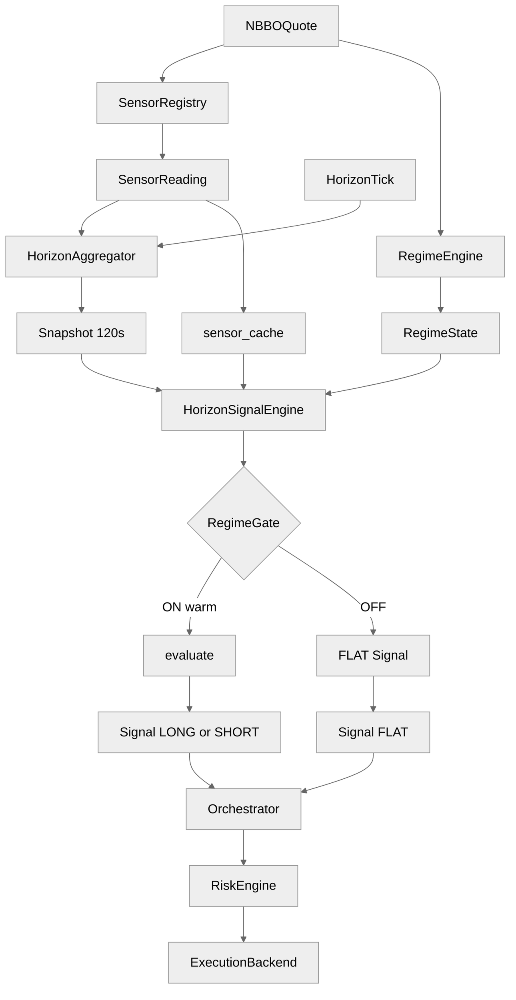

# `sig_benign_midcap_v1` — architecture and operator knobs

This note documents the shipped SIGNAL alpha [`alphas/sig_benign_midcap_v1/sig_benign_midcap_v1.alpha.yaml`](../../alphas/sig_benign_midcap_v1/sig_benign_midcap_v1.alpha.yaml): Layer-1 sensors → horizon features → `HorizonSignalEngine`, regime gate, parameters vs platform wiring, and downstream execution. Platform invariants (determinism, gate DSL, G16) are in [`docs/three_layer_architecture.md`](../three_layer_architecture.md).

---

## 1. End-to-end architecture

**Horizon:** `horizon_seconds: 120` — the engine evaluates only on `HorizonFeatureSnapshot` events whose `horizon_seconds` equals **120**. Sensors publish `SensorReading` continuously; `HorizonAggregator` rolls horizon features forward and emits one snapshot per symbol per **120 s** boundary.

**How to read:** ASCII first (always legible); Mermaid second (single column, larger font where supported).

```
  NBBOQuote
      |
      +------------------+------------------+
      |                  |                  |
      v                  v                  v
 SensorRegistry   RegimeEngine        (same quotes)
      |                  |
      v                  v
 SensorReading      RegimeState
      |                  |
      +--------+---------+
               |
       +-------v--------+
       |HorizonAggregator|<---- HorizonTick
       +-------+--------+
               |
               v
    HorizonFeatureSnapshot (120s)
               |
       +-------v--------+
       | sensor_cache   |
       +-------+--------+
               |
               v
     HorizonSignalEngine
               |
        +------+------+
        v             v
   RegimeGate     warm/stale
        |
   +----+----+
   v         v
evaluate   FLAT unwind
   |         |
   v         v
 LONG/SHORT   FLAT
   Signal     Signal
       \       /
        v     v
     EventBus --> Orchestrator --> RiskEngine --> ExecutionBackend
```



**Bindings:** `HorizonSignalEngine._build_bindings` prefers **`snapshot.values`** (boundary aggregates) and falls back to **`sensor_cache`** for sensor ids without a derived horizon row. Since audit **P1-6**, **`spread_z_30d`** has a `SensorPassthroughFeature` row in `_horizon_features_for` (feature_id = the bare `spread_z_30d`), so gate conditions resolve it from the **snapshot boundary value** (with the cache as fallback), unifying the gate/snapshot time-base.

---

## 2. Alpha mechanics — sensors and features

### 2.1 `depends_on_sensors`

| Sensor id | Role |
|-----------|------|
| `ofi_ewma` | Signed order-flow imbalance (EWMA); primary **direction** and magnitude for Kyle-style footprint. |
| `micro_price` | Micro-price vs mid; **confirmation** that pressure aligns with OFI (same-sign tilt). |
| `spread_z_30d` | Friction / toxicity context for the gate (snapshot passthrough since P1-6). |
| `realized_vol_30s` | Short-horizon vol stress; gate uses **`realized_vol_30s_zscore`** from the snapshot. |

Universe is **not** pinned in the YAML; operators scope symbols via **`platform.yaml`** (`symbols` / deployment policy).

### 2.2 Sensor → `HorizonFeatureSnapshot.values` (at **120 s**)

From `bootstrap._horizon_features_for` (and `SensorRegistry` + `sensor_specs`):

| Sensor | Features built | Typical `snapshot.values` keys used by this alpha |
|--------|----------------|-----------------------------------------------------|
| `ofi_ewma` | passthrough + horizon-windowed z | `ofi_ewma_zscore` (and raw `ofi_ewma` available) |
| `micro_price` | passthrough + horizon-windowed z + drift (`micro_price_drift`, P1-9) | **`micro_price_zscore`** (evaluate alignment check); drift available but unused here |
| `realized_vol_30s` | passthrough + count-window rolling z | Gate: **`realized_vol_30s_zscore`** |
| `spread_z_30d` | passthrough (**P1-6**; feature_id is the bare `spread_z_30d`) | Gate: **`spread_z_30d`** from the snapshot (cache fallback) |

**`evaluate()`** reads **`ofi_ewma_zscore`** and **`micro_price_zscore`** only; spread/vol are **gate-only**.

### 2.3 `trend_mechanism.l1_signature_sensors` vs `depends_on_sensors`

G16 requires **`l1_signature_sensors`** to include a **family fingerprint** (here `KYLE_INFO` → includes **`kyle_lambda_60s`** among listed signatures). That list is a **mechanism disclosure / load-time check** against registered platform sensors; it is **not** required to equal `depends_on_sensors`. This alpha’s **inline signal** does not call `kyle_lambda_60s_*` — the tradeable L1 footprint in code is **OFI + micro-price** under benign spread/vol gates.

### 2.4 `consumed_features` on `Signal`

Loader stamps **`consumed_features`** with the **sensor id tuple** from `depends_on_sensors` (provenance), not the internal `*_zscore` feature keys.

---

## 3. Regime adaptation

### 3.1 HMM + microstructure gate

- **`RegimeState`:** `P(normal)` from `hmm_3state_fractional` (must match published `RegimeState.engine_name`).

- **`on_condition`:** `P(normal) > 0.5 and spread_z_30d < 1.5` — arm in “normal” HMM mass **and** mild spread vs the sensor’s own history.

- **`off_condition`:** `P(normal) < 0.35 or spread_z_30d > 3.0 or realized_vol_30s_zscore > 4.5` — disarm on weaker normal state, **wide spread**, or **vol spike**.

### 3.2 Warm / stale

`required_warm_feature_ids` includes feature ids implied by **`depends_on_sensors`** at horizon **120** plus gate tokens ending in **`_zscore`** / **`_percentile`** (bare gate names are also mapped through the sensor→feature table). So **`realized_vol_30s_zscore`** must be warm/non-stale for dispatch even though `evaluate()` does not read it.

### 3.3 Gate ON vs `evaluate()`

**Gate ON** permits `evaluate()` to run; **`evaluate()`** still returns **`None`** when `\|ofi_ewma_zscore\| < entry_threshold_z`, when OFI and **micro-price z** disagree on sign, or when `micro_price_zscore` is exactly **0.0** (zero pressure is treated as “no confirmation,” not agreement) — do not treat latch state as “will trade every 120 s boundary.”

### 3.4 `spread_z_30d` and warm rows

Since audit **P1-6**, `spread_z_30d` has a passthrough horizon feature, so it **does** contribute the feature_id `spread_z_30d` to **`required_warm_feature_ids`** (it is in `depends_on_sensors` and appears in the gate). The snapshot row also gives it a horizon-staleness path: if the sensor goes silent within the window, the aggregator marks it stale and dispatch is suppressed — previously the cache-only path could serve an arbitrarily old value.

---

## 4. Parameter knobs

### 4.1 Alpha `parameters:` → `params` in `evaluate()`

Overridable via **`platform.yaml` → `parameter_overrides:`** under key **`sig_benign_midcap_v1`**.

| Parameter | Effect |
|-----------|--------|
| `entry_threshold_z` | Minimum `\|ofi_ewma_zscore\|` before entry; higher ⇒ fewer signals. |
| `edge_per_z_bps` | Scales `edge_estimate_bps` linearly with `\|z\|` (capped below). |
| `edge_cap_bps` | Hard cap on reported edge (bps). |
| `strength_cap` | Ceiling for convex strength scaling; signals at `\|z\| == threshold×2` produce `strength==1.0`; higher-z signals scale superlinearly up to this cap. |

### 4.2 `platform.yaml` sensor `params`

Shipped defaults (see repo `platform.yaml`) include e.g. **`ofi_ewma`**: `alpha`, `warm_after`, `warm_window_seconds`; **`micro_price`**: `warm_after`, `warm_window_seconds`; **`spread_z_30d`**: `window`, `min_std`, etc. These control **warm-up** and **raw statistic dynamics**, independent of alpha `parameters` unless you coordinate explicitly.

### 4.3 Bootstrap

- **`horizons_seconds`** must include **120**.
- Every `depends_on_sensors` id needs a matching **`sensor_specs`** row or bootstrap warns (**H3/M2**) and runtime keys may be missing.

### 4.4 `cost_arithmetic`, `risk_budget`, execution

Same split as other SIGNAL alphas: **G12** disclosure stamps `Signal.disclosed_*`; **`risk_budget`** feeds risk/lifecycle wiring; **execution** (latency, cost model, router) comes from **platform/bootstrap**, not from alpha `parameters:`.

---

## 5. Mental model

1. L1 sensors stream on the bus.  
2. Every **120 s** boundary, horizon features (OFI z, micro-price z, vol z, etc.) are snapshotted.  
3. Gate uses HMM + **spread_z_30d** (snapshot passthrough) + **realized_vol_30s_zscore** (snapshot).  
4. When ON and warm, **evaluate** demands **OFI z** above threshold **and** **micro-price z** sign-consistent with OFI, then emits **LONG/SHORT** with capped edge.  
5. Risk + backend translate **`Signal`** → **`OrderRequest`** → fills.

When editing the YAML, keep **gate identifiers** consistent with how each sensor is exposed (snapshot vs cache-only).
