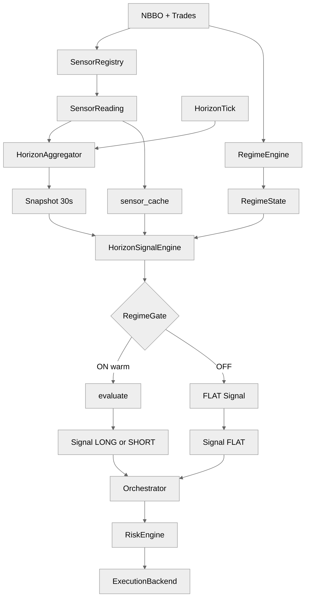
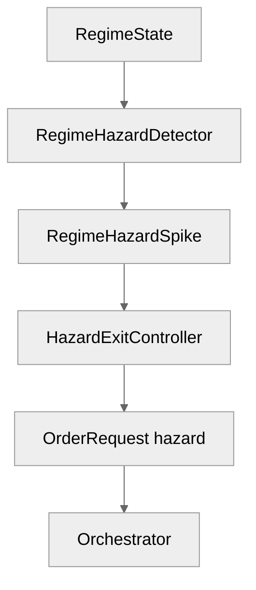

# `sig_hawkes_burst_v1` — architecture and operator knobs

This note documents the shipped SIGNAL alpha [`alphas/sig_hawkes_burst_v1/sig_hawkes_burst_v1.alpha.yaml`](../../alphas/sig_hawkes_burst_v1/sig_hawkes_burst_v1.alpha.yaml): Hawkes burst **momentum** on a **30 s** horizon, optional **hazard exit**, and how sensors/features/regime/execution interact. Platform contracts: [`docs/three_layer_architecture.md`](../three_layer_architecture.md).

---

## 1. End-to-end architecture

**Horizon:** `horizon_seconds: 30` — evaluation fires on **30 s** `HorizonFeatureSnapshot` boundaries only.

**How to read:** ASCII = main path + hazard side-path; Mermaid = two small charts (main + hazard).

```
  MAIN PATH (every snapshot)
  ===========================
  NBBO + Trades
       +-----------+-----------+
       |           |           |
       v           v           v
  SensorReg    RegimeEng   (same feed)
       |           |
       v           v
  SensorRead    RegimeState
       |           |
       +-----+-----+
             |
     HorizonAggregator <--- HorizonTick
             |
             v
      Snapshot (30s) --------+
             |                |
             v                v
     HorizonSignalEngine <-- sensor_cache
             |
      +------+------+
      v             v
  RegimeGate    warm/stale
      |
 +----+----+
 v         v
evaluate   FLAT Signal
 |         |
 v         v
LONG/SHORT  (unwind)
    \       /
     v     v
 Orchestrator -> Risk -> Backend


  HAZARD SIDE-PATH (optional; when hazard_exit.enabled on any alpha)
  ==================================================================
  RegimeState --> RegimeHazardDetector --> RegimeHazardSpike (bus)
                                              |
                                              v
                               HazardExitController (PORTFOLIO policies only)
                                              |
                                              v
                               OrderRequest (HAZARD_SPIKE / HARD_EXIT_AGE)
                                              |
                                              +----> Orchestrator (same bus)
```





**`hazard_exit` block (this SIGNAL alpha):** `bootstrap._create_hazard_detector` turns on **`RegimeHazardDetector`** when **any** registered alpha’s manifest has **`hazard_exit.enabled: true`**, so **`RegimeHazardSpike`** events can be published on regime transitions. **`HazardExitController`** (which subscribes to spikes and emits **`OrderRequest`** exits) is constructed in **`_create_composition_layer`** only for alphas in **`portfolio_modules`** that opt in — **not** from SIGNAL modules alone. In a **SIGNAL-only** deployment, this alpha’s flag therefore **arms the detector** but typically leaves **`hazard_exit_controller=None`** unless a PORTFOLIO alpha also opts in.

The YAML field **`posterior_drop_threshold`** is preserved on **`AlphaManifest.hazard_exit`** by the loader’s permissive parse; it is **not** wired today to `HazardPolicy` (which uses keys such as **`hazard_score_threshold`**, **`min_age_seconds`**, **`hard_exit_age_seconds`** in `feelies.risk.hazard_exit`). Treat it as **documentation / forward-compatible metadata** unless a future PR maps it.

**Orthogonality:** **`regime_gate`** controls **Layer-2 signal emission** (ON/OFF latch + FLAT on OFF). **Hazard exits** (when a controller policy exists) flatten **open risk** from **`RegimeHazardSpike`** — a different path from the gate DSL.

---

## 2. Alpha mechanics — sensors and features

### 2.1 `depends_on_sensors`

| Sensor id | Role |
|-----------|------|
| `hawkes_intensity` | Tuple sensor (buy/sell intensities, etc.); platform rolls a **scalar z-score** over a reduced intensity (sum of configured tuple components). |
| `trade_through_rate` | Fraction of aggressive flow **walking the book** — confirms “cluster aggression.” |
| `ofi_ewma` | **Direction** of the burst (LONG if `ofi > 0` else SHORT) once intensity/trade-through filters pass. |
| `spread_z_30d` | Gate: keep bursts only in **tight** spread regimes vs history (cache scalar). |
| `realized_vol_30s` | Gate: **`realized_vol_30s_zscore`** caps participation in vol spikes. |

### 2.2 Sensor → `snapshot.values` (30 s horizon)

| Sensor | Horizon feature wiring | Keys |
|--------|-------------------------|------|
| `hawkes_intensity` | `RollingZscoreFeature(..., tuple_sum_component_indices=(0,1))` | **`hawkes_intensity_zscore`** (default feature id) |
| `trade_through_rate` | `SensorPassthroughFeature` | **`trade_through_rate`** |
| `ofi_ewma` | passthrough + z | **`ofi_ewma`** (level used in evaluate) |
| `realized_vol_30s` | passthrough + z | Gate: **`realized_vol_30s_zscore`** |
| `spread_z_30d` | none | Gate: **`spread_z_30d`** from **sensor_cache** |

### 2.3 `evaluate()` logic (condensed)

- Requires **`hawkes_intensity_zscore`**, **`trade_through_rate`**, **`ofi_ewma`** present in **`snapshot.values`**.
- **Intensity filter:** `z >= intensity_zscore_floor` (defaults **≥ 2σ** style burst). *Note:* the comparison is **one-sided on the positive z side**; strongly negative z never passes this branch.
- **Aggression filter:** `trade_through_rate >= trade_through_floor`.
- **Direction:** sign of **`ofi_ewma`** (level, not z).
- **Edge:** `min(z * edge_per_z_bps, edge_cap_bps)`.

### 2.4 `consumed_features`

Emitted `Signal.consumed_features` lists **sensor ids** from YAML (`depends_on_sensors`), not feature row names.

### 2.5 `depends_on_sensors` vs what `evaluate()` reads

`ofi_ewma` is declared in **`depends_on_sensors`**, so bootstrap adds **both** **`ofi_ewma`** and **`ofi_ewma_zscore`** to **`required_warm_feature_ids`** (passthrough + rolling-z features). The shipped **`evaluate()`** uses only the **level** **`ofi_ewma`** for direction, but dispatch still requires the **z-score row** to be warm/non-stale when it appears in `snapshot.warm` / `snapshot.stale` for those keys. Removing unused sensors from `depends_on_sensors` (if G6/G16 still allow) tightens warm-up requirements.

---

## 3. Regime adaptation

- **`on_condition`:** `P(normal) > 0.6 and spread_z_30d < 1.0` — bursts only when HMM “normal” dominates **and** spread is not elevated vs history.

- **`off_condition`:** `P(normal) < 0.4 or spread_z_30d > 2.5 or realized_vol_30s_zscore > 3.5`.

- **Hysteresis constants** in YAML are available to the DSL as `posterior_margin` / `percentile_margin` but are **not referenced** by the current literal thresholds.

- **Warm/stale:** Gate references **`realized_vol_30s_zscore`** → that feature id participates in **`required_warm_feature_ids`** at 30 s even if only used in `off_condition`.

- **`spread_z_30d`:** cache-only for the gate (no horizon feature id); **not** part of **`required_warm_feature_ids`** via the sensor→feature map.

### 3.2 Gate ON vs burst `evaluate()`

Even when the gate is ON and warm checks pass, **`evaluate()`** returns **`None`** if intensity z is below floor, **TTR** is below floor, or **`abs(ofi) < 1e-9`** (near-zero OFI is explicitly guarded before the direction assignment, returning `None` rather than defaulting to SHORT).

---

## 4. Parameter knobs

### 4.1 Alpha `parameters:` (`parameter_overrides` key: **`sig_hawkes_burst_v1`**)

| Parameter | Effect |
|-----------|--------|
| `intensity_zscore_floor` | Minimum **`hawkes_intensity_zscore`** to trade; raises bar on burst strength. |
| `trade_through_floor` | Minimum **`trade_through_rate`**; higher ⇒ require more aggressive book-walking. |
| `edge_per_z_bps` | Edge scales with intensity z (before cap). |
| `edge_cap_bps` | Hard cap on `edge_estimate_bps`. |

### 4.2 Sensor `params` (`platform.yaml` → `sensor_specs`)

Control Hawkes tuple estimation, OFI decay, spread window, vol window, etc. These shape **raw readings** and **warm** transitions — not the alpha’s `edge_per_z_bps` unless you change sensor code.

### 4.3 `hazard_exit` manifest

- **`enabled: true`** — participates in the **“any alpha opted in”** check that constructs **`RegimeHazardDetector`** (`bootstrap._create_hazard_detector`), enabling **`RegimeHazardSpike`** on the bus when regime posteriors show configured departure behaviour.

- **`HazardExitController`** policies (thresholds that actually emit **`OrderRequest`** hazard exits) are registered today only from **`layer: PORTFOLIO`** alphas in **`_create_composition_layer`**. A SIGNAL-only stack therefore usually **does not** attach exit policies for `sig_hawkes_burst_v1` even though the detector runs.

- **`posterior_drop_threshold`** — stored on the manifest; **no** current consumer maps this string to `HazardPolicy` fields. Prefer documented keys (`hazard_score_threshold`, …) on PORTFOLIO specs if you need live hazard exits.

### 4.4 `cost_arithmetic`, `risk_budget`, execution

Tighter **`risk_budget`** (small max position / gross %) matches the **short half-life** (30 s) burst story. **Execution** remains platform **`ExecutionBackend`** + router settings.

---

## 5. Mental model

1. Trades + quotes feed **Hawkes** and **trade-through** sensors.  
2. At each **30 s** boundary, snapshot carries **intensity z**, **TTR level**, **OFI level**.  
3. **Gate** requires **normal** HMM + calm **spread**; **vol z** can force OFF.  
4. **evaluate** rides **positive intensity excursions** with aggressive **TTR**, direction from **OFI**.  
5. **`hazard_exit.enabled`** turns on **`RegimeHazardDetector`** for the process; **`HazardExitController`** order exits require a **PORTFOLIO** hazard policy in typical bootstrap wiring. **`posterior_drop_threshold`** is manifest metadata today, not a live `HazardPolicy` knob.

If you generalize to **negative** intensity spikes, adjust the **`z < floor` → `abs(z)`** style logic in the alpha code and re-validate G16 / entry-direction invariants.
