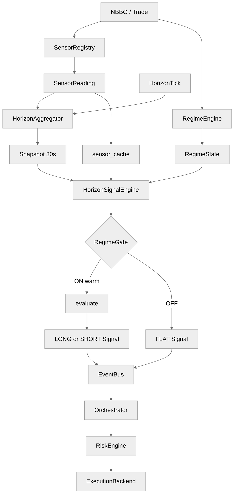

# `sig_inventory_revert_v1` — architecture and operator knobs

This note walks through the shipped example alpha [`alphas/sig_inventory_revert_v1/sig_inventory_revert_v1.alpha.yaml`](../../alphas/sig_inventory_revert_v1/sig_inventory_revert_v1.alpha.yaml): how Layer-1 sensors become inputs, how the regime gate adapts participation, how YAML parameters differ from platform sensor/bootstrap settings, and how signals reach execution. For platform-wide contracts (determinism, gate DSL whitelist, G16), see [`docs/three_layer_architecture.md`](../three_layer_architecture.md).

---

## 1. End-to-end architecture

The alpha is a **horizon-anchored SIGNAL** (`horizon_seconds: 30`). It does **not** declare inline Layer-2 features in YAML; instead it lists **`depends_on_sensors`**, and the platform derives **horizon features** at bootstrap from `platform.yaml` `sensor_specs` plus the internal sensor→feature map (`_horizon_features_for` in `bootstrap.py`). The **`HorizonSignalEngine`** evaluates the compiled `signal:` block on each matching **`HorizonFeatureSnapshot`**, after a **`RegimeGate`** decision and warm/stale checks.

**How to read the diagrams:** the **ASCII** block is readable in any editor preview; the **Mermaid** block is a compact single-column flow (no nested boxes) for renderers that support Mermaid zoom.

```
                    +------------------+
                    | NBBOQuote / Trade|
                    +--------+---------+
                             |
              +--------------+---------------+
              |                              |
              v                              v
     +----------------+            +----------------+
     | SensorRegistry |            | RegimeEngine   |
     +--------+-------+            +--------+-------+
              |                              |
              v                              v
     +----------------+            +----------------+
     | SensorReading  |            | RegimeState    |
     +--------+-------+            +--------+-------+
              |                              |
              +----------+---------+---------+
                         |         |
                         v         v
              +----------------+  +----------------+
              |HorizonAggregator|  | sensor_cache   |
              +--------+--------+  +--------+-------+
                       |                   |
              +--------+--------+          |
              | HorizonScheduler|          |
              +--------+--------+          |
                       |                   |
                       v                   v
              +----------------+   +----------------+
              | Snapshot @30s  |   | latest scalars |
              +--------+-------+   +--------+-------+
                       \         /
                        v       v
                 +---------------------+
                 | HorizonSignalEngine |
                 +----------+----------+
                            |
                     +------+------+
                     v             v
              +------------+ +------------+
              | RegimeGate | | warm/stale |
              +------+-----+ +------------+
                     |
            +--------+---------+
            v                  v
     +-------------+   +-------------+
     | evaluate()  |   | FLAT unwind |
     +------+------+   +------+------+
            |                 |
            v                 v
     +-------------+   +-------------+
     | LONG/SHORT  |   | FLAT Signal |
     |   Signal    |   +------+------+
     +------+------+          |
            \                 /
             v               v
          +---------------------+
          |      EventBus       |
          +----------+----------+
                     v
          +---------------------+
          |    Orchestrator     |
          +----------+----------+
                     v
          +---------------------+
          |     RiskEngine      |
          +----------+----------+
                     v
          +---------------------+
          |  ExecutionBackend   |
          +---------------------+
```



**Binding priority (gate and snapshot semantics):** For each symbol, `HorizonSignalEngine._build_bindings` starts from `snapshot.values` (values **at the horizon boundary** from `HorizonAggregator`) and **only then** fills missing keys from the **latest warm** `SensorReading` cache. So features in the snapshot win over stale-by-definition intra-bar cache entries. Since audit **P1-6**, every sensor this alpha declares — including `spread_z_30d` — has a registered horizon feature, so all gate identifiers resolve from the snapshot first; the cache path remains a fallback for sensors with no feature row.

---

## 2. Alpha mechanics — sensors and “features”

### 2.1 Declared sensors (`depends_on_sensors`)

| Sensor id | Role in the hypothesis | Typical reading |
|-----------|------------------------|-----------------|
| `quote_replenish_asymmetry` | Core **inventory** signature: asymmetric replenishment of bid vs ask depth after quotes. | Scalar in `[-1, 1]`; positive ⇒ bid-side replenishment faster. |
| `quote_hazard_rate` | Qualifies **active** quoting / ladder refresh; low values ⇒ “stale ladder,” weak inventory read. | Hazard-style rate in configured window. |
| `spread_z_30d` | **Stress / friction** context: wide vs own 30-day distribution (sensor already emits a z-like statistic). | Used in **regime_gate** and `trend_mechanism.failure_signature`, not in `evaluate()`. |
| `realized_vol_30s` | **Volatility stress**: suppress trading when short vol is extreme vs its rolling history. | Gate uses `realized_vol_30s_zscore` (see below). |

Sensor implementations live under `src/feelies/sensors/impl/` (e.g. `quote_replenish_asymmetry.py`, `quote_hazard_rate.py`, `spread_z_30d.py`, `realized_vol_30s.py`). Their **constructor parameters** come from **`platform.yaml` → `sensor_specs[].params`**, not from the alpha YAML `parameters:` block.

### 2.2 How sensors become `snapshot.values` keys

Bootstrap builds **`HorizonFeature`** instances per `(sensor_id, horizon)` when the sensor has a mapping in `_horizon_features_for`:

| Sensor | Horizon features at 30s (examples) | Keys in `HorizonFeatureSnapshot.values` |
|--------|-------------------------------------|-------------------------------------------|
| `quote_replenish_asymmetry` | `HorizonWindowedFeature` (z-score reducer) | `quote_replenish_asymmetry_zscore` |
| `quote_hazard_rate` | `SensorPassthroughFeature` | `quote_hazard_rate` |
| `realized_vol_30s` | passthrough + rolling z | `realized_vol_30s`, `realized_vol_30s_zscore` |
| `spread_z_30d` | `SensorPassthroughFeature` (**P1-6**; the sensor is stats-complete so the row is a passthrough of its z-like statistic) | `spread_z_30d` — gate reads the snapshot boundary value (cache fallback) |

The alpha’s **`evaluate()`** body only pulls:

- `snapshot.values["quote_replenish_asymmetry_zscore"]`
- `snapshot.values["quote_hazard_rate"]`

So **microstructure entry logic** is entirely those horizon-boundary aggregates (plus alpha `parameters`). **Stress gating** uses `spread_z_30d` and `realized_vol_30s_zscore` in **`regime_gate`**, resolved through bindings (snapshot + cache as above).

### 2.3 `consumed_features` on emitted `Signal`

The loader sets `consumed_features` on the registered module to the **sensor id tuple** from `depends_on_sensors` (provenance / parity tooling), which is **not** the same as the string keys inside `snapshot.values` (those are **feature_id** names like `…_zscore`). Do not confuse the two when reading logs or hash baselines.

---

## 3. Regime adaptation

### 3.1 Two different “regime” ideas

1. **`RegimeState` (HMM)** — `regime_gate.regime_engine: hmm_3state_fractional` selects which cached `RegimeState` the gate reads (`P(normal)`, `dominant`, etc.). This is **market-state adaptation** (e.g. require enough mass on `normal` before arming).
2. **`regime_gate` conditions** — Boolean DSL over posteriors **and** microstructure bindings (`quote_replenish_asymmetry_zscore`, `spread_z_30d`, `realized_vol_30s_zscore`). This is **alpha-level arming** layered on top of the HMM.

### 3.2 This alpha’s gate (latch + hysteresis band)

- **`on_condition`** (BT-12 “inventory-dominant only” tightening): `abs(quote_replenish_asymmetry_zscore) > 2.0 and dominant == "normal" and P(normal) > 0.65 and P(vol_breakout) < 0.20`  
  Arms only when the inventory signature is already extreme, **normal is the dominant HMM state** with high posterior mass, **and** vol-breakout mass (an informed-flow proxy) is low — the fade is only safe when displacement is inventory-driven, not informational.

- **`off_condition`:** `dominant != "normal" or P(normal) < 0.5 - posterior_margin or P(vol_breakout) > 0.30 or abs(quote_replenish_asymmetry_zscore) < 2.0 - percentile_margin or spread_z_30d > 2.0 or realized_vol_30s_zscore > 3.5 or quote_hazard_rate < 4.0`
  Disarms on **dominant-state flip**, **regime deterioration** (P(normal) < 0.30 with defaults), **vol-breakout mass rising** (> 0.30), **asymmetry loss** (signature falls below hysteresis band), **wide spread vs history**, **vol spike**, or **ladder thinning** (`quote_hazard_rate` drops back below the hazard floor).

- **Hysteresis:** `posterior_margin` (0.20) and `percentile_margin` (0.30) are injected into the gate binding map, and **this spec’s `off_condition` references both** (`P(normal) < 0.5 - posterior_margin`, `abs(asym_z) < 2.0 - percentile_margin`), producing genuine ON/OFF deadbands. The gate is a **proper latch**: when ON, only `off_condition` is tested; when OFF, only `on_condition`; if neither fires, the prior state holds.

### 3.3 Warm / stale gating (Layer-2 safety)

Before the gate runs, `HorizonSignalEngine` can suppress the whole tick if required **feature_id** keys (derived from `depends_on_sensors` **and** gate identifiers ending in `_zscore` / `_percentile`) are cold or stale in `snapshot.warm` / `snapshot.stale`. For this alpha, that includes **`realized_vol_30s_zscore`** because it appears in `off_condition`, even though `evaluate()` does not use it.

If a binding goes missing mid-session (sensor returns cold), the engine fail-safes: gate resets, and if the gate was ON it may emit a **FLAT** `Signal` for unwind attribution.

### 3.4 Gate ON vs `evaluate()` returning a signal

**`regime_gate` ON** only means the latch allows the engine to **call** `evaluate()` on each matching snapshot. **`evaluate()`** can still return **`None`** (e.g. `hazard_floor`, `cost_floor_bps`, or asymmetry below `asymmetry_z_threshold` even when the gate armed on the same z-threshold in `on_condition`). Do not equate “gate ON” with “will publish LONG/SHORT this boundary.”

### 3.5 `spread_z_30d` warm/stale (post-P1-6)

`bootstrap._required_warm_feature_ids_for_signal_alpha` unions (a) every **feature_id** derived from `depends_on_sensors` at this horizon, and (b) gate AST names ending in **`_zscore`** / **`_percentile`**, plus bare sensor names mapped through `_feature_ids_for_sensor_at_horizon`. Since audit **P1-6**, `spread_z_30d` has a passthrough feature row, so the bare `spread_z_30d` feature_id **is** a `required_warm_feature_ids` key — and the snapshot row gives the identifier a horizon-staleness path (a silent sensor marks the row stale and suppresses dispatch), which the old cache-only path lacked.

---

## 4. Parameter knobs — who owns what

### 4.1 Alpha YAML `parameters:` → `evaluate(..., params)`

These are **merged at load** with optional **`platform.yaml` → `parameter_overrides:`** keyed by **`alpha_id`** (`sig_inventory_revert_v1`). They are the **only** knobs the Python `evaluate()` function reads (`params["asymmetry_z_threshold"]`, etc.). They **do not** change sensor math unless you change code to read them (the shipped `evaluate` does not).

| Parameter | Effect |
|-----------|--------|
| `asymmetry_z_threshold` | Minimum `abs(quote_replenish_asymmetry_zscore)` before a directional signal is considered. Higher ⇒ fewer, “cleaner” fades. The gate’s `> 2.0` literal must match this default (the gate DSL cannot read `parameters:`), so sweeps below 2.0 are silently floored by the gate — see the YAML comment block. |
| `hazard_floor` | Minimum `quote_hazard_rate` from the snapshot; below ⇒ no signal (stale ladder guard). Must stay in sync with the gate's `quote_hazard_rate < 4.0` literal. |
| `hazard_band` | Width of the soft ramp above `hazard_floor` (events/s). Edge is scaled by `clip((hazard - hazard_floor) / hazard_band, 0, 1)` so marginally-active ladders contribute proportionally rather than clipping at the floor. |
| `edge_per_z_bps` | Linear scaling of `edge_estimate_bps` in excess of the z-threshold. |
| `edge_cap_bps` | Hard cap on *theoretical peak* edge; runtime capturable edge is further reduced by `realized_capture_ratio`, `hazard_weight`, and `vol_weight`. |
| `realized_capture_ratio` | Fraction of theoretical peak edge capturable over `horizon_seconds` given `expected_half_life_seconds`. Derived as `1 - 0.5^(horizon/half_life)` = **0.646** with defaults (30 s / 20 s). Must be recomputed if `trend_mechanism` fields change. |
| `vol_taper_z_scale` | Linear taper scale on `realized_vol_30s_zscore`; edge decays smoothly to zero as vol z approaches the gate's hard disarm threshold. |
| `cost_floor_bps` | Minimum modeled edge before emitting a signal; works with the alpha’s own `cost_arithmetic` disclosure narrative (see YAML comment on one-way vs round-trip). |

**`cost_arithmetic` vs `cost_floor_bps`:** **G12** validates the **`cost_arithmetic:`** block at **load time** (margin ratio, component reconciliation). **`cost_floor_bps`** is a **runtime** threshold inside `evaluate()` only — it does **not** re-validate G12 and can be set independently (authors should keep the economics story coherent).

**Load-time validation:** min/max/description live in the manifest schema; invalid combinations fail at **alpha load**, not at runtime.

### 4.2 `platform.yaml` sensor `params:` → `SensorReading.value`

Example: `quote_replenish_asymmetry` uses `window_seconds`, `min_observations` under `sensor_specs`. These control **how fast** the raw asymmetry moves and when the sensor flips **`warm`**, which in turn drives whether z-score features receive valid inputs. They are **independent** of alpha `parameters` unless you coordinate them by hand.

### 4.3 Bootstrap composition

- **`horizons_seconds`:** must include **`30`** or this alpha cannot register (G7 / horizon whitelist).
- **`sensor_specs`:** must list every `depends_on_sensors` entry **or** bootstrap logs **H3/M2** warnings for uncovered ids (`snapshot.values.get` / gate bindings may be `None`).
- **`_horizon_features_for`:** defines which sensors get z-scores / passthroughs at each horizon; extending a new sensor for alphas usually means adding a branch here **and** a `sensor_specs` row.

### 4.4 `cost_arithmetic` and execution

- **`cost_arithmetic`:** validated at load (**G12** margin ratio, component reconciliation). The engine stamps **`disclosed_cost_total_bps`** / **`disclosed_margin_ratio`** onto each emitted `Signal` from this block — **structural disclosure and forensics**, not the fill simulator’s only input.
- **`risk_budget`:** alpha-level limits (`max_position_per_symbol`, `max_gross_exposure_pct`, …) are part of the manifest consumed when wiring **risk** and lifecycle; they are not the same as `parameters` inside `evaluate()`.
- **Execution path:** `Signal` → orchestrator → **`RiskEngine`** (platform + per-alpha constraints) → **`OrderRequest`** → **`ExecutionBackend`** (latency, costs, router). Tuning **fill latency**, **cost model**, or **passive vs market** mode is **`platform.yaml` / bootstrap execution kwargs**, not the alpha `parameters:` block.

### 4.5 `trend_mechanism` (G16)

The **`INVENTORY`** family, **`expected_half_life_seconds`**, **`l1_signature_sensors`**, and **`failure_signature`** exist for **load-time gate G16**, promotion / forensics grouping (`Signal.trend_mechanism`, `Signal.expected_half_life_seconds`), and operator documentation. They do **not** auto-modify sensor formulas; they constrain what the alpha is allowed to claim about mechanism vs declared sensors.

---

## 5. Mental model summary

1. **NBBO** updates sensors continuously → **readings** on the bus.  
2. Every **30s boundary**, the aggregator writes a **snapshot** of horizon features (z-scores / levels) for symbols with active features.  
3. **`HorizonSignalEngine`** merges snapshot + latest warm sensor scalars for **gate** bindings, runs the **latch**, then runs **`evaluate()`** if ON and warm.  
4. **`Signal`** events carry mechanism + disclosed cost metadata; **risk + backend** decide executable size and fills.

For edits to this alpha, keep **gate identifiers** and **`snapshot.values` keys** consistent (e.g. if you add `vpin_50bucket_zscore` to the gate, ensure that feature exists at `horizon_seconds: 30` or you will hit missing-binding fail-safe paths).
