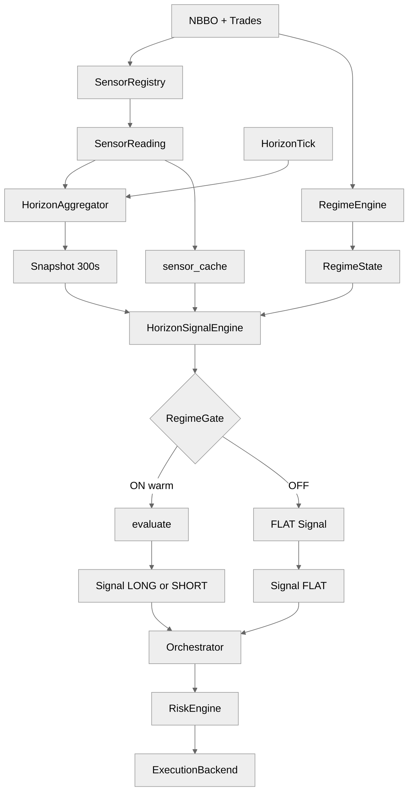

# `sig_kyle_drift_v1` — architecture and operator knobs

This note documents the shipped SIGNAL alpha [`alphas/sig_kyle_drift_v1/sig_kyle_drift_v1.alpha.yaml`](../../alphas/sig_kyle_drift_v1/sig_kyle_drift_v1.alpha.yaml): **Kyle λ** + **OFI** drift on a **300 s (5 min)** horizon. See [`docs/three_layer_architecture.md`](../three_layer_architecture.md) for global architecture.

---

## 1. End-to-end architecture

**Horizon:** `horizon_seconds: 300` — the `HorizonSignalEngine` matches snapshots on the **five-minute** bucket only.

**How to read:** ASCII pipeline + single-column Mermaid (300s snapshot).

```
  NBBO + Trades
       +-----------+-----------+
       |           |           |
       v           v           v
  SensorRegistry RegimeEngine (feed)
       |           |
       v           v
  SensorReading RegimeState
       |           |
       +-----+-----+
             |
     HorizonAggregator <--- HorizonTick
             |
             v
   HorizonFeatureSnapshot (300s / 5 min)
             |
     +-------v--------+
     | sensor_cache |
     +-------+--------+
             |
             v
   HorizonSignalEngine
             |
      +------+------+
      v             v
  RegimeGate    warm/stale
      |
 +----+----+
 v         v
evaluate   FLAT
 |         |
 v         v
LONG/SHORT  FLAT
 Signal     Signal
     \       /
      v     v
   Orchestrator --> RiskEngine --> ExecutionBackend
```



**Bindings:** `spread_z_30d` is **cache-only** (no horizon feature row). **`realized_vol_30s_zscore`** comes from the **snapshot** at the 300 s boundary.

---

## 2. Alpha mechanics — sensors and features

### 2.1 `depends_on_sensors`

| Sensor id | Role |
|-----------|------|
| `kyle_lambda_60s` | Rolling **Kyle λ** estimate; **percentile** gates “actively informed” regimes; **z-score** scales edge when present. |
| `ofi_ewma` | **Direction** (`LONG` if `ofi > 0`) and **strength** scaling; magnitude filter via `ofi_threshold`. |
| `micro_price` | Declared dependency / mechanism context (G16 fingerprint list); **not read** in the shipped `evaluate()` body. |
| `spread_z_30d` | Gate friction / toxicity (cache scalar). |
| `realized_vol_30s` | Gate stress via **`realized_vol_30s_zscore`**. |

### 2.2 Sensor → `snapshot.values` (300 s horizon)

| Sensor | Horizon features | Keys used by this alpha |
|--------|------------------|-------------------------|
| `kyle_lambda_60s` | rolling z + rolling percentile | **`kyle_lambda_60s_percentile`**, **`kyle_lambda_60s_zscore`** (optional for edge magnitude) |
| `ofi_ewma` | passthrough + z | **`ofi_ewma`** (level for direction + `abs(ofi)` filter) |
| `micro_price` | passthrough + z | *(not referenced in inline evaluate)* |
| `realized_vol_30s` | passthrough + z | Gate: **`realized_vol_30s_zscore`** |
| `spread_z_30d` | none | Gate: **`spread_z_30d`** |

### 2.3 `evaluate()` logic (condensed)

- Requires **`kyle_lambda_60s_percentile`** and **`ofi_ewma`**.
- **`lam_pct < lambda_percentile_floor`** → no trade (default: need λ above **70th** percentile of rolling distribution at boundary).
- **`abs(ofi) < ofi_threshold`** → no trade (weak flow).
- **Direction:** sign of **`ofi_ewma`**.
- **Edge:** `min(max(magnitude, 0) * edge_per_lambda_bps, edge_cap_bps)` where **`magnitude`** prefers **`kyle_lambda_60s_zscore`** if present, else a deterministic fallback from **`(lam_pct - 0.5) * 4.0`**.

### 2.4 G16 `trend_mechanism`

**`KYLE_INFO`** with **`expected_half_life_seconds: 600`** vs **`horizon_seconds: 300`** satisfies the platform horizon / half-life ratio band (ratio **0.5** at the platform floor). **`l1_signature_sensors`** lists the mechanism’s declared L1 anchors (load-time registration check against registered `sensor_specs`).

### 2.5 `micro_price` declared but unused in `evaluate()`

Because **`micro_price`** is listed in **`depends_on_sensors`**, bootstrap registers **`micro_price`** and **`micro_price_zscore`** (and any other rows from `_horizon_features_for`) as **required warm feature ids** at the **300 s** horizon alongside **`kyle_lambda_60s_*`** and **`ofi_ewma_*`**. The shipped **`evaluate()`** never reads them, but **`HorizonSignalEngine`** can still **suppress** the whole boundary if those rows are cold/stale when present under the warm/stale maps — i.e. **unused dependencies still affect readiness**. To drop that cost, remove `micro_price` from `depends_on_sensors` **only if** G6/G16 and your mechanism story still validate (G16 fingerprint list is separate from `depends_on_sensors`).

---

## 3. Regime adaptation

- **`on_condition`:** `P(normal) > 0.6 and spread_z_30d <= 1.0` — require orderly HMM state and **non-wide** spread vs history.

- **`off_condition`:** `P(normal) < 0.4 or spread_z_30d > 2.0 or realized_vol_30s_zscore > 3.5`.

- **Hysteresis** margins are declared but **not referenced** in the literal strings; latch semantics still apply (ON/OFF deadband).

- **Warm/stale:** Any `*_zscore` / `*_percentile` token in the gate adds to **`required_warm_feature_ids`** — includes **`realized_vol_30s_zscore`**.

- **`spread_z_30d`:** gate-only, **sensor_cache**; not promoted via `_horizon_features_for`, so **no** dedicated snapshot warm row for that identifier.

### 3.2 Gate ON vs `evaluate()`

**Gate ON** does not guarantee a trade: **`lam_pct`** can sit below **`lambda_percentile_floor`**, **\|ofi\|** below **`ofi_threshold`**, or **`lam_z`** may be negative while percentile passes, shrinking edge via `max(magnitude, 0)`.

---

## 4. Parameter knobs

### 4.1 Alpha `parameters:` (`parameter_overrides`: **`sig_kyle_drift_v1`**)

| Parameter | Effect |
|-----------|--------|
| `lambda_percentile_floor` | Minimum **`kyle_lambda_60s_percentile`** to trade (default **0.7**). |
| `ofi_threshold` | Minimum **\|ofi_ewma\|** (level units) for participation. |
| `edge_per_lambda_bps` | Scales edge with λ **z** or percentile-derived magnitude. |
| `edge_cap_bps` | Hard cap on `edge_estimate_bps`. |

### 4.2 Sensor `params` (`sensor_specs`)

`kyle_lambda_60s` windowing / estimation stability, OFI decay, vol window — change **how fast** percentiles/z-scores move at the **300 s** boundary.

### 4.3 Bootstrap

- **`horizons_seconds`** must include **300**.
- **`kyle_lambda_60s`** must be registered if used (G6 + G16).

### 4.4 `cost_arithmetic`, `risk_budget`, execution

Standard SIGNAL split: G12 stamps disclosures on **`Signal`**; **`risk_budget`** is alpha-level risk envelope; fills come from **`ExecutionBackend`** configuration.

---

## 5. Mental model

1. **λ̂** and **OFI** summarize informed pressure on different timescales (λ sensor internally ~60 s; alpha **harvests** on **300 s** buckets).  
2. Gate keeps the strategy out of **toxic spread** and **vol blow-ups** while HMM is not **normal**.  
3. **evaluate** is a **percentile-triggered, OFI-directed** drift catcher with λ-shaped edge sizing.  
4. **`micro_price`** is part of the declared sensor set / G16 story but **not** used in the current Python gate/signal body — add alignment checks if you want stricter L1 footprint confirmation (as in `sig_benign_midcap_v1`).
