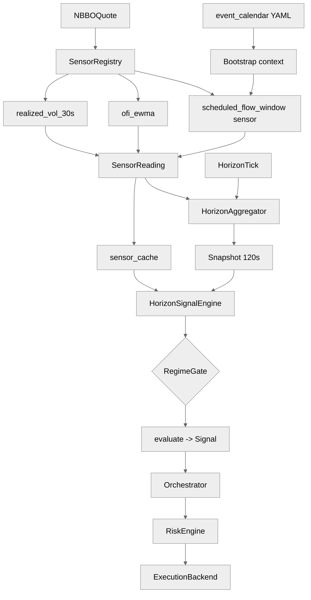

# `sig_moc_imbalance_v1` — architecture and operator knobs

This note documents the shipped SIGNAL alpha [`alphas/sig_moc_imbalance_v1/sig_moc_imbalance_v1.alpha.yaml`](../../alphas/sig_moc_imbalance_v1/sig_moc_imbalance_v1.alpha.yaml): **scheduled closing-flow** (MOC-style window) + **OFI confirmation** on a **120 s** horizon. Calendar wiring is **platform-level**. See [`docs/three_layer_architecture.md`](../three_layer_architecture.md).

---

## 1. End-to-end architecture

**Horizon:** `horizon_seconds: 120` — signal evaluation aligns to **2-minute** horizon snapshots.

**Calendar:** `scheduled_flow_window` is driven by **`platform.yaml` → `event_calendar_path`** (and related bootstrap injection) so “MOC window open” is **deterministic** for replay given the same calendar artefact.

**How to read:** ASCII shows calendar injection first; Mermaid is a vertical spine (larger type in Mermaid where `%%init%%` is supported).

```
  platform.yaml  event_calendar_path
                 |
                 v
          Bootstrap / sensor context
                 |
                 v
         scheduled_flow_window sensor
                 |
  NBBOQuote ------+--------+------------------+
                  |        |                  |
                  v        v                  v
           SensorRegistry  ofi_ewma    realized_vol_30s
                  |
                  v
            SensorReading (+ tuple fan-out)
                  |
          +-------+--------+
          |                |
          v                v
   HorizonAggregator   sensor_cache
          ^
          |
    HorizonScheduler
          |
          v
  HorizonFeatureSnapshot (120s)
          |
          v
  HorizonSignalEngine --> RegimeGate (calendar DSL)
          |
          v
      evaluate -> Signal -> Orchestrator -> Risk -> Backend
```



**Tuple sensor:** `scheduled_flow_window` publishes a **tuple** reading; `HorizonSignalEngine` fans scalar components into **`sensor_cache`** under stable names (`scheduled_flow_window_active`, `seconds_to_window_close`, …) per `horizon_engine._TUPLE_SENSOR_COMPONENTS`, while **`HorizonAggregator`** exposes **tuple-derived horizon features** (see below).

**`RegimeState`:** The gate strings reference **no regime identifiers** (no `P(...)`, no `dominant` — see the YAML’s **P2 GC-2** audit note), so the gate booleans never consult the HMM. **`regime_engine: hmm_3state_fractional`** is retained as the engine this alpha would attach to if regime conditions were added; other subsystems (risk scaling, hazard detector, forensics) still consume the same **`RegimeState`** stream.

---

## 2. Alpha mechanics — sensors and features

### 2.1 `depends_on_sensors`

| Sensor id | Role |
|-----------|------|
| `scheduled_flow_window` | Encodes **whether** a scheduled imbalance window is active, **seconds to close**, and a **signed flow-direction prior** (design §20.4.2-style tuple). |
| `ofi_ewma` | **Confirms** real-time order flow agrees in sign with the published prior. |
| `realized_vol_30s` | Stress guard: **`realized_vol_30s_zscore`** in gate `off_condition`. |

### 2.2 Sensor → `snapshot.values` (120 s)

From `bootstrap._horizon_features_for` for **`scheduled_flow_window`**:

| Logical field | Horizon feature id in snapshot |
|---------------|-------------------------------|
| Window active flag | **`scheduled_flow_window_active`** |
| Seconds remaining | **`seconds_to_window_close`** |
| Direction prior (signed) | **`scheduled_flow_window_direction_prior`** |

**`ofi_ewma`:** passthrough key **`ofi_ewma`** (evaluate uses **level**, not z).

**`realized_vol_30s`:** gate uses **`realized_vol_30s_zscore`**.

**Warm / stale:** `depends_on_sensors` pulls in **`ofi_ewma`** features (**passthrough + z-score**) and **`realized_vol_30s`** features — so **`ofi_ewma_zscore`** can be part of **`required_warm_feature_ids`** even though **`evaluate()`** only reads the **`ofi_ewma`** level. Tuple-derived ids from **`scheduled_flow_window`** are included via the same dependency expansion.

### 2.3 `evaluate()` logic (condensed)

- All of **`scheduled_flow_window_active`**, **`seconds_to_window_close`**, **`scheduled_flow_window_direction_prior`**, **`ofi_ewma`** must be present.
- **`active < 0.5`** → no signal (tolerance check, not strict equality, for forward-compat with fractional-active variants).
- **`remaining < min_seconds_to_close`** → no new entry (default **60 s** “no trade into the auction tail” — aligns with hypothesis text).
- **`abs(ofi) < ofi_agreement_threshold`** → no signal (weak confirmation).
- **Sign agreement:** `(prior > 0.5 and ofi > 0) or (prior < -0.5 and ofi < 0)` else `None` (half-step tolerance on the prior for forward-compat with smoothed priors).
- **Direction:** LONG if combined sign positive else SHORT.
- **Edge:** scales with **remaining time in minutes**, capped by **`edge_cap_bps`**.

### 2.4 `consumed_features`

Sensor id tuple from YAML for provenance on emitted **`Signal`**.

---

## 3. Regime adaptation

This alpha’s gate is **predominantly calendar- and vol-driven**, not HMM-posterior-driven:

- **`on_condition`:** `scheduled_flow_window_active == 1.0 and seconds_to_window_close > 60`  
  Arms when the **published window is active** and more than **60 s** remain (literal in gate; see also alpha param **`min_seconds_to_close`** default **60** — keep them coherent when tuning).

- **`off_condition`:** `scheduled_flow_window_active == 0.0 or seconds_to_window_close < 30 or realized_vol_30s_zscore > 3.5`  
  Disarms when the window closes, **within 30 s** of end (tighter than the entry margin), or on **vol stress**.

- **`regime_engine: hmm_3state_fractional`** is still declared; **`P(normal)` does not appear** in these conditions — per the YAML’s audit note (**P2 GC-2**) this alpha is **schedule-gated, not regime-gated**: the conditions reference no regime identifiers, so the gate never consults the posteriors. The key is retained as the engine the alpha would attach to if regime conditions were added; other platform components still consume the same `RegimeState` stream.

- **Hysteresis:** the `hysteresis:` block was **removed** from the YAML (P2 GC-2) — margins only matter when the expressions reference them explicitly, and these strings never did.

### 3.2 Gate ON vs `evaluate()`

The gate can latch **ON** while **`evaluate()`** returns **`None`** (e.g. **`abs(ofi)`** below **`ofi_agreement_threshold`**, sign mismatch between prior and OFI, or **`remaining`** below **`min_seconds_to_close`** even though the gate’s entry literal still allowed arming). Keep **`on_condition`** thresholds coherent with **`parameters:`** to avoid “armed but never fires” dead zones.

---

## 4. Parameter knobs

### 4.1 Alpha `parameters:` (`parameter_overrides`: **`sig_moc_imbalance_v1`**)

| Parameter | Effect |
|-----------|--------|
| `min_seconds_to_close` | Do not enter below this many seconds remaining (should align with gate / ops story). |
| `ofi_agreement_threshold` | Minimum **\|ofi_ewma\|** to treat flow as “confirming” the prior. |
| `edge_per_remaining_minute_bps` | Edge linear in **minutes left** in the window. |
| `edge_cap_bps` | Hard cap. |

### 4.2 Platform calendar + sensor `params`

- **`event_calendar_path`** in **`platform.yaml`** controls **which dates/sessions** expose an active `scheduled_flow_window` in replay — without a matching calendar, the alpha stays **structurally inactive** (consistent with falsification criteria in the YAML).

- **`scheduled_flow_window`** / **`ofi_ewma`** / **`realized_vol_30s`** **`sensor_specs[].params`** control how the tuple is built and how OFI/vol warm up.

### 4.3 Bootstrap

- **`horizons_seconds`** must include **120**.
- Tuple component mapping must stay in sync with gate identifiers (`scheduled_flow_window_active`, `seconds_to_window_close`, …).

### 4.4 `cost_arithmetic`, `risk_budget`, execution

Standard SIGNAL path: disclosures on **`Signal`**, **`risk_budget`** on the manifest, execution via **`ExecutionBackend`**.

---

## 5. Mental model

1. **Calendar** declares when the MOC / scheduled imbalance **window exists**.  
2. **`scheduled_flow_window`** sensor exposes **active / time-to-close / direction prior** into horizon features at **120 s** boundaries.  
3. **Gate** arms on **window active** + **time left**; disarms on **window end**, **near-close**, or **vol z**.  
4. **evaluate** demands **OFI** magnitude + **sign match** with the **prior**, then sizes edge by **time remaining**.  
5. **Risk + backend** execute orders; slippage risk near the match is mitigated by **dual** gate (`seconds_to_window_close` thresholds) + alpha **`min_seconds_to_close`**.

When changing thresholds, edit **gate literals** and **alpha parameters** together to avoid contradictory windows (e.g. gate ON while `evaluate` always returns `None`).
