<!--
  File:   docs/research/prompt_pack_00_architecture_verification.md
  Status: VERIFIED-WITH-DEFERRALS — architecture verified against source
          2026-07-07; all load-bearing claims CONFIRMED; 13 drift items
          recorded (doc omissions / stale counts / one partial behavioral
          drift), none contradicting a shipped safety or determinism
          contract. Open questions dispositioned per Task FQ-0 (see §(e)).
  Owner:  system-architect (cross-cutting; prompt-pack Task 1, Phase A).
-->

# Prompt-pack Task 1 — Architecture verification

Verification (not discovery) of the documented architecture against source,
per the audit-pack read order: `platform-invariants.mdc` → `karpathy-guidelines.mdc`
→ `.cursor/skills/README.md` → owning skills → source. Every fact below carries a
`path:line` citation against the working tree as of 2026-07-07. Line numbers are
1-based and will drift with future edits; treat the cited symbol as primary.

Method note: skills were read in full (system-architect, feature-engine,
microstructure-alpha, regime-detection, composition-layer, risk-engine,
backtest-engine, live-execution, data-engineering, alpha-lifecycle,
post-trade-forensics, research-workflow, testing-validation), then three
read-only source sweeps verified (i) tick-path wiring, (ii) execution/fill
layer, (iii) governance/forensics chain; event contracts, research machinery,
and guard files were verified directly.

---

## (a) Verified layer → module → interface table

### Event contracts (`src/feelies/core/events.py`)

| Contract | Verified facts | Citation |
|---|---|---|
| `Event` base | `timestamp_ns: int`, `correlation_id: str`, `sequence: int`, `source_layer: str = "UNKNOWN"` — the provenance triplet plus layer tag. Immutability is **shallow** (frozen dataclass; dict-valued fields mutable in place — documented caveat). | `core/events.py:30-54`, caveat `:39-48` |
| `NBBOQuote` | Timestamps: `timestamp_ns` (clock-derived, inherited), `exchange_timestamp_ns` (required), `participant_timestamp_ns: int \| None = None`, `trf_timestamp_ns: int \| None = None`, `received_ns: int \| None = None` (normalizer clock; static per-batch in REST replay). Sizes `bid_size`/`ask_size: int`; `bid`/`ask: Decimal`; `conditions: tuple[int, ...] = ()`; `indicators`, `sequence_number`, `tape`, `bid_exchange`/`ask_exchange`. | `core/events.py:60-90` |
| `Trade` | `price: Decimal`, `size: int`, `exchange_timestamp_ns` (required), `conditions: tuple[int, ...]` (preserved verbatim — no eligibility filtering at boundary, by design DI-09), `trf_id`, `trf_timestamp_ns`, `participant_timestamp_ns`, `correction`, `received_ns`, `trade_id`, `decimal_size`, `sequence_number`, `tape`. | `core/events.py:93-116` |
| `Signal` | `direction: SignalDirection (LONG/SHORT/FLAT)`, `strength: float`, `edge_estimate_bps: float`, `trend_mechanism: TrendMechanism \| None`, `expected_half_life_seconds: int = 0`; provenance triplet inherited from `Event`. Additional shipped fields beyond the skill summary: `disclosed_cost_total_bps`, `reversal_cost_estimate_bps` (B5), `disclosed_margin_ratio`, `layer: Literal["SIGNAL","PORTFOLIO"]`, `horizon_seconds`, `regime_gate_state: Literal["ON","OFF","N/A"]`, `consumed_features: tuple[str, ...]`, `metadata`. **`strength ∈ [0,1]` is a documented contract only — no runtime validation found** (dataclass, engine, arbitration all consume it unchecked; arbitration ranks by `edge_estimate_bps * strength`, `alpha/arbitration.py:79`). | `core/events.py:207-262` |
| `TrendMechanism` | Closed enum: `KYLE_INFO, INVENTORY, HAWKES_SELF_EXCITE, LIQUIDITY_STRESS, SCHEDULED_FLOW`. `EXIT_ONLY_MECHANISMS = {LIQUIDITY_STRESS}` is the single source of truth consumed by both the ranker and the SIGNAL-layer runtime guardrail. | `core/events.py:493-525` |
| `HorizonTick` | `horizon_seconds`, `boundary_index`, `session_id`, `scope: Literal["SYMBOL","UNIVERSE"]`, **two** boundary-time fields: `boundary_timestamp_ns: int = 0` (legacy) and `boundary_ts_ns: int = 0` (ENG-1 exact nominal boundary `session_open_ns + k·h·1e9`), plus `asof_timestamp_ns` property falling back to trigger time. | `core/events.py:584-620` |
| `HorizonFeatureSnapshot` | `values: dict[str, float]` (**warm features only**; cold absent, not 0.0), `warm`/`stale: dict[str, bool]` (**all** registered features), `source_sensors`, `feature_versions`, keyed by `feature_id`; `boundary_index`; plus `boundary_ts_ns` (ENG-1) and `parent_correlation_id` (audit spine). No separate z-score/percentile dicts — views are features under `<sensor_id>_zscore` / `_percentile` keys. | `core/events.py:648-692` |
| `RegimeState` | `engine_name`, `state_names`, `posteriors` (tuples), `dominant_state`, `dominant_name`, `horizon_seconds=0`, `stability=1.0`, `posterior_entropy_nats=0.0`, **plus `calibrated: bool = True` and `discriminability: float = inf`** (fail-safe gates: uncalibrated or non-discriminative posteriors make `P()`/`dominant`/`entropy` bindings unavailable → regime gates fail to OFF). Tie → lowest dominant index. | `core/events.py:153-201` |
| `RegimeHazardSpike` | `departing_state`, `departing_posterior_prev/now` (raw pair, no single `posterior_drop`), `incoming_state: str \| None`, `hazard_score` = `clip01((p_prev − p_now)/max(p_prev, ε))`. | `core/events.py:531-547` |
| `SizedPositionIntent` | `strategy_id`, `layer="PORTFOLIO"`, `target_positions: dict[str, TargetPosition]`, `factor_exposures`, `expected_turnover_usd`, `expected_gross_exposure_usd`, `mechanism_breakdown: dict[TrendMechanism, float]`, `disclosed_cost_total_bps_by_symbol`, **plus `decision_basis_hash: str = ""` and `solver_status: str = ""`** (both excluded from locked replay hashes). | `core/events.py:722-775` |
| `SensorReading` / `SensorProvenance` / `TargetPosition` | `SensorReading`: `sensor_id`, `sensor_version`, `value: float \| tuple`, `confidence=1.0`, `warm=True`, `provenance`, `parent_correlation_id`. `SensorProvenance` and `TargetPosition` (`target_usd` signed, `urgency=0.5`) are value objects, not events. | `core/events.py:553-578, 623-645` |
| `CrossSectionalContext` | `horizon_seconds`, `boundary_index`, `universe: tuple`, `signals_by_symbol`, `signals_by_strategy_by_symbol` (multi-horizon SIGNAL→PORTFOLIO fan-in), `snapshots_by_symbol`, `completeness: float = 0.0`. | `core/events.py:695-719` |

### Layer path as wired

| Stage | Module / interface | Verified mechanics | Citation |
|---|---|---|---|
| Ingestion boundary | `MassiveNormalizer.on_message(raw, received_ns, source) -> Sequence[NBBOQuote \| Trade]` | Single normalization boundary for REST + WS. | `ingestion/massive_normalizer.py:206, 306-311` |
| Replay feed | `ReplayFeed` (`MarketDataSource`) | Visibility: `market_data_visible_at_ns = exchange_timestamp_ns + market_data_latency_ns`; advances `SimulatedClock.set_time(visible_ns)` before yielding; raises `CausalityViolation` on merge-key regression. | `ingestion/replay_feed.py:29-34, 100-107, 90-98` |
| Data integrity SM | `DataHealth` | 4 states: HEALTHY ↔ {GAP_DETECTED, HALTED}; CORRUPTED terminal; GAP_DETECTED may also go HALTED. | `ingestion/data_integrity.py:31-58, 106` |
| M1 | Orchestrator | `_event_log.append(quote)` + `_bus.publish(quote)`; **sensor fan-out actually fires here as a bus side-effect of the M1 publish**, not as a direct call at SENSOR_UPDATE. | `kernel/orchestrator.py:2349-2359`; `sensors/registry.py:218-221` |
| M2 | `RegimeEngine.posterior(quote)` | Sole production call site (`_update_regime`); publishes `RegimeState`. | `kernel/orchestrator.py:2418-2423, 3511` |
| SENSOR_UPDATE | SM bookend | Body notes "sensors already ran via bus" — transition only. | `kernel/orchestrator.py:1930-1934` |
| HORIZON_CHECK | `HorizonScheduler.on_event(event)` → `bus.publish(tick)` | Integer-math boundary detection. | `kernel/orchestrator.py:1936-1947` |
| HORIZON_AGGREGATE | `HorizonAggregator` | Bus-subscribed (`attach()` to `HorizonTick`/`SensorReading`), not orchestrator-called; emits `HorizonFeatureSnapshot`. | `features/aggregator.py:339-340`; SM bookend `kernel/orchestrator.py:1956-1960` |
| SIGNAL_GATE | `HorizonSignalEngine` | Bus-subscribed to `HorizonFeatureSnapshot` (`signals/horizon_engine.py:282`). Gate first (`gate.evaluate`, `:407-411`; `if not on: return`, `:517-518`), warm/stale entry suppression via `required_warm_feature_ids` (`:148-152, 375-384, 530-539`), then `registered.signal.evaluate(snapshot, regime, registered.params)` (`:542-546`) — one publish per (alpha, symbol, boundary) (`:342-345, 592-593`); separate FLAT emission on gate ON→OFF (`:508-510, 614-634`). Protocol: `evaluate(self, snapshot, regime: RegimeState \| None, params) -> Signal \| None` (`signals/horizon_protocol.py:80-85`). | as cited |
| CROSS_SECTIONAL | `UniverseSynchronizer` → `CompositionEngine` | Synchronizer bus-subscribed to `HorizonFeatureSnapshot`/`Signal`/`HorizonTick` (`composition/synchronizer.py:202-204`); engine subscribed to `CrossSectionalContext` (`composition/engine.py:188-198`, subscribe `:197`). Orchestrator records a forensic bookend only (`kernel/orchestrator.py:2001-2005, 2433`). | as cited |
| PORTFOLIO risk path | `RiskEngine.check_sized_intent` | `_on_bus_sized_intent` buffers when a quote tick is in flight (`kernel/orchestrator.py:927, 6258-6261`); `_flush_pending_sized_intents` drains **before M3** (`:2434`) calling `check_sized_intent` (`:2056`) and walking M5–M10 micro transitions for those legs (`:2021-2128`); out-of-tick fail-safe path `_submit_portfolio_leg_without_micro_walk` (`:2137`). Per-leg orders: `for symbol in sorted(intent.target_positions)`, `reason="PORTFOLIO"` (`risk/sized_intent_orders.py:110, 142, 189`). | as cited |
| M3 | FEATURE_COMPUTE | **Body empty** — SM transition only (legacy hook, D.2). | `kernel/orchestrator.py:2437-2448`; `kernel/micro.py:76-79` |
| M4 | SIGNAL_EVALUATE | Drains bus-buffered `Signal` (`_select_bus_signal`). | `kernel/orchestrator.py:2451-2455, 2478` |
| Sizing / intent | `PositionSizer.compute_target_quantity` → `IntentTranslator.translate` | `kernel/orchestrator.py:2526, 3970-3975, 2583-2587` | |
| M5 | `RiskEngine.check_signal(signal, positions)` | `kernel/orchestrator.py:2623-2629` | |
| M6 | `_try_build_order_from_intent` + `RiskEngine.check_order` | Includes the B4 edge-vs-cost gate (below). | `kernel/orchestrator.py:2697-2701, 2801, 2828` |
| M7 / M8 | `OrderRouter.submit` / `poll_acks` | `kernel/orchestrator.py:3006-3018, 3064-3069, 5089` | |
| M9 / M10 | `_reconcile_fills` → `PositionUpdate`; finalize | `kernel/orchestrator.py:3075-3088, 3129-3133` | |
| MicroState enum order | M0, M1, M2, SENSOR_UPDATE, HORIZON_CHECK, HORIZON_AGGREGATE, SIGNAL_GATE, CROSS_SECTIONAL, M3…M10 | `kernel/micro.py:82-97`; M-number mapping `kernel/orchestrator.py:2172-2178` | |

### Execution

| Item | Verified facts | Citation |
|---|---|---|
| `OrderRouter` protocol | `submit(request) -> None`, `poll_acks() -> list[OrderAck]`; optional duck-typed `cancel_order(order_id) -> bool`. `ExecutionBackend(market_data, order_router, mode)`; `ExecutionMode ∈ {BACKTEST, PAPER, LIVE}`. | `execution/backend.py:73-79, 62-70, 89-99, 24-31` |
| `BacktestOrderRouter` fills | Cross-price taker: `cross = ask if BUY else bid` (`execution/market_fill.py:224`). D14 partial + walk-the-book on excess over L1 depth: `raw_impact = market_impact_factor · excess/depth · half_spread`, capped at `max_impact_half_spreads · half_spread` (`market_fill.py:259-299, 314-328`). Rejects: no quote / crossed-locked / zero depth / duplicate id (`execution/backtest_router.py:242-257, 287-295, 232-238`). | as cited |
| Fill-latency gating (both routers) | `backtest_fill_latency_ns` → router `_latency_ns`. Deferral deadline `max(clock.now_ns(), quote.exchange_timestamp_ns) + _latency_ns`; eligibility test `quote.exchange_timestamp_ns < fill_deadline_exchange_ns` → wait. Passive posts gate on `quote.exchange_timestamp_ns < pending.ack_timestamp_ns`. `market_data_latency_ns` is applied **only** in `ReplayFeed` (clock visibility), never inside routers. | `execution/backtest_router.py:273, 304-306, 325, 359-360`; `execution/passive_limit_router.py:377, 405-412, 425, 540, 589-593, 931`; `ingestion/replay_feed.py:102-107` |
| `PassiveLimitOrderRouter` | Through fill: `ask <= limit` (BUY) / `bid >= limit` (SELL) (`:704-715`). Level fill: seeded Bernoulli — `h0 = 1/passive_fill_delay_ticks` (`:207-214`), imbalance-scaled `hazard = h0 · 2·(opp_size/total_size)` clamped to `_fill_hazard_max` (`:777-790`), trial `_seeded_uniform(pending, quote) < hazard` (`:725-727`) where the uniform is SHA-256 over `symbol\|sequence_number\|exchange_ts\|ticks_at_level\|side\|limit_price\|order_id`, first 8 bytes / 2^64 (`:806-814`). Queue-depth mode `passive_queue_position_shares` fires when trades drain the modeled queue (`:280-295, 547, 765-768`). Cancel after `passive_max_resting_ticks` (`:594, 729-730`) → `OrderAckStatus.EXPIRED` (`:1007-1010`). `PassiveFillOutcome` ∈ {FILLED_BY_THROUGH, FILLED_BY_DRAIN, CANCELLED_MAX_RESTING_TICKS, CANCELLED_LEVEL_LEFT_BBO} with `passive_fill_stats()` tallies (`:93-96, 217-221, 843-853`). Marketable limits reroute whole order to `_submit_aggressive_market` (`:531-536`). | `execution/passive_limit_router.py` as cited |
| Cost model | `DefaultCostModelConfig`: commission 0.0035/sh (min 0.35, cap 1% notional), taker exchange 0.003/sh, maker `maker_exchange_per_share` 0.0, passive adverse 2.0 bps / through adverse 5.0 bps, SEC-side `sell_regulatory_bps` 0.5, FINRA TAF 0.000166/sh cap 8.30, `stress_multiplier`, HTB `htb_borrow_annual_bps` (`notional·bps·stress/360/1e4` on short-entry sells), stop slippage 2 half-spreads. Maker spread cost = 0 when `spread_floor_taker_only`. | `execution/cost_model.py:156-190, 267-281, 298, 386-393`; wiring `bootstrap.py:431-454` |
| Realism knobs (`platform.yaml` vs defaults) | `market_data_latency_ns` 20 ms (both); `backtest_fill_latency_ns` 50 ms (both); `execution_mode: passive_limit` (yaml) vs `market` (default); `passive_fill_delay_ticks` 3; `passive_max_resting_ticks` 8000 (yaml) vs 50 (default); `passive_queue_position_shares` 200 (yaml) vs 0; `cost_max_impact_half_spreads` 4.0 (yaml) vs 10.0; `cost_within_l1_impact_factor` 0.3 (yaml) vs 0.0; `cost_stop_depth_depletion_factor` 2.0 (yaml) vs 1.0; `through_fill_size_cap_enabled: true` (yaml). | `core/platform_config.py:37-38, 176-178, 209-234, 254, 272-279, 414-453, 796-799`; `platform.yaml:116-142, 177-216` |
| `inv12_stress` | 1.5× `cost_stress_multiplier`, 2× `backtest_fill_latency_ns` **and 2× `market_data_latency_ns`**. | `core/inv12_stress.py:25-26, 29-54` |
| `minimum_cost` | Policy compares passive (maker, zero half-spread, minus `prefer_passive_bias_bps`, plus opportunity cost) vs aggressive (depth-aware taker) cost; carve-outs force aggressive. Bootstrap routes `minimum_cost` through the passive-limit backend. | `execution/min_cost_policy.py:161-256`; `bootstrap.py:994-1001, 1024`; apply site `kernel/orchestrator.py:4514-4529` |
| B4 gate | `factor = _edge_calibration_factors.get(strategy_id, 1.0)`; `effective_edge = edge_estimate_bps · factor`; pass iff `entry_edge_clears_cost(effective_edge, rt_cost_bps, min_ratio, basis)` where `basis="round_trip"` (default) doubles the edge before comparing to `min_ratio·rt_cost` (`edge_bps·2 ≥ min_ratio·rt_cost_bps`); `_signal_min_edge_cost_ratio` default 1.0. Factors loaded by bootstrap from `config.edge_calibration_path` via `EdgeCalibrationStore.factors()`; empty → `{}` → 1.0 → parity-identical. | `kernel/orchestrator.py:732-746, 3187-3207, 4742-4754, 4485-4497`; `execution/position_manager.py:550-564`; `bootstrap.py:674-686, 722` |

### Research machinery

| API | Verified facts | Citation |
|---|---|---|
| `research/cpcv.py` | `CPCVConfig(n_groups, k_test_groups, label_horizon_bars=0, embargo_bars=0)` with `n_combinations = C(N,k)`, `n_paths = C(N−1,k−1)`; `assign_groups`, `generate_cpcv_splits` (purge both sides of test by label horizon + one-sided post-test embargo), `reconstruct_paths`, `assemble_path_returns`, `sharpe_ratio`, `lo_bootstrap_p_value`, `block_bootstrap_p_value`, `mean_path_return_per_bar`, `fold_pnl_curves_sha256`, `build_cpcv_evidence`. | `research/cpcv.py:124-192, 231, 327, 375, 434, 533, 582, 678, 777, 811` |
| `research/dsr.py` | `deflated_sharpe(observed_sharpe, n_obs, n_trials, skewness=0.0, kurtosis=3.0, trial_sharpe_variance=None)` → `DSRComputation`; `dsr_value = observed − E[max Sharpe under null]` (**Sharpe units**, matching glossary: not the canonical BLP probability), `dsr_p_value = 1 − PSR`; null trial variance defaults to `1/(n_obs−1)`; `probabilistic_sharpe_ratio`, `expected_max_sharpe`, `standardised_moments`, `build_dsr_evidence(_from_returns)`. | `research/dsr.py:185, 246, 299-338, 341-404, 412, 457, 555` |
| `research/forward_ic.py` | `spearman_ic(feature, forward_return) -> ICResult(rho, n, p_value)` (pairwise NaN-drop, ≥3 pairs, Fisher-z p); `bucketed_forward_return(n_buckets=5)`; `long_short_edge_bps`; `forward_return_at`. | `research/forward_ic.py:33-42, 74-111, 124, 168, 194` |
| `scripts/sensor_feature_ic.py` | Offline read-only IC harness: replays cached events through the real L1→L1.5 pipeline per feature variant, pairs warm feature values at snapshot boundaries with forward mid log-returns, reports RankIC/IC per (feature, horizon, variant). No edge point estimate — falsification tool. | `scripts/sensor_feature_ic.py:1-35` |
| `GateThresholds` defaults | `cpcv_min_folds=8` (**counts reconstructed paths**, not combinations — field-name caveat in docstring), `cpcv_min_mean_sharpe=1.0`, `cpcv_max_p_value=0.05`, `cpcv_min_embargo_bars=1`, `dsr_min=1.0`, `dsr_max_p_value=0.05`; plus paper-window (5 days, slippage 1.5 bps, fill-drift ±10%, latency KS ≥0.10, compression [0.6, 1.2]), capital-stage (10 days, compression [0.5, 1.0], slippage 2.5 bps, hit-rate ≥ −5 pp), quarantine consistency (10 days / −15 pp / 0.3 / 2 / 3), `revalidation_min_oos_sharpe=1.0`. | `alpha/promotion_evidence.py:365-452` |
| F-5 three-layer merge | Skill defaults → `platform.yaml` (`_build_platform_gate_thresholds`, **in `bootstrap.py`**, `:823-845`) → per-alpha (`AlphaRegistry._resolve_gate_thresholds`, `registry.py:146-174`), once at registration, non-mutating. Floor rule: `_enforce_threshold_floor` (`registry.py:176-205`) rejects per-alpha loosening of operator-pinned fields; direction map `_GATE_THRESHOLD_DIRECTIONS` MIN/MAX/FREE (`promotion_evidence.py:1352-1404`). | as cited |

### Governance

| Item | Verified facts | Citation |
|---|---|---|
| `AlphaLifecycle` | States RESEARCH/PAPER/LIVE/QUARANTINED/DECOMMISSIONED (`alpha/lifecycle.py:50-57`); transitions incl. LIVE→LIVE self-loop (`:61-79`); triggers `pass_paper_gate`/`pass_live_gate`/`promote_capital_tier`/`edge_decay_detected`/`revalidation_passed`/`decommissioned` (`:344-347, 387-390, 432-435, 473-476, 537-541, 552-555`); quarantine fail-safe — validator errors logged WARNING, demotion always commits (`:418-437`). | as cited |
| `PromotionLedger` | `LEDGER_SCHEMA_VERSION = "1.0.0"` (`alpha/promotion_ledger.py:58`); entry fields (`:83-90`); append-only JSONL, sorted-key JSON (`:92-104, 187-198`); wired pre-commit via single `on_transition` callback → write failure blocks the SM transition (`alpha/lifecycle.py:277-283, 678-693`; `core/state_machine.py:149-187`). Ledger reads exist only in `cli/promote.py` — never on the tick path. | as cited |
| Gate matrix | `GATE_EVIDENCE_REQUIREMENTS` exactly as documented (RESEARCH_TO_PAPER → ResearchAcceptance; PAPER_TO_LIVE → PaperWindow+CPCV+DSR; LIVE_PROMOTE_CAPITAL_TIER → CapitalStage; LIVE_TO_QUARANTINED → QuarantineTrigger; QUARANTINED_TO_PAPER → Revalidation; QUARANTINED_TO_DECOMMISSIONED → none). Import-time completeness/validator/reconstructor checks. | `alpha/promotion_evidence.py:838-849` |
| Close-the-loop: Measure | `per_alpha_cost_survival` verdicts BLEED (net ≤ 0) → LOW_N (`n < min_fills`, default **20**) → SURVIVES (edge ≥ 1.5× cost) → MARGINAL; reuses `DecayDetector.analyze_fills`; rendered as "Per-Alpha Cost Survival" in the backtest report. | `forensics/cost_survival.py:33-42, 88-100, 116-132`; `harness/backtest_report.py:589-600` |
| Close-the-loop: Automate | `evaluate_cost_circuit_breaker` (pure): INSUFFICIENT_EVIDENCE (< `min_fills=30`) → QUARANTINE (net ≤ 0 / decay / margin < 1.0) → WATCH (< 1.5) → OK; `apply_cost_circuit_breaker` quarantines only LIVE lifecycles; session-boundary only, no per-tick caller exists. | `forensics/cost_circuit_breaker.py:41-61, 128-158, 185-201` |
| Close-the-loop: Calibrate | `build_edge_calibrations`: `lcb = mean − z·std/√n` (z default 1.0, min_fills 30); `haircut_factor = clamp(mean/disclosed, floor, 1)`; `lcb_factor = clamp(lcb/disclosed, 0, 1)`; insufficient evidence → 1.0; `EdgeCalibrationStore` versioned sorted JSON, missing file → `{}`. | `forensics/edge_calibration.py:40-44, 102-112, 107-109, 149-178` |
| Close-the-loop: Wire + Gate | `reconcile_session` = evaluate → apply (quarantine) → build calibrations → store save; next run's B4 gate reads factors at construction (see B4 row above). | `forensics/session_reconcile.py:55-101`; `kernel/orchestrator.py:3200-3207`; `bootstrap.py:674-686` |

---

## (b) Tick path as implemented (Mermaid)

Key structural fact: the Layer-1/1.5/2/3 chain runs **synchronously as bus
subscribers** fired by the M1 quote publish and subsequent `HorizonTick`
publishes; the orchestrator's SM states for those stages are bookends. The
PORTFOLIO intent path is buffered by a bus handler and flushed before M3.

```mermaid
flowchart TD
    RF["ReplayFeed / MassiveLiveFeed<br/>clock.set_time(exchange_ts + market_data_latency_ns)<br/>replay_feed.py:100-107"] --> M1
    M1["M1 MARKET_EVENT_RECEIVED<br/>event_log.append + bus.publish(quote)<br/>orchestrator.py:2349-2359"]
    M1 -- "bus side-effect" --> SR["SensorRegistry._on_event<br/>fan-out -> SensorReading<br/>registry.py:218-273"]
    M1 --> M2["M2 STATE_UPDATE<br/>regime_engine.posterior(quote) -> RegimeState<br/>orchestrator.py:2418-2423, 3511"]
    M2 --> HC["HORIZON_CHECK<br/>HorizonScheduler.on_event -> bus.publish(HorizonTick)<br/>orchestrator.py:1936-1947"]
    HC -- "bus" --> HA["HORIZON_AGGREGATE<br/>HorizonAggregator (bus-subscribed)<br/>-> HorizonFeatureSnapshot<br/>aggregator.py:339-340"]
    HA -- "bus" --> SG["SIGNAL_GATE<br/>HorizonSignalEngine: regime_gate ON?<br/>warm/stale entry suppression -><br/>evaluate(snapshot, regime, params) -> Signal<br/>horizon_engine.py:282, 407-411, 542-546"]
    SG -- "bus" --> US["UniverseSynchronizer fan-in<br/>-> CrossSectionalContext<br/>synchronizer.py:202-204"]
    US -- "bus" --> CE["CompositionEngine._on_context<br/>rank -> neutralize -> sector -> optimize<br/>-> SizedPositionIntent<br/>engine.py:197"]
    CE -- "bus" --> OBI["_on_bus_sized_intent (buffered in-tick)<br/>orchestrator.py:927, 6258-6261"]
    OBI --> FLUSH["_flush_pending_sized_intents (before M3)<br/>RiskEngine.check_sized_intent -> per-leg OrderRequest<br/>sorted(symbols), reason=PORTFOLIO, per-leg veto<br/>orchestrator.py:2434, 2056; sized_intent_orders.py:110-189"]
    SG -- "buffered Signal" --> M3["M3 FEATURE_COMPUTE (empty body)<br/>orchestrator.py:2437-2448"]
    FLUSH --> M3
    M3 --> M4["M4 SIGNAL_EVALUATE<br/>drain _signal_buffer<br/>orchestrator.py:2451-2478"]
    M4 --> SIZE["PositionSizer.compute_target_quantity<br/>+ IntentTranslator.translate<br/>orchestrator.py:2526, 2583-2587"]
    SIZE -- "NO_ACTION" --> M10
    SIZE --> M5["M5 RISK_CHECK<br/>RiskEngine.check_signal<br/>orchestrator.py:2623-2629"]
    M5 --> M6["M6 ORDER_DECISION<br/>_try_build_order_from_intent (B4 edge-vs-cost gate,<br/>edge x calibration factor) + check_order<br/>orchestrator.py:2697-2828, 3187-3207"]
    M6 --> M7["M7 ORDER_SUBMIT<br/>OrderRouter.submit<br/>orchestrator.py:3006-3018"]
    M7 --> M8["M8 ORDER_ACK<br/>poll_acks (fill deferral by<br/>backtest_fill_latency_ns inside routers)<br/>orchestrator.py:3064-3069"]
    M8 --> M9["M9 POSITION_UPDATE<br/>_reconcile_fills -> PositionUpdate<br/>orchestrator.py:3075-3080"]
    M9 --> M10["M10 LOG_AND_METRICS -> M0<br/>orchestrator.py:3083-3133"]
    HAZ["RegimeHazardDetector -> RegimeHazardSpike<br/>-> HazardExitController -> OrderRequest<br/>(HAZARD_SPIKE | HARD_EXIT_AGE)"] --> M7
```

---

## (c) DRIFT table

Convention per `docs/prompts/README.md`: **Shipped** = code exists and the doc
claim mis-describes it; **Not-shipped** = doc describes a design target. Items
already correctly marked "Not shipped" in their skill are listed at the bottom
for completeness and are *not* drift.

| # | Doc claim (location) | Code reality | Class | Severity |
|---|---|---|---|---|
| D1 | system-architect skill ExecutionBackend table: "`BacktestOrderRouter` (mid-price fills)" | Cross-price taker fills — BUY lifts ask, SELL hits bid (`execution/market_fill.py:224`); backtest-engine skill has it right. Stale echo also in `execution/backtest_backend.py:8-9` module header ("mid-price market fills (v1 default)"). | Shipped, doc stale | Medium — anyone costing fills off the skill table underestimates spread cost |
| D2 | system-architect / backtest-engine skills: "eleven parity hashes across six levels"; composition-layer: "eleven-baseline parity-hash registry" | `LOCKED_PARITY_BASELINES` has **22** entries plus a locked manifest fingerprint (`tests/determinism/parity_manifest.py:123-213`; fingerprint `test_parity_manifest.py:199-211`). testing-validation skill already hedges ("count grows; check the manifest"). | Shipped, doc stale count | Low |
| D3 | feature-engine skill: "The orchestrator dispatches this fan-out at the SENSOR_UPDATE micro-state" | Sensor fan-out fires as a **bus side-effect of the M1 publish** (`registry.py:218-221`; `orchestrator.py:2359`); SENSOR_UPDATE is an SM bookend whose body notes "sensors already ran via bus" (`orchestrator.py:1930-1934`). Same pattern for HORIZON_AGGREGATE / SIGNAL_GATE / CROSS_SECTIONAL (bookends over bus subscribers). | Shipped, doc imprecise | Low — behavior identical; matters when reasoning about intra-tick ordering |
| D4 | system-architect skill: "`check_sized_intent` runs inside `_on_bus_sized_intent` (outside the M5–M10 walk for those legs)" | `_on_bus_sized_intent` **buffers** in-tick (`orchestrator.py:6258-6261`); the in-tick flush before M3 calls `check_sized_intent` and *does* walk M5–M10 micro transitions for those legs (`orchestrator.py:2021-2128, 2434`); only the out-of-tick fail-safe path skips the walk (`:2137`). | Shipped, doc imprecise | Low |
| D5 | backtest-engine skill: "The fill model uses the NBBO at acknowledgment time, not signal time" | True for the default deferred path (`backtest_fill_latency_ns` = 50 ms; eligibility `quote.exchange_timestamp_ns >= deadline`, `backtest_router.py:325`, `passive_limit_router.py:425, 589`). **When `_latency_ns <= 0`, immediate fills use the submit-time quote** (`backtest_router.py:286-297`; `passive_limit_router.py:390-400`) — same-tick quote that triggered the order. | Shipped, partial behavioral drift | Medium — only bites if an operator zeroes fill latency; relevant to Task 12 timing parity |
| D6 | backtest-engine skill: spread-crossing limit — "no split where remaining size rests as a passive limit" | Confirmed for initial marketability routing (`passive_limit_router.py:531-536`), **but** resting through-fills can partial-split when `through_fill_size_cap_enabled` — which `platform.yaml:206` sets `true` (`passive_limit_router.py:634-663`). | Shipped, doc incomplete | Medium — affects passive fill-size realism in the reference config |
| D7 | backtest-engine skill CLI table: "`--inv12-stress` — Joint 1.5× cost + 2× `backtest_fill_latency_ns`" | `apply_inv12_stress` also doubles `market_data_latency_ns` (`core/inv12_stress.py:52-54`). | Shipped, doc incomplete | Low — stress is *more* conservative than documented (safe direction) |
| D8 | regime-detection skill `RegimeState` snippet (fields through `posterior_entropy_nats`) | Event also carries `calibrated: bool = True` and `discriminability: float = inf` with fail-safe OFF-gating semantics for regime gates (`core/events.py:169-186, 200-201`). | Shipped, doc omission | Medium — Phase-B regime-gated candidates must know entry gates fail OFF on uncalibrated/degenerate posteriors |
| D9 | composition-layer skill `SizedPositionIntent` snippet | Event also carries `decision_basis_hash` and `solver_status` (both parity-excluded) (`core/events.py:765, 774`). Similarly feature-engine's `HorizonFeatureSnapshot` snippet omits `boundary_ts_ns` + `parent_correlation_id` (`core/events.py:686, 692`), and `HorizonTick` has dual boundary fields `boundary_timestamp_ns`/`boundary_ts_ns` + `asof_timestamp_ns` (`core/events.py:596-620`). | Shipped, doc omission (additive fields) | Low |
| D10 | microstructure-alpha / system-architect: "`strength ∈ [0,1]`" | No runtime validation anywhere (dataclass `core/events.py:247`; engine and arbitration consume unchecked; arbitration ranks by `edge·strength`, `alpha/arbitration.py:79`). Contract is convention-only. | Shipped, unenforced contract | Medium — an out-of-range strength silently scales sizing/arbitration |
| D11 | alpha-lifecycle skill F-5 pseudocode places `_build_platform_gate_thresholds` at registry | Function lives in `bootstrap.py:823-845`; registry does the per-alpha merge (`registry.py:146-174`) and floor (`:176-205`). | Shipped, location nuance | Info |
| D12 | close_the_loop.md presents one `min_fills` bar (30) | Two distinct defaults: `cost_survival.DEFAULT_MIN_FILLS = 20` (`forensics/cost_survival.py:36`) vs `CircuitBreakerPolicy.min_fills = 30` (`forensics/cost_circuit_breaker.py:58`); `reconcile_session` unifies via a shared kwarg (`session_reconcile.py:76-85`). | Shipped, doc imprecise | Info |
| D13 | `GateThresholds.cpcv_min_folds` name | Counts reconstructed **paths** `C(N−1,k−1)`, not folds/combinations — documented in the field docstring but not in the skills (`alpha/promotion_evidence.py:403-407`). | Shipped, naming trap | Medium — affects how Task-6+ CPCV evidence must be assembled |

**Confirmed-consistent claims (spot list, no drift):** M3 body empty;
`_process_tick_inner` never inspects `backend.mode`; orchestrator sole
`posterior()` writer; per-leg orders sorted lexicographically with
`reason="PORTFOLIO"` and per-leg veto; ledger never read on tick path;
`apply_cost_circuit_breaker` session-boundary only; empty calibration factors
→ 1.0 → parity-identical; passive fills charge zero spread with maker rebate
from `cost_maker_exchange_per_share` and `passive_rebate_per_share` parsed but
ignored with a deprecation warning (`platform_config.py:1267-1272`); cancel
acks immediate (no cancel-latency model); platform `dsr` is Sharpe units
(`dsr_value = observed − threshold`, `research/dsr.py:402`), matching the
glossary caveat.

**Correctly marked Not-shipped in skills (verified as absent, not drift):**
sensor snapshot/checkpoint persistence; micro-batching; stochastic Tier-2/3
fill model; live circuit breaker & capital throttle; broker retry/timeout;
periodic/reconnect position reconciliation; LIVE mode
(`bootstrap._create_backend` raises `NotImplementedError`); forensics →
lifecycle auto-trigger; daily health JSON; tiered drawdown ladder; LIFO
portfolio governor; `ExperimentTracker`/`HypothesisRegistry` concrete impls;
`notebooks/` directory. One **known gap** documented in composition-layer:
G16 PORTFOLIO rule 8 caps validated at load, but bootstrap builds
`CrossSectionalRanker` with `mechanism_max_share_of_gross=1.0` (runtime cap
disabled).

---

## (d) Guard inventory (constraints on later tasks)

| Guard | What it locks | Citation |
|---|---|---|
| `tests/determinism/parity_manifest.py` | 22 locked `(hash, count)` baselines: `level1_sensor_reading`, `level1_v03_sensor_reading`, `level2_horizon_tick`, `level2_signal`, `level3_horizon_feature_snapshot`, `level3_sized_intent_decay_off`, `level3_sized_intent_decay_on`, `level4_portfolio_order`, `level4_hazard_exit_order`, `level5_regime_hazard_spike`, `level6_regime_state`, `market_fill_acks`, `position_pnl`, `state_transition`, `cross_sectional_context`, `signal_fires`, `multi_symbol_sensor_reading`, `reference_alpha_signal_fires`, `symbol_halted`, `halt_order`, `halt_ack`, `halt_position_update`, `risk_verdict`. Changing one requires documented architectural review (immutable per session constraint #4). | `parity_manifest.py:123-213` |
| Manifest fingerprint | SHA-256 over the sorted manifest pinned as `EXPECTED_MANIFEST_FINGERPRINT` — any single re-pin surfaces as a one-line diff. | `tests/determinism/test_parity_manifest.py:199-211, 216-233` |
| Unregistered-hash sweep | Every `EXPECTED_*_HASH` constant in `tests/determinism/` must be in the manifest or in `_UNREGISTERED_HASH_EXEMPTIONS` (cvxpy-conditional solver replay; orchestrator-level replay is a deliberately-external module). | `test_parity_manifest.py:118-189` |
| Cross-libm caveat | Hashes guarantee bit-identical replay on a fixed (platform, libm) pair only — `math.exp/log` sensors (`hawkes_intensity`, `realized_vol_30s`, `snr_drift_diffusion`, `structural_break_score`, `liquidity_stress_score`) may differ in the last bit across hosts; intra-process reproducibility locked separately. | `parity_manifest.py:13-27` |
| `tests/docs/test_prompt_coverage_map.py` | **Every new module under `src/feelies/` needs an owning audit prompt.** Split-ownership packages (`signals/`, `alpha/`, `portfolio/`, `execution/`, `cli/`) require an explicit `_FILE_OWNERS` entry; new top-level packages require a `_PACKAGE_OWNERS` entry + `docs/prompts/README.md` coverage-map row. Also fails on stale entries and missing prompt files. | `test_prompt_coverage_map.py:45-137, 158-183` |
| `tests/docs/test_internal_links.py` | Path tokens cited from `README.md`, `alphas/SCHEMA.md`, every `docs/prompts/*.md`, and comments in `layer_validator.py`/`regime_gate.py` must resolve on disk (placeholder whitelist exists). New docs that get added to `_DOC_FILES` inherit the check. | `test_internal_links.py:39-54, 59-80` |
| mypy strict-scope lock | `[tool.mypy] strict = true` for all of `src/feelies`; only override is `ignore_missing_imports` for cvxpy/numpy/pyarrow. `tests/acceptance/test_mypy_strict_scope.py` runs mypy AND parses `pyproject.toml` to reject any future `ignore_errors = true` on `feelies.*`. | `pyproject.toml:73-92` |
| DTZ per-file-ignore lock | ruff `DTZ` selected globally; wall-clock APIs allowed only in `src/feelies/core/clock.py` and two ingestion functional tests. New per-file-ignores need written justification (also stated in CLAUDE.md). | `pyproject.toml:113-127` |

---

## (e) OPEN-QUESTION DISPOSITION (Task FQ-0, 2026-07-07)

Pre-registered dispositions for the six open questions raised by Task 1.
Original question detail (mechanics, citations) is preserved in the drift
table rows referenced by each ID.

| ID | Question (one line) | Class | Owner | Decision status | Downstream tasks that must cite it |
|---|---|---|---|---|---|
| OQ-1 | `Signal.strength ∈ [0,1]` is convention-only — no runtime enforcement (D10; `core/events.py:247`, `alpha/arbitration.py:79`). | ENGINEERING | Rider on Tasks 7/9/10 (defensive clamp + property test in the new alpha) + a SEPARATE, gated platform thread for engine-level enforcement; FQ-4 writes the rider and the thread spec. | DEFERRED to FQ-4. Phase-B design does **not** model other alphas' out-of-range strengths: evidence runs are single-alpha configs, so cross-alpha arbitration exposure is nil in this pack. | 7, 9, 10 (rider); FQ-4 (spec) |
| OQ-2 | B4 gate treats disclosed `edge_estimate_bps` as one-way and doubles it under `basis="round_trip"` (`execution/position_manager.py:550-564`) — disclosure convention must match or the gate is loosened. | CONVENTION / DRIFT-RISK | FQ-1 | RESOLVE NOW (FQ-1). Normative once resolved. | 3, 5, 6, 7, 8, 9, 12, 13 |
| OQ-3 | G16 PORTFOLIO rule-8 mechanism caps are load-time only; bootstrap wires `CrossSectionalRanker` with `mechanism_max_share_of_gross=1.0` (runtime cap disabled). | GOVERNANCE GAP (PORTFOLIO layer) | This pack (acceptance); separate scoped backlog thread (closure) | ACCEPTED RISK for this pack — it delivers a SIGNAL-layer alpha; the gap only bites multi-alpha PORTFOLIO deployment. Obligations: (a) Task 6 capacity/crowding cards and the Task 13 CAPACITY & CROWDING section must carry a one-line caveat that runtime mechanism-share enforcement is not active, so no deployment claim may rely on it; (b) backlog entry logged for a separate scoped thread (not this pack) with its own tests and parity-impact assessment. | 6, 13 (caveat); backlog entry |
| OQ-4 | With `backtest_fill_latency_ns = 0`, routers fill on the submit-time quote — optimistic same-tick mode (D5). | PROTOCOL / CONFIG | FQ-2 | DEFERRED to FQ-2; amends Task 8 step 6 and Task 12's precondition when those run. | 8 (step 6), 12 (precondition) |
| OQ-5 | Parity hashes are bit-identical only per (platform, libm) pair; per-baseline host fingerprint is an unimplemented FOLLOW-UP (`parity_manifest.py:13-27`). | REPRODUCIBILITY POLICY | FQ-3 | DEFERRED to FQ-3. Normative for Task 10's determinism proof and Task 13's closure. | 10, 13 |
| OQ-6 | Which config is the canonical realism profile for Phase-B evaluation runs (`platform.yaml` sets `through_fill_size_cap_enabled: true`; partial-split path undocumented in fill-model.md — D6)? | CONFIG PRE-REGISTRATION + skill-doc drift | FQ-2 | DEFERRED to FQ-2 (config pre-registration). The `fill-model.md` documentation gap routes to Task 3's edit plan. | 3 (doc edit plan); Phase-B evaluation configs |

Task 2 is cleared to run after FQ-1 completes.

Namespace (FQ-5B amendment D, 2026-07-10): the OQ ids in the table above
are the **Task-1** questions — task-prefixed **T1-OQ-1 … T1-OQ-6** from
now on (no retroactive renumbering of the table text). The unrelated
data-contract questions labelled OQ-1…OQ-6 in
`docs/research/prompt_pack_03_data_contract.md` §8 are the **Task-5**
namespace (**T5-OQ-n**); see that table for those.

REPRODUCIBILITY POLICY (OQ-5): resolved by Task FQ-3 — see
`docs/research/prompt_pack_00d_reproducibility_policy.md` (NORMATIVE;
same-host self-parity acceptance, ENVIRONMENT-LIBM triage table,
host-fingerprint provenance template, and the separate manifest-FOLLOW-UP
thread proposal).

### PARITY-GAP REGISTER (added by Task FQ-5B, 2026-07-10)

Backtest/live parity has **two open axes**, tracked here so no downstream
task can describe one of them as "the last parity gap":

| Axis | Gap | Owner | Status 2026-07-10 (AXIS-1 updated 2026-07-12) |
|---|---|---|---|
| AXIS-1 | Router fill-timing parity (T12-SC1–SC5, zero-latency prohibition precondition; 00c decisions) | Task 12 | **VERIFIED — Task 12-P, 2026-07-12** (`prompt_pack_12p_router_fill_timing_parity.md`): no violation; battery committed as regression guards (`tests/execution/test_router_fill_timing_parity.py` + kernel halt case). AXIS-2 = SHARES noted alongside per the amendment below |
| AXIS-2 | WS size units (T5-OQ-1) + live-WS dissemination parity residuals: cancel/correction records on the `T` channel (03b §7.3 row 2) and the June-2026 quote condition/indicator population change incl. uninterpreted quote condition 34 (03b §7.3 rows 1/3, T5-OQ-3) | Lei / vendor | size-units axis **RESOLVED — SHARES** (FQ-5B live capture, `prompt_pack_03c_universe_and_cache.md` §8; stale WS doc flagged to vendor); dissemination residuals OPEN pending vendor answers |

Downstream amendments (binding):

- **Task 12:** its output must report AXIS-2 status alongside its own
  AXIS-1 result, and may not describe itself as closing the last parity
  gap while any AXIS-2 residual is open.
- **Task 13:** a STATUS of "accepted" is **backtest-scoped** unless
  AXIS-2 is fully resolved; the RESEARCH→PAPER recommendation must list
  the open AXIS-2 residuals as a promotion blocker while they remain
  open.

---

## (f) CROSS-CHECK (Task FQ-V, 2026-07-07 — fresh-session, zero-trust re-verification)

Method: fresh session with no memory of the FQ-0…FQ-4 sessions. Every cited
file re-opened; the 00b hops re-traced from source; the worked example
recomputed by hand; the 00c knob table re-diffed against `platform.yaml` at
HEAD; the FQ-3 determinism run re-executed. HEAD at cross-check time is
`825a7bc3bda48d3a819fed0a498dbf9d65e711c4` — identical to 00c's pinned
commit; `git diff <pin>..HEAD -- platform.yaml` is empty and the working
tree is clean for `platform.yaml`.

### Verdict table

| Item | Claim re-verified | Verdict | Evidence |
|---|---|---|---|
| 1. Inventory | All five artifacts exist with the header convention (HTML comment File/Status/Owner) and expected Status: 00 VERIFIED-WITH-DEFERRALS (six-OQ disposition table + Task-2 clearance line); 00b NORMATIVE; 00c NORMATIVE/FROZEN-WITH-TASK-8; FQ-3 as standalone 00d NORMATIVE (allowed form); 00e Track-A-NORMATIVE / Track-B-PROPOSED with rider + thread spec. | CONFIRMED | headers of all five files, read this session |
| 2a. 00b hop (a) — B4 basis + ×2 | `entry_edge_clears_cost(edge_bps, rt_cost_bps, min_ratio, basis)`: `edge_basis = edge_bps * 2.0 if basis == "round_trip" else edge_bps`; passes iff `edge_basis >= min_ratio * rt_cost_bps`. Calibration factor multiplies the edge **before** the ×2 (`effective_edge = edge_estimate_bps × factor`, then the doubled comparison). Defaults `min_ratio=1.0`, `basis="round_trip"`. Exits/stops bypass (`not is_exit_or_stop`). Exit leg always taker (`is_taker_exit=True`). | **CONFIRMED** (one immaterial erratum, C-1 below) | `execution/position_manager.py:550-564` (×2 at `:563`); `kernel/orchestrator.py:3187-3207` (factor `:3200-3201`), `:4739-4756`, `:4485-4497`; `position_manager.py:539`; `core/platform_config.py:309-310` |
| 2b. 00b hop (b) — G12 arithmetic | `computed_margin_ratio = edge / (half_spread + impact + fee)` (`compute_margin_ratio`); declared floor `MIN_MARGIN_RATIO = 1.5`; reconciliation `abs(computed − declared) ≤ 0.05` in **absolute ratio units** — 00b's C3 caveat is correct: the code comment at `:93-95` says "0.05 (5%)" while the check is absolute. `cost_basis` default `one_way`; `round_trip_cost_bps = 2.0 × cost_total_bps` when one-way. Docstring states the one-way basis explicitly. | **CONFIRMED** | `alpha/cost_arithmetic.py:90, 95, 234-240, 242-255, 267-286, 97-104, 139-152, 33-54` |
| 2c. 00b hop (c) — Inv-12 stress lands on cost/latency only | `apply_inv12_stress` replaces exactly three fields: `cost_stress_multiplier × 1.5`, `backtest_fill_latency_ns × 2`, `market_data_latency_ns × 2`. No field touching edge. `stress_multiplier` scales variable costs only (fixed floors/caps unstressed). The stricter helper `disclosure_survives_inv12_cost_stress` (margin ≥ 2.25) has **no production caller** — repo-wide grep finds only `tests/core/test_inv12_stress.py` and 00b itself. | **CONFIRMED** | `core/inv12_stress.py:25-26, 41-55, 58-70`; `execution/cost_model.py:129-133, 228, 295-298` |
| 2d. 00b hop (d) — forensics realized-edge units | `analyze_fills`: per-fill edge = `realized_pnl / notional × 10⁴` (gross of fees); `mean_cost_bps` = mean of modeled `TradeRecord.cost_bps`. `realized_pnl` is per-fill differential (entries realize 0) and, under BT-3 crossed-price fills, already net of spread crossings. SURVIVES = `mean_edge ≥ 1.5 × mean_cost` after BLEED (`net ≤ 0`) and LOW_N (`n < 20`). Calibration: `haircut = clamp(mean/disclosed, floor, 1)`, `lcb = mean − z·std/√n` (z=1.0, min_fills=30). Runtime alert compares `ack.cost_bps` to `realized_cost_alert_ratio (default 1.5) ×` disclosed and says "one-way". C2 caveats verified (`e > 2×c` per-fill screen at `decay_detector.py:87-89`; `detect_edge_decay` net of fees at `:155-156`). | **CONFIRMED** | `forensics/decay_detector.py:41-89`; `storage/trade_journal.py:29-33, 60-74`; `forensics/cost_survival.py:33-42, 79-100`; `forensics/edge_calibration.py:40-42, 50-62, 102-112`; `kernel/orchestrator.py:5782-5828`, `core/platform_config.py:270` |
| 2e. 00b worked example | Recomputed by hand: `C_ow = 2.5+3.0+1.0 = 6.5`; `RT = 13.0`; G12 `e ≥ 1.5×6.5 = 9.75`; B4 default `2e ≥ 13.0 ⇒ e ≥ 6.50`; B4 stressed `2e ≥ 19.5 ⇒ e ≥ 9.75`; floor margin `9.75/6.5 = 1.50`; template `11.7/6.5 = 1.80`; phantom gate `2.25×6.5 = 14.625`. Identity `2e ≥ 1.5·2C ⇔ e ≥ 1.5C` holds. | **CONFIRMED** (all arithmetic exact) | hand recomputation against `template_signal.alpha.yaml:109-114` |
| 2f. 00b Status | NORMATIVE (not STOP-AND-DECIDE) is justified: all four hops match source; no hop contradicts the one-way convention; a round-trip discloser would indeed be doubled twice by B4 and would corrupt the `mean/disclosed` calibration ratio. | **JUSTIFIED** | hops 2a–2d above |
| 3a. 00c through-fill / size-cap split | Trigger (BUY `ask ≤ limit` / SELL `bid ≥ limit`); fill at limit-or-better, maker-grid snap; `fill_qty = min(remaining, crossing_size)` with `crossing_size ≤ 0` → full-remainder fallback; partial ⇒ `PARTIALLY_FILLED` + `FILLED_BY_THROUGH` reason, remainder rests in place (same order id, `filled_quantity` accumulates); drain-of-remainder default (`fill_quantity=None` → remaining); timeout → `EXPIRED`; terminal-only stats tally (partial-then-expired counts as cancel); per-slice costing (`is_taker=False`, `half_spread=0`, THROUGH adverse) with per-slice `$0.35` floor; cancel fee computed on **full original quantity** (`pending.request.quantity`); through path RNG-free, drain path SHA-256 seeded, insertion-ordered iteration. All five T12-SC ambiguity cases anchored to real code sites. | **CONFIRMED** | `execution/passive_limit_router.py:703-715, 614-663, 638-639, 664-674, 914-917, 729-730, 675-683, 1001-1010, 816-831, 933-944, 985, 793-814, 226-229`; `execution/cost_model.py:300-316` |
| 3b. 00c knob table vs `platform.yaml` at HEAD | Every pinned value re-checked against `platform.yaml` at HEAD (= pinned commit; zero diff): latencies 50 ms/20 ms, `execution_mode: passive_limit`, all passive-fill, impact, cost, and regulatory/session knobs, `platform_min_order_shares: 50`. Code defaults re-checked against `core/platform_config.py` (incl. `through_fill_size_cap` default false `:457`, `require_trade_for_level_fill` default false `:462`, `max_impact_half_spreads` default 10.0 `:421`, `passive_rebate_per_share` parsed-but-ignored with deprecation warning `:1267-1275`). No mismatch found. | **CONFIRMED** | `platform.yaml:73-105, 115-142, 156-157, 174-224`; `core/platform_config.py:36-38, 176-178, 209-236, 241, 254, 270-285, 410-466` |
| 3c. 00c pins + prohibition + amendments | Commit pin `825a7bc3…` recorded and verified (HEAD equals it; `platform.yaml` byte-identical). Checksum pin: the **method** (`PlatformConfig.snapshot()` SHA-256, timestamp excluded — verified at `platform_config.py:974-995`) and the Task-9 guard are recorded; the concrete checksum value is by design captured at `configs/bt_<ALPHA_ID>.yaml` instantiation, not stored in 00c (observation O-1 below). Zero-latency prohibition (decision A) present and its code basis verified (`backtest_router.py:286-297`; `passive_limit_router.py:390-401, 540`). All four downstream amendments present: Task 8 step 6, Task 9 config-guard (+ `signal_min_edge_cost_ratio: 1.5` override), Task 12 T12-SC1–SC5 + zero-latency precondition, Task 3 fill-model.md edit (D6). | **CONFIRMED** | 00c §§ decisions/1/3; git evidence above |
| 4. FQ-3 recorded run | 00d §1 is a RECORDED run: command, counts (126 passed / 4 skipped / 0 failed, 7.7 s), skip classification (cvxpy `[portfolio]` extra), host fingerprint with `git_sha` matching HEAD. Independently re-executed this session: `PYTHONHASHSEED=0 uv run pytest tests/determinism/ -q` → **126 passed, 4 skipped in 7.25 s** — identical counts, zero failures, no classification needed. Manifest caveat-list corrections verified: `ofi_ewma.py:238` calls `math.exp` and is absent from `parity_manifest.py:17-18`; no locked-baseline fixture instantiates `liquidity_stress_score`. | **CONFIRMED** (one count defect, C-2 below) | re-run this session; `parity_manifest.py:13-27` |
| 5. 00e internal consistency | Rider binds Tasks 7/9/10 (header + Track A text); thread spec contains the 4-step parity-impact assessment plan and the Inv-11 semantics table (NaN/negative drop, >1/+inf clamp, FLAT kept at 0.0). Consumer map re-verified: sizer clamp `position_sizer.py:94-101` (NaN→0.0 under argument order — correct); arbitration raw `alpha/arbitration.py:72-83`; ranker raw `composition/cross_sectional.py:293, 438, 513`; `EdgeWeightedSizer`'s own tilt logic never reads `strength` (the wrapped base does, clamped). Load-bearing finding re-verified: `sig_benign` convex scaling with `strength_cap` default 2.0 range 1.0–4.0 (`:88-97, 215-224`); `_paper_smoke_v1` caps at 2.0 (`:82`); reference-baseline strength recomputed `min(1 + 0.25^1.2, 2.0) = 1.18946…` with the hash folding `{s.strength:.6f}` (`test_signal_replay.py:177`); the five bounded alphas verified in-range (hawkes_burst's raw `z` is floor-guarded positive at `:159-160`, so `strength ∈ (0.5, 1]`). No real defects. | **CONFIRMED** | as cited |

### Corrections required (report only — not applied here)

- **C-1 (00b, Hop-3 detail, immaterial erratum).** "`platform.yaml` sets
  neither knob, so defaults apply" is factually wrong: `platform.yaml:156-157`
  explicitly sets `signal_min_edge_cost_ratio: 1.0` and
  `signal_edge_cost_basis: round_trip`. Both values equal the code defaults,
  so every behavioral claim, the gate arithmetic, and the convention are
  unaffected — the provenance clause alone misstates where the values come
  from. This is not a units discrepancy and does not change any hop verdict;
  per the FQ-V mandate 00b is not edited here — one-line wording fix for Lei
  (or the owning task) to approve.
- **C-2 (00d, §2 triage rule, count defect).** "the **seven** baselines
  marked LIBM-PLAUSIBLE" — the table marks **six** (`level1_sensor_reading`,
  `level1_v03_sensor_reading`, `multi_symbol_sensor_reading`,
  `level3_horizon_feature_snapshot`, `level6_regime_state`,
  `level3_sized_intent_decay_on`); `level2_signal` is classified
  INDIRECT-THRESHOLD, and per policy (B) any drift there stops the pack. The
  off-by-one matters operationally: an operator counting to seven could
  wrongly admit an ENVIRONMENT-LIBM classification for `level2_signal`.
  Fix: "seven" → "six" in 00d's triage rule.
- **O-1 (00c, observation, no action).** The checksum pin is recorded as a
  mechanism + Task-9 guard; no concrete profile checksum value is stored in
  00c itself (its text defers capture to config instantiation). Consistent
  as written — Task 9 must not expect a pre-recorded value.

**Task 2 cleared: YES** — all four 00b hops CONFIRMED against source with the
worked example exact; 00b's NORMATIVE status is justified; C-1/C-2 are
documentation errata that do not touch the units convention, the canonical
profile, or the reproducibility policy.

C-1, C-2 patched per approval; O-1 stands as recorded.
